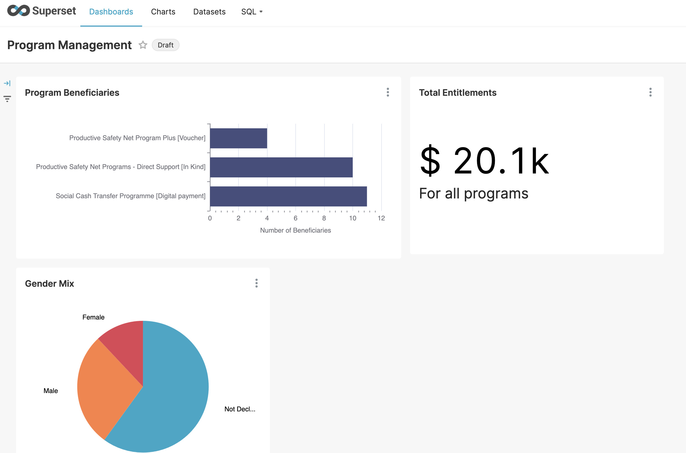

# Reporting & Analytics

<figure><figcaption><p>A registry's dashboards, in Apache Superset</p></figcaption></figure>

A registry stores records so that people can be registered. Reporting asks a
different question of the same data — how many, where, how has it changed — and
the shapes that suit one suit the other badly. A register is normalised, keyed by
opaque ids, and holds personal detail no report should carry.

So there is a layer in between, and everything on this page sits on one side of
it or the other.

```
   the register                reporting layer              what people see
   ────────────                ───────────────              ───────────────
   g2p_register_farmers   ──►  fr_rpt_farmer           ──►  Superset dashboards
   g2p_register_lands          fr_rpt_land                  map drill-down
   g2p_register_crops          fr_rpt_crop  … and more      ad-hoc queries
   …31 tables                  one view per entity
```

## The three pieces

**[Reporting views](reporting-views.md)** — one view per entity in the registry,
at record grain, carrying geography and workflow, with personal data withheld.
Mostly **generated** at install from the registry's own schema, so a registry
gets a complete reporting layer without anyone writing SQL for it. What cannot
be inferred — what a country means by "uses modern inputs", where its age bands
fall — is **declared** in a small file the registry ships.

**[Dashboards](dashboards.md)** — Apache Superset, reading those views. Each
registry ships its own bundle and imports it during its own install, so a
registry brought up on its own arrives with dashboards that already have data
behind them.

**[Map drill-down](map-drill-down.md)** — a choropleth per administrative level,
clicking down from region to district to ward. It reads the same views, joins to
boundary shapes on P-code, and is driven by a handful of SQL files the registry
supplies.

## Restricting what each viewer sees

[Row-level security](row-level-security.md) filters a dataset by attributes
carried on the viewer's own login — region, district, department — so one
dashboard serves every office without a role per office.

## Where to start

If you are bringing up a registry for a country, read
**[Setting up reporting](setting-up-reporting.md)** — it covers what arrives
with no configuration at all, what to write when your schema differs, and what
to do when a country pack or a registry schema later changes.


**Where the data itself comes from** — country packs, P-codes, the geographic
hierarchy in Master Data, boundary shapes in MinIO, and how bulk sample data is
generated — is
[Country Data Architecture](../../country-data-architecture.md). This section
assumes that data exists and describes what is built on top of it.

