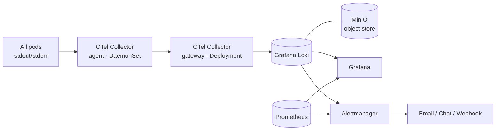

# System Monitoring

OpenG2P ships a built-in observability stack for **logs and alerting** across the
whole cluster, based on **OpenTelemetry + Grafana Loki**, viewed through the
**Grafana** that already comes with the platform.

This page covers the architecture (concepts only). For tasks, see:

* [Setup & Configuration](setup-and-configuration.md) — what gets installed and the settings you can tune.
* [Dashboards & Viewing Logs](dashboards.md) — the ready-made dashboard and how to query logs.
* [Operations Guide](operations.md) — storage, retention, alerting and troubleshooting.

## Architecture

**Pipeline (OTel → Loki → Grafana):**

1. An **OTel Collector agent** runs on every node, tails each pod's container logs,
   enriches them with Kubernetes metadata (`k8s_namespace_name`, `k8s_pod_name`,
   `k8s_container_name`, `service_name`), and **redacts PII** before anything leaves the node.
2. The agent forwards to an **OTel Collector gateway**, which batches and pushes to **Loki**.
3. **Loki** stores the logs and is the query backend.
4. **Grafana** (the existing platform Grafana) reads Loki as a datasource for viewing and dashboards.

Alerting is shared with the existing metrics stack: **Loki's ruler** (log-based alerts)
and **Prometheus** (resource/health alerts) both send to the **same Alertmanager**.

## What is collected & where it is stored

* **Scope:** logs from **all pods in all namespaces** — far more than the previous setup.
* **Storage:** logs live in **Loki**, whose chunks are kept in a small **MinIO** object
  store dedicated to logging (installed alongside Loki, internal-only). Default
  retention is **7 days**. See [Operations Guide](operations.md#storage--retention).
* **Privacy:** PII is redacted in the pipeline before storage.

## Components

| Component | Role | Namespace |
| --- | --- | --- |
| OTel Collector agent (DaemonSet) | Collect + enrich + redact pod logs | `observability` |
| OTel Collector gateway (Deployment) | Batch + forward to Loki | `observability` |
| Grafana Loki | Log store & query engine | `observability` |
| MinIO | Object store for Loki chunks | `observability` |
| Grafana | Viewing & dashboards | `cattle-monitoring-system` |
| Alertmanager | Alert routing (logs + metrics) | `cattle-monitoring-system` |

> This stack replaces the older Fluentd + OpenSearch logging setup. OpenSearch is no
> longer used for logs.
