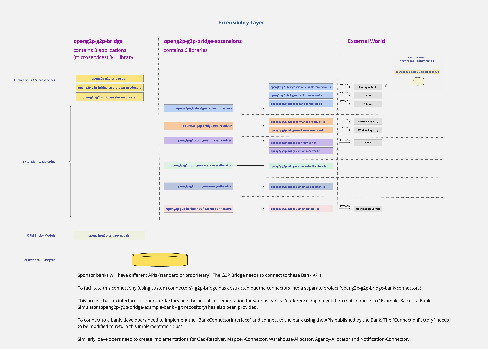

# Extensibility Layer

As part of its process flow, the G2P Bridge subsystem needs to interact with external systems to fulfill the post disbursement lifecycle processes. These interactions (interfaces) with external systems will surely involve writing custom connectors with the external systems.


**➡️ How to write your own connector:** see [Connectors & Extensibility](../design-specifications/connectors-and-extensibility.md) — the end-to-end guide. You implement the interface in your own package, extend the **published Bridge Docker image** (`FROM … + pip install`), and select it via config — **no fork** of the core. Per-interface method contracts are in [Tech Guides → Extensions](../tech-guides/README.md).


In order to facilitate clean and isolated integrations, the g2p bridge subsystem has identified the following extensions.

<figure><figcaption></figcaption></figure>

**For Cash digitally disbursed to Beneficiaries' accounts (or wallets)**

1. Address Resolver - to resolve beneficiary ID to Financial Address, Email address, Phone number, in order to decipher the final account (or wallet) - where the disbursement proceeds need to be credited
2.  Sponsor Bank Connector - to connect to the Sponsor Bank to dispatch payment instructions -

    Debit Department (Benefit Program) Account (within Sponsor bank) - Disbursement Amount\
    Credit Beneficiary Account (in another destination bank, within the country) - Disbursement Amount\
    \
    a. Single instruction per beneficiary, each instruction identified by a unique Disbursement ID.\
    b. Multiple instructions in a single payload (API invocation), depending on batch size configuration 

**For other goods & services, including cash which is physically distributed**

1. Geo Resolver - to resolve Administrative Large Area and Administrative Small Area for a beneficiary so that subsequent processes like Warehouse resolution and Agency resolution can be done based on these administrative areas
2. Warehouse Resolver - the G2P Bridge ships with a sample implementation of Warehouse resolution. However, specific implementations can choose to implement their own custom logic for Warehouse resolution.
3. Agency Resolver - the G2P Bridge ships with a sample implementation of Agency resolution. However, specific implementations can choose to implement their own custom logic for Agency resolution
4. Notification Connector - The G2P Bridge lifecycle involves dispatching notifications to various stakeholders - warehouses, agencies and beneficiaries. G2P Bridge allows you to write custom connectors to a notification engine
