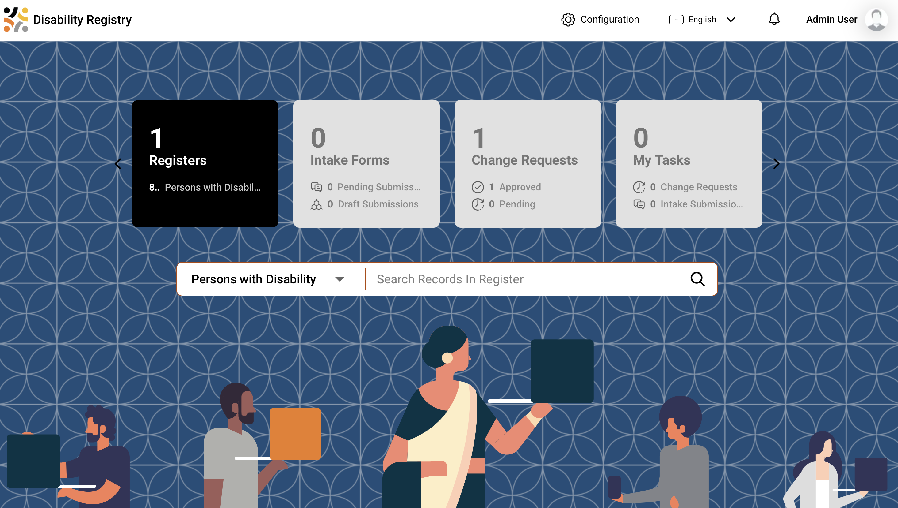
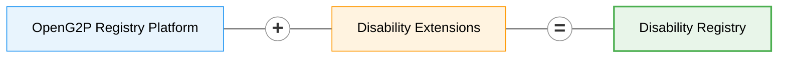

# Disability Registry


**Source:** [github.com/OpenG2P/disability-registry](https://github.com/OpenG2P/disability-registry)


An estimated **1.3 billion people — about 16% of the world's population — live with a significant disability** ([WHO](https://www.who.int/news-room/fact-sheets/detail/disability-and-health)), and they are consistently poorer, less likely to be in work and less likely to be enrolled in the programmes meant for them. A disability registry is the instrument a government uses to close that gap: an authoritative record of who has a disability, what kind and how severe, what support they need, and what they already receive — so that entitlements can be granted, assistive products procured, and coverage measured. The obligation to collect exactly this data is set out in [UNCRPD Article 31](https://www.ohchr.org/en/instruments-mechanisms/instruments/convention-rights-persons-disabilities), and the operational case is made in the [WHO Global report on health equity for persons with disabilities](https://www.who.int/publications/i/item/9789240063600). For a resident, the registry is what turns a diagnosis into an entitlement without having to prove it again at every counter — one assessment, recognised across programmes, with the certificate, the assistive-product request and the allowance all hanging off the same record.

<figure><figcaption>
The staff portal: one person, their assessed status, impairments, and the support they need or receive
</figcaption></figure>

**OpenG2P Disability Registry** is a manifestation of the
[OpenG2P Registry Platform](../registry/) with specifics related to disability
registration and disability-inclusive social protection.

## What makes this registry distinct

Six things characterise this manifestation. The rest of the page expands on each.

| | |
|---|---|
| **One register: the person** | The subject is the individual with a disability. There is no household or group register — see [A registry about people, not households](#a-registry-about-people-not-households) |
| **It tracks the support gap** | Every support record says whether it is *needed* or *received*. The difference is the number the registry exists to produce — see [Need versus provision](#need-versus-provision) |
| **Standards-aligned** | Built to the SPDCI Disability Registry data objects, so records are shareable without translation — see [Standards alignment](#standards-alignment) |
| **Works in any country** | No country, administrative level or national programme is named anywhere in it — see [Works in any country](#works-in-any-country) |
| **Access needs are structured data** | Communication needs, contact preferences and legal capacity are recorded so departments can serve people accessibly — see [Who uses it, and what it records about access](#who-uses-it-and-what-it-records-about-access) |
| **Everything the platform gives** | Approval workflows, consent-aware data sharing, audit, RBAC, deduplication, version history, dynamic UI — see [platform features](../registry/features/) |

## Need versus provision

The registry's central purpose is to make one number visible: **how many people
need support they are not getting**, and where they are.

Every support record — a wheelchair, a caregiver, a home adaptation, regular
medication — carries a status saying whether the person *needs* it or is
*receiving* it. The gap between the two is unmet need, and everything is built
around measuring it:

* each person carries a running count of their unmet needs, so "how many people
  have an unmet need" is answered instantly rather than assembled from five
  separate tables;
* the triage score weights that count most heavily — an unmet need is an
  observed service gap, whereas severity is a clinical judgement that says
  nothing about whether the person is already supported;
* the reporting layer combines all five kinds of support into a single view, so
  every chart uses **one** definition of "unmet" rather than five slightly
  different ones.

The headline measure that falls out of this is *"people with an unmet need who
are enrolled in no programme"* — a work list an administrator can act on, rather
than a coverage percentage.


The support-need score is a **triage aid** — it orders a caseload so the most
support-dependent people are reached first. It is deliberately **not** an
eligibility rule. In a rights-based system entitlement follows from assessment
and law; a score used as a gate quietly becomes one.


## A registry about people, not households

One [register](../registry/concepts.md#register) — `PersonWithDisability` — with
eight supporting tables and **no group register**.

That is a deliberate fit to the domain, not a simplification. The relationships
that matter in a disability case — a guardian, a primary caregiver, an emergency
contact — are frequently **not** people the registrant lives with, so a household
roster would miss exactly the ones who matter. They are recorded as *related
persons* instead, each flagged for the role they actually play.

| Register | Purpose | Holds |
|---|---|---|
| **Person with Disability** | `REGISTER` | Identity, assessed status and level, certificate and re-assessment dates, living situation, transport needs, legal capacity, communication needs |
| Disability Details | `TABLE` | One row per impairment — type, level, cause, age of onset |
| Human Assistance | `TABLE` | Care and personal assistance, with caregiver details and hours |
| Assistive Technology | `TABLE` | Assistive products, from the WHO Priority Assistive Products List |
| Medical Care | `TABLE` | Chronic care and its out-of-pocket cost |
| Housing Support | `TABLE` | Adaptations, relocation, supported accommodation |
| Animal Assistance | `TABLE` | Assistance animals and their certification |
| Related Persons | `TABLE` | Family, guardians, caregivers, emergency contacts |
| Programme Enrolments | `TABLE` | Other programmes the person already benefits from |
| Scores | `CORE_TABLE` | The computed support-need triage score |

Because a person may have several impairments and several kinds of support at
once, each of those is a **list** rather than a field — co-occurring impairments
are the norm, and collapsing them to a single "primary" loses the combination
that actually determines what someone needs.

It is therefore also the worked example to follow if **your** domain has a single
subject — see [Building a Registry](../registry/developer-zone/building-a-registry/README.md).

## Standards alignment

The domain is modelled on the
[SPDCI Disability Registry data objects](https://standards.spdci.org/standards/dci-standards/wip-disability-registry)
(DO.DR.01 – DO.DR.10), so a record shared over DCI already arrives in the shape a
social protection system expects.

| SPDCI object | Here |
|---|---|
| DO.DR.01 `DRPerson` | the person's identity fields (`demographic_info` in the DCI record) |
| DO.DR.02 `Member` | socio-economic attributes and `related_person` |
| DO.DR.03 `PersonwithDisability` | the master register |
| DO.DR.04 `DisabilityDetails` | Disability Details |
| DO.DR.05 `DisabilitySupport` | a **container**, not an entity — it groups DO.DR.06–10 |
| DO.DR.06 – DO.DR.10 | the five support tables |


DO.DR.05 is the one object with no table behind it. In the standard it is a
grouping of the five support objects, so it is modelled as exactly that — and
reassembled into a single `disability_support` block when a record is shared.


Vocabularies are international rather than national: the
[Washington Group](https://www.washingtongroup-disability.com/) functional-difficulty
scale for impairment level, the
[WHO Priority Assistive Products List](https://www.who.int/publications/i/item/priority-assistive-products-list)
for assistive technology, and ICF-based impairment groupings. A registry seeded
from census or household-survey data therefore needs no re-coding.

## Works in any country

Nothing in the registry names a country, an administrative level, or a national
programme:

* **geography** comes from whatever country pack the environment's Master Data
  Service holds, and reports address administrative levels by depth rather than
  by name — so the same chart works for a country with regions and districts and
  one with provinces and communes;
* **code lists** ship as defaults drawn from the international vocabularies
  above, and a country pack replaces any list it also defines;
* **programme names** are a configurable list, not fixed values in code.

One image therefore serves any country. See
[Customisation](customisation.md) for how to point it at yours.

## Who uses it, and what it records about access

The registry is an **administrative system**. Its users are staff of the
government departments that operate it — registration officers, assessment
boards, caseworkers, programme administrators — plus, through the partner API,
other systems that are entitled to query it. People with disabilities are the
**subjects** of the records, not users of the software.

That distinction matters for how the data is designed. A department cannot serve
someone accessibly unless the record tells it how, so the registry captures
access requirements as **structured data** that downstream services and outreach
can act on:

* **Communication needs.** Sign language, braille, easy-read, captioning,
  tactile signing, "interpreter required" — held as a multi-valued field,
  because these co-occur. A deafblind person may need both tactile signing and
  large print, and a single-choice field would force a wrong answer. An office
  scheduling an assessment can see that an interpreter must be booked.
* **How to make contact.** Preferred contact method includes sign-language video
  call and contact via a caregiver — so a department's outreach can honour it
  rather than defaulting to SMS.
* **Legal capacity.** Whether a person makes their own decisions, is supported in
  making them, or has a guardian, recorded following
  [UNCRPD Article 12](https://www.ohchr.org/en/instruments-mechanisms/instruments/convention-rights-persons-disabilities)
  — with at most one legal guardian and one primary caregiver enforced, so a
  caseworker is never left with an unresolved question about who may act.

None of this is decoration: it is the difference between a department knowing a
person needs an interpreter and finding out when they fail to attend.

## In this section

| | |
|---|---|
| [**Customisation**](customisation.md) | Adapting the registry to your country or use case — what is configuration, what is a code change |
| [**Dashboards and maps**](dashboards.md) | The seven Superset dashboards and the Insights map surface |
| [**Deployment**](deployment/README.md) | How it is packaged, where the source and artifacts live, and what each image contains |
| [**Deploying on Rancher**](deployment/rancher.md) | Step-by-step install |
| [**Versions**](versions/README.md) | Where releases and changelogs are published |
