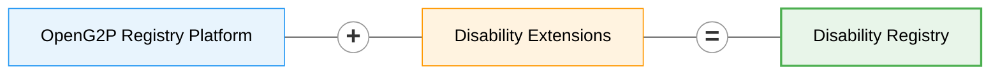

# Disability Registry


**Source:** [gitlab.com/openg2p/registry/disability-registry](https://gitlab.com/openg2p/registry/disability-registry)


A **Disability Registry** is an authoritative record of persons with disability —
who they are, what their assessed disability status is, what support they need,
and what they are already receiving. It exists to make people with disability
*visible* to social protection, because the recurring failure in this domain is
not mis-targeting but **omission**: people who are eligible for support and are
not in any list that a programme reads from.

A well-run disability registry answers three questions:

* **Who** has a disability, of what type and what severity, assessed by whom?
* **What support do they need**, and how much of it are they actually getting?
* **Which programmes** are they already enrolled in?

The second question is the one that distinguishes it from a social registry. Every
support record carries a status — *required* versus *receiving* — and the gap
between the two is the **unmet need** the registry exists to expose.

**OpenG2P Disability Registry** is a manifestation of the
[OpenG2P Registry Platform](../registry/) with specifics related to disability
registration and disability-inclusive social protection.

It inherits all the [features of the registry platform](../registry/features/) —
change-management and approval workflows, ingestion/outgestion pipelines,
consent-aware data sharing, audit-ability, RBAC, deduplication, dynamic UI
rendering, metadata-driven extensibility, cloud-native deployment — and adds a
domain model tuned to disability.

## A single-register registry

This registry defines **one** [register](../registry/concepts.md#register) —
`PersonWithDisability` — with eight supporting tables and no group register.

That makes it the worked example to follow when your domain has **one subject**.
The Farmer Registry and the National Social Registry both pair an individual with
a household, which can make a group register look mandatory. It is not.

The choice is deliberate rather than a simplification. The relationships that
matter in a disability case — a guardian, a primary caregiver, an emergency
contact — are frequently **not** co-resident, so a household roster would miss
exactly the people who matter. They are recorded as related persons instead.

| Register | `register_purpose` | Holds |
|---|---|---|
| **Person with Disability** | `REGISTER` | Identity, assessed disability status and level, certificate and re-assessment dates, living situation, transport needs, legal capacity, communication needs |
| Disability Details | `TABLE` | One row per impairment — type, level, cause, age of onset |
| Human Assistance | `TABLE` | Care and personal assistance, with caregiver details and hours |
| Assistive Technology | `TABLE` | Assistive products, from the WHO Priority Assistive Products List |
| Medical Care | `TABLE` | Chronic care and its out-of-pocket cost |
| Housing Support | `TABLE` | Adaptations, relocation, supported accommodation |
| Animal Assistance | `TABLE` | Assistance animals and their certification |
| Related Persons | `TABLE` | Family, guardians, caregivers, emergency contacts |
| Programme Enrolments | `TABLE` | Other programmes the person already benefits from |
| Scores | `CORE_TABLE` | The computed `SUPPORT_NEED` triage score |

The domain models are in the
[disability-extension](https://gitlab.com/openg2p/registry/disability-registry/-/tree/develop/disability-extension)
package.

## Standards alignment

The domain is modelled on the
[SPDCI Disability Registry data objects](https://standards.spdci.org/standards/dci-standards/wip-disability-registry)
(DO.DR.01 – DO.DR.10), so records shared over DCI are already in the shape a
social protection system expects.

| SPDCI object | Here |
|---|---|
| DO.DR.01 `DRPerson` | the person's identity fields (`demographic_info` in the DCI record) |
| DO.DR.02 `Member` | socio-economic attributes and `related_person` |
| DO.DR.03 `PersonwithDisability` | the master register |
| DO.DR.04 `DisabilityDetails` | Disability Details |
| DO.DR.05 `DisabilitySupport` | a **container**, not an entity — it groups DO.DR.06–10 |
| DO.DR.06 – DO.DR.10 | the five support tables |


DO.DR.05 is the one object with no table behind it. In the standard it is a
grouping of the five support objects, so it is modelled as exactly that: the five
sub-registers, reassembled into a single `disability_support` block by the
outbound DCI template.


## What it is built to answer

**Who needs support they are not getting, and where are they?**

That single question shapes the whole design:

* every support row carries `support_status`, and `REQUIRED` or
  `PARTIALLY_RECEIVED` means unmet;
* the count is **denormalised onto the person** (`unmet_support_needs_count`,
  `has_unmet_support_need`) so the headline figure is a single-table scan rather
  than a fan-out over five child tables;
* the `SUPPORT_NEED` score weights that count most heavily — an unmet need is an
  observed service gap, whereas severity is a clinical judgement that says nothing
  about whether the person is already supported;
* the reporting layer unions all five support tables into one view, so "unmet need
  by domain" is one query with **one** definition of unmet rather than five.


The `SUPPORT_NEED` score is a **triage aid** — it orders a caseload so the most
support-dependent people are reached first. It is deliberately not an eligibility
rule. In a rights-based system entitlement follows from assessment and law, and a
score used as a gate quietly becomes one.


## Country-agnostic by construction

Nothing in the registry names a country, an administrative level, or a national
programme:

* **geography** comes from whatever country pack the environment's Master Data
  Service holds, and the reporting views unpack it positionally;
* **code lists** ship as defaults derived from international vocabularies — the
  Washington Group functional-difficulty scale, the WHO Priority Assistive
  Products List, ICF impairment groupings — and a country pack replaces any list
  it also defines;
* **programme names** are a code list, not an enum.

## Accessibility is a domain requirement here

This registry's own registrants include people with visual, hearing and cognitive
impairments, so accessibility is part of the domain rather than a UI
afterthought:

* `communication_needs` is a first-class, multi-valued field (sign language,
  braille, easy-read, captioning, interpreter required) because these co-occur;
* `preferred_contact_method` includes sign-language video call and contact via a
  caregiver;
* the default theme is chosen to clear WCAG 2.1 AA contrast against its own
  background, rather than inheriting brand colours untested.

## Building on it

The Disability Registry follows
[Building a Registry](../registry/developer-zone/building-a-registry/README.md)
exactly. Two of its choices are worth borrowing:

* **Generated code lists and translations.** The dropdown values in
  `meta_data/lookup-data/*_defaults.sql` are derived from the domain enums by a
  script, and the translation keys from the section metadata — so the two cannot
  drift, and CI fails if the checked-in SQL is stale.
* **Repository guards.** `test/test_metadata_consistency.py` asserts the naming
  contracts that otherwise fail silently — see
  [Contracts that fail silently](../registry/developer-zone/building-a-registry/contracts-that-fail-silently.md).
