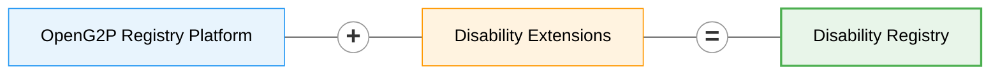

# Disability Registry


**Source:** [gitlab.com/openg2p/registry/disability-registry](https://gitlab.com/openg2p/registry/disability-registry)


An estimated **1.3 billion people — about 16% of the world's population — live with a significant disability** ([WHO](https://www.who.int/news-room/fact-sheets/detail/disability-and-health)), and they are consistently poorer, less likely to be in work and less likely to be enrolled in the programmes meant for them. A disability registry is the instrument a government uses to close that gap: an authoritative record of who has a disability, what kind and how severe, what support they need, and what they already receive — so that entitlements can be granted, assistive products procured, and coverage measured. The obligation to collect exactly this data is set out in [UNCRPD Article 31](https://www.ohchr.org/en/instruments-mechanisms/instruments/convention-rights-persons-disabilities), and the operational case is made in the [WHO Global report on health equity for persons with disabilities](https://www.who.int/publications/i/item/9789240063600). For a resident, the registry is what turns a diagnosis into an entitlement without having to prove it again at every counter — one assessment, recognised across programmes, with the certificate, the assistive-product request and the allowance all hanging off the same record.

<figure><figcaption>
The staff portal: one person, their assessed status, impairments, and the support they need or receive
</figcaption></figure>

**OpenG2P Disability Registry** is a manifestation of the
[OpenG2P Registry Platform](../registry/) with specifics related to disability
registration and disability-inclusive social protection.

It inherits every [feature of the registry platform](../registry/features/) —
change-management and approval workflows, ingestion/outgestion pipelines,
consent-aware data sharing, audit-ability, RBAC, deduplication, dynamic UI
rendering, metadata-driven extensibility, cloud-native deployment — and adds a
domain model tuned to disability.

## The question it is built to answer

**Who needs support they are not getting, and where are they?**

That single question shapes the whole design. Every support record carries a
status, and the gap between *required* and *receiving* is the **unmet need**:

* the count is denormalised onto the person (`unmet_support_needs_count`,
  `has_unmet_support_need`), so the headline figure is a single-table scan rather
  than a fan-out across five child tables;
* the `SUPPORT_NEED` score weights that count most heavily — an unmet need is an
  observed service gap, whereas severity is a clinical judgement that says
  nothing about whether the person is already supported;
* the reporting layer unions all five support tables into one view, so "unmet
  need by domain" is one query with **one** definition of unmet, not five.


The `SUPPORT_NEED` score is a **triage aid** — it orders a caseload so the most
support-dependent people are reached first. It is deliberately **not** an
eligibility rule. In a rights-based system entitlement follows from assessment
and law; a score used as a gate quietly becomes one.


## A single-register registry

One [register](../registry/concepts.md#register) — `PersonWithDisability` — with
eight supporting tables and **no group register**.

That is a deliberate fit to the domain, not a simplification. The relationships
that matter in a disability case — a guardian, a primary caregiver, an emergency
contact — are frequently **not** co-resident, so a household roster would miss
exactly the people who matter. They are recorded as related persons instead.

| Register | Purpose | Holds |
|---|---|---|
| **Person with Disability** | `REGISTER` | Identity, assessed status and level, certificate and re-assessment dates, living situation, transport needs, legal capacity, communication needs |
| Disability Details | `TABLE` | One row per impairment — type, level, cause, age of onset |
| Human Assistance | `TABLE` | Care and personal assistance, with caregiver details and hours |
| Assistive Technology | `TABLE` | Assistive products, from the WHO Priority Assistive Products List |
| Medical Care | `TABLE` | Chronic care and its out-of-pocket cost |
| Housing Support | `TABLE` | Adaptations, relocation, supported accommodation |
| Animal Assistance | `TABLE` | Assistance animals and their certification |
| Related Persons | `TABLE` | Family, guardians, caregivers, emergency contacts |
| Programme Enrolments | `TABLE` | Other programmes the person already benefits from |
| Scores | `CORE_TABLE` | The computed `SUPPORT_NEED` triage score |

It is therefore also the worked example to follow if **your** domain has a single
subject — see [Building a Registry](../registry/developer-zone/building-a-registry/README.md).

## Standards alignment

The domain is modelled on the
[SPDCI Disability Registry data objects](https://standards.spdci.org/standards/dci-standards/wip-disability-registry)
(DO.DR.01 – DO.DR.10), so a record shared over DCI already arrives in the shape a
social protection system expects.

| SPDCI object | Here |
|---|---|
| DO.DR.01 `DRPerson` | the person's identity fields (`demographic_info` in the DCI record) |
| DO.DR.02 `Member` | socio-economic attributes and `related_person` |
| DO.DR.03 `PersonwithDisability` | the master register |
| DO.DR.04 `DisabilityDetails` | Disability Details |
| DO.DR.05 `DisabilitySupport` | a **container**, not an entity — it groups DO.DR.06–10 |
| DO.DR.06 – DO.DR.10 | the five support tables |


DO.DR.05 is the one object with no table behind it. In the standard it is a
grouping of the five support objects, so it is modelled as exactly that — and
reassembled into a single `disability_support` block by the outbound DCI
template.


Vocabularies are international rather than national: the
[Washington Group](https://www.washingtongroup-disability.com/) functional-difficulty
scale for impairment level, the
[WHO Priority Assistive Products List](https://www.who.int/publications/i/item/priority-assistive-products-list)
for assistive technology, and ICF-based impairment groupings.

## Country-agnostic by construction

Nothing in the registry names a country, an administrative level, or a national
programme:

* **geography** comes from whatever country pack the environment's Master Data
  Service holds, and the reporting views unpack it positionally;
* **code lists** ship as defaults derived from the vocabularies above, and a
  country pack replaces any list it also defines;
* **programme names** are a code list, not an enum.

## Accessibility is part of the domain

This registry's own registrants include people with visual, hearing and cognitive
impairments, so accessibility is a data requirement rather than a UI
afterthought:

* `communication_needs` is a first-class, **multi-valued** field — sign language,
  braille, easy-read, captioning, interpreter required — because these co-occur;
* `preferred_contact_method` includes sign-language video call and contact via a
  caregiver;
* the shipped theme is chosen to clear WCAG 2.1 AA contrast against its own
  background rather than inheriting brand colours untested.

## In this section

| | |
|---|---|
| [**Customisation**](customisation.md) | Adapting the registry to your country or use case — what is configuration, what is a code change |
| [**Deployment**](deployment/README.md) | How it is packaged, where the source and artifacts live, and what each image contains |
| [**Deploying on Rancher**](deployment/rancher.md) | Step-by-step install |
| [**Dashboards and maps**](dashboards.md) | The seven Superset dashboards and the Insights map surface |
