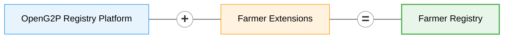

# Farmer Registry

<figure><figcaption></figcaption></figure>

Farmer Registry is a manifestation of [OpenG2P Registry Platform](registry/) with specifics related to a farmer registry.

This registry contains the following [**registers**](registry/concepts.md#register):

1. Farmer Register
2. Household Register

The domain models for these registers are available in the [extensions repository](https://github.com/OpenG2P/openg2p-registry-gen2-extensions/tree/develop/openg2p-registry-farmer-extension).

The Farmer Registry inherits all the [features of the registry platform](registry/features/).

## Versions

The table below tracks the **Farmer Registry Helm chart** versions and the key changes in each (relative to the previous chart). The published version is derived from the branch name at package time — see [Helm chart versioning](farmer-registry.md#helm-chart-versioning) for the scheme.

| Helm Chart Version | Last Modified | Comments                                                                                                                                                                                                                                                                                                                                                                                                                                                                                                                                                                                                                                                                                                                                                                                                                                                                                                                                                                                                                                         |
| ------------------ | ------------- | ------------------------------------------------------------------------------------------------------------------------------------------------------------------------------------------------------------------------------------------------------------------------------------------------------------------------------------------------------------------------------------------------------------------------------------------------------------------------------------------------------------------------------------------------------------------------------------------------------------------------------------------------------------------------------------------------------------------------------------------------------------------------------------------------------------------------------------------------------------------------------------------------------------------------------------------------------------------------------------------------------------------------------------------------ |
| `0.0.0-develop17`  | 25-Jun-2026   | 
<strong>Rolling development version.</strong> Every CI publish appends a unique <code>.&#x3C;run></code> suffix; this single row tracks all changes on <code>develop</code>. Key changes: • Self-sufficient chart — the base "registry" wrapper chart was retired; the chart now owns all templates and values directly (the registry platform lives in <a href="https://github.com/openg2p/registry-platform"><code>registry-platform</code></a>, <code>develop</code>, and ships no Helm chart of its own). • Multiple registries (and AWE) can co-exist in one namespace — the Keycloak staff client, AWE admin clients, MinIO buckets (including <code>registrant-photos</code>), keymanager app-id and the AWE callback-secret id are all release-scoped. • Legacy Fluentd/OpenSearch logging removed (cluster logging is handled cluster-wide by OpenTelemetry + Grafana Loki). • Branch-derived chart versioning with a <code>&#x3C;run></code> suffix, plus a manual <code>version</code> override for ad-hoc builds.
 |
| `1.1.0`            | 08-May-2026   | Frozen release built on the registry base Helm chart `4.1.0` (the wrapper-chart era, before the self-sufficient conversion). [Registry Release Notes v4.1.0](registry/versions/registry-release-notes-v4.1.0.md).                                                                                                                                                                                                                                                                                                                                                                                                                                                                                                                                                                                                                                                                                                                                                                                                                                |


**Maintaining this table.** Do **not** add a row for every suffixed develop build (`0.0.0-develop.<run>`) — there would be hundreds, and they are intentionally not listed. Keep a **single `0.0.0-develop` row** and append bullets to its _Comments_ as changes land (bumping _Last Modified_). Add a **new row only when a version is frozen** — i.e. when a three-part `N.N.N` release is cut — capturing that release's final changelog.


The underlying **platform version is the version of the** [**`registry-platform`**](https://github.com/openg2p/registry-platform) **repository** the Farmer Registry is built from. There is no longer a separate "base registry chart" — the Farmer Registry chart is self-sufficient.

### Helm chart versioning

The **published Helm chart version is derived from the branch name** by the chart-publish workflow — it is the Helm chart's SemVer only and is **independent of the Docker image tags** (those are driven by their own image-build workflows). A `<run-number>` pre-release suffix makes every publish a new, monotonically-increasing version, so Rancher and the chart CDN never serve a stale cached chart.

| Branch                          | Type                | Published chart version |
| ------------------------------- | ------------------- | ----------------------- |
| `develop`                       | development         | `0.0.0-develop.<run>`   |
| `N.N` (e.g. `1.0`, `1.1`)       | active release line | `N.N.0-develop.<run>`   |
| `N.N.N` (e.g. `1.0.0`, `1.0.3`) | frozen release      | `N.N.N` (no suffix)     |

Notes:

* `N.N` branches expand to `N.N.0-…` because Helm requires a three-part SemVer (a bare `1.0` is rejected). A `N.N.N` (three-part) branch is treated as **frozen**: it publishes the exact version with no suffix, and — per SemVer — that release outranks all of its `-develop` builds.
* **Automatic publishing happens only for `develop`, `N.N` and `N.N.N` branches.** Any other branch is skipped. To publish from such a branch (or to cut a custom version like `1.0.0-g2p5466`), trigger the **Publish Helm Charts** workflow manually (Actions → _Run workflow_) and supply the explicit `version` input — that overrides the branch-derived value.
* Tag pushes do **not** trigger a chart publish.

The CI workflows in the [`farmer-registry`](https://github.com/OpenG2P/farmer-registry/tree/develop/.github/workflows) repository implement this strategy (the `helm-publish.yml` workflow computes the version from the branch and packages with `helm package --version`).

## Domain models

Each domain model below represents a database table in the Farmer Registry. The Farmer and Household models are **registers** (extending the core [`G2PRegister`](https://github.com/OpenG2P/openg2p-registry-gen2-core/blob/1.0/openg2p-registry-core/src/openg2p_registry_core/models/g2p_register.py) base); the remaining models are supporting tables that store related data linked to a register record. All models extend core platform base classes and add domain-specific columns. Fields inherited from the base classes (such as `internal_record_id`, `functional_record_id`, `record_name`, `status`, name fields, date of birth, gender, geo coordinates, address etc.) are not repeated here.

**Core base classes:**

| Base class           | Description                                                                                                                                                               | Source                                                                                                                                                                     |
| -------------------- | ------------------------------------------------------------------------------------------------------------------------------------------------------------------------- | -------------------------------------------------------------------------------------------------------------------------------------------------------------------------- |
| `G2PRegister`        | Abstract base for all registers — provides `internal_record_id`, `functional_record_id`, `record_name`, `status`, `link_internal_record_id`, and change management fields | [g2p\_register.py](https://github.com/OpenG2P/openg2p-registry-gen2-core/blob/1.0/openg2p-registry-core/src/openg2p_registry_core/models/g2p_register.py)                  |
| `G2PPerson`          | Mixin for person-level fields — given name, family name, additional name, date of birth, gender, marital status, foundational ID, email, phone                            | [g2p\_register.py](https://github.com/OpenG2P/openg2p-registry-gen2-core/blob/1.0/openg2p-registry-core/src/openg2p_registry_core/models/g2p_register.py)                  |
| `G2PGeo`             | Mixin for point-location fields — latitude, longitude, address components                                                                                                 | [g2p\_register.py](https://github.com/OpenG2P/openg2p-registry-gen2-core/blob/1.0/openg2p-registry-core/src/openg2p_registry_core/models/g2p_register.py)                  |
| `G2PGeoShape`        | Mixin for polygon/boundary geometry data                                                                                                                                  | [g2p\_register.py](https://github.com/OpenG2P/openg2p-registry-gen2-core/blob/1.0/openg2p-registry-core/src/openg2p_registry_core/models/g2p_register.py)                  |
| `G2PRegisterHistory` | Abstract base for history/version snapshot tables                                                                                                                         | [g2p\_register\_history.py](https://github.com/OpenG2P/openg2p-registry-gen2-core/blob/1.0/openg2p-registry-core/src/openg2p_registry_core/models/g2p_register_history.py) |


Every register model has a corresponding **History** table (e.g., `g2p_register_history_farmers`) with the same domain columns, used for version snapshots. History tables are not listed separately below.


***

### Farmer (`g2p_register_farmers`)

Extends: [`G2PRegister`](https://github.com/OpenG2P/openg2p-registry-gen2-core/blob/1.0/openg2p-registry-core/src/openg2p_registry_core/models/g2p_register.py), [`G2PPerson`](https://github.com/OpenG2P/openg2p-registry-gen2-core/blob/1.0/openg2p-registry-core/src/openg2p_registry_core/models/g2p_register.py), [`G2PGeo`](https://github.com/OpenG2P/openg2p-registry-gen2-core/blob/1.0/openg2p-registry-core/src/openg2p_registry_core/models/g2p_register.py)

The primary register for individual farmer records. Inherits person-level fields (name, date of birth, gender, foundational ID) from `G2PPerson` and location fields from `G2PGeo`.

| Column                   | Data type     | Description                                                                                                     |
| ------------------------ | ------------- | --------------------------------------------------------------------------------------------------------------- |
| `estimated_age`          | Integer       | Estimated age of the farmer (used when exact date of birth is unavailable)                                      |
| `has_personal_phone`     | Boolean       | Whether the farmer has a personal phone                                                                         |
| `disabled`               | Boolean       | Whether the farmer has a disability                                                                             |
| `disability_type`        | String (enum) | Type of disability. Values: `VISION`, `HEARING`, `MOBILITY`, `COGNITION`, `SELF_CARE`, `COMMUNICATION`          |
| `disability_severity`    | String (enum) | Severity of disability. Values: `NO_DIFFICULTY`, `SOME_DIFFICULTY`, `A_LOT_OF_DIFFICULTY`, `CANNOT_DO_AT_ALL`   |
| `source_of_income`       | String (enum) | Primary source of income. Values: `CROP_PRODUCTION`, `LIVESTOCK_PRODUCTION`, `GOVERNMENT_NGO_SUPPORT`, `OTHERS` |
| `source_of_income_other` | String        | Free-text description when `source_of_income` is `OTHERS`                                                       |
| `language_spoken`        | String        | Language spoken by the farmer (ISO-639-2 code, attribute lookup)                                                |
| `education_level`        | String (enum) | Educational level. Values: `ILLITERATE`, `CAN_READ_AND_WRITE`, `BASIC`, `INTERMEDIARY`, `HIGHER_EDUCATION`      |
| `national_id_masked`     | String        | Masked representation of the national ID                                                                        |

***

### Household (`g2p_register_households`)

Extends: [`G2PRegister`](https://github.com/OpenG2P/openg2p-registry-gen2-core/blob/1.0/openg2p-registry-core/src/openg2p_registry_core/models/g2p_register.py), [`G2PGeo`](https://github.com/OpenG2P/openg2p-registry-gen2-core/blob/1.0/openg2p-registry-core/src/openg2p_registry_core/models/g2p_register.py)

Represents a farmer's household. Does not extend `G2PPerson` since a household is a group, not an individual.

| Column                     | Data type | Description                                                             |
| -------------------------- | --------- | ----------------------------------------------------------------------- |
| `household_head`           | String    | Name or identifier of the household head                                |
| `size_of_group`            | Integer   | Total number of members in the household                                |
| `number_of_children`       | Integer   | Number of children in the household                                     |
| `number_of_female_members` | Integer   | Number of female members                                                |
| `number_of_male_members`   | Integer   | Number of male members                                                  |
| `other_land_owner`         | Boolean   | Whether anyone other than the primary farmer owns land in the household |

***

### Household Member (`g2p_register_household_members`)

Extends: [`G2PRegister`](https://github.com/OpenG2P/openg2p-registry-gen2-core/blob/1.0/openg2p-registry-core/src/openg2p_registry_core/models/g2p_register.py), [`G2PPerson`](https://github.com/OpenG2P/openg2p-registry-gen2-core/blob/1.0/openg2p-registry-core/src/openg2p_registry_core/models/g2p_register.py), [`G2PGeo`](https://github.com/OpenG2P/openg2p-registry-gen2-core/blob/1.0/openg2p-registry-core/src/openg2p_registry_core/models/g2p_register.py)

Individual members of a household. Inherits person-level fields (name, date of birth, gender) from `G2PPerson`. Linked to a Household via `link_internal_record_id`.

| Column        | Data type | Description                                   |
| ------------- | --------- | --------------------------------------------- |
| `is_disabled` | Boolean   | Whether the household member has a disability |

***

### Land (`g2p_register_lands`)

Extends: [`G2PRegister`](https://github.com/OpenG2P/openg2p-registry-gen2-core/blob/1.0/openg2p-registry-core/src/openg2p_registry_core/models/g2p_register.py), [`G2PGeo`](https://github.com/OpenG2P/openg2p-registry-gen2-core/blob/1.0/openg2p-registry-core/src/openg2p_registry_core/models/g2p_register.py), [`G2PGeoShape`](https://github.com/OpenG2P/openg2p-registry-gen2-core/blob/1.0/openg2p-registry-core/src/openg2p_registry_core/models/g2p_register.py)

Represents a land parcel associated with a farmer. Linked to a Farmer via `link_internal_record_id`. Extends `G2PGeoShape` for polygon/boundary data in addition to point-location from `G2PGeo`.

| Column                   | Data type     | Description                                                                                                         |
| ------------------------ | ------------- | ------------------------------------------------------------------------------------------------------------------- |
| `land_ownership_type`    | String (enum) | Type of land ownership. Values: `OWNER`, `TENANT`, `CROP_SHARE`                                                     |
| `certificate_storage_id` | Text          | Reference to the stored land ownership certificate (document storage ID)                                            |
| `land_size`              | String        | Size of the land parcel                                                                                             |
| `unit`                   | String (enum) | Unit of land size measurement. Values: `HECTARE`, `ACRE`, `SQUARE_METER`, `SQUARE_KM`, `SQUARE_FOOT`, `SQUARE_YARD` |
| `soil_fertility`         | String        | Soil fertility assessment                                                                                           |
| `current_land_use`       | String (enum) | Current use of the land. Values: `AGRICULTURAL`, `RESIDENTIAL`, `GRAZING`, `FOREST`                                 |
| `farming_type`           | String (enum) | Type of farming practised. Values: `CROP`, `LIVESTOCK`, `MIXED`, `AQUACULTURE`, `AGROFORESTRY`                      |
| `year_of_acquisition`    | Integer       | Year the land was acquired                                                                                          |
| `means_of_acquisition`   | String        | How the land was acquired (attribute lookup)                                                                        |

***

### Crop (`g2p_register_crops`)

Extends: [`G2PRegister`](https://github.com/OpenG2P/openg2p-registry-gen2-core/blob/1.0/openg2p-registry-core/src/openg2p_registry_core/models/g2p_register.py)

Represents a crop cultivated by a farmer. Linked to a Farmer via `link_internal_record_id`.

| Column         | Data type     | Description                                                                                                 |
| -------------- | ------------- | ----------------------------------------------------------------------------------------------------------- |
| `commodity`    | String        | Type of crop/commodity (attribute lookup)                                                                   |
| `planted_date` | Date          | Date the crop was planted                                                                                   |
| `season`       | String        | Agricultural season                                                                                         |
| `end_use`      | String (enum) | Intended end use of the crop. Values: `FOOD_HUMAN_CONSUMPTION`, `FEED_ANIMALS`, `BIOFUELS_NONFOOD`, `OTHER` |

***

### Livestock (`g2p_register_livestocks`)

Extends: [`G2PRegister`](https://github.com/OpenG2P/openg2p-registry-gen2-core/blob/1.0/openg2p-registry-core/src/openg2p_registry_core/models/g2p_register.py)

Represents livestock owned by a farmer. Linked to a Land via `link_internal_record_id`.

| Column             | Data type     | Description                                                                                                       |
| ------------------ | ------------- | ----------------------------------------------------------------------------------------------------------------- |
| `livestock_type`   | String        | Type of livestock (attribute lookup)                                                                              |
| `breed`            | String        | Breed of the livestock (attribute lookup)                                                                         |
| `head_count`       | Integer       | Number of animals                                                                                                 |
| `livestock_system` | String (enum) | Livestock rearing system. Values: `NOMADIC_PASTORAL`, `SEMI_NOMADIC`, `SEDENTARY_PASTORAL`, `MIXED`, `INDUSTRIAL` |

***

### Farm Inputs (`g2p_register_farm_inputs`)

Extends: [`G2PRegister`](https://github.com/OpenG2P/openg2p-registry-gen2-core/blob/1.0/openg2p-registry-core/src/openg2p_registry_core/models/g2p_register.py)

Captures the agricultural inputs and resources available to a farmer. Linked to a Farmer via `link_internal_record_id`.

| Column                | Data type | Description                                                                                                          |
| --------------------- | --------- | -------------------------------------------------------------------------------------------------------------------- |
| `fertilizer_use`      | Boolean   | Whether the farmer uses fertilizers                                                                                  |
| `pesticide_use`       | Boolean   | Whether the farmer uses pesticides                                                                                   |
| `insecticide_use`     | Boolean   | Whether the farmer uses insecticides                                                                                 |
| `improved_seed_use`   | Boolean   | Whether the farmer uses improved/certified seeds                                                                     |
| `water_source`        | String    | Primary water source (attribute lookup). E.g., Rainfed, Irrigation GW/Surface, Well, Water Harvesting, Surface Water |
| `access_to_machinery` | Boolean   | Whether the farmer has access to farm machinery                                                                      |
| `access_to_finance`   | Boolean   | Whether the farmer has access to agricultural finance/credit                                                         |

***

### Membership Details (`g2p_register_membership_details`)

Extends: [`G2PRegister`](https://github.com/OpenG2P/openg2p-registry-gen2-core/blob/1.0/openg2p-registry-core/src/openg2p_registry_core/models/g2p_register.py)

Captures cooperative and farmer cluster membership information. Linked to a Farmer via `link_internal_record_id`.

| Column                          | Data type     | Description                                                                                   |
| ------------------------------- | ------------- | --------------------------------------------------------------------------------------------- |
| `is_primary_cooperative_member` | Boolean       | Whether the farmer is a member of a primary cooperative                                       |
| `primary_cooperative_name`      | String        | Name of the primary cooperative                                                               |
| `is_cooperative_union_member`   | Boolean       | Whether the farmer is a member of a cooperative union                                         |
| `cooperative_union_name`        | String        | Name of the cooperative union                                                                 |
| `is_farmer_cluster_member`      | Boolean       | Whether the farmer is a member of a farmer cluster                                            |
| `farmer_cluster_role`           | String (enum) | Role within the farmer cluster. Values: `LEAD`, `DEPUTY`, `SECRETARY`, `ACCOUNTANT`, `MEMBER` |

***

### Poverty Score (`g2p_register_poverty_scores`)

Extends: [`G2PRegister`](https://github.com/OpenG2P/openg2p-registry-gen2-core/blob/1.0/openg2p-registry-core/src/openg2p_registry_core/models/g2p_register.py)

Stores poverty assessment scores for a household. Linked to a Household via `link_internal_record_id`.

| Column               | Data type | Description                                            |
| -------------------- | --------- | ------------------------------------------------------ |
| `poverty_score`      | String    | Computed or assessed poverty score value               |
| `poverty_score_type` | String    | Type/methodology of the poverty score (e.g., PMT, PPI) |
