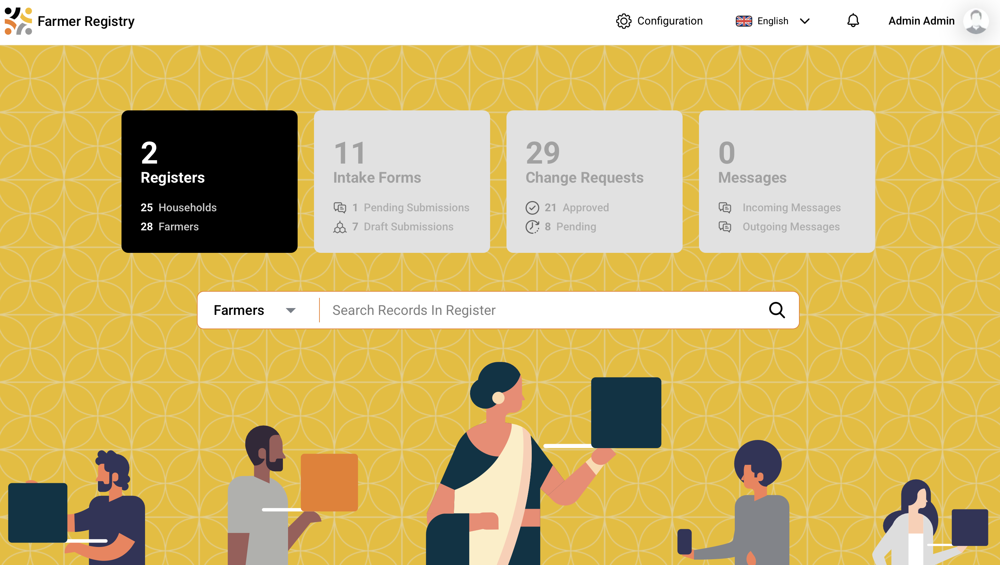
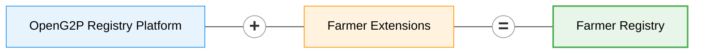

# Farmer Registry


**New home: GitLab.** **`farmer-registry`** is now developed at [github.com/OpenG2P/farmer-registry](https://github.com/OpenG2P/farmer-registry).


<figure><figcaption></figcaption></figure>

Farmer Registry is a manifestation of [OpenG2P Registry Platform](../registry/) with specifics related to a farmer registry.

This registry contains the following [**registers**](../registry/concepts.md#register):

1. Farmer Register
2. Household Register

The domain models for these registers live in the [`farmer-extension`](https://github.com/OpenG2P/farmer-registry/tree/develop/farmer-extension) package in this repository.

The Farmer Registry inherits all the [features of the registry platform](../registry/features/).

## How it is packaged

The Farmer Registry is a thin **extension** of the [Registry Platform](../registry/deployment-and-extension/README.md), which publishes the runnable Docker images and the `openg2p-registry` Helm chart. This repository adds only the farmer domain — the extension package, its seed content, a field-specific test set, and a wrapper chart that pins the platform chart and overlays farmer values. Nothing from the platform is copied or vendored.

* [**Deployment**](deployment/README.md) — how it is packaged, prerequisites, and installing from Rancher or the Helm CLI.
* [**Helm chart**](deployment/helm-chart.md) — the wrapper chart, what it deploys and how it is configured.
* [**Data seeding**](deployment/data-seeding.md) — the seed content this repo owns and the inherited machinery that applies it.
* [**Sanity testing**](deployment/sanity-testing.md) — the two-part test model and the farmer field tests.

## Versions

Chart and image versions — and what changed in each — are published by the central CI pipeline. See [**Versions**](versions/README.md), or go straight to the [changelog](https://openg2p.github.io/openg2p-packaging/farmer-registry/CHANGELOG).

## Domain models

Each domain model below represents a database table in the Farmer Registry. The Farmer and Household models are **registers** (extending the core [`G2PRegister`](https://github.com/OpenG2P/registry-platform/blob/develop/core/openg2p-registry-core/src/openg2p_registry_core/models/g2p_register.py) base); the remaining models are supporting tables that store related data linked to a register record. All models extend core platform base classes and add domain-specific columns. Fields inherited from the base classes (such as `internal_record_id`, `functional_record_id`, `record_name`, `status`, name fields, date of birth, gender, geo coordinates, address etc.) are not repeated here.

**Core base classes:**

| Base class           | Description                                                                                                                                                               | Source                                                                                                                                                                     |
| -------------------- | ------------------------------------------------------------------------------------------------------------------------------------------------------------------------- | -------------------------------------------------------------------------------------------------------------------------------------------------------------------------- |
| `G2PRegister`        | Abstract base for all registers — provides `internal_record_id`, `functional_record_id`, `record_name`, `status`, `link_internal_record_id`, and change management fields | [g2p\_register.py](https://github.com/OpenG2P/registry-platform/blob/develop/core/openg2p-registry-core/src/openg2p_registry_core/models/g2p_register.py)                  |
| `G2PPerson`          | Mixin for person-level fields — given name, family name, additional name, date of birth, gender, marital status, foundational ID, email, phone                            | [g2p\_register.py](https://github.com/OpenG2P/registry-platform/blob/develop/core/openg2p-registry-core/src/openg2p_registry_core/models/g2p_register.py)                  |
| `G2PGeo`             | Mixin for point-location fields — latitude, longitude, address components                                                                                                 | [g2p\_register.py](https://github.com/OpenG2P/registry-platform/blob/develop/core/openg2p-registry-core/src/openg2p_registry_core/models/g2p_register.py)                  |
| `G2PGeoShape`        | Mixin for polygon/boundary geometry data                                                                                                                                  | [g2p\_register.py](https://github.com/OpenG2P/registry-platform/blob/develop/core/openg2p-registry-core/src/openg2p_registry_core/models/g2p_register.py)                  |
| `G2PRegisterHistory` | Abstract base for history/version snapshot tables                                                                                                                         | [g2p\_register\_history.py](https://github.com/OpenG2P/registry-platform/blob/develop/core/openg2p-registry-core/src/openg2p_registry_core/models/g2p_register_history.py) |


Every register model also declares a **History** table (e.g. `g2p_register_history_farmers`) for version snapshots and an **Intake form** table (e.g. `g2p_intake_form_farmers`) for submissions awaiting intake, both carrying the same domain columns. Neither is listed separately below.


***

### Farmer (`g2p_register_farmers`)

Extends: [`G2PRegister`](https://github.com/OpenG2P/registry-platform/blob/develop/core/openg2p-registry-core/src/openg2p_registry_core/models/g2p_register.py), [`G2PPerson`](https://github.com/OpenG2P/registry-platform/blob/develop/core/openg2p-registry-core/src/openg2p_registry_core/models/g2p_register.py), [`G2PGeo`](https://github.com/OpenG2P/registry-platform/blob/develop/core/openg2p-registry-core/src/openg2p_registry_core/models/g2p_register.py)

The primary register for individual farmer records. Inherits person-level fields (name, date of birth, gender, foundational ID) from `G2PPerson` and location fields from `G2PGeo`.

| Column                   | Data type     | Description                                                                                                     |
| ------------------------ | ------------- | --------------------------------------------------------------------------------------------------------------- |
| `estimated_age`          | Integer       | Estimated age of the farmer (used when exact date of birth is unavailable)                                      |
| `has_personal_phone`     | Boolean       | Whether the farmer has a personal phone                                                                         |
| `disabled`               | Boolean       | Whether the farmer has a disability                                                                             |
| `disability_type`        | String (enum) | Type of disability. Values: `VISION`, `HEARING`, `MOBILITY`, `COGNITION`, `SELF_CARE`, `COMMUNICATION`          |
| `disability_severity`    | String (enum) | Severity of disability. Values: `NO_DIFFICULTY`, `SOME_DIFFICULTY`, `A_LOT_OF_DIFFICULTY`, `CANNOT_DO_AT_ALL`   |
| `source_of_income`       | String (enum) | Primary source of income. Values: `CROP_PRODUCTION`, `LIVESTOCK_PRODUCTION`, `GOVERNMENT_NGO_SUPPORT`, `OTHERS` |
| `source_of_income_other` | String        | Free-text description when `source_of_income` is `OTHERS`                                                       |
| `language_spoken`        | String        | Language spoken by the farmer (ISO-639-2 code, attribute lookup)                                                |
| `education_level`        | String (enum) | Educational level. Values: `ILLITERATE`, `CAN_READ_AND_WRITE`, `BASIC`, `INTERMEDIARY`, `HIGHER_EDUCATION`      |
| `national_id_masked`     | String        | Masked representation of the national ID                                                                        |

***

### Household (`g2p_register_households`)

Extends: [`G2PRegister`](https://github.com/OpenG2P/registry-platform/blob/develop/core/openg2p-registry-core/src/openg2p_registry_core/models/g2p_register.py), [`G2PGeo`](https://github.com/OpenG2P/registry-platform/blob/develop/core/openg2p-registry-core/src/openg2p_registry_core/models/g2p_register.py)

Represents a farmer's household. Does not extend `G2PPerson` since a household is a group, not an individual.

| Column                     | Data type | Description                                                             |
| -------------------------- | --------- | ----------------------------------------------------------------------- |
| `household_head`           | String    | Name or identifier of the household head                                |
| `size_of_group`            | Integer   | Total number of members in the household                                |
| `number_of_children`       | Integer   | Number of children in the household                                     |
| `number_of_female_members` | Integer   | Number of female members                                                |
| `number_of_male_members`   | Integer   | Number of male members                                                  |
| `other_land_owner`         | Boolean   | Whether anyone other than the primary farmer owns land in the household |

***

### Household Member (`g2p_register_household_members`)

Extends: [`G2PRegister`](https://github.com/OpenG2P/registry-platform/blob/develop/core/openg2p-registry-core/src/openg2p_registry_core/models/g2p_register.py), [`G2PPerson`](https://github.com/OpenG2P/registry-platform/blob/develop/core/openg2p-registry-core/src/openg2p_registry_core/models/g2p_register.py), [`G2PGeo`](https://github.com/OpenG2P/registry-platform/blob/develop/core/openg2p-registry-core/src/openg2p_registry_core/models/g2p_register.py)

Individual members of a household. Inherits person-level fields (name, date of birth, gender) from `G2PPerson`. Linked to a Household via `link_internal_record_id`.

| Column        | Data type | Description                                   |
| ------------- | --------- | --------------------------------------------- |
| `is_disabled` | Boolean   | Whether the household member has a disability |

***

### Land (`g2p_register_lands`)

Extends: [`G2PRegister`](https://github.com/OpenG2P/registry-platform/blob/develop/core/openg2p-registry-core/src/openg2p_registry_core/models/g2p_register.py), [`G2PGeo`](https://github.com/OpenG2P/registry-platform/blob/develop/core/openg2p-registry-core/src/openg2p_registry_core/models/g2p_register.py), [`G2PGeoShape`](https://github.com/OpenG2P/registry-platform/blob/develop/core/openg2p-registry-core/src/openg2p_registry_core/models/g2p_register.py)

Represents a land parcel associated with a farmer. Linked to a Farmer via `link_internal_record_id`. Extends `G2PGeoShape` for polygon/boundary data in addition to point-location from `G2PGeo`.

| Column                   | Data type     | Description                                                                                                         |
| ------------------------ | ------------- | ------------------------------------------------------------------------------------------------------------------- |
| `land_ownership_type`    | String (enum) | Type of land ownership. Values: `OWNER`, `TENANT`, `CROP_SHARE`                                                     |
| `certificate_storage_id` | Text          | Reference to the stored land ownership certificate (document storage ID)                                            |
| `land_size`              | String        | Size of the land parcel                                                                                             |
| `unit`                   | String (enum) | Unit of land size measurement. Values: `HECTARE`, `ACRE`, `SQUARE_METER`, `SQUARE_KM`, `SQUARE_FOOT`, `SQUARE_YARD` |
| `soil_fertility`         | String        | Soil fertility assessment                                                                                           |
| `current_land_use`       | String (enum) | Current use of the land. Values: `AGRICULTURAL`, `RESIDENTIAL`, `GRAZING`, `FOREST`                                 |
| `farming_type`           | String (enum) | Type of farming practised. Values: `CROP`, `LIVESTOCK`, `MIXED`, `AQUACULTURE`, `AGROFORESTRY`                      |
| `year_of_acquisition`    | Integer       | Year the land was acquired                                                                                          |
| `means_of_acquisition`   | String        | How the land was acquired (attribute lookup)                                                                        |

***

### Crop (`g2p_register_crops`)

Extends: [`G2PRegister`](https://github.com/OpenG2P/registry-platform/blob/develop/core/openg2p-registry-core/src/openg2p_registry_core/models/g2p_register.py)

Represents a crop cultivated by a farmer. Linked to a Farmer via `link_internal_record_id`.

| Column         | Data type     | Description                                                                                                 |
| -------------- | ------------- | ----------------------------------------------------------------------------------------------------------- |
| `commodity`    | String        | Type of crop/commodity (attribute lookup)                                                                   |
| `planted_date` | Date          | Date the crop was planted                                                                                   |
| `season`       | String        | Agricultural season                                                                                         |
| `end_use`      | String (enum) | Intended end use of the crop. Values: `FOOD_HUMAN_CONSUMPTION`, `FEED_ANIMALS`, `BIOFUELS_NONFOOD`, `OTHER` |

***

### Livestock (`g2p_register_livestocks`)

Extends: [`G2PRegister`](https://github.com/OpenG2P/registry-platform/blob/develop/core/openg2p-registry-core/src/openg2p_registry_core/models/g2p_register.py)

Represents livestock owned by a farmer. Linked to a Land via `link_internal_record_id`.

| Column             | Data type     | Description                                                                                                       |
| ------------------ | ------------- | ----------------------------------------------------------------------------------------------------------------- |
| `livestock_type`   | String        | Type of livestock (attribute lookup)                                                                              |
| `breed`            | String        | Breed of the livestock (attribute lookup)                                                                         |
| `head_count`       | Integer       | Number of animals                                                                                                 |
| `livestock_system` | String (enum) | Livestock rearing system. Values: `NOMADIC_PASTORAL`, `SEMI_NOMADIC`, `SEDENTARY_PASTORAL`, `MIXED`, `INDUSTRIAL` |

***

### Farm Inputs (`g2p_register_farm_inputs`)

Extends: [`G2PRegister`](https://github.com/OpenG2P/registry-platform/blob/develop/core/openg2p-registry-core/src/openg2p_registry_core/models/g2p_register.py)

Captures the agricultural inputs and resources available to a farmer. Linked to a Farmer via `link_internal_record_id`.

| Column                | Data type | Description                                                                                                          |
| --------------------- | --------- | -------------------------------------------------------------------------------------------------------------------- |
| `fertilizer_use`      | Boolean   | Whether the farmer uses fertilizers                                                                                  |
| `pesticide_use`       | Boolean   | Whether the farmer uses pesticides                                                                                   |
| `insecticide_use`     | Boolean   | Whether the farmer uses insecticides                                                                                 |
| `improved_seed_use`   | Boolean   | Whether the farmer uses improved/certified seeds                                                                     |
| `water_source`        | String    | Primary water source (attribute lookup). E.g., Rainfed, Irrigation GW/Surface, Well, Water Harvesting, Surface Water |
| `access_to_machinery` | Boolean   | Whether the farmer has access to farm machinery                                                                      |
| `access_to_finance`   | Boolean   | Whether the farmer has access to agricultural finance/credit                                                         |

***

### Membership Details (`g2p_register_membership_details`)

Extends: [`G2PRegister`](https://github.com/OpenG2P/registry-platform/blob/develop/core/openg2p-registry-core/src/openg2p_registry_core/models/g2p_register.py)

Captures cooperative and farmer cluster membership information. Linked to a Farmer via `link_internal_record_id`.

| Column                          | Data type     | Description                                                                                   |
| ------------------------------- | ------------- | --------------------------------------------------------------------------------------------- |
| `is_primary_cooperative_member` | Boolean       | Whether the farmer is a member of a primary cooperative                                       |
| `primary_cooperative_name`      | String        | Name of the primary cooperative                                                               |
| `is_cooperative_union_member`   | Boolean       | Whether the farmer is a member of a cooperative union                                         |
| `cooperative_union_name`        | String        | Name of the cooperative union                                                                 |
| `is_farmer_cluster_member`      | Boolean       | Whether the farmer is a member of a farmer cluster                                            |
| `farmer_cluster_role`           | String (enum) | Role within the farmer cluster. Values: `LEAD`, `DEPUTY`, `SECRETARY`, `ACCOUNTANT`, `MEMBER` |

***

### Poverty score

The poverty score is **not a register table**. It is a score computation the extension contributes to the platform's scoring mechanism:

* `G2PScoreComputeServicePoverty` ([`score_compute/services/poverty.py`](https://github.com/OpenG2P/farmer-registry/blob/develop/farmer-extension/src/openg2p_registry_farmer_extension/score_compute/services/poverty.py)) implements the core `G2PScoreComputeInterface` and computes a vulnerability score for **Household** records — a higher score means higher vulnerability.
* It is bound to the Household register by seed metadata: `g2p_register_score_definitions.sql` (score type `POVERTY`) and `g2p_register_score_contributing_attributes.sql`, which name the attributes that feed the calculation.
* `G2PRegisterSchemaPovertyScore` exposes `poverty_score` and `poverty_score_type` on the API.

Because the score is defined in seed metadata rather than code, the contributing attributes and their weights can be changed without a code release.
