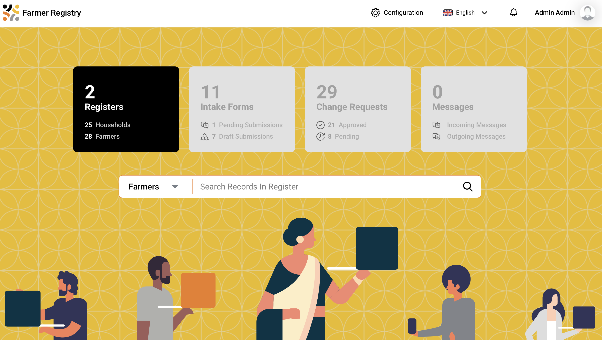
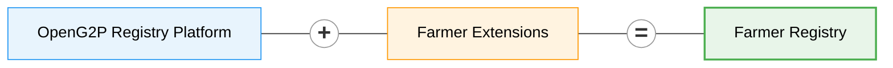

# Farmer Registry


**New home: GitLab.** **`farmer-registry`** is now developed at [github.com/OpenG2P/farmer-registry](https://github.com/OpenG2P/farmer-registry).


<figure><figcaption></figcaption></figure>

Farmer Registry is a manifestation of [OpenG2P Registry Platform](../registry/) with specifics related to a farmer registry.

```mermaid
graph LR
    A["OpenG2P Registry Platform"] --- P((" <b><span style='font-size:24px'>+</span></b> ")) --- B["Farmer Extensions"] --- E((" <b><span style='font-size:24px'>=</span></b> ")) --- C["Farmer Registry"]
    style A fill:#e8f4fd,stroke:#2196F3,color:#000
    style B fill:#fff3e0,stroke:#FF9800,color:#000
    style C fill:#e8f5e9,stroke:#4CAF50,stroke-width:2px,color:#000
    style P fill:#fff,stroke:#999,font-size:24px,color:#000
    style E fill:#fff,stroke:#999,font-size:24px,color:#000
```

This registry contains the following [**registers**](../registry/concepts.md#register):

1. Farmer Register
2. Household Register

The domain models for these registers live in the [`farmer-extension`](https://github.com/OpenG2P/farmer-registry/tree/develop/farmer-extension) package in this repository.

The Farmer Registry inherits all the [features of the registry platform](../registry/features/).

## How it is packaged

The Farmer Registry is a thin **extension** of the [Registry Platform](../registry/deployment-and-extension/README.md), which publishes the runnable Docker images and the `openg2p-registry` Helm chart. This repository adds only the farmer domain — the extension package, its seed content, a field-specific test set, and a wrapper chart that pins the platform chart and overlays farmer values. Nothing from the platform is copied or vendored.

* [**Deployment**](deployment/README.md) — how it is packaged, prerequisites, and installing from Rancher or the Helm CLI.
* [**Helm chart**](deployment/helm-chart.md) — the wrapper chart, what it deploys and how it is configured.
* [**Data seeding**](deployment/data-seeding.md) — the seed content this repo owns and the inherited machinery that applies it.
* [**Sanity testing**](deployment/sanity-testing.md) — the two-part test model and the farmer field tests.

## Versions

Chart and image versions — and what changed in each — are published by the central CI pipeline. See [**Versions**](versions/README.md), or go straight to the [changelog](https://openg2p.github.io/openg2p-packaging/farmer-registry/CHANGELOG).

## Domain models

Two **registers** hold the main records: **Farmer** and **Household**. The other models are **sections** linked to a farmer or household (a farmer has many lands, livestock entries and so on). Every model also has a history table (`g2p_register_history_*`) and an intake-form table (`g2p_intake_form_*`).

**Inherited from the platform** (not repeated below): `G2PRegister` gives every record its IDs (`internal_record_id`, `functional_record_id`), `record_name`, status, link to its parent and change-management fields; `G2PPerson` adds name, date of birth, `gender`, `marital_status`, foundational ID (the Fayda FAN), email and phone; `G2PGeo` adds the location (geography unit, latitude/longitude, address). See the [registry platform models](https://github.com/OpenG2P/registry-platform/tree/develop/core/openg2p-registry-core/src/openg2p_registry_core/models).

**Coded fields** take their values from a [Master Data](../../../platform/platform-services/master-data-service/README.md) dataset at run time (shown in brackets), or from fixed options in the form (marked *form*). Yes/no fields are booleans.

| Model (table) | Kind | Fields |
| --- | --- | --- |
| **Farmer** (`g2p_register_farmers`) | Register | `estimated_age`, `has_personal_phone`, `disabled` (*form*), `disability_type` (`DISABILITY_DOMAIN`), `disability_severity` (`DISABILITY_SEVERITY`), `source_of_income` (`SOURCE_OF_INCOME`), `source_of_income_other`, `language_spoken`, `education_level` (`EDUCATION_LEVEL`), `national_id_masked`, `main_crops` (`CROP_COMMODITY`, list); plus inherited `gender` (`GENDER`) and `marital_status` (`MARITAL_STATUS`) |
| **Household** (`g2p_register_households`) | Register | `household_head`, `number_of_male_members`, `number_of_female_members`, `number_of_children`, `number_of_elderly_members`, `size_of_group`, `other_land_owner` |
| **Household member** (`g2p_register_household_members`) | Section of Household | `is_head`, `relationship_to_the_head` (`RELATIONSHIP_TO_HEAD`), `is_disabled`; plus inherited person fields |
| **Land** (`g2p_register_lands`) | Section of Farmer | `land_size` (number), `unit` (*form*), `land_ownership_type` (*form*), `means_of_acquisition` (`MEANS_OF_ACQUISITION`), `year_of_acquisition`, `current_land_use` (*form*), `farming_type` (*form*), `soil_fertility` (*form*), `certificate_storage_id`; plus inherited location and parcel shape |
| **Livestock** (`g2p_register_livestocks`) | Section of Farmer | `livestock_type` (`LIVESTOCK_TYPE`), `breed` (`LIVESTOCK_BREED`), `head_count`, `livestock_system` (*form*) |
| **Farm inputs** (`g2p_register_farm_inputs`) | Section of Farmer | `fertilizer_use`, `improved_seed_use`, `pesticide_use`, `insecticide_use`, `access_to_machinery`, `access_to_finance`, `water_source` (`WATER_SOURCE`) |
| **Membership details** (`g2p_register_membership_details`) | Section of Farmer | `is_primary_cooperative_member`, `primary_cooperative_name`, `is_cooperative_union_member`, `cooperative_union_name`, `is_farmer_cluster_member`, `farmer_cluster_role` (*form*) |


The **Crop** register (`g2p_register_crops`) is retired: the crops a farmer grows are declared as `main_crops` on the Farmer record, and crops actually sown each season are recorded in the [Crop Sown Registry](../../../open-agri-stack/design/crop-sown-registry.md). Existing installs are migrated by the `zz-upgrades` seed SQL.


### Poverty score

The poverty score is **not a register table**. It is a score computation the extension contributes to the platform's scoring mechanism:

* `G2PScoreComputeServicePoverty` ([`score_compute/services/poverty.py`](https://github.com/OpenG2P/farmer-registry/blob/develop/farmer-extension/src/openg2p_registry_farmer_extension/score_compute/services/poverty.py)) implements the core `G2PScoreComputeInterface` and computes a vulnerability score for **Household** records — a higher score means higher vulnerability.
* It is bound to the Household register by seed metadata: `g2p_register_score_definitions.sql` (score type `POVERTY`) and `g2p_register_score_contributing_attributes.sql`, which name the attributes that feed the calculation.
* `G2PRegisterSchemaPovertyScore` exposes `poverty_score` and `poverty_score_type` on the API.

Because the score is defined in seed metadata rather than code, the contributing attributes and their weights can be changed without a code release.
