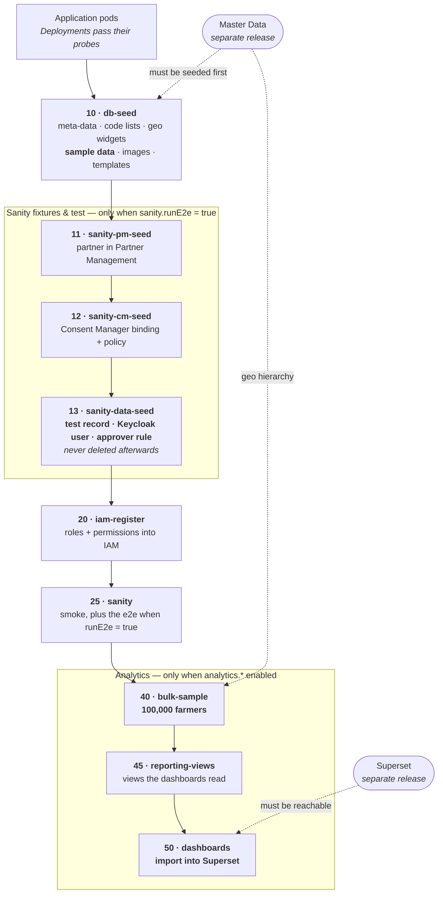

# Data seeding


**New home: GitLab.** **`farmer-registry`** is now developed at [gitlab.com/openg2p/registry/farmer-registry](https://gitlab.com/openg2p/registry/farmer-registry).

Any `github.com` links on this page refer to the **earlier GitHub repository**, which is now read-only. They are kept so that references to previous versions keep working.


Seeding follows the same split as everything else: the **machinery** is inherited from the platform's `db-seed` image, and the Farmer Registry supplies only its **content**.


The switches, the code-list mechanism, the Rancher form and the production
("empty") install are all platform-level and documented once in
[**Country data & seeding**](../../registry/deployment-and-extension/country-data-and-seeding.md).
For what a country pack is, see
[**Country Data Architecture**](../../../../platform/country-data-architecture.md).
This page covers only what is specific to the Farmer Registry.


## Three kinds of data the Farmer Registry can create

| | Sample data | Bulk data | Sanity data |
|---|---|---|---|
| **How much** | A few dozen people from the country pack, plus the farmer overlay below | **100,000 farmers** by default | A handful of fixtures |
| **Purpose** | Demonstrations — records a person reads | Volume for reports and dashboards | Verifying the deploy |
| **Switch** | `registry.dbSeed.loadSampleData` | `analytics.bulkSample.enabled` | `registry.sanity.runE2e` |
| **Default here** | `true` | `true` | `false` |

## Sample data

### Where the people come from

The individuals and households come from **Master Data**, which holds the country
pack's sample people (`g2p_sample_individuals`, `g2p_sample_households`), complete
with their geo ancestry — so every record points at a real administrative unit in
whatever country the deployment carries.

The Farmer Registry then **augments** each person with its own agricultural fields:

| Farmer overlay | Rows |
|---|---|
| `crops.json` | 757 |
| `lands.json` | 509 |
| `farmers.json` | 500 |
| `livestocks.json` | 471 |
| `farm_inputs.json` | 434 |
| `household_members.json` | 428 |
| `membership_details.json` | 122 |
| `scores.json` | 100 |

These live in [`docker/db-seed/seed-data`](https://gitlab.com/openg2p/registry/farmer-registry/-/tree/develop/docker/db-seed/seed-data) and are linked to whoever was actually loaded, rather than to a fixed set of ids.


**If Master Data holds no samples, the loader falls back** to the shared demography
CSV baked into the image and says so in its log. That CSV can only ever describe
one country — it has five fixed level names — so the fallback produces people whose
addresses do not match the deployment's country pack. Enable
`geoSeed.load.samples` on the Master Data chart to get a pack-coherent set.


## Code lists — including the agriculture domain

A Farmer Registry needs the country's agricultural vocabularies (crop types,
livestock) on top of the core lists a social registry uses. Those live in a
**domain subtree** of the country pack, and are opted into explicitly:

```yaml
registry:
  dbSeed:
    loadAttributes: true
    attributeDomains:
      - agriculture
```

Leaving `attributeDomains` empty loads only the core lists. A country pack that
carries no `agriculture` domain simply has none to load — the step logs it and
continues.

## Bulk data

The Farmer Registry generates **100,000 farmers** at install so that reports and
dashboards have something to show. Nobody reads an individual bulk row, so the
names and phone numbers are invented and need not belong to the country.


**Bulk generation still reads Master Data — it is not country-independent.**

It is the *people* that are country-agnostic, not the *geography*. Every generated
record must point at a real administrative unit or maps and drill-downs break, so
the generator reads the hierarchy from the MDS database
(`g2p_geo_levels` / `g2p_geo_level_values`) and fails if it is not there.

What this buys is that **one generator serves every country** — the same build
generates for Ethiopia or Kamuntu unchanged. It does not mean MDS is optional.


`analytics.bulkSample.expectedCountry` is a **guard, not a selector**: set it and
the job fails if MDS holds a different country than expected. Empty (the default)
means no check.

### Turning it off

```yaml
analytics:
  bulkSample:
    enabled: false
```


This one is **not in the Rancher form** — the generated questions come from the
platform chart, and `analytics.*` is the Farmer Registry's own key. Set it in the
YAML editor alongside the form.


## Sanity data

Completely separate from sample and bulk data, and created for a different reason:
to prove the deploy actually works.

With `sanity.runE2e: false` (the default) the suite is smoke-only and **creates
nothing**. With it on, a deploy-time job seeds the e2e's *own* fixtures — a sanity
farmer (`SANITY-FARMER-0001`) injected by SQL rather than reused from the sample
data, the suite's own Keycloak user with a non-temporary password, and that user as
an approver on the change-request policy.


**Sanity fixtures are never deleted.** They are left in place for inspection after
the run, so an environment that has ever had `runE2e: true` carries them
permanently. Keep it off for production.


## Install sequence

Everything below runs as Helm **post-install / post-upgrade hooks**, in hook-weight
order. Helm waits for each weight to succeed before creating the next, so this is a
strict sequence — and **a failure at any step blocks everything after it**.



Read the diagram top to bottom: each box only starts once the one above it has
succeeded. The two dotted arrows are the dependencies Helm cannot order, because
they belong to other releases — see [Cross-release dependencies](#cross-release-dependencies).

| Weight | Job | What it does | Runs when |
|---|---|---|---|
| — | *(application pods)* | The registry's own Deployments start and pass their probes | always |
| 10 | `fr-db-seed` | Meta-data SQL, code lists from Master Data, geo-widget sync, **sample data**, images, templates | `dbSeed.enabled` |
| 11 | `fr-sanity-pm-seed` | Registers the sanity partner in Partner Management | `sanity.runE2e` |
| 12 | `fr-sanity-cm-seed` | Consent Manager binding and policy for that partner | `sanity.runE2e` |
| 13 | `fr-sanity-data-seed` | **Sanity fixtures** — the test record, Keycloak user, approver rule | `sanity.runE2e` |
| 20 | `fr-iam-register` | Registers the registry's roles and permissions in IAM | always |
| 25 | `fr-sanity` | Runs the sanity suite | `sanity.enabled` |
| 40 | `fr-fr-bulk-sample` | Generates **100,000 farmers** | `analytics.bulkSample.enabled` |
| 45 | `fr-fr-reporting-views` | Creates the reporting views the dashboards read | `analytics.reportingViews.enabled` |
| 50 | `fr-fr-dashboards` | **Imports the dashboards into Superset** | `analytics.dashboards.enabled` |


**The dashboards are loaded by this registry, not by the analytics platform.** The
dashboard bundle ships in this repository, and the weight-50 job imports it into the
environment's Superset, points its database connection at this registry, publishes
the dashboards and enables embedding on them.

The ordering is the point: dashboards are imported **after** bulk data and **after**
the reporting views exist, so that a dashboard opened straight after install already
has data behind it rather than rendering empty.


### Cross-release dependencies

Two of these steps depend on releases Helm cannot order against, because they are
separate installs:

* **Master Data** must be seeded before weight 10 (code lists, geo, sample people)
  and before weight 40 (the bulk generator reads its geo hierarchy). The db-seed and
  bulk jobs each wait for it and fail with a clear message rather than producing
  records that point nowhere.
* **Superset** must be reachable before weight 50. That job waits for it rather
  than failing immediately, so a Superset that is merely restarting does not lose
  the dashboard import.


Because Helm stops at a failed hook, a failure in bulk generation (weight 40) also
prevents the reporting views and the dashboard import from ever running. If Superset
has no dashboards after an install, check the **earlier** jobs first.


## What the image contains

The Farmer Registry's `db-seed` image is a thin `FROM` of the platform's, clearing
the reference registry's content and copying its own — the extension's
`meta_data/`, `awe_meta_data/` and `templates/`, the `seed-data/*.json` overlay
above, `generate_fr_bulk_sample.py` and `reporting_views.sql`.

The bulk generator lives here, beside the reporting views it must move in step
with, rather than in a shared repository.

## Chart defaults

```yaml
registry:
  dbSeed:
    loadGeoData: false     # legacy loader — must stay off
    loadAttributes: true   # take the country's code lists from Master Data
    attributeDomains:
      - agriculture        # crops, livestock
    syncGeoWidgets: true   # match geo dropdowns to the country's levels
    loadSampleData: true
    loadImages: true

analytics:
  bulkSample:
    enabled: true
    farmers: 100000
```

For a production install, see
[An empty install](../../registry/deployment-and-extension/country-data-and-seeding.md#an-empty-install-for-production).
