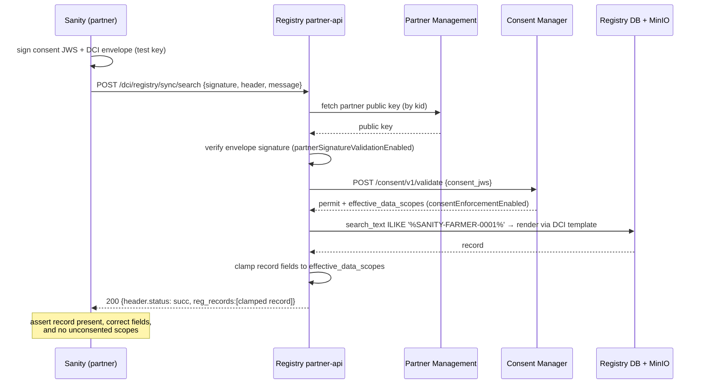
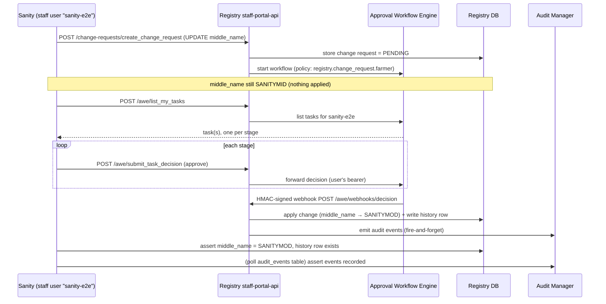

# Sanity testing

The Farmer Registry ships an **in-cluster sanity suite** — a pytest suite packaged as its own image (`openg2p/openg2p-farmer-registry-sanity`) and run as a post-install/upgrade Helm Job. It verifies that a fresh install actually works: the partner-api is live, the DCI data-sharing path enforces signatures and consent, and the change-request → approval → history → audit flow behaves.

Source: [`test/sanity`](https://github.com/OpenG2P/farmer-registry/tree/develop/test/sanity) · image [`docker/sanity`](https://github.com/OpenG2P/farmer-registry/tree/develop/docker/sanity).


**The e2e tier is OFF by default.** A normal install runs only the **smoke** tests (no auth, no data created). The full e2e — which creates test fixtures — runs only when `sanity.runE2e=true`. See [When e2e is disabled](#when-the-gates-or-e2e-are-disabled).


## What the suite tests

11 tests in two tiers (pytest markers `smoke` / `e2e`):

| Test | Tier | What it asserts |
| ---- | ---- | --------------- |
| `test_partner_ping` | smoke | `GET /ping` → 200 (partner-api is live) |
| `test_openapi_has_dci_search` | smoke | the DCI search route is present in `/openapi.json` |
| `test_dci_search_returns_the_consented_record` | e2e | a signed, consented DCI search returns the seeded farmer with the expected fields |
| `test_dci_search_clamps_to_consented_scopes` | e2e | returned fields are clamped to the consented scopes; unconsented scopes are absent |
| `test_search_without_consent_is_rejected` | e2e | a search with **no** consent object is rejected (`rjct`) |
| `test_search_with_unverifiable_signature_is_rejected` | e2e | a search signed with a key **not** registered in Partner Management is rejected |
| `test_search_with_wrong_consent_audience_is_rejected` | e2e | a consent object bound to an unknown audience is rejected |
| `test_change_request_is_created_pending` | e2e | a change request is created **pending** — nothing is applied yet |
| `test_approval_through_awe_applies_the_change` | e2e | approving every AWE stage applies the change to the record |
| `test_version_history_retains_the_previous_record` | e2e | approval writes a version-history row; the prior value survives |
| `test_audit_events_are_recorded` | e2e | the change request leaves an audit trail in Audit Manager |

The two complex flows are the **DCI data-sharing** e2e and the **change-request** e2e, diagrammed below.

Every e2e test **skips** (rather than fails) when a dependency it needs is unreachable or a required gate is off — so smoke coverage stays green everywhere and the Job never blocks a deploy.

## Flow 1 — DCI data-sharing e2e

The suite acts as a **partner**. It signs two things with one Partner-Management-registered key: the **consent object** (a compact JWS) and the **DCI envelope** (a detached JWS). The registry's partner-api is the policy-enforcement point.



Notes that matter for reading the assertions:

* Rejections come back as **HTTP 200 with `header.status = "rjct"`** (the status is in the body, not the HTTP code), so the tests assert on the envelope.
* Field clamping is a **strict allow-list over the record's top-level keys**, and the farmer DCI template emits exactly six (`farmer_personal_details`, `family_details`, `farm_details`, `machineries_details`, `registration_date`, `last_updated`). The e2e consents to `farmer_personal_details` and asserts the others are absent.
* Consent authorises **fields, not rows** — the registry does not filter results by the consent's subject, only the query. Clamping decides *which columns* return.

## Flow 2 — Change-request e2e

The suite acts as a **staff user**. It logs into staff-portal-api, raises a change request on the seeded farmer, approves it through the AWE proxy, then verifies the change landed, was versioned, and was audited.



Notes:

* The suite approves **only through the AWE proxy** (`/awe/submit_task_decision`). The registry also has `/change-requests/approve_change_request`, but that path does not consult the AWE workflow — approving through it would bypass the policy and prove nothing.
* AWE does **not** apply the change itself; it posts an **HMAC-signed webhook** back to the registry, which applies it and writes history. So the change lands **asynchronously** — the test polls for it (up to `sanity.aweSettleTimeout`, default 90 s).
* Audit Manager has **no query API**, so the audit assertion reads its `audit_events` table directly, with polling (the write path is fire-and-forget → Kafka → Postgres).

## Test data & seeding

The e2e needs identities and a record in several systems. These are seeded by **ordered post-install/upgrade Helm hook Jobs** (the `sanity-*-seed` Jobs render only when `runE2e=true`):

| Weight | Job | Seeds | Where / how |
| ------ | --- | ----- | ----------- |
| 10 | `db-seed` | the **AWE approval policy** (`registry.change_request.farmer`, 2 stages) | shipped SQL in `farmer-extension/.../awe_meta_data`, applied by `psql` into the AWE DB |
| 11 | `sanity-pm-seed` | the sanity **partner key** in Partner Management | `pm_seed` via PM's admin API |
| 12 | `sanity-cm-seed` | the sanity partner's **CM binding + policy** | `cm_seed` via CM's staff API |
| 13 | `sanity-data-seed` | the **Keycloak user**, the **test farmer**, the **AWE approver rule** | `keycloak_seed` + `data_seed` + `awe_seed` (see below) |
| 15 | `sanity` | — (runs the suite) | pytest |

`sanity-data-seed` runs three steps:

1. **`keycloak_seed`** — creates the `sanity-e2e` user in the `staff` realm via the Keycloak **Admin API**, with a **non-temporary** password and the roles it needs, and ensures `directAccessGrantsEnabled` on the registry client. (The shipped demo users can't be reused — keycloak-init gives them a *temporary* password, so their password grant fails with "Account is not fully set up".)
2. **`data_seed`** — **SQL-injects** the sanity farmer directly into the registry DB. Injected by SQL because every staff-portal-api register write is a change request, and the DCI tests need a record already in an approved, `ACTIVE` state. Injected rather than reusing sample data so the e2e also passes when `dbSeed.loadSampleData=false`. It writes `search_text` explicitly (ORM listeners that normally build it don't fire on raw SQL).
3. **`awe_seed`** — **SQL-inserts** an `approver_rule` naming `sanity-e2e` on each stage of the shipped policy (additive — the shipped `alex.carter`/`nina.patel` rules are left alone), so the sanity user is offered the approval tasks.

### Markers

Everything the suite creates is tagged, so the whole fixture set is findable (and removable):

| Fixture | Marker |
| ------- | ------ |
| Test farmer | `functional_record_id = SANITY-FARMER-0001`, `created_by = sanity-e2e`, `search_text` contains `SANITYE2E`; the changed field is `middle_name` (`SANITYMID` → `SANITYMOD`) |
| Keycloak user | username `sanity-e2e` |
| AWE approver rule | `rule_value` contains `sanity-e2e` |
| Partner Management key | partner `PARTNER_CM_SANITY`, kid `cm-sanity-1` |
| Consent Manager binding | audience `FR_SANITY_PARTNER`, controller `fr-sanity-controller` |

The DCI search deliberately matches on the **`functional_record_id`** (`SANITY-FARMER-0001`), which is part of `search_text` and is regenerated by the ORM on every update — so the record stays findable even after the change-request test modifies it. The partner identity uses a **fixed, checked-in TEST-ONLY Ed25519 key**; it is inert for real data sharing.

## Packaging & running at install

The suite is built from [`docker/sanity/Dockerfile`](https://github.com/OpenG2P/farmer-registry/blob/develop/docker/sanity/Dockerfile) (`python:3.12-slim` + pytest/httpx/cryptography/pyjwt/orjson/psycopg2) and published as `openg2p/openg2p-farmer-registry-sanity`. The `sanity` Job's entrypoint waits for the partner-api `/ping`, then runs:

* **smoke only** by default (`SANITY_RUN_E2E=false`), or
* **smoke + e2e** when `SANITY_RUN_E2E=true`.

By default `sanity.failOnError=false`, so the Job **exits 0 even if tests fail** — a sanity failure never blocks an install; you read the pod logs. Set `sanity.failOnError=true` to gate a deployment on it.

Relevant `values.yaml` keys under `sanity`: `enabled`, `runE2e`, `failOnError`, `readinessTimeout`, `dataScopes`, `deniedScopes`, `aweSettleTimeout`, `auditTimeout`, and the seeded-identity settings (`staffUsername`, `staffRoles`, …).

## Running the e2e from the command line

The suite is env-driven, so it runs from a laptop against a live cluster (kubectl configured). Use [`test/sanity/run-local.sh`](https://github.com/OpenG2P/farmer-registry/blob/develop/test/sanity/run-local.sh):

```bash
cd test/sanity
pip install -e .                                   # pytest, httpx, cryptography, pyjwt, orjson, psycopg2

NS=<namespace> RELEASE=<release> ./run-local.sh          # smoke only
NS=<namespace> RELEASE=<release> ./run-local.sh --e2e    # full suite (creates fixtures)
NS=<namespace> RELEASE=<release> ./run-local.sh --e2e -k clamp -x   # extra args → pytest
```

It port-forwards the partner-api, staff-portal-api, PM, CM and Postgres, reads credentials from the **same Secrets the chart wires into the Job**, exports the `SANITY_*` env, and runs pytest. It prints which credentials resolved so a skip is diagnosable, and cleans up the forwards on exit.

Two things to know:

* **Keycloak is reached over its public URL, not a port-forward.** Keycloak stamps the token's `iss` with the hostname it's reached on, and the APIs reject a token whose `iss` doesn't match their configured issuer. A port-forwarded token would carry `iss=http://localhost:…` and be rejected. Override with `KEYCLOAK_URL=` if your public hostname differs.
* Locally the script sets `FAIL_ON_ERROR=true` so a failure is a non-zero exit (the in-cluster Job does the opposite).

## When the gates or e2e are disabled

The DCI e2e is only meaningful when both PII-egress gates are **on** (they now default on — see [Helm chart → Integrating CM/PM](helm-chart.md#integrating-consent-manager-and-partner-management)). If you run the e2e with **`partnerSignatureValidationEnabled=false` and `consentEnforcementEnabled=false`**:

| Test | Result | Why |
| ---- | ------ | --- |
| `..._returns_the_consented_record` | **passes** | search + render still work — but with clamping off it proves retrieval only, not enforcement |
| `..._clamps_to_consented_scopes` | **skips** | it reads the enforcement posture from `header.meta` and skips when consent enforcement is off |
| all three negatives | **skip** | same — with the gate off there is nothing to reject |

So with both gates off you get **1 pass, 4 skips, 0 failures** — a green-looking run that has verified almost nothing about data-sharing. Enabling `runE2e=true` on such an install buys you little; keep the gates on for a meaningful e2e (that is the default).

And note that **the e2e is disabled by default at install** (`sanity.runE2e=false`) — so a normal install neither runs these tests nor creates any of their fixtures. Only the two smoke tests run, and they create nothing.

## Teardown

The suite **deliberately does not clean up after itself** — the fixtures (test farmer, change request, history, approver rule, Keycloak user) are left in place so a failed run can be inspected. On a real install with `runE2e=true`, remove them when you no longer need them.

`test/sanity/sanity/fixtures.py` carries the removal predicates. To tear down:

```sql
-- Registry DB — keyed on the farmer's internal_record_id, the one reliable
-- marker: the change-request and history rows are stamped with the user's
-- display name ("Sanity E2E"), not the created_by marker.
DELETE FROM g2p_register_history_farmers WHERE internal_record_id = '00000000-5a11-4e2e-8000-000000000001';
DELETE FROM g2p_register_change_requests  WHERE internal_record_id = '00000000-5a11-4e2e-8000-000000000001';
DELETE FROM g2p_register_farmers          WHERE internal_record_id = '00000000-5a11-4e2e-8000-000000000001';

-- AWE DB
DELETE FROM approver_rule WHERE rule_value::text LIKE '%sanity-e2e%';
```

Re-running the e2e requires a clean slate: a partially-completed run can leave a **pending** change request for the farmer, and the registry's sequence check blocks a new one until it's cleared — so run the registry deletes above before a re-run.

```bash
# Keycloak (admin API, not SQL): delete the test user from the staff realm
#   find the user id, then DELETE /admin/realms/staff/users/{id}
```

The **Partner Management key** (`PARTNER_CM_SANITY`) and **Consent Manager binding** (`FR_SANITY_PARTNER`) are shared, persistent test fixtures reused across runs and are intentionally *not* deleted.

## Other things worth knowing

* **The two APIs authenticate very differently.** The partner-api (DCI) uses **no Keycloak** — it's signature + consent only. staff-portal-api (change requests) uses the full auth chain, so the suite provisions its own real Keycloak user and logs in with a password grant.
* **AWE issuer prerequisite.** Because the change-request approval forwards the user's token to AWE, AWE must validate it against the **external** Keycloak issuer (the same one user tokens carry). If AWE is configured with the internal issuer, approvals fail with `AWE-ERR-006: Invalid issuer` — a common misconfiguration to check if the change-request tests fail at the AWE hop.
* **AWE must be enabled** (`global.aweEnabled=true`, the default). With it off, the change request never reaches a workflow and the approval test **skips** with an explanatory message rather than giving a false green.
* **Templates must be seeded.** DCI records render through a MinIO-hosted Jinja template uploaded by db-seed when `dbSeed.loadTemplates=true` (default). With it off, DCI search returns an empty result and the retrieval test fails — check this if a healthy-looking registry returns no records.
