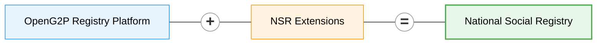
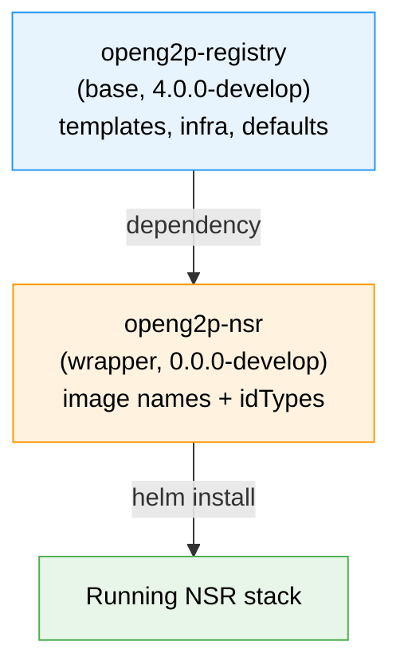

# National Social Registry

A **National Social Registry (NSR)** is a dynamic, centrally-maintained repository of socio-economic information on poor and vulnerable individuals and households. It serves as the single source of truth that government agencies rely on to _target, enrol and deliver_ social-protection programmes — cash transfers, food support, elderly pensions, disability allowances, health insurance, school feeding, public works and the like.

A well-run NSR answers three recurring questions across programmes:

* **Who** is poor or vulnerable, and by what measure?
* **Where** are they, and which household do they belong to?
* **What** programmes are they already on, who consented to what, and when were their records last verified?

It replaces siloed, per-programme beneficiary databases — where the same household gets registered, mis-targeted and reconciled again and again — with one extensible record that every programme reads from.

**OpenG2P National Social Registry** is a manifestation of the [OpenG2P Registry Platform](registry/) with specifics related to a national-level social registry.



The NSR inherits all the [features of the registry platform](registry/features/) — change-management & approval workflows, ingestion/outgestion pipelines, consent-aware data sharing, audit-ability, RBAC, deduplication, dynamic UI rendering, meta-data-driven extensibility, cloud-native deployment — and adds a domain model tuned to social protection.

## Registers

NSR defines **two [registers](registry/concepts.md#register)** (top-level entities that drive registration, change-requests, and search in the staff portal) plus a set of **supporting tables** (multi-valued or time-series data linked to a register record):

* **Individual Register** — personal demographics, identity evidence, vulnerability & inclusion markers, livelihoods
* **Household Register** — composition, headship, dwelling conditions, basic services

An Individual may exist independently or belong to a Household, linked via `link_internal_record_id` on the Individual record. Supporting tables follow the same linkage pattern.

The NSR domain models are available in the [NSR repository](https://github.com/OpenG2P/national-social-registry/tree/develop/nsr-extension).

## Versions

| Artefact | Current (develop) | Where |
| -------- | ----------------- | ----- |
| NSR Helm wrapper chart | `0.0.0-develop` | [`helm/openg2p-nsr/`](https://github.com/OpenG2P/national-social-registry/tree/develop/helm/openg2p-nsr) |
| Base registry chart (dependency) | `4.0.0-develop` | [openg2p-registry-gen2-deployment](https://github.com/OpenG2P/openg2p-registry-gen2-deployment) |
| Docker images (tag) | `develop` | Docker Hub `openg2p/openg2p-nsr-*` |

NSR follows the **branch-name-equals-version** convention: the `develop` branch carries `-develop` pre-release tags on both the wrapper chart and all Docker images. Release branches drop the suffix in lockstep.

## Source code


All NSR source — Python extension, Docker build definitions, Helm wrapper chart, CI workflows — lives in one repository:\
[**github.com/OpenG2P/national-social-registry**](https://github.com/OpenG2P/national-social-registry)


Layout at a glance:

```
national-social-registry/
├── nsr-extension/        Python package (SQLAlchemy models, Pydantic schemas,
│                         domain services, ID generator, meta-data + sample SQL)
├── docker/               Dockerfile + spec file for each of the five images
│   ├── staff-portal-api/
│   ├── partner-api/
│   ├── celery/
│   ├── staff-portal-ui/
│   └── db-seed/
├── helm/openg2p-nsr/     Thin wrapper chart over the base registry chart
└── .github/workflows/    Path-scoped CI for docker images and the helm chart
```

## Domain model

Each register/table below extends the platform's core base classes — `G2PRegister`, `G2PPerson`, `G2PGeo`, `G2PGeoShape` (and their `*History` twins). Inherited fields (`internal_record_id`, `functional_record_id`, `link_internal_record_id`, `record_name`, `search_text`, `record_status`, all person-level and geo fields, audit stamps) are **not repeated below** — only the NSR-specific additions are listed.

For the full inherited schema see the [platform data model](registry/design/data-model.md).


Every concrete table has a corresponding `g2p_register_history_*` snapshot table with the same domain columns, used by the change-management workflow. History tables are not listed separately.


### Individual (`g2p_register_individuals`)

Extends `G2PRegister`, `G2PPerson`, `G2PGeo`. The primary register for person-level records. Links to a Household (if any) via `link_internal_record_id`.

Grouped by theme:

* **Identity & evidence** — `foundational_id_masked`, `foundational_id_verification_status`, `identity_evidence_type`, `legacy_program_ids`
* **Names** — `full_name`, `alias_names` _(alternative-spellings list for search/dedup)_
* **Demographics (beyond base)** — `estimated_age`, `age_method`, `citizenship_category`
* **Household membership** — `relationship_to_head`, `residency_status`, `dependency_indicator`
* **Contact** — `preferred_contact_method`, `contact_person_name`
* **Vulnerability & inclusion** — `disability_status` _(high-level YES/NO/UNKNOWN flag — per-domain severities live in the `IndividualDisability` table)_, `plw_status`, `plw_status_date`, `orphanhood_flag`, `chronic_illness_flag`, `displacement_status`, `pastoralist_classification`, `high_mobility_indicator`
* **Livelihood** — `primary_livelihood`, `secondary_livelihood`, `employment_status`, `coping_strategies_index`

### Household (`g2p_register_households`)

Extends `G2PRegister`, `G2PGeo`. Group-level register covering composition and living conditions.

* **Headship & composition** — `household_head_internal_record_id`, `household_head_name`, `headship_type`, `size_total`, `size_adults`, `size_children_u5`, `size_school_age`, `size_elderly`, `number_of_female_members`, `number_of_male_members`, `elderly_member_present`
* **Dwelling** — `dwelling_type`, `roof_material`, `wall_material`, `floor_material`, `tenure_status`, `rooms_count`, `overcrowding_indicator`
* **Basic services** — `water_source_type`, `water_distance_minutes`, `sanitation_type`, `lighting_source`, `cooking_fuel_type`, `mobile_phone_type`

### Supporting tables

Multi-valued or time-series data lives in supporting tables. Each is linked to a parent register via `link_internal_record_id` and uses the platform's standard identifier prefixes.

| Table | Parent | NSR-specific fields |
| ----- | ------ | ------------------- |
| **Individual Disability** (`g2p_register_individual_disabilities`) | Individual | `disability_domain` (Washington Group Short Set: VISION, HEARING, MOBILITY, COGNITION, SELF_CARE, COMMUNICATION), `disability_severity` — **one row per affected domain** so an individual can carry different severities across functional domains |
| **Program Participation** (`g2p_register_program_participations`) | Individual _or_ Household | `linked_register_mnemonic`, `program_name`, `program_mnemonic`, `program_start_date`, `program_exit_date`, `legacy_program_id`, `payment_channel_preference`, `payment_account_token`, `payment_verification_status` |
| **Poverty Score** (`g2p_register_poverty_scores`) | Household | `pmt_score`, `pmt_score_type`, `pmt_variables`, `pmt_calculation_date`, `pmt_model_version` |
| **Asset** (`g2p_register_assets`) | Household | `asset_type`, `asset_category`, `quantity`, `size_value`, `size_unit`, `size_band`, `details` |
| **Shock** (`g2p_register_shocks`) | Individual | `shock_type`, `shock_date`, `shock_period`, `coping_strategy` |
| **Consent** (`g2p_register_consents`) | Individual | `consent_captured`, `consent_date`, `consent_scope`, `consent_method`, `consent_evidence_ref`, `data_sharing_restrictions` |
| **Grievance** (`g2p_register_grievances`) | Individual | `grievance_case_id`, `grievance_type`, `submission_channel`, `grievance_status`, `submission_date`, `resolution_date`, `resolution_code`, `resolution_rationale`, `protection_referral_flag` |
| **Verification History** (`g2p_register_verification_history`) | Individual _or_ Household | `linked_register_mnemonic`, `update_trigger`, `data_source`, `enumerator_id`, `office_location_code`, `verification_status`, `verification_method`, `verified_at`, `data_quality_flags` |

### Identifiers

| Mnemonic | Auto-generated prefix | Auto-gen in config |
| -------- | --------------------- | ------------------ |
| `Individual` | `IND-` | ✅ |
| `Household` | `HH-` | ✅ |
| `IndividualDisability` | `DIS-` | ✖ (externally supplied) |
| `ProgramParticipation` | `PP-` | ✖ |
| `PovertyScore` | `PMT-` | ✖ |
| `Asset` | `AST-` | ✖ |
| `Shock` | `SHK-` | ✖ |
| `Consent` | `CNS-` | ✖ |
| `Grievance` | `GRV-` | ✖ |
| `VerificationHistory` | `VER-` | ✖ |

`foundational_id` (national ID / alias) is **UNIQUE + INDEXED** on Individual. `grievance_case_id` is **UNIQUE** on Grievance. Other fields carry B-tree indexes where query shapes warrant (e.g. `pmt_score` for targeting thresholds, `shock_date` for time-series analytics) — the full list is documented inline in the model files.

## Helm chart

NSR's deployment is shipped as a thin **wrapper chart** that depends on the OpenG2P Registry base chart. The wrapper adds no templates of its own — it only overrides NSR-specific values.



**What the wrapper overrides**, and nothing more:

1. **Docker image repositories** — five NSR-branded images in place of the base chart's farmer defaults:
   * `openg2p/openg2p-nsr-staff-portal-api`
   * `openg2p/openg2p-nsr-partner-api`
   * `openg2p/openg2p-nsr-staff-portal-ui`
   * `openg2p/openg2p-nsr-celery` _(same image runs as worker or beat, selected at runtime)_
   * `openg2p/openg2p-nsr-db-seed`
2. **ID Generator `idTypes`** — adds an `individual` entry (length 12) alongside the base's `household` entry.
3. **Rancher branding** — `catalog.cattle.io/display-name: OpenG2P NSR` and the NSR `questions.yaml` for the Rancher form.

Everything else — Keycloak, Postgres, RabbitMQ, ingress, templates, service-monitors, resource profiles — is inherited **unmodified** from the base chart. That's the whole point of the wrapper pattern: new variants (NSR today, another social programme tomorrow) cost ~30 lines of YAML instead of a forked chart.


The wrapper chart's version tracks the NSR repo's branch (`0.0.0-develop`). The base-chart dependency is pinned to a corresponding release (`4.0.0-develop`). On release, both sides drop `-develop` together. See the [wrapper strategy doc](https://github.com/OpenG2P/national-social-registry/blob/develop/helm/openg2p-nsr/README.md#versioning) for the full cadence.


### Installing

```bash
helm repo add openg2p https://openg2p.github.io/openg2p-helm
helm repo update

helm install nsr openg2p/openg2p-nsr \
  --version 0.0.0-develop \
  --namespace openg2p-nsr \
  --create-namespace \
  --set openg2p-registry.global.domain=nsr.example.com
```

For dev/test environments, toggle sample-data seeding:

```bash
--set openg2p-registry.dbSeed.loadSampleData=true
```

This populates the database with 5 demo households, 15 demo individuals, and demo rows for every supporting table.

### Rancher catalog

The `openg2p-nsr` chart carries the `openg2p.org/add-to-rancher` annotation, which makes it appear in the Rancher-specific sub-index at `https://openg2p.github.io/openg2p-helm/rancher/` alongside the other OpenG2P charts. Rancher users install it directly from the Apps catalog; the chart's `questions.yaml` renders a branded form for the common knobs (domain, namespace, image tags, seeder toggle, individual-ID prefix/length).

## Docker images

Five images are produced from this repo. Each uses the `develop` tag when built from the `develop` branch:

| Image | Purpose |
| ----- | ------- |
| `openg2p/openg2p-nsr-staff-portal-api` | Backend API for the staff portal (migrations + REST) |
| `openg2p/openg2p-nsr-partner-api` | Partner-facing REST API for data sharing with other government systems |
| `openg2p/openg2p-nsr-celery` | Celery worker / beat (mode selected via env vars at runtime) |
| `openg2p/openg2p-nsr-staff-portal-ui` | Next.js staff portal UI (clones `openg2p-registry-gen2-staff-portal-ui` at build time) |
| `openg2p/openg2p-nsr-db-seed` | Postgres-client image that applies the meta-data SQL (and optional sample data) to a target database |

CI path-filters ensure each workflow only rebuilds when its own inputs change: the db-seed image rebuilds on SQL changes (`meta_data/`, `sample_data/`), the backend images on Python or spec-file changes, the UI image on its own folder, and the Helm chart publishes only on `helm/**` changes.

## Meta-data seeding

The db-seed image packages the register definitions, schemas, UI tabs, sections, attribute lookups and registry configuration as ordered SQL files. At install time the chart runs it as a Kubernetes Job against the target Postgres; at runtime it reads:

* `PGHOST`, `PGPORT`, `PGDATABASE`, `PGUSER`, `PGPASSWORD` — connection
* `LOAD_SAMPLE_DATA=true` _(optional)_ — also apply the sample-data SQL

See the [Meta Data Seeding design](registry/design/meta-data-seeding.md) for the platform-level framework.

## Related

* [OpenG2P Registry Platform](registry/) — the base that NSR extends
* [Farmer Registry](farmer-registry.md) — sibling manifestation of the same platform, tuned for agricultural-extension use-cases
* [Registry concepts](registry/concepts.md) — register, table, section, tab, change request, etc.
* [Registry features](registry/features/) — the full list of capabilities NSR inherits
