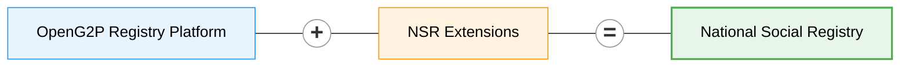

# National Social Registry


**New home: GitLab.** **`national-social-registry`** is now developed at [github.com/OpenG2P/national-social-registry](https://github.com/OpenG2P/national-social-registry).


A **National Social Registry (NSR)** is a dynamic, centrally-maintained repository of socio-economic information on poor and vulnerable individuals and households. It serves as the single source of truth that government agencies rely on to _target, enrol and deliver_ social-protection programmes — cash transfers, food support, elderly pensions, disability allowances, health insurance, school feeding, public works and the like.

A well-run NSR answers three recurring questions across programmes:

* **Who** is poor or vulnerable, and by what measure?
* **Where** are they, and which household do they belong to?
* **What** programmes are they already on, who consented to what, and when were their records last verified?

It replaces siloed, per-programme beneficiary databases — where the same household gets registered, mis-targeted and reconciled again and again — with one extensible record that every programme reads from.

**OpenG2P National Social Registry** is a manifestation of the [OpenG2P Registry Platform](../registry/) with specifics related to a national-level social registry.

The NSR inherits all the [features of the registry platform](../registry/features/) — change-management & approval workflows, ingestion/outgestion pipelines, consent-aware data sharing, audit-ability, RBAC, deduplication, dynamic UI rendering, meta-data-driven extensibility, cloud-native deployment — and adds a domain model tuned to social protection.

## Registers

NSR defines **two** [**registers**](../registry/concepts.md#register) (top-level entities that drive registration, change-requests, and search in the staff portal) plus a set of **supporting tables** (multi-valued or time-series data linked to a register record):

* **Individual Register** — personal demographics, identity evidence, vulnerability & inclusion markers, livelihoods
* **Household Register** — composition, headship, dwelling conditions, basic services

An Individual may exist independently or belong to a Household, linked via `link_internal_record_id` on the Individual record. Supporting tables follow the same linkage pattern.

The NSR domain models are available in the [NSR repository](https://github.com/OpenG2P/national-social-registry/tree/develop/nsr-extension).

## How it is packaged

The NSR is a thin **extension** of the [Registry Platform](../registry/deployment-and-extension/README.md), which publishes the runnable Docker images and the `openg2p-registry` Helm chart. This repository adds only the NSR domain — the extension package, its seed content, and a wrapper chart that pins the platform chart and overlays NSR values. Nothing from the platform is copied or vendored.

* [**Deployment**](deployment/README.md) — how it is packaged, prerequisites, and installing from Rancher or the Helm CLI.
* [**Helm chart**](deployment/helm-chart.md) — the wrapper chart, what it deploys and how it is configured.
* [**Data seeding**](deployment/data-seeding.md) — the seed content this repo owns and the inherited machinery that applies it.
* [**Sanity testing**](deployment/sanity-testing.md) — why NSR inherits the whole suite unchanged.

All NSR source — the Python extension, the thin Dockerfiles, the wrapper chart and the single CI workflow — lives in one repository: [**github.com/OpenG2P/national-social-registry**](https://github.com/OpenG2P/national-social-registry).

## Versions

Chart and image versions — and what changed in each — are published by the central CI pipeline. See [**Versions**](versions/README.md), or go straight to the [changelog](https://openg2p.github.io/openg2p-packaging/national-social-registry/CHANGELOG).

## Domain model

Each register/table below extends the platform's core base classes — `G2PRegister`, `G2PPerson`, `G2PGeo`, `G2PGeoShape` (and their `*History` twins). Inherited fields (`internal_record_id`, `functional_record_id`, `link_internal_record_id`, `record_name`, `search_text`, `record_status`, all person-level and geo fields, audit stamps) are **not repeated below** — only the NSR-specific additions are listed.

For the full inherited schema see the [platform data model](../registry/design/data-model.md).


Every concrete table has a corresponding `g2p_register_history_*` snapshot table with the same domain columns, used by the change-management workflow. History tables are not listed separately.


### Individual (`g2p_register_individuals`)

Extends `G2PRegister`, `G2PPerson`, `G2PGeo`. The primary register for person-level records. Links to a Household (if any) via `link_internal_record_id`.

Grouped by theme:

* **Identity & evidence** — `foundational_id_masked`, `foundational_id_verification_status`, `identity_evidence_type`, `legacy_program_ids`
* **Names** — `full_name`, `alias_names` _(alternative-spellings list for search/dedup)_
* **Demographics (beyond base)** — `estimated_age`, `age_method`, `citizenship_category`
* **Household membership** — `relationship_to_head`, `residency_status`, `dependency_indicator`
* **Contact** — `preferred_contact_method`, `contact_person_name`
* **Vulnerability & inclusion** — `disability_status` _(high-level YES/NO/UNKNOWN flag — per-domain severities live in the `IndividualDisability` table)_, `plw_status`, `plw_status_date`, `orphanhood_flag`, `chronic_illness_flag`, `displacement_status`, `pastoralist_classification`, `high_mobility_indicator`
* **Livelihood** — `primary_livelihood`, `secondary_livelihood`, `employment_status`, `coping_strategies_index`

### Household (`g2p_register_households`)

Extends `G2PRegister`, `G2PGeo`. Group-level register covering composition and living conditions.

* **Headship & composition** — `household_head_internal_record_id`, `household_head_name`, `headship_type`, `size_total`, `size_adults`, `size_children_u5`, `size_school_age`, `size_elderly`, `number_of_female_members`, `number_of_male_members`, `elderly_member_present`
* **Dwelling** — `dwelling_type`, `roof_material`, `wall_material`, `floor_material`, `tenure_status`, `rooms_count`, `overcrowding_indicator`
* **Basic services** — `water_source_type`, `water_distance_minutes`, `sanitation_type`, `lighting_source`, `cooking_fuel_type`, `mobile_phone_type`

### Supporting tables

Multi-valued or time-series data lives in supporting tables. Each is linked to a parent register via `link_internal_record_id`. Every register and supporting table has a `*_history` twin for version snapshots.

| Mnemonic / Table                                                              | Parent     | NSR-specific fields                                                                                                                                                          |
| ----------------------------------------------------------------------------- | ---------- | --------------------------------------------------------------------------------------------------------------------------------------------------------------------------- |
| **IndividualProgram** (`g2p_register_individual_programs`)                    | Individual | `program_name`, `program_start_date`, `program_exit_date`                                                                                                                   |
| **IndividualLand** (`g2p_register_individual_land`)                           | Individual | `land_access`, `land_size`, `productive_assets`                                                                                                                             |
| **IndividualLivelihood** (`g2p_register_individual_livelihoods`)              | Individual | `primary_livelihood`, `secondary_livelihood`, `employment_status`, `coping_strategies_index`, `mobile_phone_type`                                                           |
| **IndividualLivestock** (`g2p_register_individual_livestock`)                 | Individual | `livestock_species`, `livestock_counts`                                                                                                                                     |
| **IndividualVulnerability** (`g2p_register_individual_vulnerability`)         | Individual | `disability_status`, `orphanhood_flag`, `chronic_illness_flag`, `displacement_status`, `pastoralist_classification`, `high_mobility_indicator`, `plw_status`, `plw_status_date` |
| **IndividualShock** (`g2p_register_individual_shocks`)                        | Individual | `shock_type`, `shock_date`, `shock_period`, `coping_strategy`                                                                                                               |
| **IndividualDisability** (`g2p_register_individual_disabilities`)             | Individual | `disability_domain` (Washington Group Short Set: VISION, HEARING, MOBILITY, COGNITION, SELF\_CARE, COMMUNICATION), `disability_severity` — **one row per affected domain**   |
| **HouseholdProgram** (`g2p_register_household_programs`)                      | Household  | `program_name`, `program_start_date`, `program_exit_date`                                                                                                                   |
| **HouseholdHousingAndServices** (`g2p_register_household_housing_and_services`) | Household | `dwelling_type`, `roof_material`, `wall_material`, `floor_material`, `tenure_status`, `water_source_type`, `water_distance_minutes`, `sanitation_type`, `lighting_source`, `cooking_fuel_type` |
| **HouseholdAsset** (`g2p_register_household_assets`)                          | Household  | `asset_type`, `asset_category`, `quantity`, `size_value`, `size_unit`, `size_band`, `details`                                                                               |
| **Score** (`g2p_register_scores`, core table)                                | Household  | Latest computed poverty / vulnerability scores; `score_type` (e.g. `POVERTY`)                                                                                               |


Verification / audit trail is provided by the registry-core platform itself (`g2p_register_verifications`); NSR does not duplicate it.


### Identifiers

Only the two registers receive an auto-generated functional ID (`functional_id_generation_required = TRUE`). Supporting-table rows are keyed by the platform's `internal_record_id` and linked to their parent — they are not assigned a functional-ID prefix.

| Mnemonic     | Auto-generated prefix |
| ------------ | --------------------- |
| `Individual` | `IN-`                 |
| `Household`  | `HH-`                 |

`foundational_id` (national ID / alias) is **UNIQUE + INDEXED** on Individual. Other fields carry B-tree indexes where query shapes warrant (e.g. `shock_date` for time-series analytics) — the full list is documented inline in the model files.

## Related

* [OpenG2P Registry Platform](../registry/) — the base that NSR extends
* [Farmer Registry](../farmer-registry/README.md) — sibling manifestation of the same platform, tuned for agricultural-extension use-cases
* [Registry concepts](../registry/concepts.md) — register, table, section, tab, change request, etc.
* [Registry features](../registry/features/) — the full list of capabilities NSR inherits
