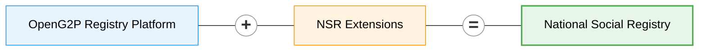
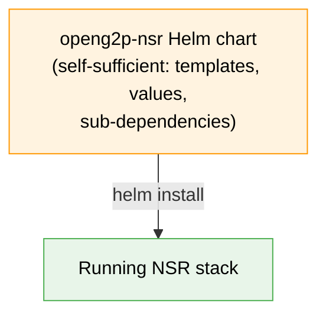

# National Social Registry

A **National Social Registry (NSR)** is a dynamic, centrally-maintained repository of socio-economic information on poor and vulnerable individuals and households. It serves as the single source of truth that government agencies rely on to _target, enrol and deliver_ social-protection programmes — cash transfers, food support, elderly pensions, disability allowances, health insurance, school feeding, public works and the like.

A well-run NSR answers three recurring questions across programmes:

* **Who** is poor or vulnerable, and by what measure?
* **Where** are they, and which household do they belong to?
* **What** programmes are they already on, who consented to what, and when were their records last verified?

It replaces siloed, per-programme beneficiary databases — where the same household gets registered, mis-targeted and reconciled again and again — with one extensible record that every programme reads from.

**OpenG2P National Social Registry** is a manifestation of the [OpenG2P Registry Platform](../registry/) with specifics related to a national-level social registry.



The NSR inherits all the [features of the registry platform](../registry/features/) — change-management & approval workflows, ingestion/outgestion pipelines, consent-aware data sharing, audit-ability, RBAC, deduplication, dynamic UI rendering, meta-data-driven extensibility, cloud-native deployment — and adds a domain model tuned to social protection.

## Registers

NSR defines **two** [**registers**](../registry/concepts.md#register) (top-level entities that drive registration, change-requests, and search in the staff portal) plus a set of **supporting tables** (multi-valued or time-series data linked to a register record):

* **Individual Register** — personal demographics, identity evidence, vulnerability & inclusion markers, livelihoods
* **Household Register** — composition, headship, dwelling conditions, basic services

An Individual may exist independently or belong to a Household, linked via `link_internal_record_id` on the Individual record. Supporting tables follow the same linkage pattern.

The NSR domain models are available in the [NSR repository](https://github.com/OpenG2P/national-social-registry/tree/develop/nsr-extension).

## Versions

| Artefact            | Current (develop) | Where                                                                                                    |
| ------------------- | ----------------- | -------------------------------------------------------------------------------------------------------- |
| NSR Helm chart      | `0.0.0-develop`   | [`helm/openg2p-nsr/`](https://github.com/OpenG2P/national-social-registry/tree/develop/helm/openg2p-nsr) |
| Docker images (tag) | `develop`         | Docker Hub `openg2p/openg2p-nsr-*`                                                                       |

NSR follows the **branch-name-equals-version** convention: the `develop` branch carries `-develop` pre-release tags on the Helm chart and all Docker images.

The underlying **platform version is the version of the** [**`registry-platform`**](https://github.com/openg2p/registry-platform) **repository** NSR is built from. There is no longer a separate "base registry chart" — the NSR chart is self-sufficient.


The detailed version mapping (platform ↔ NSR ↔ image tags) is still being clarified and will be documented later.


## Source code


All NSR source — Python extension, Docker build definitions, the complete Helm chart, CI workflows — lives in one repository:\
[**github.com/OpenG2P/national-social-registry**](https://github.com/OpenG2P/national-social-registry)


NSR is a **manifestation** of the [`registry-platform`](https://github.com/openg2p/registry-platform): its Docker builds assemble the platform runtimes (pulled from `registry-platform`) together with the NSR extension, and its Helm chart deploys the result. The platform itself is not deployable on its own.

Layout at a glance:

```
national-social-registry/
├── nsr-extension/        Python package (SQLAlchemy models, Pydantic schemas,
│                         domain services, ID generator, meta-data + sample SQL)
├── docker/               Dockerfile + spec file for each backend image
│   ├── staff-portal-api/
│   ├── partner-api/
│   ├── celery/
│   └── db-seed/
├── helm/openg2p-nsr/     Complete, self-sufficient Helm chart for NSR
└── .github/workflows/    Path-scoped CI for docker images and the helm chart
```


The **Staff Portal UI image is not built here** — it is a common runtime built by the [`registry-platform`](https://github.com/openg2p/registry-platform) repository and published as `openg2p/openg2p-registry-staff-portal-ui`. The NSR Helm chart simply references that image.


## Domain model

Each register/table below extends the platform's core base classes — `G2PRegister`, `G2PPerson`, `G2PGeo`, `G2PGeoShape` (and their `*History` twins). Inherited fields (`internal_record_id`, `functional_record_id`, `link_internal_record_id`, `record_name`, `search_text`, `record_status`, all person-level and geo fields, audit stamps) are **not repeated below** — only the NSR-specific additions are listed.

For the full inherited schema see the [platform data model](../registry/design/data-model.md).


Every concrete table has a corresponding `g2p_register_history_*` snapshot table with the same domain columns, used by the change-management workflow. History tables are not listed separately.


### Individual (`g2p_register_individuals`)

Extends `G2PRegister`, `G2PPerson`, `G2PGeo`. The primary register for person-level records. Links to a Household (if any) via `link_internal_record_id`.

Grouped by theme:

* **Identity & evidence** — `foundational_id_masked`, `foundational_id_verification_status`, `identity_evidence_type`, `legacy_program_ids`
* **Names** — `full_name`, `alias_names` _(alternative-spellings list for search/dedup)_
* **Demographics (beyond base)** — `estimated_age`, `age_method`, `citizenship_category`
* **Household membership** — `relationship_to_head`, `residency_status`, `dependency_indicator`
* **Contact** — `preferred_contact_method`, `contact_person_name`
* **Vulnerability & inclusion** — `disability_status` _(high-level YES/NO/UNKNOWN flag — per-domain severities live in the `IndividualDisability` table)_, `plw_status`, `plw_status_date`, `orphanhood_flag`, `chronic_illness_flag`, `displacement_status`, `pastoralist_classification`, `high_mobility_indicator`
* **Livelihood** — `primary_livelihood`, `secondary_livelihood`, `employment_status`, `coping_strategies_index`

### Household (`g2p_register_households`)

Extends `G2PRegister`, `G2PGeo`. Group-level register covering composition and living conditions.

* **Headship & composition** — `household_head_internal_record_id`, `household_head_name`, `headship_type`, `size_total`, `size_adults`, `size_children_u5`, `size_school_age`, `size_elderly`, `number_of_female_members`, `number_of_male_members`, `elderly_member_present`
* **Dwelling** — `dwelling_type`, `roof_material`, `wall_material`, `floor_material`, `tenure_status`, `rooms_count`, `overcrowding_indicator`
* **Basic services** — `water_source_type`, `water_distance_minutes`, `sanitation_type`, `lighting_source`, `cooking_fuel_type`, `mobile_phone_type`

### Supporting tables

Multi-valued or time-series data lives in supporting tables. Each is linked to a parent register via `link_internal_record_id`. Every register and supporting table has a `*_history` twin for version snapshots.

| Mnemonic / Table                                                              | Parent     | NSR-specific fields                                                                                                                                                          |
| ----------------------------------------------------------------------------- | ---------- | --------------------------------------------------------------------------------------------------------------------------------------------------------------------------- |
| **IndividualProgram** (`g2p_register_individual_programs`)                    | Individual | `program_name`, `program_start_date`, `program_exit_date`                                                                                                                   |
| **IndividualLand** (`g2p_register_individual_land`)                           | Individual | `land_access`, `land_size`, `productive_assets`                                                                                                                             |
| **IndividualLivelihood** (`g2p_register_individual_livelihoods`)              | Individual | `primary_livelihood`, `secondary_livelihood`, `employment_status`, `coping_strategies_index`, `mobile_phone_type`                                                           |
| **IndividualLivestock** (`g2p_register_individual_livestock`)                 | Individual | `livestock_species`, `livestock_counts`                                                                                                                                     |
| **IndividualVulnerability** (`g2p_register_individual_vulnerability`)         | Individual | `disability_status`, `orphanhood_flag`, `chronic_illness_flag`, `displacement_status`, `pastoralist_classification`, `high_mobility_indicator`, `plw_status`, `plw_status_date` |
| **IndividualShock** (`g2p_register_individual_shocks`)                        | Individual | `shock_type`, `shock_date`, `shock_period`, `coping_strategy`                                                                                                               |
| **IndividualDisability** (`g2p_register_individual_disabilities`)             | Individual | `disability_domain` (Washington Group Short Set: VISION, HEARING, MOBILITY, COGNITION, SELF\_CARE, COMMUNICATION), `disability_severity` — **one row per affected domain**   |
| **HouseholdProgram** (`g2p_register_household_programs`)                      | Household  | `program_name`, `program_start_date`, `program_exit_date`                                                                                                                   |
| **HouseholdHousingAndServices** (`g2p_register_household_housing_and_services`) | Household | `dwelling_type`, `roof_material`, `wall_material`, `floor_material`, `tenure_status`, `water_source_type`, `water_distance_minutes`, `sanitation_type`, `lighting_source`, `cooking_fuel_type` |
| **HouseholdAsset** (`g2p_register_household_assets`)                          | Household  | `asset_type`, `asset_category`, `quantity`, `size_value`, `size_unit`, `size_band`, `details`                                                                               |
| **Score** (`g2p_register_scores`, core table)                                | Household  | Latest computed poverty / vulnerability scores; `score_type` (e.g. `POVERTY`)                                                                                               |


Verification / audit trail is provided by the registry-core platform itself (`g2p_register_verifications`); NSR does not duplicate it.


### Identifiers

Only the two registers receive an auto-generated functional ID (`functional_id_generation_required = TRUE`). Supporting-table rows are keyed by the platform's `internal_record_id` and linked to their parent — they are not assigned a functional-ID prefix.

| Mnemonic     | Auto-generated prefix |
| ------------ | --------------------- |
| `Individual` | `IN-`                 |
| `Household`  | `HH-`                 |

`foundational_id` (national ID / alias) is **UNIQUE + INDEXED** on Individual. Other fields carry B-tree indexes where query shapes warrant (e.g. `shock_date` for time-series analytics) — the full list is documented inline in the model files.

## Helm chart

NSR ships a **complete, self-sufficient Helm chart** ([`helm/openg2p-nsr`](https://github.com/OpenG2P/national-social-registry/tree/develop/helm/openg2p-nsr)). It owns all of its templates and values directly — there is **no dependency on a shared "base registry chart"** (that wrapper model has been retired).



The chart contains the full deployment definition — Staff Portal API/UI, Partner API, Celery beat/worker, db-seed, ID Generator, Keycloak/Postgres init, ingress/gateways and resource profiles — plus its sub-dependencies (`common`, `redis`, `postgres-init`, `openg2p-id-generator`, `keycloak-init`, `openg2p-awe`), fetched from the OpenG2P Helm repo at package time.

**NSR-specific configuration in the chart values:**

1. **Docker images** — NSR-branded images for the components built by this repo:
   * `openg2p/openg2p-nsr-staff-portal-api`
   * `openg2p/openg2p-nsr-partner-api`
   * `openg2p/openg2p-nsr-celery` _(same image runs as worker or beat, selected at runtime)_
   * `openg2p/openg2p-nsr-db-seed`
   * `openg2p/openg2p-registry-staff-portal-ui` _(the common UI image, built by `registry-platform`)_
2. **ID Generator `idTypes`** — `individual` (length 12) and `household` (length 10).
3. **`global.registryVariant: nsr`** — informational flag identifying this deployment as the NSR variant of the registry platform.
4. **Rancher branding** — `catalog.cattle.io/display-name: OpenG2P NSR` and a `questions.yaml` for the Rancher form.

### Installing

```bash
# From this repo (dev / CI)
cd helm/openg2p-nsr
helm dependency build
helm install nsr . \
  --namespace openg2p-nsr \
  --create-namespace \
  --set global.registryHostname=nsr.example.com
```

Component URLs are auto-computed from `global.registryHostname` (default `{{ .Release.Name }}.{{ .Release.Namespace }}.openg2p.org`).

For dev/test environments, toggle sample-data seeding:

```bash
--set dbSeed.loadSampleData=true
```

This populates the database with 5 demo households, 15 demo individuals, and demo rows for every supporting table.

### Tearing down

Standard `helm uninstall` + PVC / secret cleanup applies. See the [Helm chart v4.x deployment guide](../registry/deployment/helm-chart-4.x.md) for detailed steps and caveats (database-secret persistence, `resource-policy: keep` annotations, password-mismatch recovery on reinstall).

### Rancher catalog

The `openg2p-nsr` chart carries the `openg2p.org/add-to-rancher` annotation, which makes it appear in the Rancher-specific sub-index at `https://openg2p.github.io/openg2p-helm/rancher/` alongside the other OpenG2P charts. Rancher users install it directly from the Apps catalog; the chart's `questions.yaml` renders a branded form for the common knobs (domain, namespace, image tags, seeder toggle, individual-ID prefix/length).

## Docker images

**Four** images are produced from this repo. The Staff Portal UI image is built separately by [`registry-platform`](https://github.com/openg2p/registry-platform) (it is a common platform runtime, not NSR-specific). Each uses the `develop` tag when built from the `develop` branch:

| Image                                      | Built by            | Purpose                                                                                              |
| ------------------------------------------ | ------------------- | ---------------------------------------------------------------------------------------------------- |
| `openg2p/openg2p-nsr-staff-portal-api`     | this repo           | Backend API for the staff portal (migrations + REST)                                                 |
| `openg2p/openg2p-nsr-partner-api`          | this repo           | Partner-facing REST API for data sharing with other government systems                               |
| `openg2p/openg2p-nsr-celery`               | this repo           | Celery worker / beat (mode selected via env vars at runtime)                                         |
| `openg2p/openg2p-nsr-db-seed`              | this repo           | Postgres-client image that applies the meta-data SQL (and optional sample data) to a target database |
| `openg2p/openg2p-registry-staff-portal-ui` | `registry-platform` | Next.js Staff Portal UI — common platform runtime referenced by the NSR chart                        |

The NSR backend images assemble the platform runtimes (pulled from `registry-platform`) together with the `nsr-extension` code. CI path-filters ensure each workflow only rebuilds when its own inputs change: the db-seed image rebuilds on SQL changes (`meta_data/`, `sample_data/`), the backend images on Python or spec-file changes (rebuilding only the affected service), and the Helm chart publishes only on `helm/**` changes.

## Meta-data seeding

The db-seed image packages the register definitions, schemas, UI tabs, sections, attribute lookups and registry configuration as ordered SQL files. These live under `nsr-extension/src/openg2p_registry_nsr_extension/meta_data/` (`register-metadata/`, `lookup-data/`, `data-models/`, `registry-configurations/`); the seed container runs **all** `.sql` files under `meta_data/` in sorted path order.

At install time the chart runs it as a Kubernetes Job against the target Postgres; at runtime it reads:

* `PGHOST`, `PGPORT`, `PGDATABASE`, `PGUSER`, `PGPASSWORD` — connection
* `LOAD_SAMPLE_DATA=true` _(optional)_ — also apply the sample-data SQL

Demo rows live under `sample_data/register-data/` (`g2p_register_households.sql`, `g2p_register_individuals.sql`, child-table inserts, etc.). When sample data is enabled the seeder loads them in dependency order using `register-data/load_order.txt` (one basename per line; `#` lines are comments); if that file is absent, the `.sql` files run in sorted path order instead.

See the [Meta Data Seeding design](../registry/design/meta-data-seeding.md) for the platform-level framework.

## Related

* [OpenG2P Registry Platform](../registry/) — the base that NSR extends
* [Farmer Registry](../farmer-registry.md) — sibling manifestation of the same platform, tuned for agricultural-extension use-cases
* [Registry concepts](../registry/concepts.md) — register, table, section, tab, change request, etc.
* [Registry features](../registry/features/) — the full list of capabilities NSR inherits
