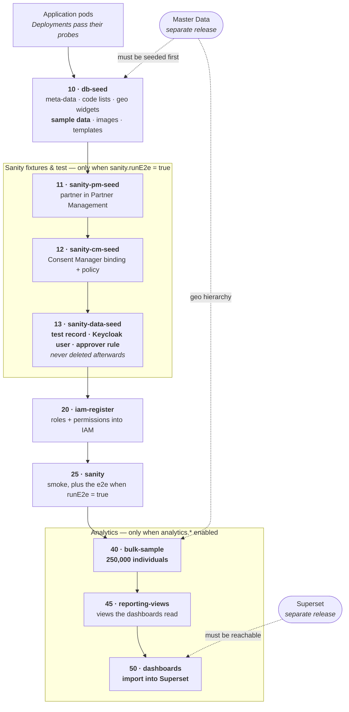

# Data seeding


**New home: GitLab.** **`national-social-registry`** is now developed at [gitlab.com/openg2p/registry/national-social-registry](https://gitlab.com/openg2p/registry/national-social-registry).

Any `github.com` links on this page refer to the **earlier GitHub repository**, which is now read-only. They are kept so that references to previous versions keep working.


Seeding follows the same split as everything else: the **machinery** is inherited from the platform's `db-seed` image, and NSR supplies only its **content**.


The switches, the code-list mechanism, the Rancher form and the production
("empty") install are all platform-level and documented once in
[**Country data & seeding**](../../registry/deployment-and-extension/country-data-and-seeding.md).
For what a country pack is, see
[**Country Data Architecture**](../../../../platform/country-data-architecture.md).
This page covers only what is specific to NSR.


## Three kinds of data NSR can create

| | Sample data | Bulk data | Sanity data |
|---|---|---|---|
| **How much** | 21 individuals, 6 households (Ethiopia pack) plus 2,221 NSR sub-table rows | **250,000 individuals** by default | A handful of fixtures |
| **Purpose** | Demonstrations — records a person reads | Volume for reports and dashboards | Verifying the deploy |
| **Switch** | `registry.dbSeed.loadSampleData` | `analytics.bulkSample.enabled` | `registry.sanity.runE2e` |
| **Default in NSR** | `true` | `true` | `false` |

## Sample data

### Where the people come from

The individuals and households come from **Master Data**, which holds the country
pack's sample people (`g2p_sample_individuals`, `g2p_sample_households`). They
arrive with their full geo ancestry, so every record points at a real
administrative unit in whatever country the deployment carries.

NSR then **augments** each person with its own domain fields — the sub-tables that
make it a social registry rather than a generic register:

| NSR overlay | Rows |
|---|---|
| `individual_livelihoods.json` | 418 |
| `individual_land.json` | 321 |
| `household_assets.json` | 253 |
| `individual_programs.json` | 234 |
| `individual_livestock.json` | 229 |
| `individual_vulnerability.json` | 205 |
| `individual_shocks.json` | 167 |
| `individual_disabilities.json` | 117 |
| `household_housing_and_services.json` | 100 |
| `scores.json` | 100 |
| `household_programs.json` | 77 |

These live in [`docker/db-seed/seed-data`](https://gitlab.com/openg2p/registry/national-social-registry/-/tree/develop/docker/db-seed/seed-data) and are linked to whoever was actually loaded, rather than to a fixed set of ids.


**If Master Data holds no samples, the loader falls back** to the shared demography
CSV baked into the image and says so in its log. That CSV can only ever describe
one country — it has five fixed level names — so the fallback produces people whose
addresses do not match the deployment's country pack. Enable
`geoSeed.load.samples` on the Master Data chart to get a pack-coherent set.


### Why NSR ships its own loader

The platform image carries no sample loader at all, and the reference registry's
own is farmer-shaped — it writes `g2p_register_farmers`, `crops`, `lands`, none of
which NSR has. NSR therefore keeps its own
[`load_sample_data.py`](https://gitlab.com/openg2p/registry/national-social-registry/-/blob/develop/docker/db-seed/load_sample_data.py)
and [`upload_images.py`](https://gitlab.com/openg2p/registry/national-social-registry/-/blob/develop/docker/db-seed/upload_images.py),
which target `g2p_register_individuals` and NSR's `individual_*` / `household_*`
tables, and copies them over the inherited ones in its Dockerfile.

### Turning it off

```yaml
registry:
  dbSeed:
    loadSampleData: false
    loadImages: false
```

In Rancher: **DB Seed → Load Sample Data** (and **Load Sample Images**).

## Bulk data

NSR generates **250,000 individuals** at install so that reports and dashboards have
something to show. Nobody reads an individual bulk row, so the names and phone
numbers are invented and need not belong to the country.


**Bulk generation still reads Master Data — it is not country-independent.**

It is the *people* that are country-agnostic, not the *geography*. Every generated
record must point at a real administrative unit or maps and drill-downs break, so
the generator reads the hierarchy from the MDS database
(`g2p_geo_levels` / `g2p_geo_level_values`) and **refuses to run against an empty
MDS**. It also reconciles the values it writes against the registry's code lists,
so it never writes a value the deployment does not recognise.

What this buys is that **one generator serves every country** — the same NSR build
generates for Ethiopia or Kamuntu unchanged. It does not mean MDS is optional.


`analytics.bulkSample.expectedCountry` is a **guard, not a selector**: set it and
the job fails if MDS holds a different country than expected. Empty (the default)
means no check.

### Turning it off

```yaml
analytics:
  bulkSample:
    enabled: false
```


This one is **not in the Rancher form** — the generated questions come from the
platform chart, and `analytics.*` is NSR's own key. Set it in the YAML editor
alongside the form.


## Sanity data

Completely separate from sample and bulk data, and created for a different reason:
to prove the deploy actually works.

With `sanity.runE2e: false` (the default) the suite is smoke-only and **creates
nothing**. With it on, a deploy-time job seeds the e2e's *own* fixtures:

* a sanity individual (`SANITY-INDIVIDUAL-0001`), injected **by SQL** rather than
  reused from the sample data — deliberately, so the e2e also passes on installs
  with `loadSampleData: false`, and so the record already exists in an approved,
  ACTIVE state;
* the suite's own Keycloak user with a non-temporary password;
* that user as an approver on the register's change-request policy.


**Sanity fixtures are never deleted.** They are left in place for inspection after
the run, so an environment that has ever had `runE2e: true` carries them
permanently. Keep it off for production.


## Reporting views

Dashboards and the map never read the register tables directly — they read
**reporting views**, `nsr_rpt_*`, one per entity, with geography and
workflow columns and personal data withheld.

**Most of them are generated**, at install, by the platform's
`generate_reporting_views.py` reading this registry's schema and the country's
hierarchy from Master Data. This registry supplies two things:

* **`reporting_views.sql`** — the views it maintains by hand: `nsr_rpt_household` and `nsr_rpt_individual`,
  because they pair household with individual and derive the bands and flags the dashboards group by. Nothing can infer those from a schema.
* **`reporting.yaml`** — a short declaration: which entity hangs off which, which
  views are hand-written, and what its own columns mean.
  ([this registry's copy](https://gitlab.com/openg2p/registry/national-social-registry/-/blob/develop/docker/db-seed/reporting.yaml))

Everything else is generated: vulnerability, livelihood, disability, land, livestock, programmes, shocks, housing and services, household assets, scores, change requests and record history.

**Who runs it:** a job of this chart, `<release>-nsr-reporting-views`, at
hook weight 45 — after bulk data, so the first build has rows behind it. It runs
the hand-written SQL first and the generator second, because a generated child
reads its parent's columns.

Switched by `analytics.reportingViews.enabled`; generation alone by
`analytics.reportingViews.generate`.


**Why this changed.** The reporting SQL used to be hand-written in full, here, so
coverage was whatever somebody had thought of — vulnerability and livelihood — 259,328 and 165,625 rows respectively, with no reporting view of any kind before this. Generation makes
coverage structural instead. The reasoning, the declaration reference and the
`--discover` workflow are in
[Reporting views](../../../../platform/platform-services/reporting-and-analytics/reporting-views.md).


### Keeping them current

Some views are materialized, and **Postgres never updates a materialized view when
its base tables change**. This chart therefore refreshes its own, on a schedule:

```yaml
analytics:
  reportingViews:
    refreshSchedule: "0 * * * *"   # hourly; empty disables the CronJob
```

`<release>-nsr-reporting-views-refresh` rebuilds every `nsr_rpt_*`
materialized view in dependency order resolved from the catalog, using `REFRESH
MATERIALIZED VIEW CONCURRENTLY` so dashboards keep reading the previous snapshot
while it runs. The cadence is on the Rancher form under **Analytics**.

Between refreshes, households and individuals registered since the last run do not appear in any
report. Choose the interval accordingly.

## Install sequence

Everything below runs as Helm **post-install / post-upgrade hooks**, in hook-weight
order. Helm waits for each weight to succeed before creating the next, so this is a
strict sequence — and **a failure at any step blocks everything after it**.



Read the diagram top to bottom: each box only starts once the one above it has
succeeded. The two dotted arrows are the dependencies Helm cannot order, because
they belong to other releases — see [Cross-release dependencies](#cross-release-dependencies).

| Weight | Job | What it does | Runs when |
|---|---|---|---|
| — | *(application pods)* | The registry's own Deployments start and pass their probes | always |
| 10 | `nsr-db-seed` | Meta-data SQL, code lists from Master Data, geo-widget sync, **sample data**, images, templates | `dbSeed.enabled` |
| 11 | `nsr-sanity-pm-seed` | Registers the sanity partner in Partner Management | `sanity.runE2e` |
| 12 | `nsr-sanity-cm-seed` | Consent Manager binding and policy for that partner | `sanity.runE2e` |
| 13 | `nsr-sanity-data-seed` | **Sanity fixtures** — the test record, Keycloak user, approver rule | `sanity.runE2e` |
| 20 | `nsr-iam-register` | Registers the registry's roles and permissions in IAM | always |
| 25 | `nsr-sanity` | Runs the sanity suite | `sanity.enabled` |
| 40 | `nsr-nsr-bulk-sample` | Generates **250,000 individuals** | `analytics.bulkSample.enabled` |
| 45 | `nsr-nsr-reporting-views` | Creates the reporting views the dashboards read | `analytics.reportingViews.enabled` |
| 50 | `nsr-nsr-dashboards` | **Imports the dashboards into Superset** | `analytics.dashboards.enabled` |


**The dashboards are loaded by this registry, not by the analytics platform.** The
dashboard bundle ships in this repository, and the weight-50 job imports it into the
environment's Superset, points its database connection at this registry, publishes
the dashboards and enables embedding on them.

The ordering is the point: dashboards are imported **after** bulk data and **after**
the reporting views exist, so that a dashboard opened straight after install already
has data behind it rather than rendering empty.


### Cross-release dependencies

Two of these steps depend on releases Helm cannot order against, because they are
separate installs:

* **Master Data** must be seeded before weight 10 (code lists, geo, sample people)
  and before weight 40 (the bulk generator reads its geo hierarchy). The db-seed and
  bulk jobs each wait for it and fail with a clear message rather than producing
  records that point nowhere.
* **Superset** must be reachable before weight 50. That job waits for it rather
  than failing immediately, so a Superset that is merely restarting does not lose
  the dashboard import.


Because Helm stops at a failed hook, a failure in bulk generation (weight 40) also
prevents the reporting views and the dashboard import from ever running. If Superset
has no dashboards after an install, check the **earlier** jobs first.


## What NSR's image contains

NSR's `db-seed` image is a thin `FROM` of the platform's, which clears the
reference registry's content and copies its own:

```dockerfile
FROM openg2p/openg2p-registry-db-seed:${RP_VERSION}
RUN rm -rf /seed/meta_data/* /seed/awe_meta_data/* /seed/templates/* /seed/seed-data/*
COPY nsr-extension/src/openg2p_registry_nsr_extension/meta_data/     /seed/meta_data/
COPY nsr-extension/src/openg2p_registry_nsr_extension/awe_meta_data/ /seed/awe_meta_data/
COPY nsr-extension/src/openg2p_registry_nsr_extension/templates/     /seed/templates/
COPY docker/db-seed/seed-data/                                       /seed/seed-data/

# NSR's domain-specific loaders, overriding the base image's farmer-shaped ones.
COPY docker/db-seed/load_sample_data.py /seed/load_sample_data.py
COPY docker/db-seed/upload_images.py    /seed/upload_images.py
```

So NSR's seed content is:

| Content | Source in this repo |
|---|---|
| `meta_data/` SQL — register definitions, schemas, UI tabs/sections, **code-list fixtures**, score definitions, registry configuration, inbound message rules | `nsr-extension/.../meta_data` |
| `awe_meta_data/` SQL — approval policy, stages, approver rules, callback-secret template | `nsr-extension/.../awe_meta_data` |
| `templates/` — the DCI Jinja templates | `nsr-extension/.../templates` |
| `seed-data/*.json` — the NSR domain overlay listed above | `docker/db-seed/seed-data` |
| `generate_nsr_bulk_sample.py`, `distributions.json` | `docker/db-seed` |
| `reporting_views.sql` | `docker/db-seed` |

The bulk generator and its distributions live here, beside the enums and reporting
views they must move in step with, rather than in a shared repository.

## NSR's chart defaults

```yaml
registry:
  dbSeed:
    loadGeoData: false     # legacy loader — must stay off
    loadAttributes: true   # take the country's code lists from Master Data
    syncGeoWidgets: true   # match geo dropdowns to the country's levels
    loadSampleData: true
    loadImages: true

analytics:
  bulkSample:
    enabled: true
    individuals: 250000
```

For a production install, see
[An empty install](../../registry/deployment-and-extension/country-data-and-seeding.md#an-empty-install-for-production).

---


**Beyond seeding.** What is built on these views — the dashboards, the map
drill-down, how to add your own, and what to do when a country pack or this
registry's schema changes — is under
[**Reporting & Analytics**](../../../../platform/platform-services/reporting-and-analytics/README.md). Start with
[Setting up reporting](../../../../platform/platform-services/reporting-and-analytics/setting-up-reporting.md) if you are bringing this
registry up for a country.

