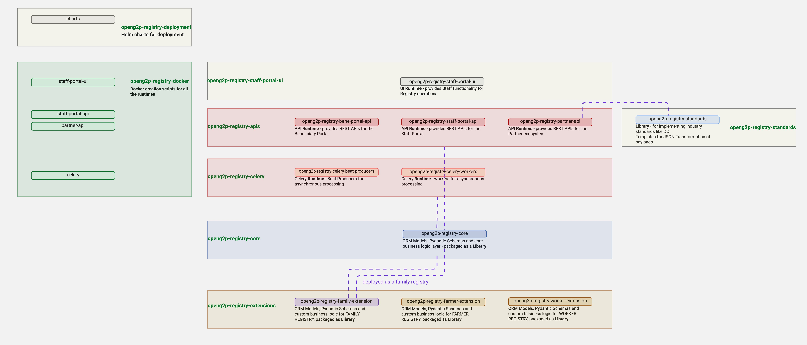

# Organization of Codebase

<figure><figcaption>
Organization of the Registry codebase in github. The labels in green are the repo names
</figcaption></figure>

The registry codebase is organized into several repositories.

### openg2p-registry-staff-portal-ui

This repository contains the ReactJS UI <mark style="color:blue;">**runtime**</mark> for the Staff Portal functionalities of the Registry. This UI is available as a Docker image with the docker creation scripts in the repo - openg2p-registry-docker. This runtime is accessible from within the openg2p-staff-portal-ui, a common staff-portal for all the staff functionalities relating to PBMS, Registry, Bridge and SPAR.

### **openg2p-registry-apis**

This repository contains the API <mark style="color:blue;">**runtimes**</mark> for the registry. This houses the following runtimes. These 4 runtimes are made available as Docker images. These docker creation scripts are available in the repo - openg2p-registry-docker.

1. <mark style="color:blue;">openg2p-registry-staff-portal-api</mark> — Providing REST APIs for the Registry Staff Portal UI (openg2p-registry-staff-portal-ui)
2. <mark style="color:blue;">openg2p-registry-beneficiary-portal-api</mark> — Provding Registry REST APIs for the Unified Beneficiary Beneficiary Portal UI
3. <mark style="color:blue;">openg2p-registry-agency-portal-api</mark> — Providing Registry REST APIs for the Unified Agency App
4. <mark style="color:blue;">openg2p-registry-partner-api</mark> — Providing Registry REST APIs for the partner ecosystem.

### **openg2p-registry-celery**

This repository contains the Celery <mark style="color:$success;">**runtimes**</mark> for the registry. OpenG2P Registry uses the Celery framework to perform several asynchronous tasks on the registry. The celery framework consists of two runtimes

1. <mark style="color:blue;">openg2p-registry-celery-beat-producers</mark> — This runtime provides periodic beats for specific tasks. Almost all of these beat producers are based on Queues (implemented as Postgres Tables) with a specific column (typically xyz\_status = "PENDING") serving as the selection criteria for these beats. <mark style="color:orange;">To avoid multiple beats picking up the same records, it is necessary that we provision exactly ONE instance (POD) of the beat producer.</mark>
2. <mark style="color:blue;">openg2p-registry-celery-workers</mark> — This runtime hosts the workers that receive the tasks emitted by the beat producer. There are multiple workers, each worker processing exactly one business task. The worker typically receives a unique queue\_id from the beat. Each POD is configured to run "NN" workers. <mark style="color:purple;">It is recommended to scale up the worker instances (PODs) to handle higher volumes.</mark>

### openg2p-registry-core

This repository, packaged as a <mark style="color:$success;">**library**</mark>, contains the core registry codebase. It contains the ORM Models, Pydantic schemas and the core business logic of the registry platform. This library need does not require a separate installation. All the runtimes package this as a library within themselves.

### openg2p-registry-extensions

This is the repository that contains the domain extensions created by OpenG2P. Since the base registry itself is devoid of any functional domain, OpenG2P has created certain domain extensions which may be treated as reference implentations. For a given domain, this repository will contain the ORM Models, the Pydantic Schemas, any custom business logic for the domain, and Database scripts for UI JSON Schemas. There will be separate folders for different domains. The python code blocks need to be packaged as libraries, while the database scripts need to be executed in the database, to create the relevant records.

### openg2p-registry-standards

This repository contains JSON transformation templates for data sharing standards such as DCI. The templates here are used to transform domain models into industry standard payloads for outward data sharing and vice versa for incoming data feeds. OpenG2P Registry currently supports the DCI standards. As and when, other standards are adopted, these will also appear here, in this repository.

### openg2p-registry-docker

This repository contains the Docker creation scripts and configurations for creating Docker images for all the runtimes, viz the API runtimes and Celery runtimes.

### openg2p-registry-deployment

This repository contains the Helm charts for deploying OpenG2P Registry and all the necessary dependent services sucha as MinIO, Postgres, Keycloak, MOSIP KeyManager etc.
