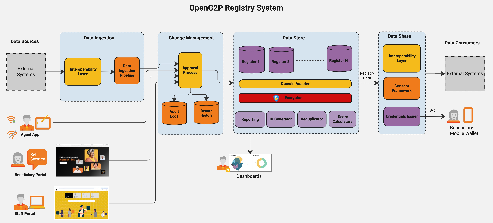

# OpenG2P Registry (Platform)

**OpenG2P Registry** is an open-source platform for building **functional registries** -- not mere databases -- of individuals, non-human entities, and groups. It is designed to fit naturally into a country's digital public infrastructure (DPI), providing an authoritative, interoperable data platform that can serve multiple government agencies and programmes simultaneously.

A single deployment of the Registry can host one or more **Registers** (such as a Farmer Register, Individual Register, or Household Register), each governed by change-management workflows, version history, and consent-aware data sharing. Whether you are building a national social registry, a farmer registry, or a vehicle registry, the underlying principles and platform remain the same.

<figure><figcaption></figcaption></figure>

## Why a registry?

A **registry** is fundamentally different from an application database. The distinction matters because registries serve as shared infrastructure rather than isolated application stores.

| Dimension             | Registry                                             | Application database                           |
| --------------------- | ---------------------------------------------------- | ---------------------------------------------- |
| **Purpose**           | Authoritative source of truth across the ecosystem   | Data store for a single application            |
| **Identifiers**       | Unique, meaningful IDs mapped to real-world entities | Application-specific keys; duplicates possible |
| **Change management** | Versioned audit trails with approval workflows       | Direct writes, typically unaudited             |
| **Interoperability**  | Cross-sector sharing via standard APIs               | System-specific, tightly coupled               |

When governments invest in a proper registry layer, they unlock exponential value through data sharing, verifiable credentials, and coordinated service delivery. The rationale is explored in detail in the blog [Dynamic Registry: A Foundation for Effective G2P Delivery](../../../blogs/dynamic-registry-a-foundation-for-effective-g2p-delivery.md).

## One core, many domains

OpenG2P Registry is a **core platform** over which registries of any domain can be implemented. By extending the core with domain-specific registers and metadata, the same platform can manifest as:

* Farmer Registry
* Social Registry
* Family / Household Registry
* Vehicle Registry
* Disability Registry
* Crop Registry
* Any other domain registry

The fundamentals of a good registry -- change management, version history, encryption, interoperability, consent -- remain the same across domains. Only the domain-specific data model changes.

## Functional architecture

<figure><figcaption></figcaption></figure>

The architecture can be understood in terms of the following layers and capabilities:

**Data entry channels** -- Staff Portal, Beneficiary Portal, and Agency App provide user interfaces for creating and updating records. Each channel feeds changes through the same change-management pipeline.

**System integration** -- The Partner API and Ingestion Pipeline allow external systems to push data into the Registry programmatically. Data is validated, mapped, and routed through the standard approval workflow.

**Change management** -- Every modification, regardless of source channel, passes through a change request workflow with verification and approval steps before it is applied to the data.

**Data security** -- Records are stored with encryption at rest at the column level, ensuring sensitive fields are protected even in the event of infrastructure compromise.

**Version history** -- The Registry maintains a full version history of every record. Previous versions can be queried at any time, which is essential for grievance redressal and audit.

**Audit trail** -- All significant events in the system are recorded for transparency and traceability.

**Event publishing** -- Changes in the Registry are published via WebSub, enabling downstream systems to react to data updates in near real-time.

**Consent-aware data sharing** -- Data is shared with external consumers only when consent requirements are satisfied, following configurable consent policies.

**Outgestion pipeline** -- A push-based pipeline for proactively sending data to partner systems according to defined schedules and filters.

## Key capabilities

The following table summarises the major features of the Registry with links to detailed pages.

| Capability                    | Description                                                  | Details                                                                           |
| ----------------------------- | ------------------------------------------------------------ | --------------------------------------------------------------------------------- |
| Unified registry model        | Registers, Tables, and Programme Registers in one platform   | [Unified Registry Model](features/unified-registry-model.md)                      |
| Change management             | Verification and approval workflows for every data change    | [Change Management](features/change-management-and-approval-workflow.md)          |
| Metadata-driven extensibility | Configure registers, sections, and UI through metadata       | [Metadata-Driven Extensibility](features/metadata-driven-extensibility.md)        |
| Ingestion pipeline            | Bulk and streaming data import from external systems         | [Ingestion Pipeline](features/ingestion-pipeline.md)                              |
| Data integrity and encryption | Column-level encryption at rest; data integrity controls     | [Data Integrity & Encryption](features/data-integrity-security-and-encryption.md) |
| Consent-aware data sharing    | Share data with partner systems governed by consent policies | [Consent-Aware Data Sharing](features/consent-aware-data-sharing.md)              |
| Event publishing and WebSub   | Publish change events to downstream subscribers              | [Event Publishing](features/event-publishing-and-websub-integration.md)           |
| Audit and traceability        | Full audit trail of system events                            | [Audit & Traceability](features/audit-ability-and-trace-ability.md)               |
| Dynamic UI rendering          | UI generated from register metadata and JSON schemas         | [Dynamic UI Rendering](features/dynamic-ui-rendering.md)                          |
| Cloud-native deployment       | Helm-based deployment on Kubernetes                          | [Cloud-Native Deployment](features/cloud-native-deployment-and-scaling.md)        |
| Standards compliance          | Alignment with DPI and functional registry standards         | [Standards Compliance](features/standards-compliance.md)                          |
| Observability                 | Logging, monitoring, and operational controls                | [Observability](features/observability-and-operational-control.md)                |


This Registry is internally referred to as **Gen 2**. It is a major evolution from the previous [Social Registry](_archive/social-registry/), which was built on the Odoo platform. Gen 2 uses a completely different architecture based on **FastAPI** services, with a metadata-driven design and a rich set of features suited to diverse domain requirements.


## Getting started


[concepts.md](concepts.md)



[features](features/)



[deployment](deployment/)



[developer-zone](developer-zone/)

