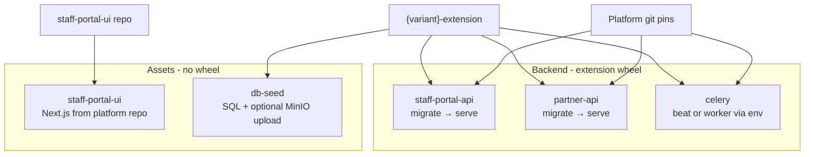

# Build docker images

### Docker images



| Image                        | CMD / role                                     | Extension wheel?   |
| ---------------------------- | ---------------------------------------------- | ------------------ |
| `{variant}-staff-portal-api` | migrate → serve FastAPI                        | Yes                |
| `{variant}-partner-api`      | migrate → serve FastAPI                        | Yes                |
| `{variant}-celery`           | beat or worker via env                         | Yes                |
| `{variant}-staff-portal-ui`  | Next.js static/server                          | No                 |
| `{variant}-db-seed`          | `entrypoint.sh` → psql + optional MinIO upload | SQL/templates only |

**API images** run database migration on startup, then serve FastAPI - this creates core and extension tables before the db-seed Job runs metadata SQL.

**Celery** uses the same image for beat and worker deployments. The base chart sets `CELERY_APP` and `CELERY_OPTS` per pod. The worker includes your extension wheel but does **not** run the full extension `Initializer` or migrate - domain code loads lazily at task time.

**UI** clones the platform staff-portal-ui at build time. Your metadata SQL drives what the UI renders; the image itself carries no extension code.

**db-seed** is a lightweight Postgres-client image plus Python for optional MinIO upload. Build context is the **repository root** so both `docker/db-seed/` and `{variant}-extension/` are reachable.

***

### Service spec files

Each backend service has a spec under `docker/{service}/develop.txt`. Line 1 declares the output image; subsequent lines list dependencies:

```
#!openg2p/openg2p-{variant}-staff-portal-api:develop
./{variant}-extension
git://{pin}//https://github.com/openg2p/openg2p-fastapi-common#subdirectory=openg2p-fastapi-common
git://{pin}//https://github.com/openg2p/iam-service#subdirectory=iam-core
git://{pin}//https://github.com/openg2p/openg2p-registry-gen2-core#subdirectory=openg2p-registry-core
git://{pin}//https://github.com/openg2p/openg2p-registry-gen2-apis#subdirectory=openg2p-registry-staff-portal-api
```

| Line type                           | Meaning                                        |
| ----------------------------------- | ---------------------------------------------- |
| `#!image:tag`                       | Output image (required first line)             |
| `./{variant}-extension`             | Copied to `docker/local_deps/`                 |
| `git://{tag}//{url}#subdirectory=…` | Pip-installable platform package at pinned ref |
| `# comment`                         | Ignored                                        |

Partner API swaps the APIs subdirectory for `openg2p-registry-partner-api`. Celery adds both `openg2p-registry-celery-beat-producers` and `openg2p-registry-celery-workers`.

Keep platform git pins **identical** across staff-api, partner-api, and celery on every release.

***

### `parse_service.py` and `build.sh`

Local and CI builds share the same parse step:

```bash
python3 docker/scripts/parse_service.py \
  --service-file docker/staff-portal-api/develop.txt \
  --repo-root docker/ \
  --source-root "$PWD"
```

| Flag             | Role                                                                            |
| ---------------- | ------------------------------------------------------------------------------- |
| `--service-file` | Spec to parse                                                                   |
| `--repo-root`    | Docker build context; writes `local_deps/` and `adapters.requirements.txt` here |
| `--source-root`  | Resolves `./{variant}-extension` relative path                                  |
| `--output-env`   | Shell vars for CI (`SVC_IMAGE`, `SVC_DOCKERFILE`, …)                            |

The parser writes `local_deps/` and `adapters.requirements.txt` under `docker/`, then Docker builds from that context.

```bash
./docker/scripts/build.sh staff-portal-api/develop.txt   # one service
./docker/scripts/build.sh                              # all default services
```

Verify the extension inside a built API image:

```bash
docker run --rm openg2p/openg2p-{variant}-staff-portal-api:develop \
  python -c "import openg2p_registry_extensions as e; print(e.__variant__)"
```

***

### `db-seed` image: seed SQL and templates

The db-seed Dockerfile takes `EXTENSION_FOLDER={variant}-extension` and copies from the extension source tree:

| Source (extension)                | Destination (image)  | Notes                        |
| --------------------------------- | -------------------- | ---------------------------- |
| `meta_data/`                      | `/seed/meta_data/`   | All register and config SQL  |
| `sample_data/`                    | `/seed/sample_data/` | Optional demo rows           |
| `templates/*.j2` (top level only) | `/seed/templates/`   | Nested subfolders not copied |

At runtime, `entrypoint.sh` runs SQL in sorted path order, optionally sample data when `LOAD_SAMPLE_DATA=true`, then optionally uploads templates when `LOAD_TEMPLATES=true` - object key equals filename.

Jinja templates are **not** baked into API or Celery images. They travel through the db-seed image and land in MinIO during install.

***

### Before proceeding to the next step

* [ ] Spec files for `staff-api`, `partner-api`, `celery` (+ UI and `db-seed` Dockerfiles)
* [ ] Consistent platform git pins across all backend specs on release
* [ ] Local build succeeds; extension import works inside API image
* [ ] db-seed image contains expected SQL folders and flat `.j2` files
