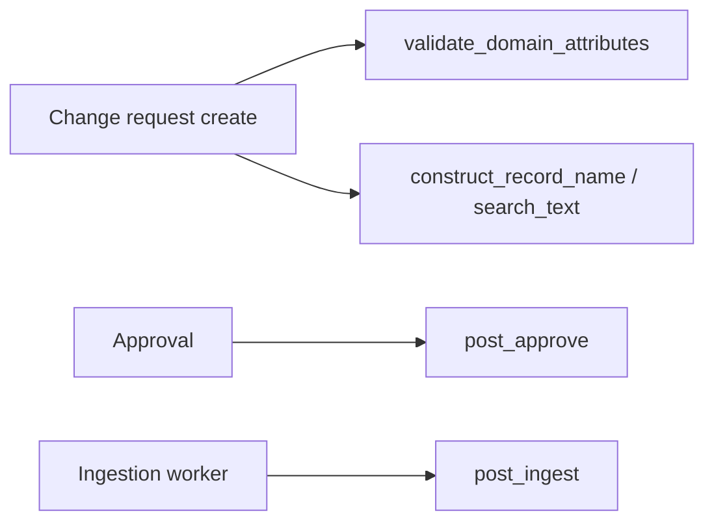

# Build models, schemas and services

### Per mnemonic class set

<table><thead><tr><th>Class</th><th>Location</th><th>Notes</th><th data-hidden>#</th></tr></thead><tbody><tr><td><code>G2P{DomainTrait}</code></td><td><code>models/{snake}.py</code></td><td>Domain columns only - no <code>__tablename__</code></td><td>1</td></tr><tr><td><code>G2PRegister{Mnemonic}</code></td><td>same file</td><td>Live ORM</td><td>2</td></tr><tr><td><code>G2PRegisterHistory{Mnemonic}</code></td><td>same file</td><td>History twin</td><td>3</td></tr><tr><td><code>G2PIntakeForm{Mnemonic}</code></td><td>same file</td><td>Intake staging twin</td><td>4</td></tr><tr><td>Three Pydantic schemas</td><td><code>schemas/{snake}.py</code></td><td>Mirror ORM fields</td><td>5</td></tr><tr><td><code>G2PRegisterDomainService{Mnemonic}</code></td><td><code>services/g2p_register_domain_service_{snake}.py</code></td><td>Validation and display hooks</td><td>6</td></tr></tbody></table>

`CORE_TABLE` registers (e.g. `Score`) use core ORM - seed metadata and optional `G2PScoreComputeService{Type}` only.

***

### Model composition

Platform mixins supply IDs, audit fields, person/geo columns, and `link_internal_record_id`. Your trait mixin adds programme-specific columns:

```python
class G2P{DomainTrait}:
    domain_field: Mapped[str] = mapped_column(String, nullable=True, index=True)

class G2PRegister{Mnemonic}(G2PRegister, G2PPerson, G2PGeo, G2P{DomainTrait}):
    __tablename__ = "g2p_register_{table_plural}"

    def get_record_name_fields(self) -> str:
        return G2PRegisterDomainService{Mnemonic}().construct_record_name(self.to_dict())

    def get_search_text_fields(self) -> str:
        return G2PRegisterDomainService{Mnemonic}().construct_search_text(self.to_dict())
```

History models swap in `G2PRegisterHistory` + history mixins. Intake models use `G2PIntakeForm` + the same domain trait.

Child **TABLE** registers often drop person/geo mixins; the parent link is the inherited `link_internal_record_id` column.

Keep `models/enums.py` aligned with lookup SQL and section widget option values.

***

### Pydantic schemas

Mirror ORM fields using bases from `openg2p_registry_core.schemas`:

```python
class G2PRegisterSchema{Mnemonic}(G2PRegisterSchemaBase):
    domain_field: Optional[str] = None
```

Change-request attribute validation reads rules from metadata JSON in Postgres. Pydantic schemas still matter for API consistency and developer clarity - keep them in sync.

***

### Domain services



| Method                       | Runs on                      | Typical implementation                               |
| ---------------------------- | ---------------------------- | ---------------------------------------------------- |
| `validate_domain_attributes` | API controller, before save  | Date ranges, required combinations, external lookups |
| `construct_record_name`      | CR payload assembly          | `"Last, First (ID)"` display string                  |
| `construct_search_text`      | CR payload assembly          | Concatenated searchable fields                       |
| `post_approve`               | After approval commit        | Side effects, notifications                          |
| `post_ingest`                | Celery after pipeline insert | Bulk-load follow-up logic                            |

Example validation gate:

```python
async def validate_domain_attributes(self, change_request_request_payload):
    attrs = change_request_request_payload.change_request_attributes or {}
    if attrs.get("start_date") and attrs.get("end_date"):
        if attrs["start_date"] > attrs["end_date"]:
            raise G2PValidationError("start_date must be before end_date")
```

Child TABLE services can be minimal if they only need display strings. Root registers typically implement full validation and search text construction.

#### **Register hierarchy and domain hook placement**

Registers in an extension form a tree defined in Postgres metadata (`g2p_register_definitions.master_register_id`). Child rows link to their immediate parent via `link_internal_record_id`. When records are saved into the registry, ancestors are persisted before descendants. Domain hooks (`post_approve`, `post_ingest`) run on the domain service for the register being saved only. They do not bubble up the tree automatically.

**Side effects on a parent register should live in the lowest (most specific) child domain service that triggers the change**, not in the parent's service.

**How hierarchy is defined**

<table><thead><tr><th width="201">Column</th><th>Role</th></tr></thead><tbody><tr><td><code>master_register_id</code></td><td>Immediate parent register; <code>NULL</code> = root subject register</td></tr><tr><td><code>register_purpose</code></td><td><code>REGISTER</code> (subject / nested subject) or <code>TABLE</code> (child table)</td></tr><tr><td><code>register_rank</code></td><td>Metadata ordering hint (higher = closer to root)</td></tr></tbody></table>

Example ([NSR Implementation](../../../../national-social-registry/))

```
Household (root, REGISTER)
├── Individual (REGISTER)
│   ├── IndividualProgram (TABLE)
│   ├── IndividualLand (TABLE)
│   ├── IndividualShock (TABLE)
│   └── IndividualDisability (TABLE)
├── HouseholdProgram (TABLE)
├── HouseholdAsset (TABLE)
└── HouseholdHousingAndServices (TABLE)
```

Child TABLE models typically drop person/geo mixins; the parent link is the inherited `link_internal_record_id` column. `G2PRegisterHierarchicalService` walks this tree via `master_register_id` and `link_internal_record_id`.

**Hook placement rule**

The platform invokes `post_approve` and `post_ingest` only on the register currently being saved. When a child row is saved, its parent row already exists in the live register. Implement parent-updating logic in the **child** register's domain service: the deepest register in the tree whose save event causes the side effect.

<table><thead><tr><th width="181">Scenario</th><th>Wrong placement</th><th>Correct placement</th></tr></thead><tbody><tr><td>Adding a household member should increment <code>size_children_u5</code> on Household</td><td><code>G2PRegisterDomainServiceHousehold.post_ingest</code></td><td><code>G2PRegisterDomainServiceIndividual.post_ingest</code></td></tr><tr><td>Individual marked INACTIVE (Death) should set <code>husband_dead</code> on Household</td><td><code>G2PRegisterDomainServiceHousehold.post_approve</code></td><td><code>G2PRegisterDomainServiceIndividual.post_approve</code></td></tr><tr><td>Adding a shock row should update individual coping index</td><td>Individual domain service</td><td><code>G2PRegisterDomainServiceIndividualShock.post_ingest</code></td></tr></tbody></table>

**Reference from** [**National Social Registry Implementation**](../../../../national-social-registry/)

`G2PRegisterDomainServiceIndividual.post_ingest` loads the parent Household via `register_row.link_internal_record_id` and increments `size_children_u5` when the new member is under 5.

`G2PRegisterDomainServiceIndividual.post_approve` sets `household.husband_dead` when an individual is marked INACTIVE with reason Death.

`G2PRegisterDomainServiceHousehold` validates household-native attributes (`size_total` vs counts on the household form) but does not implement cross-register rollups. That belongs on Individual or deeper TABLE services.

**Domain Service Hooks at a glance**

<table><thead><tr><th width="193">Hook</th><th>Resolved by</th><th>Typical use</th></tr></thead><tbody><tr><td><code>post_ingest</code></td><td><code>register_mnemonic</code> of the saved row</td><td>Rollups and cross-register updates after ingest</td></tr><tr><td><code>post_approve</code></td><td><code>register_mnemonic</code> of the CR's <code>section_register_id</code></td><td>Side effects on UPDATE, DELETE, INACTIVE</td></tr><tr><td><code>pre_approve</code></td><td>Same</td><td>Rare; blocking checks before commit</td></tr><tr><td><code>validate_domain_attributes</code></td><td>Section register mnemonic</td><td>Field validation only (no DB side effects)</td></tr></tbody></table>

Load the parent in either hook via `link_internal_record_id` on the saved row (ingest) or from the change request payload (approve).

***

### Intake parent linking

Multi-step intake (parent register, then child) overrides **`get_link_internal_record_id`** on the intake model:

```python
async def get_link_internal_record_id(self, session) -> str | None:
    # Resolve parent register UUID from batch context or identifier field
    ...
```

Used when portal or pipeline intake submits child rows that must attach to an approved parent.

***

### Optional: scores and enrichers

**`G2PScoreComputeService{ScoreType}`** - Celery `score_compute_worker` invokes by metadata `score_type`.

**`G2P{EnricherName}`** - implements `G2PPayloadEnricherInterface.enrich()`; class name must match ingestion semantic pattern SQL.

Export from package `__init__.py`. No `app.py` registration.

***

### Before proceeding to the next step

* [ ] Six-class set per mnemonic (except `CORE_TABLE`)
* [ ] Every model in extension `migrate_database()`
* [ ] Full exports from `models/`, `schemas/`, `services/` `__init__.py`
* [ ] Optional ID generator, scores, enrichers as planned
