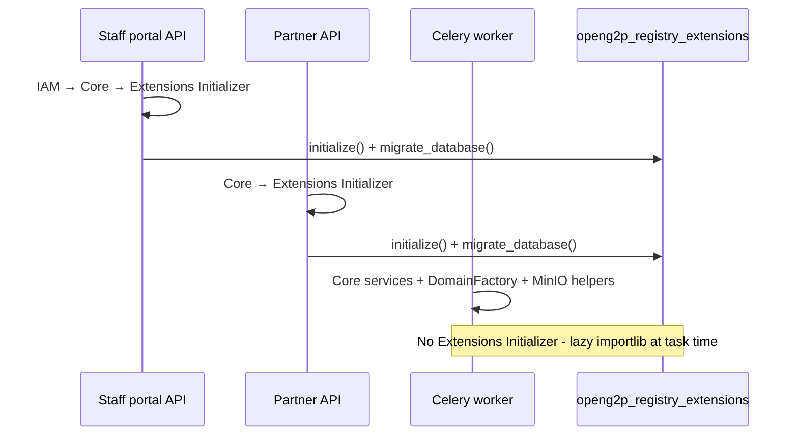

# Configure extensions package

### `pyproject.toml` - import alias

Hatch remaps the source tree at build time:

```toml
[tool.hatch.build.targets.wheel.sources]
"src/openg2p_registry_{variant}_extension" = "openg2p_registry_extensions"
```

Platform packages (core, APIs, celery, IAM) belong in Docker spec files, not extension dependencies - except shared libs you need for local editable installs.

Version and `__variant__` live in `__init__.py`:

```python
__version__ = "0.0.0-develop"
__variant__ = "{variant}"
```

***

### `app.py` - bootstrap and migrations

Reference extensions follow the same rhythm:

```python
# ruff: noqa: E402
from .config import Settings
Settings.get_config()   # must run before other imports

from openg2p_fastapi_common.app import Initializer as BaseInitializer
from openg2p_registry_core.app import Initializer as CoreInitializer
from .register_domain.factory import G2PRegisterDomainFactory
from .register_domain.services import (
    G2PRegisterDomainService{TopMnemonic},
    G2PRegisterDomainService{ParentMnemonic},
)

class Initializer(BaseInitializer):
    def initialize(self, **kwargs):
        super().initialize()              # logger, app registry, DB engine
        CoreInitializer().initialize()
        G2PRegisterDomainFactory()
        G2PRegisterDomainService{TopMnemonic}()    # eager-init roots only
        G2PRegisterDomainService{ParentMnemonic}()

    def migrate_database(self, args):
        async def migrate():
            await G2PRegister{Mnemonic}.create_migrate()
            await G2PRegisterHistory{Mnemonic}.create_migrate()
            await G2PIntakeForm{Mnemonic}.create_migrate()
            # … every mnemonic triplet
        asyncio.run(migrate())
```

**Eager-init** the factory plus one or two high-traffic root services. All other `G2PRegisterDomainService{Mnemonic}` classes resolve lazily through the factory on first lookup.

**Every** live, history, and intake ORM class must appear in `migrate_database()`. Celery never runs this path.

***

### Domain factory

`register_domain/factory/g2p_register_domain_factory.py` is identical across variants:

```python
module = importlib.import_module("openg2p_registry_extensions.register_domain.services")
class_name = f"G2PRegisterDomainService{register_mnemonic}"
implementation_class = getattr(module, class_name)
return implementation_class.get_component() or implementation_class()
```

On miss it logs a warning and returns `None` - change-request validation then fails when core calls `validate_domain_attributes`.

***

### `config.py` - settings extensions

API and Celery import settings from your extension:

```python
from openg2p_registry_core.config import Settings as CoreSettings
from pydantic_settings import SettingsConfigDict

class Settings(CoreSettings):
    model_config = SettingsConfigDict(
        env_prefix="registry_extensions_", env_file=".env", extra="allow"
    )
```

Use this for enricher URLs, external API credentials, and feature flags - never fork platform config modules.

***

### Optional folders

<table><thead><tr><th width="203">Folder</th><th width="216">Class / pattern</th><th>Registration</th></tr></thead><tbody><tr><td><code>id_generator/</code></td><td><code>G2PIdGeneratorService</code></td><td>Lazy via <code>G2PIdGeneratorFactory</code>; keys match Helm <code>idTypes</code> (lowercase)</td></tr><tr><td><code>score_compute/services/</code></td><td><code>G2PScoreComputeService{Type}</code></td><td>Factory; metadata <code>score_type</code> <code>POVERTY</code> → <code>G2PScoreComputeServicePoverty</code></td></tr><tr><td><code>ingestion_pipeline/enricher_services/</code></td><td><code>G2P{EnricherName}</code></td><td>Class name must match <code>raw_payload_enricher_class</code> in semantic pattern SQL</td></tr><tr><td><code>templates/</code></td><td>flat <code>*.j2</code></td><td>Copied into db-seed image (Step 5); not imported by Python at runtime</td></tr></tbody></table>

Score and enricher classes need exports in package `__init__.py` but **no** `app.py` registration - core factories resolve them by naming convention.

***

### How each runtime loads you



Staff portal API `migrate_database()` chains core then extension:

```python
CoreInitializer().get_component().migrate_database(args)
ExtensionsInitializer().get_component().migrate_database(args)
```

Celery worker imports `G2PRegisterDomainFactory` directly and initializes `MinioClient` + `TemplateHelper` for pipeline rendering - but never calls your full `Initializer.initialize()`.

| Runtime          | Extension `Initializer` | `migrate_database()`   | Domain services             |
| ---------------- | ----------------------- | ---------------------- | --------------------------- |
| Staff portal API | Yes (after IAM + core)  | Core chain + extension | Eager roots + lazy factory  |
| Partner API      | Yes (after core)        | Core chain + extension | Eager roots + lazy factory  |
| Celery worker    | **No**                  | **No**                 | Lazy importlib at task time |

***

### Local verification

```bash
cd {variant}-extension && pip install -e .
python -c "import openg2p_registry_extensions as e; print(e.__variant__)"
```

Pin platform git tags to match your Docker spec file when testing against core locally.

***

### Before proceeding to the next step

* [ ] Hatch source map → `openg2p_registry_extensions`
* [ ] Factory + `app.py` with complete `migrate_database()` list
* [ ] Config extending core settings
* [ ] Extension imports inside a built API image
