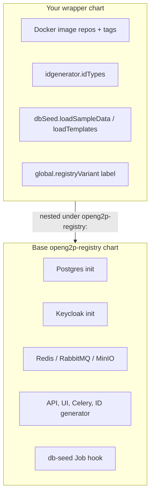

# Construct helm charts

### Override vs Inherit



The base chart deploys infrastructure, application pods, and the post-install db-seed Job. Authoritative defaults live in base `values.yaml` and `questions.yaml` - treat those as source of truth, not prose summaries.

Your wrapper overrides only domain-specific knobs. Postgres, Keycloak, RabbitMQ, MinIO, ingress, Celery split, resource limits, and logging Flow inherit unless you explicitly replace them.

| Override                                    | Purpose                                |
| ------------------------------------------- | -------------------------------------- |
| Five image repositories + tags              | Your branded Docker images             |
| `idgenerator.idGenerator.appConfig.idTypes` | Functional ID lengths per type         |
| `dbSeed.loadSampleData`                     | Demo rows on/off                       |
| `dbSeed.loadTemplates`                      | Automated MinIO template upload on/off |
| `global.registryVariant`                    | Informational label (`'{variant}'`)    |


**Scoping rule:** nest **all** overrides under `openg2p-registry:`. Top-level keys in the wrapper file do not reach the subchart.


***

### Chart.yaml

```yaml
apiVersion: v2
name: openg2p-{variant}
version: 0.0.0-develop
appVersion: "develop"

dependencies:
  - name: openg2p-registry
    version: 0.0.0-develop    # pin to tested base version on release
    repository: https://openg2p.github.io/openg2p-helm

annotations:
  catalog.cattle.io/display-name: "OpenG2P {Display Name}"
  openg2p.org/add-to-rancher: ""    # optional - triggers Rancher index update on publish
```

Run `helm dependency update helm/openg2p-{variant}/` before install or chart publish.

***

### values.yaml - images and domain settings

```yaml
openg2p-registry:
  global:
    registryVariant: '{variant}'

  staffPortalApi:
    image:
      repository: openg2p/openg2p-{variant}-staff-portal-api
      tag: "develop"

  partnerApi:
    image:
      repository: openg2p/openg2p-{variant}-partner-api
      tag: "develop"

  staffPortalUi:
    image:
      repository: openg2p/openg2p-{variant}-staff-portal-ui
      tag: "develop"

  celeryBeatProducer:
    image:
      repository: openg2p/openg2p-{variant}-celery
      tag: "develop"

  celeryWorker:
    image:
      repository: openg2p/openg2p-{variant}-celery
      tag: "develop"

  dbSeed:
    image:
      repository: openg2p/openg2p-{variant}-db-seed
      tag: "develop"
    loadSampleData: true      # set false in production
    loadTemplates: true       # uploads flat *.j2 from db-seed image to MinIO

  idgenerator:
    idGenerator:
      appConfig:
        idTypes:
          {id_type_key}:
            idLength: 12
```

***

### `db-seed` job ordering and `env`

The base chart renders a post-install/post-upgrade Job with two init containers:

1. **wait-for-db** - Postgres reachable
2. **wait-for-apps** - staff/partner/bene APIs respond on `/ping` (migrations complete)

Only then does the db-seed container run SQL and optional template upload.

| Helm value                   | Env var                | Purpose                          |
| ---------------------------- | ---------------------- | -------------------------------- |
| `dbSeed.loadSampleData`      | `LOAD_SAMPLE_DATA`     | Run sample SQL                   |
| `dbSeed.loadTemplates`       | `LOAD_TEMPLATES`       | Upload flat `.j2` to MinIO       |
| `global.minioHost` + secrets | `MINIO_*`              | MinIO connection                 |
| `global.templateBucketName`  | `TEMPLATE_BUCKET_NAME` | Bucket name (default `template`) |

Base defaults often enable both sample data and template upload for demo-friendly installs. Production clusters typically set `loadSampleData: false`; set `loadTemplates: false` only if you manage MinIO objects out-of-band.

***

### ID Generator: `idTypes`

Keys under `idgenerator.idGenerator.appConfig.idTypes` must match the lowercase strings your `G2PIdGeneratorService.generate_prefix_suffix()` expects. Length values drive functional ID formatting in the staff portal header.

Helm map-merge caveat: inherited base-chart keys you do not use cannot be removed via override - harmless if your metadata never requests those ID types.

***

### Hostnames

Default pattern: `{{ .Release.Name }}.{{ .Release.Namespace }}.openg2p.org`

<table><thead><tr><th width="191">Service</th><th>Hostname pattern</th></tr></thead><tbody><tr><td>Staff portal UI</td><td><code>{registryHostname}</code></td></tr><tr><td>Staff portal API</td><td><code>staff-{registryHostname}</code></td></tr><tr><td>Partner API</td><td><code>partner-{registryHostname}</code></td></tr><tr><td>ID generator</td><td><code>idgenerator-{release}.{namespace}.…</code></td></tr></tbody></table>

***

### Rancher UI: `questions.yaml`

Prefix every variable with `openg2p-registry.` - mirror base chart groups: hostname, Postgres, Keycloak, component toggles, image tags, `dbSeed.loadSampleData`, **`dbSeed.loadTemplates`**, and an informational note on `idTypes`.

***

### Install

```bash
helm repo add openg2p https://openg2p.github.io/openg2p-helm
helm install {release} openg2p/openg2p-{variant} \
  --namespace {namespace} --create-namespace \
  --set openg2p-registry.global.registryHostname={release}.{namespace}.example.com
```

After install, confirm the db-seed Job reached **Completed** and review its logs for SQL and template upload lines.

***

### Before proceeding to the next step

* [ ] Wrapper chart with pinned base dependency
* [ ] Image overrides for all docker components + `idTypes`
* [ ] `dbSeed.loadSampleData` and `loadTemplates` set appropriately per environment
* [ ] Optional Rancher `questions.yaml`
* [ ] Chart publishes to openg2p-helm on release
