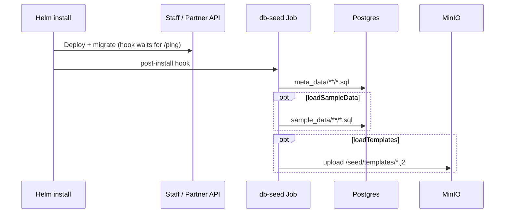

# Generate metadata and sample data

### Folder layout

```
meta_data/
  register-metadata/                 ← seed SQL files - see Register metadata index
  lookup-data/
  registry-configurations/
  data-models/
  registry-inbound-message-rules/
  registry-outbound-messages-templates/

sample_data/register-data/           ← optional demo rows (sibling, not under meta_data)

templates/                           ← flat *.j2 only - see template seeding below
  {message}_to_{register}.json.j2
  {register}_to_{message}.json.j2
  {commons}_response.json.j2
```

Details on non-register-metadata folders: Metadata folder reference.

***

### Authoring seed scripts

<table><thead><tr><th width="317">File / folder</th><th>Depends on</th><th data-hidden>Step</th></tr></thead><tbody><tr><td><code>g2p_register_definitions.sql</code></td><td>- freeze <code>register_id</code> UUIDs first</td><td>1</td></tr><tr><td><code>g2p_register_sections.sql</code></td><td>register UUIDs; field names must match ORM columns</td><td>2</td></tr><tr><td><code>g2p_register_schemas.sql</code></td><td>register UUIDs; dedup, search, filter JSON</td><td>3</td></tr><tr><td>Tab and intake junction SQL</td><td>section rows from step 2</td><td>4</td></tr><tr><td><code>g2p_register_score_definitions.sql</code></td><td><code>CORE_TABLE</code> definition</td><td>5</td></tr><tr><td><code>g2p_registry_documents.sql</code></td><td>- template UUID registry</td><td>6</td></tr><tr><td>Inbound / outbound rules</td><td>document UUIDs and registers</td><td>7</td></tr><tr><td><code>registry-configurations/</code></td><td>register definitions</td><td>8</td></tr></tbody></table>

db-seed runs all `meta_data/**/*.sql` in **sorted full path order**. Prefix folder names if you need explicit sequencing.

Field reference: Register metadata index.

***

### Register definitions - the anchor rows

See G2PRegisterDefinition.

| Column                              | Why it matters                                                                                        |
| ----------------------------------- | ----------------------------------------------------------------------------------------------------- |
| `register_id`                       | Stable UUID embedded in section JSON, tabs, ingestion config - do not change after authoring sections |
| `register_mnemonic`                 | PascalCase; must match Python class suffix exactly                                                    |
| `register_purpose`                  | Drives core branching (history handling, score compute, etc.)                                         |
| `master_register_id`                | Parent in the hierarchy graph                                                                         |
| `functional_id_generation_required` | Pairs with ID generator + Helm `idTypes`                                                              |
| `dedup_is_enabled`                  | Pairs with schema JSON weights                                                                        |

***

### Sections and schemas

**Schemas** (`g2p_register_schemas`) hold three JSON blobs: dedup weights, search result columns, filter panel config. See G2PRegisterSchema.

**Sections** (`g2p_register_sections`) carry the large `section_ui_schema` plus workflow flags - `is_primary_section`, `is_list`, `cr_auto_approve_for_partner`, verification counts, etc. See G2PRegisterSection and Section UI schema.

Widget data paths always use **register UUIDs**, never mnemonics:

```
{register_id_uuid}.first_name
{child_register_id_uuid}.records     ← list / TABLE sections
```

Intake forms **reuse** the same section rows - wire them through `g2p_intake_form_ui_tab_sections`. Mark pipeline-only forms with `used_only_in_ingestion_pipeline = TRUE`.

***

### Template seeding - SQL registry + db-seed upload

Ingestion and outgestion render Jinja templates from MinIO. The platform now supports **automated template upload** as part of the db-seed Job - you no longer need a separate manual upload step for standard installs.

#### Authoring rules

1. Place **flat** `*.j2` files directly under extension `templates/`, the db-seed Dockerfile copies only top-level files into `/seed/templates/`
2. Seed a row in **`g2p_registry_documents.sql`** for each template:

```sql
INSERT INTO g2p_registry_documents (document_id, document_store_id, document_label, filename)
VALUES (
  '{stable-uuid}',
  '{filename}.json.j2',          -- must match the file basename
  'jinja-template',
  '{filename}.json.j2'
);
```

3. Reference `document_id` from ingestion/outgestion metadata (`incoming_templates`, `data_models.response_template_file_id`, outbound template rows).

**Critical alignment:** `document_store_id` and the physical filename must match. The upload script uses the **filename as the MinIO object key**.

#### Runtime flow



Base chart defaults: **`dbSeed.loadSampleData: true`** and **`dbSeed.loadTemplates: true`** for demo-friendly installs. For production, set both to `false` unless you want demo rows or automated template upload.

| Helm value                     | Env var in db-seed pod | Purpose                                |
| ------------------------------ | ---------------------- | -------------------------------------- |
| `dbSeed.loadSampleData`        | `LOAD_SAMPLE_DATA`     | Run `sample_data/**/*.sql`             |
| `dbSeed.loadTemplates`         | `LOAD_TEMPLATES`       | Upload `/seed/templates/*.j2` to MinIO |
| `global.minioHost` (+ secrets) | `MINIO_*`              | MinIO connection                       |
| `global.templateBucketName`    | `TEMPLATE_BUCKET_NAME` | Target bucket (default `template`)     |

Local testing:

```bash
docker run --rm \
  -e PGHOST=... -e PGDATABASE=... -e PGUSER=... -e PGPASSWORD=... \
  -e LOAD_SAMPLE_DATA=true -e LOAD_TEMPLATES=true \
  -e MINIO_ENDPOINT=... -e MINIO_ACCESS_KEY=... -e MINIO_SECRET_KEY=... \
  openg2p/openg2p-{variant}-db-seed:develop
```


db-seed uses `psql -v ON_ERROR_STOP=0` - a failed SQL script logs an error but does not abort the Job. Always review db-seed logs after install.


***

### Sample data

When `LOAD_SAMPLE_DATA=true` (or Helm `dbSeed.loadSampleData`), entrypoint runs `sample_data/**/*.sql` after metadata. Use `load_order.txt` in sample folders if foreign keys require strict ordering.

***

### Keep SQL and Python aligned

For each mnemonic, before moving on:

* Row exists in `g2p_register_definitions`
* Six-class Python set exists and is listed in `migrate_database()`
* Every editable ORM column appears in a section widget path
* Enums match across Python, lookup SQL, and widget options
* Every `g2p_registry_documents` row has a matching `.j2` file in `templates/` (if using ingestion)

***

### Before proceeding to the next step

* [ ] Complete `meta_data/` for your planned scope
* [ ] Flat `templates/*.j2` aligned with `g2p_registry_documents`
* [ ] Staff portal and intake forms render correctly
* [ ] db-seed Job completes; logs reviewed for SQL and template upload
