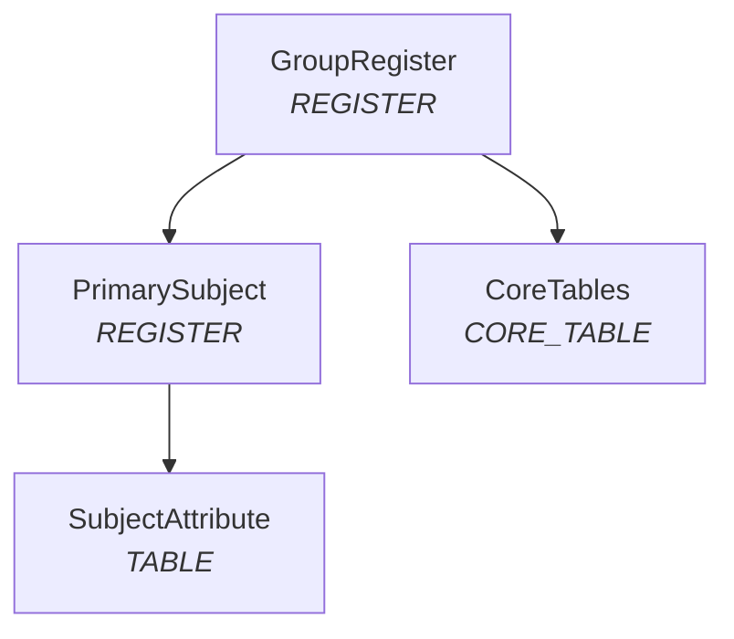

# Plan your domain

### Register Purpose

OpenG2P recognizes four register purposes (`RegisterPurposeEnum` in core):

| Purpose               | Role                                                                               |
| --------------------- | ---------------------------------------------------------------------------------- |
| **REGISTER**          | Top-level subject you search for and open in the staff portal                      |
| **TABLE**             | Repeating child data linked through `link_internal_record_id`                      |
| **PROGRAM\_REGISTER** | Programme enrollment; core applies specialized validation paths                    |
| **CORE\_TABLE**       | Platform-managed rows (e.g. computed scores); you seed metadata, core supplies ORM |

A typical shape looks like this:

Pick **PascalCase mnemonics** early. Each mnemonic becomes a class family the platform resolves at runtime:

| Mnemonic `{Mnemonic}` | Generated classes                                          |
| --------------------- | ---------------------------------------------------------- |
| Live ORM              | `G2PRegister{Mnemonic}`                                    |
| History ORM           | `G2PRegisterHistory{Mnemonic}`                             |
| Intake ORM            | `G2PIntakeForm{Mnemonic}`                                  |
| Schemas               | `G2PRegisterSchema{Mnemonic}`, history and intake variants |
| Domain service        | `G2PRegisterDomainService{Mnemonic}`                       |

Core loads them through `importlib` against the installed alias `openg2p_registry_extensions`. A typo in SQL or Python surfaces as `AttributeError` on the first change request — not at import time.

***

### Mixins and tables

Domain models **compose** platform mixins; you declare only programme-specific columns on a plain trait mixin (no `__tablename__`).

Person-like registers usually stack `G2PRegister` + `G2PPerson` + `G2PGeo`. Group registers often drop person mixins. Child TABLE registers frequently use `G2PRegister` + trait only.

Naming convention for physical tables:

* Live: `g2p_register_{snake_plural}`
* History: `g2p_register_history_{snake_plural}`
* Intake staging: `g2p_intake_form_{snake_plural}`

Plan one trait mixin module per register file so live, history, and intake models stay aligned.

***

### Functional IDs

When a register needs a human-readable identifier, set `functional_id_generation_required = TRUE` in metadata and wire three layers:

1. **Extension** — `G2PIdGeneratorService.generate_prefix_suffix()` compares a **lowercase** mnemonic string
2. **Helm wrapper** — `idgenerator.idGenerator.appConfig.idTypes.{key}.idLength`
3. **Celery** — `functional_id_allocation_worker` after approval

The lowercase key in Helm must match the string tested in Python (`primarysubject`, not `PrimarySubject`).

***

### De-duplication

Turn on `dedup_is_enabled` and set `dedup_threshold_score` where near-duplicate detection matters. Weighted field lists live in `g2p_register_schemas.deduplicate_schema` JSON, core implements the matcher; you only configure which fields count.

Dedup runs during change-request processing and through dedicated Celery workers. Domain services do not override dedup logic.

***

### Domain service hooks

Core invokes extension services at well-defined moments. Decide up front which registers need which hook:

| Hook                                              | When it runs                                      | Typical use                           |
| ------------------------------------------------- | ------------------------------------------------- | ------------------------------------- |
| `validate_domain_attributes`                      | Change-request **controller**, before persistence | Cross-field rules, referential checks |
| `construct_record_name` / `construct_search_text` | While CR payload is assembled                     | List display, full-text search        |
| `post_approve`                                    | After approval commits                            | Life events, parent aggregates        |
| `post_ingest`                                     | Celery, after pipeline insert                     | Bulk partner loads                    |


Factory resolution is lazy for most registers. Only the factory plus one or two root services are eager-initialized in `app.py`; every other `G2PRegisterDomainService{Mnemonic}` loads on first use.


***

### Optional capabilities

| Capability         | What you add                                                                                                                                                                           |
| ------------------ | -------------------------------------------------------------------------------------------------------------------------------------------------------------------------------------- |
| **Ingestion**      | `data-models/`, `registry-inbound-message-rules/`, flat `templates/*.j2`, `g2p_registry_documents`, optional enrichers - see [Ingestion](../../../design/ingestion-pipeline.md) design |
| **Outgestion**     | `registry-outbound-messages-templates/` + outbound `.j2` templates; Celery publishes on register changes                                                                               |
| **Scores**         | `CORE_TABLE` register, `g2p_register_score_definitions` JSON, `G2PScoreComputeService{Type}`                                                                                           |
| **Input channels** | `registry-configurations/` - staff portal, intake, partner, import file, VC per register                                                                                               |

Reference implementations differ mainly in graph size and ingestion depth. Use Reference implementations for structural patterns, not domain field lists.

***

### Before proceeding to the next step

* [ ] Register hierarchy diagram with purpose and parent links
* [ ] Mnemonic list mapped to mixin choices and table names
* [ ] Field inventory (column, type, enum / lookup source)
* [ ] Notes on functional IDs, dedup, hooks, and integrations
* [ ] Variant slug `{variant}` for `{variant}-extension`, Docker image names, and Helm chart name
