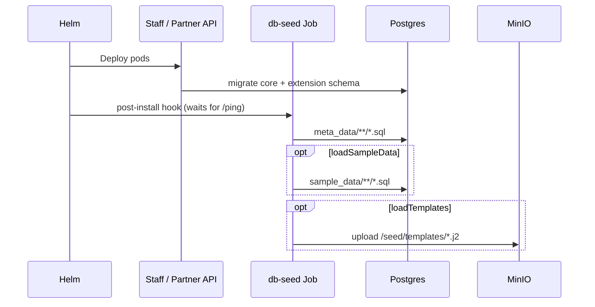
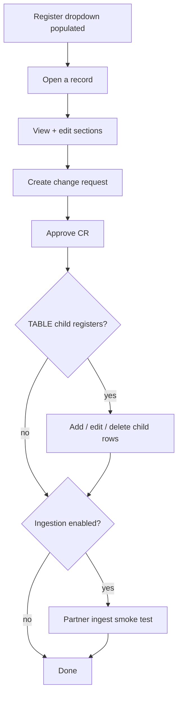

# Post install workflow

This checklist covers **domain-specific** verification only. The following are **platform commons** - shared across all OpenG2P registry deployments and assumed to be already in place before you start Step 8:

<table><thead><tr><th width="204">Platform common</th><th>Assumed ready</th></tr></thead><tbody><tr><td><strong>Keycloak</strong></td><td>Realm deployed; staff portal OIDC client configured; test users created; roles and permissions mapped through IAM</td></tr><tr><td><strong>Postgres, RabbitMQ, MinIO, ingress</strong></td><td>Provisioned by the base <code>openg2p-registry</code> chart (or your cluster's equivalent)</td></tr></tbody></table>

You do not configure Keycloak users or permission matrices as part of building a domain extension. Log in to the staff portal with a **pre-provisioned test user** when running functional tests below.

***

### What install does



API pods migrate schema first. The db-seed Job runs only after init containers confirm Postgres is up and APIs respond on `/ping`.

***

### 1. Confirm the db-seed Job

```bash
kubectl get jobs -n {namespace} | grep db-seed
kubectl logs job/{release}-db-seed -n {namespace}
```

<table><thead><tr><th width="287">Log line to look for</th><th>Meaning</th></tr></thead><tbody><tr><td><code>meta-data scripts completed</code></td><td>Register definitions, sections, tabs, configs applied</td></tr><tr><td><code>sample data scripts completed</code></td><td>Demo rows loaded (<code>loadSampleData=true</code>)</td></tr><tr><td><code>Skipping sample data</code></td><td>Expected when <code>loadSampleData=false</code></td></tr><tr><td><code>Uploading N template(s)</code></td><td>MinIO upload ran (<code>loadTemplates=true</code>)</td></tr><tr><td><code>Skipping template upload</code></td><td>Expected when <code>loadTemplates=false</code></td></tr></tbody></table>


db-seed uses `psql -v ON_ERROR_STOP=0` - a failed SQL script logs an error but does **not** fail the Job. Always read the full log, not just Job status.


If the Job failed or metadata looks wrong, fix SQL, rebuild the db-seed image, and run `helm upgrade` (or re-run the db-seed container against the same database locally).

***

### 2. Infrastructure checks

<table><thead><tr><th width="284">Pod / Job</th><th>Check</th></tr></thead><tbody><tr><td>db-seed Job</td><td><strong>Completed</strong></td></tr><tr><td><code>{release}-staff-portal-api</code></td><td>Running; logs free of <code>openg2p_registry_extensions</code> import errors</td></tr><tr><td><code>{release}-partner-api</code></td><td>Running (if partner ingestion enabled)</td></tr><tr><td><code>{release}-celery-beat-producer</code></td><td>Running — pipelines stall without beat</td></tr><tr><td><code>{release}-celery-worker</code></td><td>Running</td></tr><tr><td>MinIO</td><td>Reachable via the api and console endpoints when ingestion or outgestion is enabled</td></tr></tbody></table>

Quick API health:

```bash
kubectl exec -n {namespace} deploy/{release}-staff-portal-api -- wget -qO- http://localhost/ping
```

***

### 3. Staff portal functional tests

Work through these in order after logging in with a pre-provisioned Keycloak user (see Assumed platform setup):



| Test                 | Expected                                                           |
| -------------------- | ------------------------------------------------------------------ |
| Register dropdown    | Top-level **REGISTER** rows from `g2p_register_definitions`        |
| Open record          | Tabs, sections, header with functional ID (if enabled)             |
| Create + approve CR  | Row in `g2p_register_{table}`; history snapshot in history table   |
| Search / filters     | Columns and filters match `search_result_schema` / `filter_schema` |
| Child TABLE section  | Add, edit, delete rows on parent tab                               |
| Functional ID prefix | Matches `G2PIdGeneratorService` + Helm `idTypes`                   |
| Sample data          | Visible only when `dbSeed.loadSampleData=true`                     |

After section JSON changes: hard-refresh the browser and re-test view mode, edit mode, and TABLE list add/remove.

***

### 4. Ingestion (if enabled)

Per Ingestion and outgestion:

| Step | Action                                                                                                                               |
| ---- | ------------------------------------------------------------------------------------------------------------------------------------ |
| 1    | Confirm every `g2p_registry_documents.document_store_id` has a matching MinIO object (uploaded by db-seed when `loadTemplates=true`) |
| 2    | `POST` a sample payload to partner `/ingest_data`                                                                                    |
| 3    | Search the pipeline via ingestion data API                                                                                           |
| 4    | Verify classify → transform → **ADD** (intake) or **UPDATE** (change request)                                                        |
| 5    | Approve workflow → register row updated                                                                                              |
| 6    | Enricher class name in SQL matches exported Python class exactly                                                                     |

Stuck `PENDING` rows → check beat pod, RabbitMQ connectivity, and celery worker logs.

***

### 5. Scores and dedup (if enabled)

| Feature          | How to verify                                                                                                          |
| ---------------- | ---------------------------------------------------------------------------------------------------------------------- |
| Dedup            | Submit a near-duplicate CR - flagged when score ≥ `dedup_threshold_score`                                              |
| Score compute    | Change fields referenced in score definition → approve → check `g2p_register_scores` (may be async; watch Celery logs) |
| Completion score | Section completion bar updates if enabled on register definition                                                       |

***

### 6. Environment toggles to document

Record these for each environment so operators know what to expect:

| Helm value                                  | Production typical                      | Demo / dev typical |
| ------------------------------------------- | --------------------------------------- | ------------------ |
| `dbSeed.loadSampleData`                     | `false`                                 | `true`             |
| `dbSeed.loadTemplates`                      | `true` (or manual MinIO if disabled)    | `true`             |
| `idgenerator.idGenerator.appConfig.idTypes` | Match your `G2PIdGeneratorService` keys | Same               |

***

### Common failures

<table><thead><tr><th width="316">Symptom</th><th>Likely cause</th></tr></thead><tbody><tr><td>Empty register dropdown</td><td>db-seed failed or wrong database; check Job logs</td></tr><tr><td><code>AttributeError: G2PRegister{Mnemonic}</code></td><td>Mnemonic mismatch between SQL and Python, or missing export</td></tr><tr><td><code>validate_domain_attributes</code> failure</td><td>Factory returned <code>None</code> - class not exported or typo in mnemonic</td></tr><tr><td>Field missing in UI</td><td>Column absent from <code>section_ui_schema</code> widget paths</td></tr><tr><td>Empty widget</td><td>Wrong <code>register_id</code> UUID in <code>widget-data-path</code></td></tr><tr><td>API migration error in logs</td><td>Model missing from extension <code>migrate_database()</code></td></tr><tr><td>Celery task ORM error</td><td>API migrate did not complete before workers started</td></tr><tr><td>Template render error</td><td>MinIO object missing - verify <code>document_store_id</code> matches uploaded filename</td></tr><tr><td>Partial seed data</td><td>Earlier SQL file errored silently (<code>ON_ERROR_STOP=0</code>)</td></tr></tbody></table>


**You're done when** the db-seed Job completed cleanly, application pods are healthy, and you can create and approve a change request in the staff portal for at least one register. If ingestion or scores are in scope, those smoke tests passed too. Your domain registry is ready for programme staff - document `idTypes`, `loadSampleData`, and `loadTemplates` for operators and hand off.

