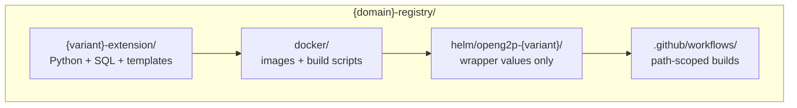

# Scaffold the repository

### What the repository contains

Think of four concentric layers:



**Extension package** (`{variant}-extension/src/openg2p_registry_{variant}_extension/`)

```
register_domain/
  factory/          ← standard G2PRegisterDomainFactory (copy unchanged)
  models/           ← ORM + enums.py
  schemas/          ← Pydantic mirrors
  services/         ← g2p_register_domain_service_{snake}.py per mnemonic
  id_generator/     ← optional
score_compute/      ← optional
ingestion_pipeline/ ← optional enrichers
templates/          ← flat *.j2 files for db-seed upload
meta_data/          ← seed SQL folder groups (see Step 5)
sample_data/        ← optional demo rows
app.py · config.py · __init__.py
```

**Docker** (`docker/`) - one folder per image: `staff-portal-api`, `partner-api`, `celery`, `staff-portal-ui`, `db-seed`, plus `scripts/` (`build.sh`, `parse_service.py`).

**Helm** (`helm/openg2p-{variant}/`) - `Chart.yaml`, `values.yaml`, optional `questions.yaml`. **No `templates/` directory**, Kubernetes manifests come from the base chart in [openg2p-registry-gen2-deployment](https://github.com/OpenG2P/openg2p-registry-gen2-deployment).

***

### meta\_data layout

Both reference extensions use the same six folders:

| Folder                                  | Purpose                                                |
| --------------------------------------- | ------------------------------------------------------ |
| `register-metadata/`                    | Definitions, sections, tabs, intake, scores, documents |
| `lookup-data/`                          | Enumerated values for widgets and validation           |
| `registry-configurations/`              | Input mechanisms per register                          |
| `data-models/`                          | Ingestion payload models                               |
| `registry-inbound-message-rules/`       | Classify / transform routing                           |
| `registry-outbound-messages-templates/` | Outgestion template bindings                           |

Demo rows sit in `sample_data/register-data/`, sibling to `meta_data/`, not inside it.

***

### Docker and db-seed live in the extension repo

This is intentional: your domain owns **how** images are built and **which** platform git pins they carry. The base deployment chart only knows how to **run** those images.

The **db-seed** image is special:

* Build context = repository root
* Dockerfile copies SQL from extension `src/` into `/seed/meta_data` and `/seed/sample_data`
* Flat `.j2` files from extension `templates/` (top level only) copy into `/seed/templates/`
* `entrypoint.sh` runs SQL, optionally sample data, optionally uploads templates to MinIO via `upload_templates.py`

Backend service specs (`docker/*/develop.txt`) pin platform packages and stage `./{variant}-extension` into `docker/local_deps/` through `parse_service.py`.

***

### CI workflows

Path filters keep builds fast — each workflow should rebuild only what changed:

| Workflow                   | Path filters                                                                                           | Output                        |
| -------------------------- | ------------------------------------------------------------------------------------------------------ | ----------------------------- |
| `docker-build-backend.yml` | `{variant}-extension/src/**/*.py`, `docker/{staff-portal-api,partner-api,celery}/**`, `pyproject.toml` | Backend images                |
| `docker-build-db-seed.yml` | `meta_data/**`, `sample_data/**`, `templates/**`, `docker/db-seed/**`                                  | db-seed image                 |
| `docker-build-ui.yml`      | `docker/staff-portal-ui/**`                                                                            | UI image                      |
| `helm-publish.yml`         | `helm/**`                                                                                              | Wrapper `.tgz` → openg2p-helm |

Backend workflows must **not** include `meta_data/**` or `sample_data/**`. Add `workflow_dispatch` with a `service_file` input so operators can rebuild one image without a code push.

***

### Naming cheat sheet

<table><thead><tr><th width="215">Artefact</th><th>Pattern</th></tr></thead><tbody><tr><td>Extension folder</td><td><code>{variant}-extension</code></td></tr><tr><td>Python source dir</td><td><code>openg2p_registry_{variant}_extension</code></td></tr><tr><td>Installed import</td><td><strong><code>openg2p_registry_extensions</code></strong></td></tr><tr><td>Docker image</td><td><code>openg2p/openg2p-{variant}-{service}:{tag}</code></td></tr><tr><td>Helm chart</td><td><code>openg2p-{variant}</code></td></tr></tbody></table>

***

### Before proceeding to the next step

* [ ] Repository matches the layout above
* [ ] `pip install -e ./{variant}-extension` succeeds
* [ ] `docker/scripts/build.sh` is executable
* [ ] Helm wrapper declares `openg2p-registry` dependency and nests overrides under `openg2p-registry:`
