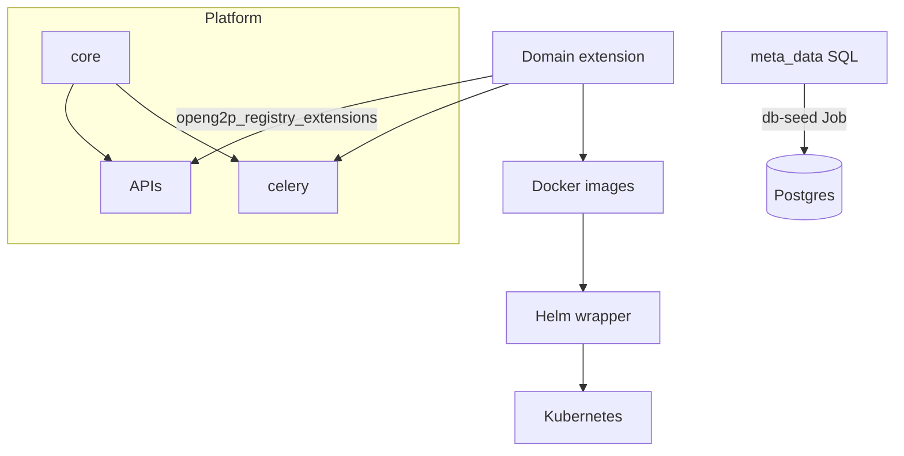

# Platform & Extensions Model

### Components

<table><thead><tr><th width="266">Layer</th><th>Responsibility</th><th data-hidden>You customize?</th></tr></thead><tbody><tr><td><strong>Core</strong></td><td>ORM bases, change requests, dedup, metadata services, ingestion framework</td><td>No</td></tr><tr><td><strong>APIs</strong></td><td>Staff portal and partner FastAPI apps</td><td>No — extension pip-installed into API images</td></tr><tr><td><strong>Celery</strong></td><td>Ingestion, scoring, dedup workers</td><td>No — same extension package</td></tr><tr><td><strong>Staff portal UI</strong></td><td>Next.js; renders forms from metadata</td><td>Rarely</td></tr><tr><td><strong>Extension</strong></td><td>Models, schemas, services, SQL seeds, optional enrichers/scores</td><td><strong>Yes</strong></td></tr><tr><td><strong>Docker + Helm wrapper</strong></td><td>Five branded images; point base chart at your images</td><td><strong>Yes</strong></td></tr></tbody></table>



***

### Runtime loading

Core resolves classes by **register mnemonic** from metadata. If `register_mnemonic` is `{Mnemonic}`, the platform expects `G2PRegister{Mnemonic}`, `G2PRegisterSchema{Mnemonic}`, and `G2PRegisterDomainService{Mnemonic}` in your extension.

The extension installs under a **fixed import alias** configured in `pyproject.toml`:

```toml
[tool.hatch.build.targets.wheel.sources]
"src/openg2p_registry_{variant}_extension" = "openg2p_registry_extensions"
```

Only one extension wheel per deployment. Staff portal API loads it via `ExtensionsInitializer()` from `openg2p_registry_extensions.app` after core is initialized.


See [Extensions contract](../../developer-zone/building-a-registry/concepts/registry-extensions/extensions-contract.md) for required classes and hooks.


***

### Repository pattern

Every domain variant repository follows the same layout: `{variant}-extension/` (Python + SQL), `docker/` (docker images + build scripts), `helm/openg2p-{variant}/` , path-scoped CI workflows.

Platform packages are pinned in Docker **service spec files** (`docker/staff-portal-api/develop.txt`, etc.) alongside `./{variant}-extension`. On release, bump Docker tags, wrapper chart version, and base chart dependency together.


Do **not** fork core, APIs, Celery, UI, or the base Helm chart.


***

### API vs Celery startup

| Runtime             | Extension bootstrap                                      | Domain migrations        |
| ------------------- | -------------------------------------------------------- | ------------------------ |
| Staff / partner API | Full `app.py` Initializer                                | Yes (on container start) |
| Celery worker       | `G2PRegisterDomainFactory` only; lazy model/service load | **No**                   |


API containers must migrate successfully before Celery tasks run. Beat and worker pods share one `{variant}-celery` image; the base chart sets mode via env vars.


***

### Settings

API/Celery import `Settings` from `openg2p_registry_extensions.config`, which extends core settings. Use env prefix `registry_extensions_` for domain variables (enricher URLs, feature flags).
