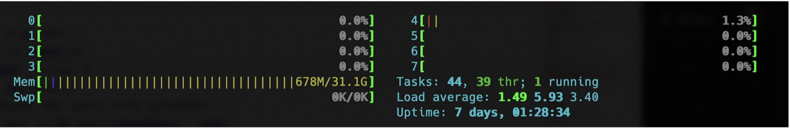
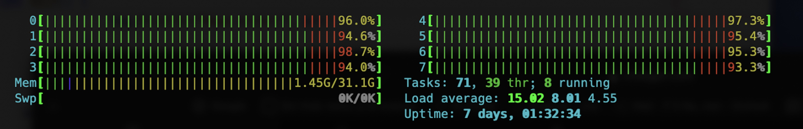
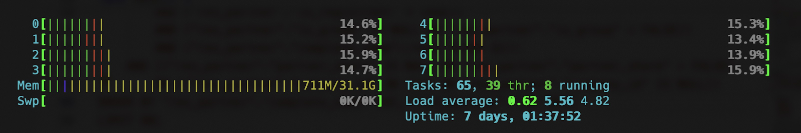
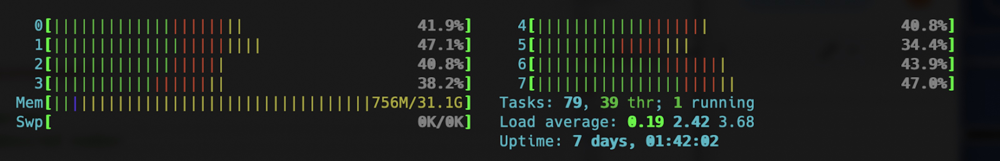
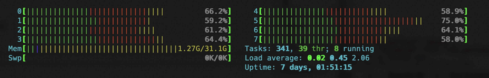
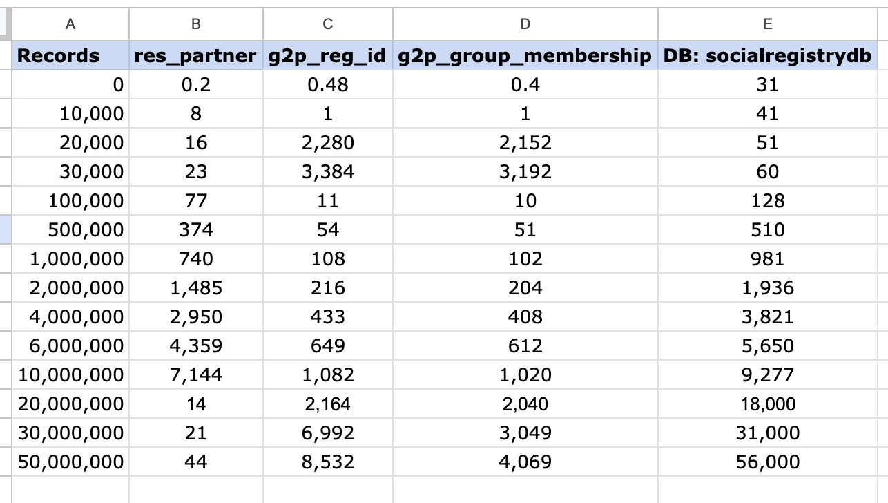
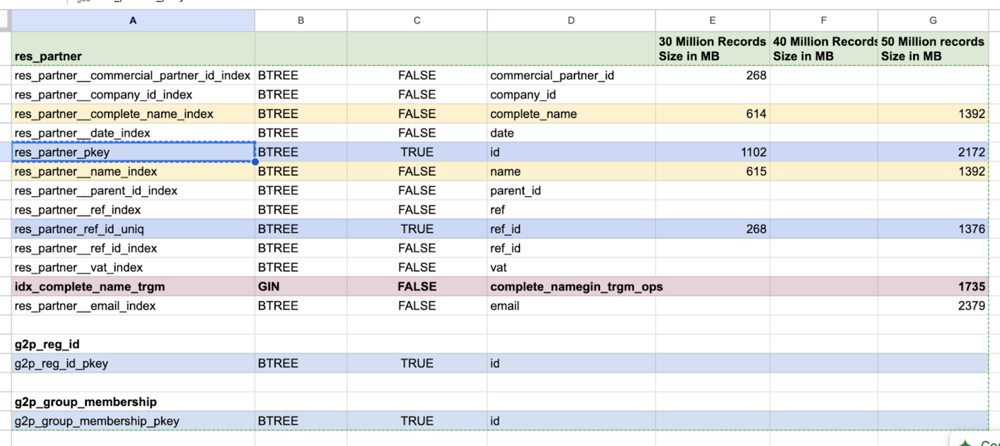

# Performance Testing

**Data Overview**

The main registry table - 'res\_partner" was populated with 50,000,000 (50 million) records. This 50 million records consisted of 40,000,000 (40 million) individuals and 10,000,000 million groups.

### **User Interface (UI) Performance**

* Inserts and Updates: The current system handles record inserts and updates effectively with no significant delay or latency.
* Search Performance:
  * **Default Index:** The search using the complete\_name index performs well when exact matches are searched (e.g., complete\_name = '...').
  * **Partial Matches:** For substring searches (e.g., complete\_name containing a value), the default index does not suffice.
  * We created a **trigram index** (using the **pg\_trgm** extension) This improves search functionality dramatically. Both LIKE '%CARL%' and LIKE 'CARL%' queries leverage this index effectively, providing results within approximately one second. This also ensured UI search responses remain quick - typically within one to two seconds.
  * We added an index on res\_partner.email – Similar performance observed (similar to complete\_name mentioned above) – both from UI as well as SQL Query sessions.

### **Unique ID (like Aadhaar ID) Search Performance**

* We created an index on **g2p\_reg\_id.value** column. UI Search for ID\_VALUE = ‘123456789012” and ID\_TYPE = ‘AADHAAR’. The resulting Query is

`SELECT "res_partner"."id", "res_partner"."name", "res_partner"."address", "res_partner"."phone", "res_partner"."birthdate", "res_partner"."registration_date", "res_partner"."disabled" FROM "res_partner" WHERE ((((("res_partner"."active" = true) AND ("res_partner"."is_registrant" = TRUE)) AND ("res_partner"."is_group" IS NULL OR "res_partner"."is_group" = FALSE)) AND`

<mark style="color:orange;">**`("res_partner"."id" IN (SELECT "g2p_reg_id"."partner_id" FROM "g2p_reg_id" WHERE ("g2p_reg_id"."value" = '1870938943'))))`**</mark>

<mark style="color:orange;">**`AND ("res_partner"."id" IN (SELECT "g2p_reg_id"."partner_id" FROM "g2p_reg_id"`**</mark>

<mark style="color:orange;">**`WHERE ("g2p_reg_id"."id_type" IN (SELECT "g2p_id_type"."id" FROM "g2p_id_type" WHERE ("g2p_id_type"."id" = '2'))))))`**</mark>

`AND (("res_partner"."partner_share" IS NULL OR "res_partner"."partner_share" = FALSE) OR (("res_partner"."company_id" IN (1)) OR "res_partner"."company_id" IS NULL)) ORDER BY "res_partner"."complete_name" ASC , "res_partner"."id" DESC LIMIT 80`

* Nested queries executed by the Odoo UI are suboptimal and do not utilize the index on g2p\_reg\_id.value – Queries are always on “res\_partner” with nested subqueries on child tables

### **Postgres Parallel Queries - Measurements**

Queries were fired in parallel on the Postgres database to measure the performance of the postgres database server.

#### **Idle Time**

**CPU Measurements**

<table><thead><tr><th width="344.9088134765625">Metric</th><th>Value</th></tr></thead><tbody><tr><td>Uptime</td><td>7d 01:28:34</td></tr><tr><td>Avg CPU/core</td><td>~0.2%</td></tr><tr><td>Load average (1/5/15m)</td><td>1.49 / 5.93 / 3.40</td></tr><tr><td>Memory used</td><td>678M / 31.1G</td></tr><tr><td>Tasks running</td><td>1</td></tr></tbody></table>

<figure><figcaption></figcaption></figure>

#### <mark style="color:$primary;">**Test 01 - LIKE query on Non Indexed Text Column (20 threads)**</mark>

Number of Parallel threads: 20 (from a client machine that supports 20 threads - 10 Cores with 2 threads per core)

`SELECT "res_partner"."id", "res_partner"."name", "res_partner"."address", "res_partner"."phone", "res_partner"."birthdate", "res_partner"."registration_date", "res_partner"."disabled"`

`FROM "res_partner"`

`WHERE (((("res_partner"."active" = true) AND ("res_partner"."is_registrant" = TRUE)) AND ("res_partner"."is_group" IS NULL OR "res_partner"."is_group" = FALSE)) AND ("res_partner"."name"::text ILIKE $1)) AND (("res_partner"."partner_share" IS NULL OR "res_partner"."partner_share" = FALSE) OR (("res_partner"."company_id" IN (1)) OR "res_partner"."company_id" IS NULL)) ORDER BY "res_partner"."name" ASC, "res_partner"."id" DESC`

`LIMIT 80;`

**CPU Utilizations**

| Metric                 | Value                          |
| ---------------------- | ------------------------------ |
| Uptime                 | 7d 01:32:34 (+4m from idle)    |
| Total execution time   | **3m 39.88s**                  |
| Avg CPU/core           | **\~95.7%** (93.3–98.7% range) |
| Load average (1/5/15m) | **15.02** / 8.01 / 4.55        |
| Memory used            | 1.45G / 31.1G                  |
| Tasks running          | 8 / 8                          |

<figure><figcaption>
Total execution time: 3m 39.881448458s
</figcaption></figure>

#### <mark style="color:$primary;">Test 02 - LIKE query on Indexed Text Column (20 threads)</mark>

Number of Parallel threads: 20 (from a client machine that supports 20 threads - 10 Cores with 2 threads per core) 

`SELECT "res_partner"."id", "res_partner"."name", "res_partner"."address", "res_partner"."phone", "res_partner"."birthdate", "res_partner"."registration_date", "res_partner"."disabled"`

`FROM "res_partner"`

`WHERE (((("res_partner"."active" = true) AND ("res_partner"."is_registrant" = TRUE)) AND ("res_partner"."is_group" IS NULL OR "res_partner"."is_group" = FALSE)) AND ("res_partner"."complete_name"::text ILIKE $1)) AND (("res_partner"."partner_share" IS NULL OR "res_partner"."partner_share" = FALSE) OR (("res_partner"."company_id" IN (1)) OR "res_partner"."company_id" IS NULL) ORDER BY "res_partner"."complete_name" ASC, "res_partner"."id" DESC`

`LIMIT 80;`

**CPU Utilizations**

| Metric                 | Value                |
| ---------------------- | -------------------- |
| Uptime                 | 7d 01:37:52 (+5m18s) |
| Total execution time   | **1.71s**            |
| Avg CPU/core           | **\~14.9%**          |
| Load average (1/5/15m) | 0.62 / 5.56 / 4.82   |
| Memory used            | 711M / 31.1G         |
| Tasks running          | 8 / 8                |

<figure><figcaption>
Total execution time: 1.714154125s
</figcaption></figure>

#### <mark style="color:$primary;">Test 03 - LIKE query on Indexed Text Column (100 threads)</mark>

Number of Parallel threads: 100 (from a client machine that supports 20 threads - 10 Cores with 2 threads per core)

**CPU Utilizations**

| Metric                 | Value                |
| ---------------------- | -------------------- |
| Uptime                 | 7d 01:42:02 (+4m10s) |
| Total execution time   | 2.44s                |
| Avg CPU/core           | \~41.9%              |
| Load average (1/5/15m) | 0.19 / 2.42 / 3.68   |
| Memory used            | 756M / 31.1G         |
| Tasks running          | 1 / 8                |

<figure><figcaption>
Total execution time: 2.435852958s
</figcaption></figure>

#### <mark style="color:$primary;">Test 04 - LIKE query on Non Indexed Text Column (100 threads)</mark>

Number of Parallel threads: 100 (from a client machine that supports 20 threads - 10 Cores with 2 threads per core)

**CPU Utilizations**

| Metric                 | Value                |
| ---------------------- | -------------------- |
| Uptime                 | 7d 01:51:15 (+9m13s) |
| Total execution time   | 5.70s                |
| Avg CPU/core           | \~63.5%              |
| Load average (1/5/15m) | 0.02 / 0.45 / 2.06   |
| Memory used            | 1.27G / 31.1G        |
| Tasks running          | 8 / 8                |

<figure><figcaption>
Total execution time: 5.696620167s
</figcaption></figure>

#### <mark style="color:$primary;">Consolidated Comparison Table (across the 4 tests)</mark>

<table><thead><tr><th>Test</th><th width="101.8902587890625">Threads</th><th width="118.41400146484375">Exec Time</th><th width="109.486328125">Avg CPU/core</th><th width="104.3323974609375">Load Avg (1m)</th><th>Cache State</th></tr></thead><tbody><tr><td>Idle</td><td>—</td><td>—</td><td>~0.2%</td><td>1.49</td><td>—</td></tr><tr><td>Non-indexed</td><td>20</td><td>3m 39.88s</td><td>95.7%</td><td>15.02</td><td>Cold </td></tr><tr><td>Indexed</td><td>20</td><td>1.71s</td><td>14.9%</td><td>0.62</td><td>Warm, close to Test 1</td></tr><tr><td>Indexed</td><td>100</td><td>2.44s</td><td>41.9%</td><td>0.19</td><td>Likely cache usage</td></tr><tr><td>Non-indexed</td><td>100</td><td>5.70s</td><td>63.5%</td><td>0.02</td><td>Likely cache usage</td></tr></tbody></table>

#### DB Storage (Tables)

<figure><figcaption></figcaption></figure>

#### DB Storage (Indexes)

<figure><figcaption></figcaption></figure>

#### Recommendations

1. Leverage pg\_trgm extension and trigram indexes for text substring searches to improve postgres text searches
2. Odoo Search - Explore if we can insert custom queries for "unique\_id" lookups (implemented as child tables) instead of relying on Odoo’s generic ORM queries. If this is not possible, then it is recommended to add these columns (like unique\_id, aadhaar\_id) into the res\_partner table itself.
3. The ID generation and De-duplication modules need to be implemented using a Celery Background Worker framework.
4. During data migration of large datasets, populate Open Search directly during Migration as in independent task, using Bulk Insertion into OpenSearch. Use Debezium only for production where data will flow in increments rather than bulk.
