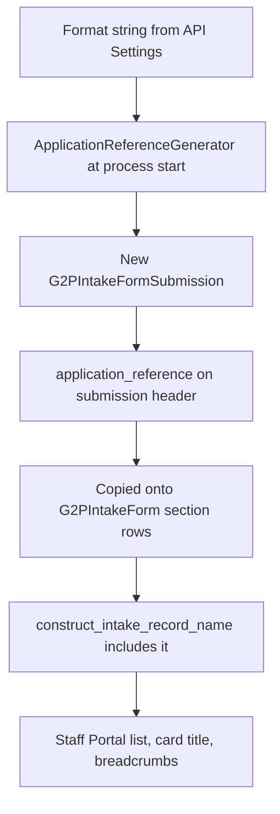

# Application Reference


An **Application Reference** is the human-readable identifier for an intake-form submission. Staff Portal shows it as **Application Reference**. Operators and applicants use it to find a draft or submitted form. APIs and the database still use `submission_id` (a UUID) as the primary key.

It is **not** a Functional ID. A Functional ID (`functional_record_id`) is assigned later, after the submission is approved and ingested into a Register. An Application Reference exists from the moment the intake submission row is created.


**Default format:** `{DATE:%Y%b%d|upper}-{SECONDS:5}{RAND:1}` → example `2026AUG21-519070`.

Override it with one environment variable on each API that creates intake submissions. An invalid format prevents that process from starting.


### Identifiers compared

| Identifier              | Assigned                     | Stored on                                                   | Audience                                             |
| ----------------------- | ---------------------------- | ----------------------------------------------------------- | ---------------------------------------------------- |
| `submission_id`         | On create (UUID)             | Intake submission (PK) and section rows                     | APIs, workers, internal joins                        |
| `application_reference` | On create (format string)    | Intake submission (**unique**) and copied onto section rows | Staff Portal list, breadcrumbs, search/display names |
| `functional_record_id`  | After ingest into a Register | Live register rows                                          | Real-world registry ID (Farmer ID, Household ID, …)  |

### When it is generated

`G2PIntakeFormSubmission.application_reference` has a SQLAlchemy default that calls `generate_application_reference()`. The value is written on insert - typically the first save of a new intake form, while the submission is still `DRAFT`.



The generator is constructed once during core initialization:

```python
ApplicationReferenceGenerator(_config.application_reference_format)
```

`generate_application_reference(now: datetime | None = None) -> str` then uses that singleton. If no generator is registered (tests / isolated core), it compiles `Settings.application_reference_format` on the fly.

The same value is stamped onto each intake section row (`G2PIntakeForm.application_reference`) when the section is saved, so list/search helpers can read it from the row payload. After ingest, live register rows do **not** store `application_reference`.

### Configuration

The setting is `application_reference_format` on registry core Settings (`env_prefix="registry_core_"`). Each API subclass inherits the field but uses **its own** env prefix. Intake submissions are created by those APIs, and each process registers its Settings before core initialization.

| Process                                    | Env var                                                  | Helm `envVars` key   |
| ------------------------------------------ | -------------------------------------------------------- | -------------------- |
| Staff Portal API                           | `REGISTRY_STAFF_PORTAL_API_APPLICATION_REFERENCE_FORMAT` | `staffApi.envVars`   |
| Partner API                                | `REGISTRY_PARTNER_API_APPLICATION_REFERENCE_FORMAT`      | `partnerApi.envVars` |
| Beneficiary Portal API                     | `REGISTRY_BENE_PORTAL_API_APPLICATION_REFERENCE_FORMAT`  | `beneApi.envVars`    |
| Core Settings in isolation (local / tests) | `REGISTRY_CORE_APPLICATION_REFERENCE_FORMAT`             | -                    |

Pydantic Settings treats env names as case-insensitive. Quotes around the value are required in shells when the format contains `{` `}` or `|`.

Helm example (Staff Portal API):

```yaml
staffApi:
  envVars:
    REGISTRY_STAFF_PORTAL_API_APPLICATION_REFERENCE_FORMAT: "{DATE:%Y%m%d}-{SECONDS:5}-{RAND:5}"
```

Set the **same format** on every API that can create submissions. Otherwise Staff Portal drafts, Partner-created submissions, and Beneficiary Portal submissions will look like different numbering schemes.

The format is compiled and test-rendered at startup. A bad format raises `ApplicationReferenceFormatError` and the process does not come up.

### Format syntax

A format string is literals plus tokens.

1. **Literals** - any text outside `{...}` is copied exactly (`APP-`, `-`, `/`).
2. **Tokens** - `{TOKEN}`, `{TOKEN:argument}`, or `{TOKEN:argument|upper}`.

Token names are case-insensitive. The only modifier is `|upper`, and it is applied to **DATE** and **TIME** segments (month/weekday names from `strftime`). Other tokens ignore `|upper`. `{UUID8}` is already uppercase hex.

#### Token reference

<table><thead><tr><th width="139">Token</th><th width="155">Syntax</th><th>What it renders</th><th>Limits</th></tr></thead><tbody><tr><td><strong>DATE</strong></td><td><code>{DATE:&#x3C;strftime>}</code></td><td><code>datetime.strftime</code> of the generation time</td><td>Requires a valid Python strftime pattern</td></tr><tr><td><strong>TIME</strong></td><td><code>{TIME:&#x3C;strftime>}</code></td><td>Same as DATE; use for clock-time segments</td><td>Requires a valid Python strftime pattern</td></tr><tr><td><strong>SECONDS</strong></td><td><code>{SECONDS:&#x3C;width>}</code></td><td>Zero-padded seconds since midnight (<code>0</code>–<code>86399</code>)</td><td>Width <strong>1–5</strong></td></tr><tr><td><strong>EPOCH</strong></td><td><code>{EPOCH:&#x3C;width>}</code></td><td>Zero-padded Unix epoch seconds</td><td>Width <strong>1–12</strong>. Width is <strong>minimum padding</strong>, not truncation - a 10-digit epoch will still render 10 digits if you pass <code>{EPOCH:5}</code></td></tr><tr><td><strong>RAND</strong></td><td><code>{RAND:&#x3C;width>}</code></td><td>Zero-padded decimal digits (<code>0</code>–<code>9</code>), from <code>secrets.randbelow</code></td><td>Width <strong>1–12</strong></td></tr><tr><td><strong>RAND_ALNUM</strong></td><td><code>{RAND_ALNUM:&#x3C;width>}</code></td><td>Random <code>A–Z</code> and <code>0–9</code></td><td>Width <strong>1–12</strong></td></tr><tr><td><strong>UUID8</strong></td><td><code>{UUID8}</code></td><td>First 8 hex characters of a UUID4, uppercased</td><td>No argument</td></tr></tbody></table>

Unknown tokens, empty format strings, missing widths, and invalid strftime patterns are rejected at compile time.

#### DATE / TIME strftime patterns

DATE and TIME accept any valid Python [`strftime`](https://docs.python.org/3/library/datetime.html#strftime-and-strptime-format-codes) pattern. The compiler checks the pattern against a fixed timestamp (`2001-01-01 12:30:45`).

<table><thead><tr><th width="146">Pattern</th><th width="149">Example</th><th>Notes</th></tr></thead><tbody><tr><td><code>%Y%m%d</code></td><td><code>20260821</code></td><td>Compact ISO-style date</td></tr><tr><td><code>%Y%b%d|upper</code></td><td><code>2026AUG21</code></td><td>Year + uppercase abbreviated month + day (default date segment)</td></tr><tr><td><code>%d%m%Y</code></td><td><code>21082026</code></td><td>Day-first numeric date</td></tr><tr><td><code>%d%b%Y</code></td><td><code>21Aug2026</code></td><td>Day + abbreviated month + year</td></tr><tr><td><code>%d%b%Y|upper</code></td><td><code>21AUG2026</code></td><td>Uppercase month via <code>|upper</code></td></tr><tr><td><code>%d%B%Y</code></td><td><code>21August2026</code></td><td>Full month name (length varies by month)</td></tr><tr><td><code>%Y/%m/%d</code></td><td><code>2026/08/21</code></td><td>Slashes inside the token; or put them in literals</td></tr><tr><td><code>%H%M%S</code></td><td><code>143025</code></td><td>24-hour time</td></tr><tr><td><code>%H:%M:%S</code></td><td><code>14:30:25</code></td><td>Time with colons</td></tr></tbody></table>

Month and weekday names follow the **process locale** (usually English in container images).

### Example formats

#### Default

```bash
REGISTRY_STAFF_PORTAL_API_APPLICATION_REFERENCE_FORMAT="{DATE:%Y%b%d|upper}-{SECONDS:5}{RAND:1}"
# Example: 2026AUG21-519070
```

The last six characters are five-digit seconds-since-midnight plus one random digit. Fine for low concurrent traffic; see Uniqueness before using this in production.

#### ISO date, seconds, and a wider random segment (recommended for volume)

```bash
REGISTRY_STAFF_PORTAL_API_APPLICATION_REFERENCE_FORMAT="{DATE:%Y%m%d}-{SECONDS:5}-{RAND:5}"
# Example: 20260821-51907-04217
```

#### Day-first date with time

```bash
REGISTRY_STAFF_PORTAL_API_APPLICATION_REFERENCE_FORMAT="{DATE:%d%m%Y}-{TIME:%H%M%S}-{RAND:4}"
# Example: 21082026-143025-7314
```

#### Agency prefix and uppercase month

```bash
REGISTRY_STAFF_PORTAL_API_APPLICATION_REFERENCE_FORMAT="APP-{DATE:%d%b%Y|upper}-{RAND:6}"
# Example: APP-21AUG2026-842917
```

#### Slashes in literals

```bash
REGISTRY_STAFF_PORTAL_API_APPLICATION_REFERENCE_FORMAT="REG/{DATE:%Y/%m/%d}/{RAND:8}"
# Example: REG/2026/08/21/00421789
```

#### Alphanumeric random segment

```bash
REGISTRY_STAFF_PORTAL_API_APPLICATION_REFERENCE_FORMAT="{DATE:%Y%m%d}-{RAND_ALNUM:8}"
# Example: 20260821-K7P2M9QX
```

#### UUID fragment

```bash
REGISTRY_STAFF_PORTAL_API_APPLICATION_REFERENCE_FORMAT="{DATE:%Y%m%d}-{UUID8}"
# Example: 20260821-A1B2C3D4
```

### Limits and validation

| Rule                            | Value                                                                              |
| ------------------------------- | ---------------------------------------------------------------------------------- |
| Maximum rendered length         | **64** characters (checked at compile using an estimated max, and again at render) |
| `{RAND}` / `{RAND_ALNUM}` width | **1–12**                                                                           |
| `{SECONDS}` width               | **1–5**                                                                            |
| `{EPOCH}` width                 | **1–12**                                                                           |
| Empty format                    | Rejected                                                                           |
| Unknown token                   | Rejected                                                                           |
| Invalid strftime                | Rejected                                                                           |
| `{UUID8}` with an argument      | Rejected                                                                           |
| Modifier other than `upper`     | Rejected                                                                           |

### Uniqueness

`g2p_intake_form_submissions.application_reference` has a **unique** constraint. There is **no retry** if two concurrent inserts collide.

Entropy comes from the time tokens plus `{RAND}`, `{RAND_ALNUM}`, or `{UUID8}`. `{SECONDS:5}` distinguishes submissions in different seconds of the same day. Within the same second you need enough random width:

| Random token         | Values per second (same date/seconds prefix) |
| -------------------- | -------------------------------------------- |
| `{RAND:1}` (default) | 10                                           |
| `{RAND:5}`           | 100,000                                      |
| `{RAND_ALNUM:6}`     | 36⁶                                          |
| `{UUID8}`            | 16⁸ (hex)                                    |


The default `{RAND:1}` is a collision risk if many submissions are created in the same second. For production, use at least `{RAND:5}` or `{RAND_ALNUM:6}` in addition to a date (and optionally seconds) segment.


### Display names

The base domain service appends `application_reference` to the intake `record_name` when it is not already present:

```python
def construct_intake_record_name(self, payload: dict, extra: list[str] = None) -> str:
    record_name = self.construct_record_name(payload, extra)
    application_reference = str(payload.get("application_reference") or "").strip()
    if application_reference and application_reference not in record_name:
        return f"{record_name} {application_reference}".strip() if record_name else application_reference
    return record_name
```

Override `construct_intake_record_name` when the intake list should lead with the reference (common on master registers). Include `application_reference` in `construct_search_text` if staff will type it into search.

Live register `construct_record_name` should **not** depend on `application_reference` - that column is not on register tables.

### Signatures (code)

```python
class ApplicationReferenceGenerator(BaseService):
    def __init__(self, format_string: str): ...
    def generate(self, now: datetime | None = None) -> str: ...
    @classmethod
    def compile(cls, format_string: str) -> CompiledApplicationReferenceFormat: ...

def generate_application_reference(now: datetime | None = None) -> str: ...
```

`compile` is what validates the implementer-supplied format at startup. `generate` renders it for the current time (`datetime.now()` unless `now` is passed).
