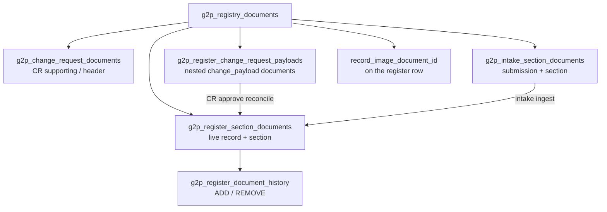
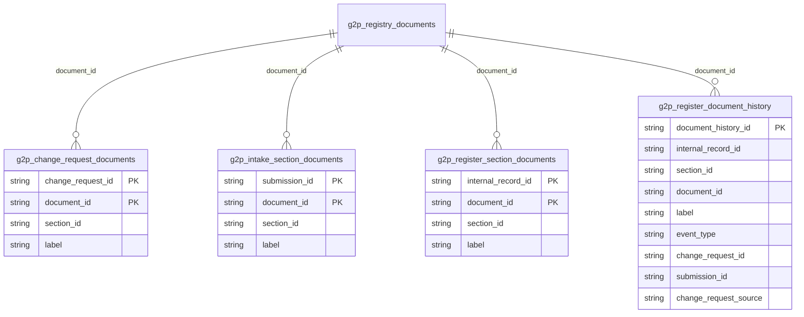
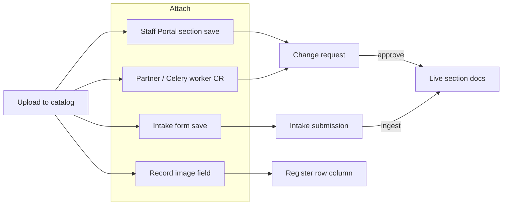

# Document Attachments

Uploaded files live in S3 under a catalog id (Document storage). This page is how those ids are **bound** to a register section, a change request, an intake submission, and the live record.

### Attachment reference

Every bind uses the same wire object:

<table><thead><tr><th width="171">Field</th><th>Meaning</th></tr></thead><tbody><tr><td><code>document_id</code></td><td>Catalog primary key from upload</td></tr><tr><td><code>label</code></td><td>Display string stored on the <strong>junction</strong> (or in CR payload JSON).</td></tr></tbody></table>

`section_id` is stored on the junction row, taken from the CR / intake / live section being saved. It is not repeated on each `{ document_id, label }` in the client payload.

The catalog row has no label.

### Where a file can be bound



| Binding                     | Table / column                                                                 | Scope                                                          | Live section docs?                                             |
| --------------------------- | ------------------------------------------------------------------------------ | -------------------------------------------------------------- | -------------------------------------------------------------- |
| **CR supporting / header**  | `g2p_change_request_documents`                                                 | One change request                                             | No. Stays on the CR                                            |
| **CR proposed section set** | Nested `change_payload[i].documents` in `g2p_register_change_request_payloads` | One payload **row**                                            | On approve, if the list is present                             |
| **Intake section set**      | `g2p_intake_section_documents`                                                 | One submission **section** (all rows of that section share it) | On ingest, copied onto each live row created from that section |
| **Live section set**        | `g2p_register_section_documents`                                               | One live `internal_record_id`                                  | This **is** the live set                                       |
| **Document history**        | `g2p_register_document_history`                                                | One live record + section                                      | Audit of ADD / REMOVE, not the current set                     |
| **Record image**            | `record_image_document_id` on the register / history row                       | The record                                                     | Not a section junction. Profile widget                         |

Templates, import files, and export files also use the catalog. They are not section attachments.


Intake documents are **per section**. Change-request nested documents are **per payload row**. On a list section, CR rows can each have their own file set; an intake section has one shared list for every row in that section.


### Data model



| Table                            | PK                                  | Notes                                                                                 |
| -------------------------------- | ----------------------------------- | ------------------------------------------------------------------------------------- |
| `g2p_change_request_documents`   | `(change_request_id, document_id)`  | Header evidence. `section_id` is the CR’s section                                     |
| `g2p_intake_section_documents`   | `(submission_id, document_id)`      | Draft and submitted files. `section_id` distinguishes sections of the same submission |
| `g2p_register_section_documents` | `(internal_record_id, document_id)` | Current live links. Indexed `(internal_record_id, section_id)`                        |
| `g2p_register_document_history`  | `document_history_id`               | `event_type` `ADD` or `REMOVE`. Origin `change_request_id` and/or `submission_id`     |


Live PK is `(internal_record_id, document_id)`, not per section. The same catalog id cannot be linked to two sections of one record.


### Section UI schema

A section collects files when its `section_ui_schema` has an editable **`file`** widget (older `docs` / `documents` widgets still count). Each file widget is one slot in the form (`widget-label`, `widget-required`, accept, max size). The `widget-data-path` is **not** an ORM column. Those keys are stripped from a change payload and are not written to the register table.

`section-supporting-documents` on the schema is the **header** list (covering letter, extra certificate). It is not a live slot. Clients send those as top-level CR `documents`.

`documents_required` on `g2p_register_sections` means a nested / intake list cannot be empty when that flag is on.

A section may be files only, or mixed with text / table widgets.

### Channels

Every channel uploads first (`POST /documents/upload_documents`), then attaches catalog ids.



Staff, worker, and core **create change request** paths share the same validation and the same two lists (header + nested).

Ingestion pipelines and partner APIs that open a CR use that same body. They do not write live section docs themselves.

### Change request lifecycle

A CR always targets one `section_id` of one subject `internal_record_id`. At most one **pending** CR exists for that pair.

#### Create

1. Client uploads files, gets `document_id`s.
2. Body may include top-level `documents` (header) and, on each `change_payload` row, nested `documents` (desired live set for that row).
3. Non-ORM keys are stripped. Nested `documents` is kept. Domain / AWE constructors see fields only.
4. Header rows go to `g2p_change_request_documents`. Nested lists stay in payload JSON.
5. `g2p_register_section_documents` is not touched.

```json
{
  "section_id": "…",
  "internal_record_id": "household-1",
  "documents": [
    { "document_id": "header-1", "label": "cert1" }
  ],
  "change_payload": [
    {
      "edit_action": "UPDATE",
      "internal_record_id": "household-1",
      "first_name": "Ada",
      "documents": [
        { "document_id": "doc-1", "label": "National ID" }
      ]
    }
  ]
}
```

Nested list on ADD / UPDATE:

| Value             | On approval                               |
| ----------------- | ----------------------------------------- |
| omitted or `null` | Leave live section docs as they are       |
| `[]`              | Unlink all live section docs for that row |
| list              | Make live docs exactly that set           |

`DELETE` must not send nested `documents`. Deleting the row unlinks that row’s live section docs. `NO_CHANGE` rows are dropped and must not carry nested `documents`.

A document-only section (only file widgets) requires an explicit list on ADD / UPDATE, including `[]`.

Rejected: nested `documents` with no file widget; duplicate `document_id` in one row; ids not in the catalog; header duplicate ids; `documents_required` with `[]`.

#### Pending read

| Surface                      | Source                                                                       |
| ---------------------------- | ---------------------------------------------------------------------------- |
| Header                       | `g2p_change_request_documents` + presigned URLs                              |
| New / proposed section files | Nested list in payload JSON, hydrated when the key is present and not `null` |
| Old / current section files  | Live `g2p_register_section_documents` for that `section_id`                  |

Omitted nested `documents` means New has no documents key. The comparison UI should treat that as “same as Old”, not as an empty New. `[]` is the empty New.

Record images on the payload resolve to `record_image_url` the same way live records do.

`GET /documents/get_change_request_documents` returns **header** files only.

#### Verification and reject

Verifications do not copy files. Reject updates CR status only. Live section docs and document history are unchanged.

#### Approve

In the same transaction as field upsert and register history:

1. Apply domain fields (nested `documents` removed before ORM / history schemas).
2. Reconcile nested lists onto `g2p_register_section_documents` ([`G2PSectionDocumentReconcileService`](https://github.com/OpenG2P/registry-platform/blob/develop/core/openg2p-registry-core/src/openg2p_registry_core/services/g2p_section_document_reconcile_service.py)).
3. Header `g2p_change_request_documents` are **not** copied to live.

| `edit_action`                         | Desired live set |
| ------------------------------------- | ---------------- |
| `DELETE`                              | `[]`             |
| ADD / UPDATE, nested omitted / `null` | skip             |
| ADD / UPDATE, nested list             | that list        |

Reconcile (advisory lock on `(internal_record_id, section_id)`):

* In live, not in desired → delete link, history `REMOVE`
* In desired, not in live → insert link, history `ADD`
* Same `document_id`, different `label` → `REMOVE` then `ADD`

Table `ADD` assigns `internal_record_id` in this session before reconcile.

Catalog ids on the nested list are re-checked at approve time.

#### Approved read

Old / current section files are rebuilt from `g2p_register_document_history` events with `approved_at` **before** this CR’s `approved_at`. Events from the same CR are grouped so a label change does not appear as a gap.

### Intake lifecycle

Intake does **not** use `change_payload` and does **not** run CR section-payload validation.

#### Draft save

`save_intake_form_submission` takes `section_payload` (rows) and a section-level `documents` list.

| `documents`      | `g2p_intake_section_documents`                                              |
| ---------------- | --------------------------------------------------------------------------- |
| omitted / `null` | No-op                                                                       |
| `[]`             | Clear that section’s submission files                                       |
| list             | Exact set for that section (diff by `document_id`; labels updated in place) |

Ids must exist in the catalog. Submission GET returns those files grouped by `section_id` (`GET /documents/get_intake_form_documents`, and on each section payload).

Deleting a submission deletes its intake junction rows. Catalog objects are not deleted.

#### Finalize, approve, ingest

Finalize / approve do not write live section docs. After the submission is FINAL and APPROVED, register ingest:

1. Upserts live register rows from intake rows.
2. Writes per-register **row** history (`submission_id` set, `change_request_id` null).
3. For each section that has submission documents, upserts those files onto **each** live row created from that section, and writes document history `ADD` (`submission_id`, source `INTAKE_FORM`).

Intake ingest does not emit `REMOVE`. Files dropped from the draft before ingest never reach live. Files already live on a pre-existing row are not unlinked by ingest.

### Live reads

<table><thead><tr><th width="212">API</th><th>Documents returned</th></tr></thead><tbody><tr><td>Get record / hierarchy</td><td><code>documents</code> = all live section links for that <code>internal_record_id</code> (every section), plus <code>record_image_url</code> from <code>record_image_document_id</code></td></tr><tr><td><code>POST /documents/get_section_documents</code></td><td>Live links for one record; optional <code>section_id</code> filter</td></tr><tr><td>CR detail</td><td>Header + proposed nested + current as above</td></tr><tr><td>Intake submission</td><td>Junction rows for that submission</td></tr></tbody></table>

Presigned URLs are minted at read time.

### Document history vs register history

<table><thead><tr><th width="278">Ledger</th><th>What it versions</th></tr></thead><tbody><tr><td><code>g2p_register_history_*</code></td><td>Field snapshot of the row at commit</td></tr><tr><td><code>g2p_register_document_history</code></td><td>Link add/remove for section files</td></tr></tbody></table>

Document history is written when a live **link** changes (CR reconcile or intake ingest ADD), not at upload and not when a header file is attached to a CR.

Default `event_type` is `ADD` (intake ingest relies on that default).

Existing databases that predate `event_type` and the `(internal_record_id, section_id)` index need:

```sql
ALTER TABLE g2p_register_document_history ADD COLUMN IF NOT EXISTS event_type VARCHAR;
UPDATE g2p_register_document_history SET event_type = 'ADD' WHERE event_type IS NULL;
ALTER TABLE g2p_register_document_history
  ALTER COLUMN event_type SET DEFAULT 'ADD',
  ALTER COLUMN event_type SET NOT NULL;
CREATE INDEX IF NOT EXISTS ix_g2p_register_section_documents_record_section
ON g2p_register_section_documents (internal_record_id, section_id);
```

`create_all()` does not alter existing tables.

### Catalog delete

`delete_documents` removes the S3 object, then every CR / intake / live / history row for those ids, then the catalog row. Section files on live records disappear with no `REMOVE` history event.

### Invariants

* Upload and attach are separate calls.
* Header CR files never become live section files.
* Nested CR lists are the only CR path onto `g2p_register_section_documents`.
* Intake lists are the only intake path onto that table.
* Reject / pending CR / intake draft do not mutate live section files.
* `label` is display text on the junction or payload, not a schema key.
* One catalog id, one live record: at most one live link.

### Code

<table><thead><tr><th width="250">Piece</th><th>Code</th></tr></thead><tbody><tr><td>Catalog + hydrate + as-of</td><td><a href="https://github.com/OpenG2P/registry-platform/blob/develop/core/openg2p-registry-core/src/openg2p_registry_core/services/g2p_document_service.py"><code>g2p_document_service.py</code></a></td></tr><tr><td>CR validate / create / approve / fetch</td><td><a href="https://github.com/OpenG2P/registry-platform/blob/develop/core/openg2p-registry-core/src/openg2p_registry_core/services/g2p_register_change_request_service.py"><code>g2p_register_change_request_service.py</code></a></td></tr><tr><td>File widget, strip non-ORM, nested list</td><td><a href="https://github.com/OpenG2P/registry-platform/blob/develop/core/openg2p-registry-core/src/openg2p_registry_core/services/g2p_change_request_section_payload_service.py"><code>g2p_change_request_section_payload_service.py</code></a></td></tr><tr><td>Nested vs domain fields</td><td><a href="https://github.com/OpenG2P/registry-platform/blob/develop/core/openg2p-registry-core/src/openg2p_registry_core/services/change_request_payload_utils.py"><code>change_request_payload_utils.py</code></a></td></tr><tr><td>Live exact-set reconcile</td><td><a href="https://github.com/OpenG2P/registry-platform/blob/develop/core/openg2p-registry-core/src/openg2p_registry_core/services/g2p_section_document_reconcile_service.py"><code>g2p_section_document_reconcile_service.py</code></a></td></tr><tr><td>Worker CR create</td><td><a href="https://github.com/OpenG2P/registry-platform/blob/develop/core/openg2p-registry-core/src/openg2p_registry_core/services/g2p_change_request_worker_service.py"><code>g2p_change_request_worker_service.py</code></a></td></tr><tr><td>Intake save / ingest</td><td><a href="https://github.com/OpenG2P/registry-platform/blob/develop/core/openg2p-registry-core/src/openg2p_registry_core/services/intake_form_data_service.py"><code>intake_form_data_service.py</code></a></td></tr><tr><td>Live / hierarchy reads</td><td><a href="https://github.com/OpenG2P/registry-platform/blob/develop/core/openg2p-registry-core/src/openg2p_registry_core/services/g2p_register_service.py"><code>g2p_register_service.py</code></a>, <a href="https://github.com/OpenG2P/registry-platform/blob/develop/core/openg2p-registry-core/src/openg2p_registry_core/services/g2p_register_hierarchical_service.py"><code>g2p_register_hierarchical_service.py</code></a></td></tr></tbody></table>

