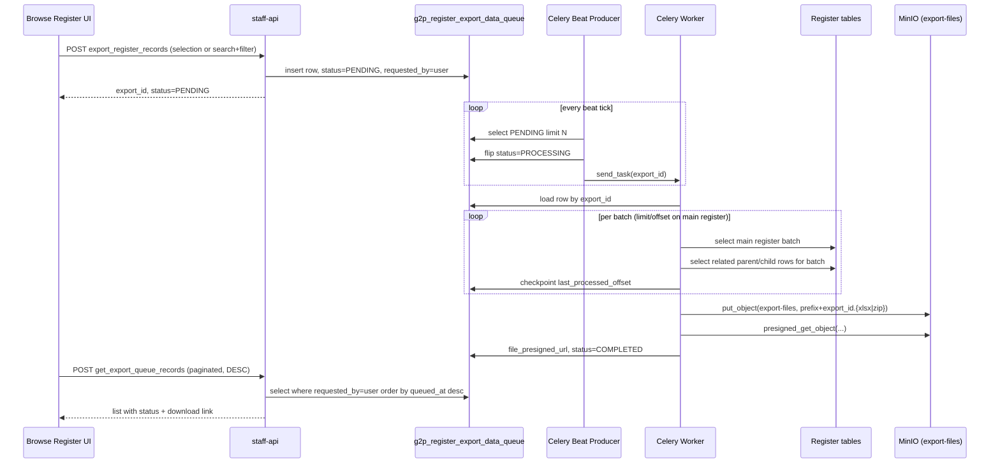

# Exporting to an XLS

### 1. Overview

Adds a bulk export capability to the Browse Register page: the currently applied search/filter result (or a user-picked subset of it, spanning pages) is exported as a downloadable file containing the main register's records plus every related parent/child register's records, one sheet per register. Export is asynchronous — a Celery Beat producer / Celery Worker pair (matching the existing `*_beat_producer.py` / `*_worker.py` pattern already used for functional-ID allocation, score computation, and file-intake ingestion) processes a queue table and lands the finished file in MinIO, returning a pre-signed download URL.

### 2. UI Behavior — Browse Register Page

1. User applies search criteria and/or filter criteria on a register.
2. Result set is shown paginated (server-side pagination, existing `pagination_request { current_page, page_size }` convention).
3. User may optionally check individual rows across multiple pages. Selection state is accumulated client-side across page navigations (not just the current page) and is **not required**.
4. An **Export** action becomes available on the result toolbar, always enabled once a result set exists, paired with a format picker (**XLSX** / **ZIP of CSVs**) that the user chooses before triggering the export.
5. On click:
   * If one or more rows are checked → export is scoped to exactly those rows.
   * If nothing is checked → export is scoped to the entire result set of the current search/filter (all pages).
6. The UI calls `export_register_records`, then shows the request as "queued" (e.g. a toast + an entry in an "Exports" panel) rather than blocking — the file is produced out of band.
7. The Exports panel polls `get_export_queue_records` for the signed-in user to show status transitions (`PENDING → PROCESSING → COMPLETED` with a download link, or `FAILED`).

### 3. API — `export_register_records`

`POST /register/export_register_records` (staff-api, mirrors the existing POST-with-envelope-body convention used by e.g. `/data-model/get_all_data_models`).

#### 3.1 Request payload

Exactly one of `selected_internal_record_ids` or `search_and_filter_condition` is populated, mirroring the UI rule in §2 step 5.

```jsonc
{
  "register_id": "REG-FARMER-001",
  // User-chosen output format — a UI control next to the Export action
  "export_format": "XLSX",   // "XLSX" | "ZIP_CSV"

  // Mode A — user made a selection (any page)
  "selected_internal_record_ids": ["8f2c...", "a913...", "..."],

  // Mode B — no selection: re-send the exact criteria that produced
  // the browsed result set, so the worker can reproduce it server-side
  "search_and_filter_condition": {
    "search_condition": { "...": "same shape as the Browse Register search API" },
    "filter_condition": { "...": "same shape as the Browse Register filter API" }
  }
}
```

Validation: the API rejects a payload carrying both fields or neither. `register_id` identifies the main register being browsed; related registers are resolved server-side (§6.1), not supplied by the client. `export_format` is required; the API rejects any value outside `XLSX`/`ZIP_CSV`.

#### 3.2 Behavior

1. Authenticate/authorize (`@require_permissions({"register:export"})` or similar, per existing controller pattern).
2. Resolve the caller's `policy_mnemonics` the same way the Browse Register search path does today (DP\_ roles → policy mnemonics, `G2PDataPolicyService`), and snapshot them onto the queue row — see §6.5.
3. Insert one row into `g2p_register_export_data_queue` with `status = PENDING`, `requested_by = <current user id>`, and the payload above serialized into the row (see §4).
4. Return `{ "export_id": "<queue row id>", "status": "PENDING" }` immediately. No synchronous file generation happens in the API.

### 4. Data Model — `g2p_register_export_data_queue`

Follows the repo's standard queue-table shape (as used by `G2PFunctionalIdGenerationQueue`, `ImportFileProcessQueue`, and the score-computation queues): UUID string PK, target FK column(s), one status column per processing phase backed by a `str, Enum` (`PENDING / PROCESSING / COMPLETED / FAILED`), an attempts counter, a latest-timestamp, and a latest-error column.

| Column                         | Type                                     | Notes                                                                                |
| ------------------------------ | ---------------------------------------- | ------------------------------------------------------------------------------------ |
| `export_id`                    | `String` (PK)                            | `default=lambda: str(uuid.uuid4())`                                                  |
| `register_id`                  | `String`, indexed                        | main register being exported                                                         |
| `requested_by`                 | `String`, indexed                        | user id who initiated the request                                                    |
| `queued_at`                    | `DateTime`                               | request creation time                                                                |
| `export_format`                | `String` (`XLSX` \| `ZIP_CSV`)           | UI-selected output format; drives worker branching (§6.3)                            |
| `policy_mnemonics`             | `JSONB`, nullable                        | caller's resolved data-policy mnemonics at request time (§6.5)                       |
| `selection_mode`               | `String` (`SELECTED` \| `SEARCH_FILTER`) | which payload mode was used                                                          |
| `selected_internal_record_ids` | `JSONB`, nullable                        | Mode A payload (list of ids)                                                         |
| `search_condition`             | `JSONB`, nullable                        | Mode B payload                                                                       |
| `filter_condition`             | `JSONB`, nullable                        | Mode B payload                                                                       |
| `batch_size`                   | `Integer`, default from config           | rows per batch (`limit`)                                                             |
| `last_processed_offset`        | `Integer`, default 0                     | resume point (`start_from`) on the main register                                     |
| `export_status`                | `String`, default `PENDING`              | `ProcessStatusEnum`: `PENDING / PROCESSING / COMPLETED / FAILED`                     |
| `export_no_of_attempts`        | `Integer`, default 0                     | retry counter                                                                        |
| `export_latest_timestamp`      | `DateTime`, nullable                     | last status-change time                                                              |
| `export_latest_error_code`     | `String`, nullable                       | last error, if any                                                                   |
| `file_object_name`             | `String`, nullable                       | MinIO object key once written (extension matches `export_format`: `.xlsx` or `.zip`) |
| `file_presigned_url`           | `Text`, nullable                         | set on completion                                                                    |
| `file_url_expires_at`          | `DateTime`, nullable                     | presigned URL expiry                                                                 |
| `total_records_exported`       | `Integer`, nullable                      | main-register row count, for the UI                                                  |

Reuses the shared `ProcessStatusEnum` (`NOT_APPLICABLE, PENDING, PROCESSING, COMPLETED, FAILED`) already defined for the other queue tables rather than introducing a new enum.

### 5. Celery Beat Producer

New file: `celery/openg2p-registry-celery-beat/src/openg2p_registry_celery_beat/tasks/register_export_beat_producer.py`, following `functional_id_allocation_beat_producer.py`:

1. Query up to `config.export_no_of_tasks_to_process` rows from `g2p_register_export_data_queue` where `export_status == PENDING`, ordered by `queued_at` (FIFO).
2. For each row, flip `export_status → PROCESSING` in the same session (this is the claim; no `SELECT ... FOR UPDATE`, consistent with the existing producers).
3. `celery_app.send_task(Workers.REGISTER_EXPORT_WORKER, args=(export_id,), queue=config.worker_queue)`.
4. Single `session.commit()` after the loop.
5. Register the new task name in `celery-beat/.../utils/workers.py::Workers` and schedule the producer itself in the beat schedule config alongside the other producers.

### 6. Celery Worker

New file: `celery/openg2p-registry-celery-worker/src/openg2p_registry_celery_worker/tasks/register_export_worker.py`.

Task signature: `@celery_app.task(name="register_export_worker") def register_export_worker(export_id: str)`.

#### 6.1 Resolving the register hierarchy

Corrects the field name in the request: the self-referential FK on `G2PRegisterDefinition` (table `g2p_register_definitions`) is `master_register_id`, not `parent_register_id`. It points from a register to its parent register's `register_id`.

* **Register-definition level**: walk `G2PRegisterDefinition` rows via `master_register_id` to build the full parent chain upward, and via `master_register_id == this.register_id` to find every direct child (repeat downward for grandchildren). This produces the ordered list of related registers to export as sheets. (`g2p_register_hierarchical_service.py` already implements comparable traversal and should be reused rather than re-implemented.)
* **Record level**: each concrete register table (`G2PRegister{mnemonic}`, loaded dynamically the same way `functional_id_allocation_worker.py` does via `getattr(module, f"G2PRegister{register_mnemonic}")`) carries `link_internal_record_id`, pointing at the parent record's `internal_record_id`. Given a batch of main-register `internal_record_id`s, child rows are found by `link_internal_record_id IN (batch_ids)`; parent rows are found by joining the batch's own `link_internal_record_id` values against the parent table's `internal_record_id`.

Selection scope applies only to the **main** register: when `selection_mode == SELECTED`, `selected_internal_record_ids` constrain which main-register rows are exported, but every related parent/child register row for those records is still pulled in full — "restricted to selected records" means restricted on the register being browsed, not a further filter on its relatives.

#### 6.2 Batch algorithm

```
fetch queue row by export_id
resolve register_definition tree (parents + children) for register_id
open output writer per queue_row.export_format:
    XLSX     -> one workbook, one sheet per register in the tree
    ZIP_CSV  -> one open CSV stream per register in the tree

offset = queue_row.last_processed_offset
loop:
    if selection_mode == SELECTED:
        batch_ids = queue_row.selected_internal_record_ids[offset : offset+batch_size]
    else:  # SEARCH_FILTER
        batch_ids = (
            select internal_record_id from MainRegisterTable
            where <search_condition AND filter_condition>
            order by internal_record_id
            limit batch_size offset offset
        )
    if batch_ids is empty:
        break

    main_rows = select * from MainRegisterTable where internal_record_id in batch_ids
    append main_rows to the main register's sheet/CSV

    for each related_register in tree:            # parents first, then children
        related_rows = fetch related rows for batch_ids per §6.1
        append related_rows to related_register's sheet/CSV

    offset += len(batch_ids)
    queue_row.last_processed_offset = offset
    commit()   # checkpoint, so a retry resumes instead of restarting

finalize per export_format (save workbook, or zip the CSV files)
upload to MinIO -> generate presigned URL
queue_row.export_status = COMPLETED
queue_row.total_records_exported = offset
commit()
```

Batching only ever paginates the **main** register (`limit`/`start_from` on `last_processed_offset`); each batch's parent/child rows are fetched in full for that batch, which is what keeps ordering correct — the worker never paginates a child/parent table independently.

#### 6.3 Output file — one sheet per register

Output format is a UI input (§3.1 `export_format`), stored on the queue row and read by the worker at generation time — the worker does not decide the format itself. One "sheet" (register) still maps to exactly one table of rows in both cases; only the container differs:

* **`XLSX`** — a single workbook, one worksheet per register in the resolved tree (§6.1), sheet name = register mnemonic/name. Rows for a given register are appended to its sheet as each batch (§6.2) completes, so the workbook is built incrementally rather than held fully in memory.
* **`ZIP_CSV`** — one `.csv` file per register, all collected into a single `.zip`. Each register's CSV is written incrementally (append-per-batch) to a temp file / stream, and the files are zipped together once all batches are processed.

Both branches share the same batch loop (§6.2) and register/record resolution (§6.1); only the "append rows to sheet/register-target" step and the final "finalize output" step differ by `export_format`. The finalized file's extension (`.xlsx` or `.zip`) determines `file_object_name` and the `Content-Type` set on `put_object` (`application/vnd.openxmlformats-officedocument.spreadsheetml.sheet` vs `application/zip`).

#### 6.4 Failure handling

On any exception: `session.rollback()`, increment `export_no_of_attempts`, set `export_latest_timestamp` / `export_latest_error_code`, and re-queue to `PENDING` (retry from the checkpointed `last_processed_offset`) if `export_no_of_attempts < config.export_worker_max_attempts`, else set `export_status = FAILED` — mirroring `functional_id_allocation_worker.py`'s retry/terminal logic.

#### 6.5 Data-policy enforcement

The worker must not query register tables more permissively than an interactive Browse Register search would. It re-applies the caller's `policy_mnemonics` (captured on the queue row at request time, §3.2) to **every** register/table it touches — main, parent, and child alike — using the same mechanism `G2PRegisterService` already uses for interactive search:

1. For each register in the resolved tree (§6.1), call `G2PDataPolicyService.get_component().resolve_register_record_policy(register_id, policy_mnemonics, session)` to get the merged policy expression, matching `_build_register_policy_condition` in `g2p_register_service.py`.
2. Turn it into a SQLAlchemy condition via `RegisterRecordRepository(implementation_class).build_policy_condition(merged_expression)`.
3. AND that condition into every batch query (main-register batch selection, and each related-register lookup), the same way `_search_in_register`/`_count_records_for_register` append `policy_condition` to `filter_conditions`.

This keeps export from ever surfacing rows the requesting user couldn't already see through the UI, including for related registers the user never directly searched.

### 7. MinIO Storage

The repo already has a `MinioClient` (`openg2p_registry_core.helpers.document.minio_client`) wrapping the `minio` SDK, obtained via `document_factory.get_document_handler()`, config'd under the `registry_core_` env prefix (`minio_endpoint`, `minio_access_key`, `minio_secret_key`, `minio_read_access_key`/`minio_read_secret_key`, `minio_secure`).

Today bucket names are **not** configurable — they come from a hard-coded `DocumentBucket` enum. This feature needs a new bucket, so:

1. Add `EXPORT_FILES = "export-files"` to `DocumentBucket`.
2. On MinIO client startup, ensure-create the bucket if it doesn't exist (extend the existing bucket bootstrap logic that presumably already ensures `DOCUMENTS`/`TEMPLATES` exist, or add one if it doesn't).
3. New env var for the **object-key prefix** (the "folder" within the bucket), e.g. `registry_core_export_files_prefix` (default `"register-exports/"`). The worker writes objects to `f"{prefix}{export_id}.{ext}"`, where `ext` is `xlsx` or `zip` depending on `queue_row.export_format` (§6.3).
4. Worker uploads via the existing `put_object(bucket, object_name, data, length, content_type)` path — `content_type` likewise selected by `export_format` — then calls `get_url(object_name, DocumentBucket.EXPORT_FILES, expires=timedelta(hours=<config>))` to obtain the presigned URL — same method already used for document downloads elsewhere in the codebase.
5. Persist `file_object_name`, `file_presigned_url`, and `file_url_expires_at` on the queue row, then set `export_status = COMPLETED`.

### 8. API — `get_export_queue_records`

`POST /register/get_export_queue_records` (same POST+envelope convention as `get_all_data_models`).

```jsonc
// request
{
  "pagination_request": { "current_page": 1, "page_size": 20 }
}
```

* Filters `g2p_register_export_data_queue` by `requested_by == current_user_id` (never another user's rows) AND `queued_at >= now() - config.export_queue_visibility_days` — rows older than the visibility window (default **2 days**) are not returned, regardless of status. This is the intended lifecycle boundary: the presigned URL and the queue row both age out together, so the list API never needs to compute a separate "EXPIRED" display state.
* Orders by `queued_at DESC` (most recent request first).
* `offset/limit` computed the same way as `g2p_dci_service.py` (`offset = (current_page - 1) * page_size`).
* Response follows the shared envelope (`RequestResponseHelper.construct_..._success_response`) carrying `total_items` / `number_of_pages` plus a list of rows: `export_id`, `register_id`, `export_status`, `queued_at`, `export_latest_timestamp`, `total_records_exported`, `export_format`, `file_presigned_url` (only when `COMPLETED`), `file_url_expires_at`.

### 9. New Configuration (env vars)

| Var                                                                        | Purpose                                           | Default             |
| -------------------------------------------------------------------------- | ------------------------------------------------- | ------------------- |
| `registry_core_minio_export_bucket` or reuse `DocumentBucket.EXPORT_FILES` | target bucket for export files                    | `export-files`      |
| `registry_core_export_files_prefix`                                        | folder/prefix within the bucket                   | `register-exports/` |
| `export_no_of_tasks_to_process` (beat)                                     | producer batch size (queue rows claimed per tick) | e.g. `5`            |
| `export_batch_size` (worker)                                               | main-register row batch size (`limit`)            | e.g. `500`          |
| `export_worker_max_attempts` (worker)                                      | retry ceiling before `FAILED`                     | e.g. `3`            |
| `export_presigned_url_expiry_hours`                                        | presigned URL lifetime                            | e.g. `24`           |
| `export_queue_visibility_days`                                             | how far back `get_export_queue_records` looks     | `2`                 |

(Names should ultimately match whatever prefix convention each package already uses — `registry_core_*` for core/MinIO settings, package-local settings for the beat/worker configs, per the existing `config.py` files in each package.)

### 10. End-to-End Flow


