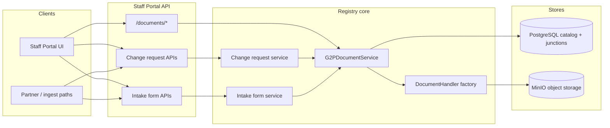
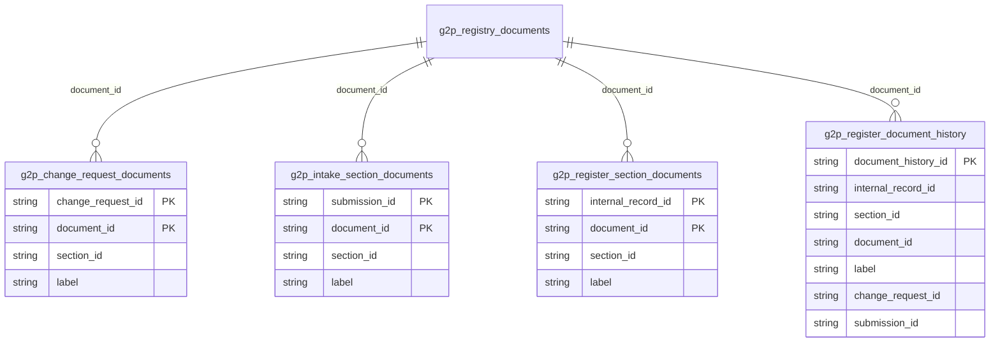
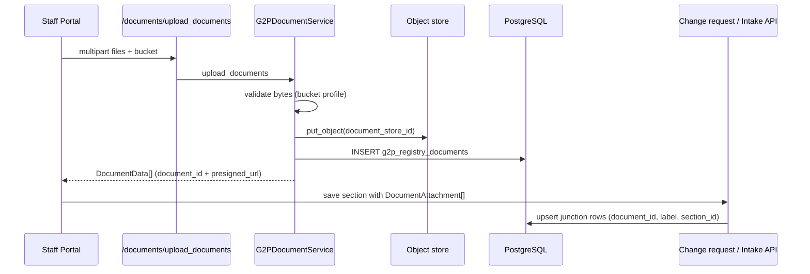
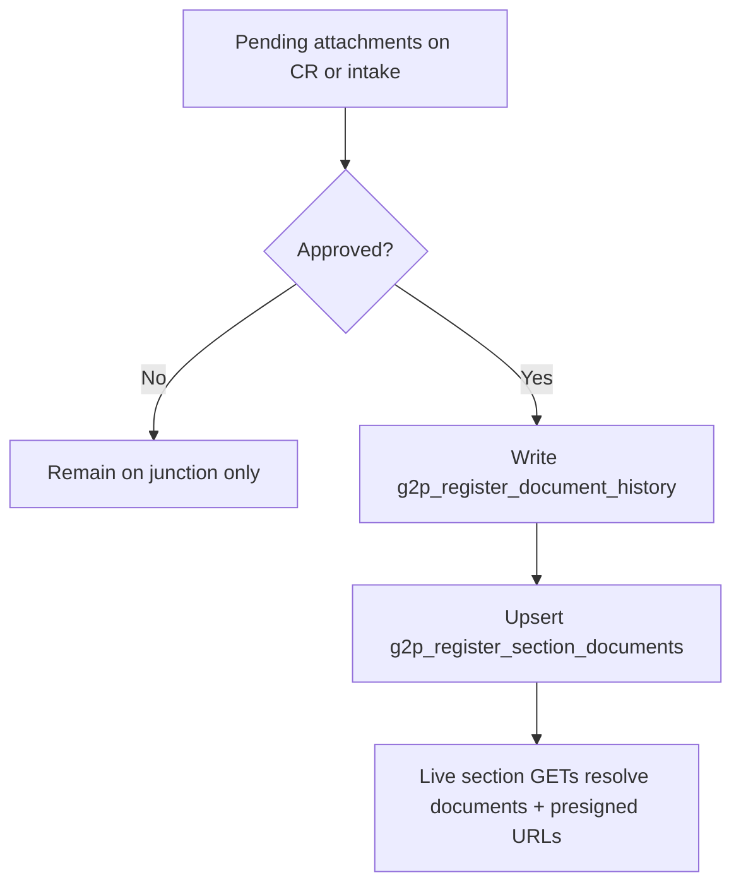

# File Attachments

File attachments in OpenG2P Registry are supporting documents (identity proofs, certificates, photos, and similar artifacts) that accompany registry mutations. Binary content lives in object storage; PostgreSQL holds a central catalog of metadata and thin junction rows that bind each document to a change request, intake submission, or live register section.


Every mutation to registry data flows through a [change request](https://docs.openg2p.org/products/registry/registry/design/change-management) (or an intake-form approval path). Documents are never written directly into live register tables without that approval step.


### Design principles

<table><thead><tr><th width="216">Principle</th><th>Description</th></tr></thead><tbody><tr><td>Catalog-centric</td><td>Every stored object has exactly one row in <code>g2p_registry_documents</code>. All other tables reference <code>document_id</code> (PK <code>g2p_registry_documents</code>) only.</td></tr><tr><td>Attach by reference</td><td>Upload is a separate step from business attachment. Change requests and intake submissions receive <code>{ document_id, label }</code> references, not file bytes.</td></tr><tr><td>Bucket-aware storage</td><td>Logical buckets (<code>documents</code>, <code>templates</code>, <code>data_import_files</code>, <code>default</code>) map 1:1 to physical object-store buckets. Validation rules are bucket-specific.</td></tr><tr><td>Labelled attachments</td><td>Junction and history rows require a human-readable <code>label</code> so the UI can show document slots without relying on filenames alone.</td></tr><tr><td>Promote on approval</td><td>Pending attachments on change requests / intake submissions become live section documents only when the request is approved.</td></tr><tr><td>Presigned access</td><td>Callers never receive long-lived storage credentials. Reads use short-lived presigned GET URLs (default expiry: one hour).</td></tr></tbody></table>

### Architecture

#### Components

| Component               | Role                                                                                                              |
| ----------------------- | ----------------------------------------------------------------------------------------------------------------- |
| `G2PDocumentController` | Staff Portal API surface under `/documents` for upload, get, delete, and entity-scoped listing.                   |
| `G2PDocumentService`    | Single entry point for catalog CRUD, junction queries, and object-store operations.                               |
| `DocumentHandler`       | Abstract storage interface (`upload`, `download`, `delete`, `get_url`).                                           |
| `MinioClient`           | Default `DocumentHandler` implementation. Selected via `document_storage_backend` (default: `minio`).             |
| Staff Portal widgets    | Schema-driven `docs` / `file` widgets collect files client-side; save flows upload first, then attach references. |

### Object storage

Binary payloads are stored through the `DocumentHandler` abstraction. The factory resolves the active backend from configuration; MinIO is the default.

#### Logical buckets

Bucket names are fixed by the `DocumentBucket` enum. The physical bucket name is always the enum value.

| Bucket              | Typical contents                                                    | Upload validation                                          |
| ------------------- | ------------------------------------------------------------------- | ---------------------------------------------------------- |
| `documents`         | Supporting documents and record images attached to forms / sections | MIME, extension, and size limits (configurable)            |
| `default`           | Fallback bucket when none is specified                              | Same profile as `documents`                                |
| `templates`         | Jinja / JSON templates for ingest and outgest responses             | Text-oriented profile (e.g. `.json.j2`)                    |
| `data_import_files` | Bulk import payloads                                                | No profile validation (import pipeline owns format checks) |

#### Object identity

| Identifier          | Scope        | Description                                                                                                |
| ------------------- | ------------ | ---------------------------------------------------------------------------------------------------------- |
| `document_store_id` | Object store | Opaque hex UUID generated at upload time; used as the object key inside the bucket. Unique in the catalog. |
| `document_id`       | PostgreSQL   | Catalog primary key (UUID string). Used by all junction tables and API payloads.                           |

Upload flow (handler side): ensure bucket exists → generate `document_store_id` → `put_object` → return store id. The service then inserts the catalog row and returns a `DocumentData` payload that includes a presigned URL.

### Data model

#### Central catalog - `g2p_registry_documents`

Every uploaded object has exactly one catalog row.

| Column              | Description                                         |
| ------------------- | --------------------------------------------------- |
| `document_id`       | Primary key (UUID string)                           |
| `document_store_id` | Object key in the storage backend (unique, indexed) |
| `bucket`            | Logical / physical bucket name (`DocumentBucket`)   |
| `source_filename`   | Original client filename                            |
| `created_by`        | Identity of the uploader                            |
| `created_at`        | Upload timestamp                                    |


Templates for ingestion / outgestion and partner response templates also use this catalog (typically the `templates` bucket). Import queues and process logs reference the same `document_id` for bulk files.


#### Attachment junction tables

Attachments are many-to-many links between a business entity and the catalog. Each junction row carries a required `label` and a `section_id` so documents stay scoped to the section that collected them.

| Table                            | Binds documents to                    | Notes                                                                                  |
| -------------------------------- | ------------------------------------- | -------------------------------------------------------------------------------------- |
| `g2p_change_request_documents`   | A pending / historical change request | Composite PK: `(change_request_id, document_id)`                                       |
| `g2p_intake_section_documents`   | An intake form submission section     | Composite PK: `(submission_id, document_id)`                                           |
| `g2p_register_section_documents` | A live register record                | Composite PK: `(internal_record_id, document_id)` - the approved “current” set         |
| `g2p_register_document_history`  | Audit of promotions to live           | One history row per promotion event; origin via `change_request_id` or `submission_id` |

#### Wire attachment shape

When creating or updating a change request or intake section, clients send references - not binary content:

<table><thead><tr><th width="162">Field</th><th width="117">Required</th><th>Description</th></tr></thead><tbody><tr><td><code>document_id</code></td><td>Yes</td><td>Catalog id returned by upload</td></tr><tr><td><code>label</code></td><td>Yes</td><td>Display / slot label for the attachment</td></tr></tbody></table>

API responses enrich catalog rows into `DocumentData`: catalog fields plus optional `presigned_url`, `section_id`, and `label` when loaded through a junction.

### Lifecycle

#### Upload then attach

1. The UI (or partner path) uploads files to `/documents/upload_documents`.
2. The service validates content against the bucket profile, stores the object, and inserts the catalog row.
3. The client includes `{ document_id, label }` on the subsequent change-request or intake save.
4. The business service validates that catalog ids exist, then upserts junction rows for that section.


For intake drafts, `documents = null`  leaves attachments unchanged; `[]` clears the section’s attachments; a non-empty list is the desired full set (diff by `document_id`).


#### Promotion on approval

Pending attachments become live only after approval.

| Origin                        | Promotion behaviour                                                                                                                           |
| ----------------------------- | --------------------------------------------------------------------------------------------------------------------------------------------- |
| Change request approval       | For each CR document, write history and link (or refresh) live section documents for the target record id(s) derived from the change payload. |
| Intake form approval / ingest | For each submission section document, write history (with `submission_id`) and upsert live section documents for the new or updated record.   |

Target record selection for change requests prefers `internal_record_id` values from the change payload (so child / household rows receive documents correctly). If none are present, the change request’s subject `internal_record_id` is used.

#### Delete

`delete_documents` is a hard cascade:

1. Remove objects from the storage backend.
2. Delete junction and history rows that reference the ids.
3. Delete catalog rows.

Callers should treat delete as irreversible and restrict it to unused or explicitly orphaned documents.

### Staff Portal API

Document endpoints are exposed on the Staff Portal API under the `/documents` prefix.

<table><thead><tr><th width="99">Method</th><th>Path</th><th>Purpose</th><th>Typical permission</th></tr></thead><tbody><tr><td><code>POST</code></td><td><code>/documents/upload_documents</code></td><td>Multipart upload into a bucket; returns catalog entries + presigned URLs</td><td>Authenticated uploader</td></tr><tr><td><code>POST</code></td><td><code>/documents/get_documents</code></td><td>Resolve catalog rows by <code>document_ids</code></td><td><code>register:view</code></td></tr><tr><td><code>POST</code></td><td><code>/documents/delete_documents</code></td><td>Hard-cascade delete</td><td>Authenticated (use carefully)</td></tr><tr><td><code>POST</code></td><td><code>/documents/get_change_request_documents</code></td><td>List attachments for a change request</td><td><code>changeRequest:view</code></td></tr><tr><td><code>POST</code></td><td><code>/documents/get_intake_form_documents</code></td><td>List attachments for an intake submission</td><td><code>intakeSubmission:view</code></td></tr><tr><td><code>POST</code></td><td><code>/documents/get_section_documents</code></td><td>List live attachments for a register record</td><td><code>register:view</code></td></tr></tbody></table>

Upload accepts a `bucket` form field (default: `documents`) and one or more files. Entity-scoped get endpoints join the catalog to the relevant junction table and attach `section_id` / `label` on each returned document.

### UI integration

Supporting documents are schema-driven. Section UI schemas declare document slots (label, accept filter, max size, required). The widgets library renders:

<table><thead><tr><th width="166">Widget</th><th>Role</th></tr></thead><tbody><tr><td><code>docs</code> widget</td><td>Multi-slot supporting documents layout (labels, upload controls, view / remove).</td></tr><tr><td><code>file</code> widget</td><td>Single-file slots derived from supporting-document metadata.</td></tr></tbody></table>

On section save (register edit or intake):

1. Collect local files from docs widgets (blobs are not persisted in the change payload).
2. Upload via the shared upload helper → receive `document_id`s.
3. Strip raw file blobs from the section records.
4. Submit the change request / intake payload with `DocumentAttachment` references and labels.

Record images (profile pictures) follow the same upload path: upload first, then set `record_image_document_id` (or equivalent) on the register payload. Live record and tab APIs batch-resolve image and section documents to presigned URLs for display.

### Validations

Upload validation is profile-driven and applied before the object is stored.

<table><thead><tr><th width="242">Bucket</th><th>Default rules (configurable)</th></tr></thead><tbody><tr><td><code>documents</code> / <code>default</code></td><td>Extensions such as <code>png</code>, <code>jpg</code>, <code>jpeg</code>, <code>webp</code>, <code>pdf</code>; matching MIME types; overall max size (default 10 MiB) with optional per-MIME caps (images often lower than PDFs).</td></tr><tr><td><code>templates</code></td><td>Text / JSON MIME types; template extensions (e.g. <code>json.j2</code>); smaller max size (default 1 MiB).</td></tr><tr><td><code>data_import_files</code></td><td>No upload-time profile, format is owned by the import pipeline.</td></tr></tbody></table>

Separate image profiles exist for icons and dashboard imagery (MIME, dimensions, and byte limits) outside the general document buckets.

### Configuration

<table><thead><tr><th width="284">Setting</th><th>Purpose</th></tr></thead><tbody><tr><td><code>document_storage_backend</code></td><td>Handler selection (default <code>minio</code>)</td></tr><tr><td><code>minio_endpoint</code> / <code>minio_access_key</code> / <code>minio_secret_key</code> / <code>minio_secure</code></td><td>MinIO connectivity</td></tr><tr><td><code>document_upload_allowed_extensions</code></td><td>Allowed extensions for document uploads</td></tr><tr><td><code>document_upload_allowed_mime_types</code></td><td>Allowed MIME types for document uploads</td></tr><tr><td><code>document_upload_max_bytes</code></td><td>Absolute max size for document uploads</td></tr><tr><td><code>document_upload_max_bytes_by_mime</code></td><td>Optional JSON map of per-MIME size caps</td></tr><tr><td><code>template_upload_*</code></td><td>Parallel settings for the <code>templates</code> bucket</td></tr></tbody></table>

Physical bucket names are not configurable; they always equal the `DocumentBucket` enum values.
