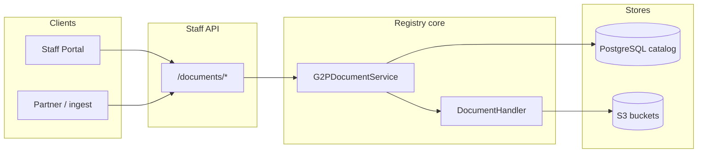
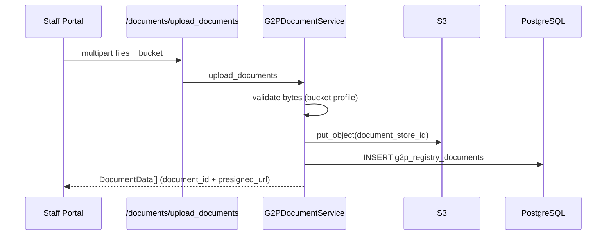

# Document Storage

Binary files (identity proofs, certificates, photos, templates, import payloads) are stored in **S3**. PostgreSQL holds a catalog row per object. Callers attach catalog ids to change requests, intake submissions, and live records; they never send file bytes on those APIs.

How those catalog ids are bound to a section, and when they become live, is Document attachments. Staff usage is Documents.


Application code never talks to S3 directly. It uses [`DocumentHandler`](https://github.com/OpenG2P/registry-platform/blob/develop/core/openg2p-registry-core/src/openg2p_registry_core/helpers/document/document_handlers.py) from [`get_document_handler()`](https://github.com/OpenG2P/registry-platform/blob/develop/core/openg2p-registry-core/src/openg2p_registry_core/helpers/document/document_factory.py).


### Design principles

<table><thead><tr><th width="192">Principle</th><th>Description</th></tr></thead><tbody><tr><td>Catalog-centric</td><td>Every stored object has one row in <code>g2p_registry_documents</code>. Other tables reference <code>document_id</code> only.</td></tr><tr><td>Upload is not attach</td><td><code>POST /documents/upload_documents</code> returns <code>{ document_id, … }</code>. Change requests and intake saves send that id, not bytes.</td></tr><tr><td>Bucket-aware</td><td>Logical buckets (<code>documents</code>, <code>templates</code>, <code>data_import_files</code>, <code>export-files</code>, <code>default</code>) map 1:1 to S3 buckets. Validation is per bucket.</td></tr><tr><td>Presigned reads</td><td>Callers never get long-lived storage credentials. Reads use short-lived presigned GET URLs (default one hour).</td></tr></tbody></table>

### Architecture

| Component                                                                                                                                                                                  | Role                                                                      |
| ------------------------------------------------------------------------------------------------------------------------------------------------------------------------------------------ | ------------------------------------------------------------------------- |
| [`G2PDocumentController`](https://github.com/OpenG2P/registry-platform/blob/develop/apis/openg2p-registry-staff-api/src/openg2p_registry_staff_api/controllers/g2p_document_controller.py) | Staff API under `/documents`.                                             |
| [`G2PDocumentService`](https://github.com/OpenG2P/registry-platform/blob/develop/core/openg2p-registry-core/src/openg2p_registry_core/services/g2p_document_service.py)                    | Catalog CRUD, junction queries, S3 via the handler.                       |
| `DocumentHandler`                                                                                                                                                                          | `upload`, `download`, `delete`, `get_url`.                                |
| Staff Portal                                                                                                                                                                               | `file` widgets collect bytes; save uploads first, then sends catalog ids. |

### S3

`DocumentHandler.upload` puts an object and returns `document_store_id` (opaque hex UUID, used as the object key). The service then inserts the catalog row.

Reads go through `get_url` (presigned GET). Optional read-only credentials can sign those URLs so write keys stay off download links.

#### Logical buckets

Names are fixed by [`DocumentBucket`](https://github.com/OpenG2P/registry-platform/blob/develop/core/openg2p-registry-core/src/openg2p_registry_core/models/enum.py). The S3 bucket name is the enum value. They are not configurable.

| Bucket              | Typical contents                                  | Upload validation                             |
| ------------------- | ------------------------------------------------- | --------------------------------------------- |
| `documents`         | Section files, supporting evidence, record images | MIME, extension, size                         |
| `default`           | Fallback when no bucket is given                  | Same as `documents`                           |
| `templates`         | Ingest / outgest Jinja templates                  | Text profile (for example `.json.j2`)         |
| `data_import_files` | Bulk import payloads                              | None at upload; import pipeline owns format   |
| `export-files`      | Register export downloads                         | Handler only; export worker writes the object |

#### Identifiers

| Identifier          | Scope      | Description                                                  |
| ------------------- | ---------- | ------------------------------------------------------------ |
| `document_store_id` | S3         | Object key. Unique in the catalog.                           |
| `document_id`       | PostgreSQL | Catalog primary key. Used on all junctions and API payloads. |

### Catalog: `g2p_registry_documents`

| Column              | Description                     |
| ------------------- | ------------------------------- |
| `document_id`       | Primary key (UUID string)       |
| `document_store_id` | S3 object key (unique, indexed) |
| `bucket`            | `DocumentBucket` value          |
| `source_filename`   | Original client filename        |
| `created_by`        | Uploader                        |
| `created_at`        | Upload time                     |

The catalog does **not** store a display label. Labels live on junction and history rows. See Document attachments.

### Upload flow

1. Client posts one or more files and a `bucket` (default `documents`).
2. Service validates against the bucket profile, puts the object, inserts the catalog row.
3. Response is `DocumentData`: catalog fields plus a presigned URL.


`delete_documents` is a hard cascade: S3 object, then every junction and history row for those ids, then the catalog row. Treat it as irreversible.


### Staff API

Prefix `/documents` on Staff API.

| Method | Path                                      | Purpose                                            | Typical permission      |
| ------ | ----------------------------------------- | -------------------------------------------------- | ----------------------- |
| `POST` | `/documents/upload_documents`             | Multipart upload; returns catalog + presigned URLs | Authenticated uploader  |
| `POST` | `/documents/get_documents`                | Catalog rows by `document_ids`                     | `register:view`         |
| `POST` | `/documents/delete_documents`             | Hard-cascade delete                                | Authenticated           |
| `POST` | `/documents/get_change_request_documents` | Header attachments on a change request             | `changeRequest:view`    |
| `POST` | `/documents/get_intake_form_documents`    | Attachments on an intake submission                | `intakeSubmission:view` |
| `POST` | `/documents/get_section_documents`        | Live attachments on a register record              | `register:view`         |

Upload accepts form field `bucket` and one or more files. Entity-scoped GETs join the catalog to the relevant junction and add `section_id` / `label`.

Record images use the same upload path, then set `record_image_document_id` (or equivalent) on the register payload. Live record APIs batch-resolve those ids to presigned URLs.

### Validation

Applied **before** the object is stored. Profiles live in [`file_validation_profiles.py`](https://github.com/OpenG2P/registry-platform/blob/develop/core/openg2p-registry-core/src/openg2p_registry_core/helpers/file_validation_profiles.py).

| Bucket                  | Default rules (configurable)                                                                              |
| ----------------------- | --------------------------------------------------------------------------------------------------------- |
| `documents` / `default` | `png`, `jpg`, `jpeg`, `webp`, `pdf`; matching MIME types; max 10 MiB, with lower per-MIME caps for images |
| `templates`             | Text / JSON MIME; template extensions; max 1 MiB                                                          |
| `data_import_files`     | No upload-time profile                                                                                    |

Separate image profiles exist for register icons and dashboard imagery (MIME, pixel bounds, byte limits). Those are not the `documents` bucket.

### Configuration

Env prefix `registry_core_`.

| Setting                              | Purpose                                             |
| ------------------------------------ | --------------------------------------------------- |
| `document_storage_backend`           | Which `DocumentHandler` implementation to construct |
| S3 endpoint, access key, secret, TLS | Connectivity for the handler                        |
| Optional read access key / secret    | Signs presigned GET; falls back to the write key    |
| `document_upload_allowed_extensions` | `documents` / `default` extensions                  |
| `document_upload_allowed_mime_types` | MIME allow-list                                     |
| `document_upload_max_bytes`          | Absolute max size                                   |
| `document_upload_max_bytes_by_mime`  | Optional JSON map of per-MIME caps                  |
| `template_upload_*`                  | Same shape for the `templates` bucket               |

S3 bucket names always equal `DocumentBucket` values.
