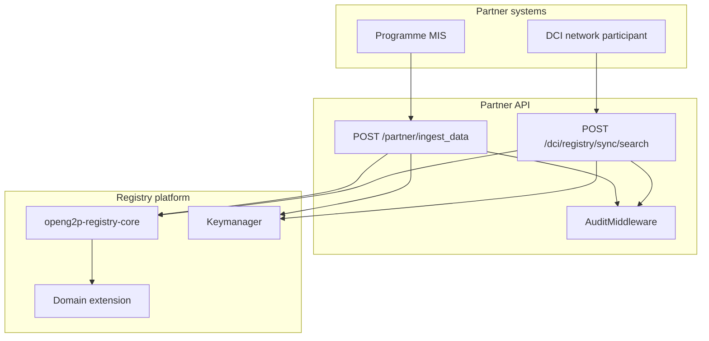
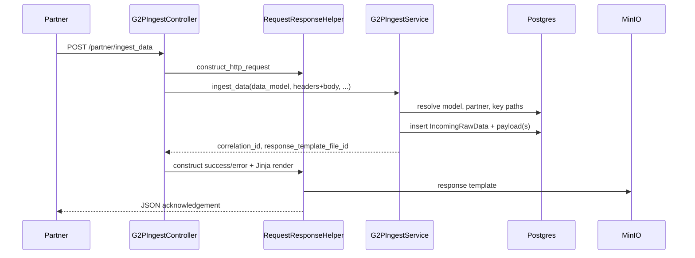
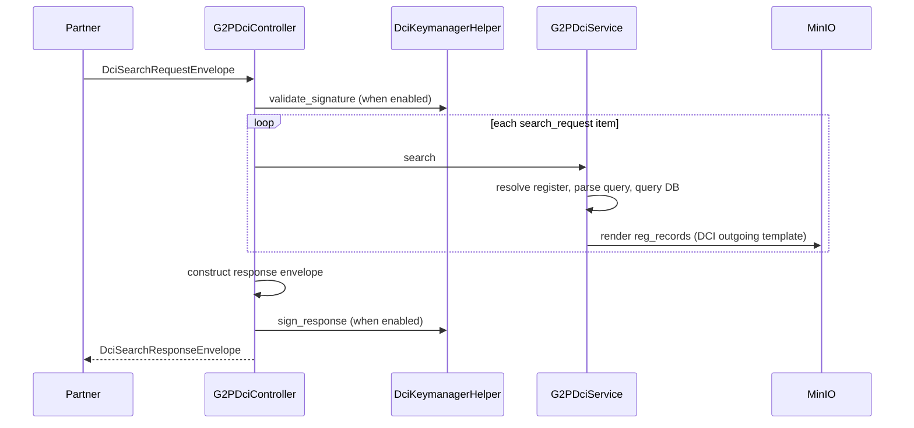

# Partner APIs

## Overview

### Purpose and scope

The Partner API is the boundary between external data providers / programme systems and an OpenG2P Registry deployment. Partners do not call staff-portal endpoints or mutate register tables directly. Instead they:

1. **Ingest** structured payloads that enter the async ingestion pipeline (classification → transformation → intake or change request → approval).
2. **Search** register records synchronously via a fixed standard such as DCI-compliant envelope, receiving JSON-LD shaped outbound payloads.

The service is intentionally thin: controllers validate and adapt wire formats, then delegate to **core** services (`G2PIngestControllerService`, `G2PRegisterService`) and **extension** register models loaded at runtime.

### Position in the platform



Compared to the **Staff Portal API**, the Partner API serves external callers with signature-based auth (not Keycloak JWT), exposes ingest and DCI search only (not full CRUD), returns envelope-level success/error inside HTTP 200 for business failures, and relies on controllers to set `request.state.audit_actor` for audit identity.

See Platform and extension model for how the extension package is loaded into API images at deploy time.

### Service components and dependencies

Boot sequence (`main.py` → `app.py`) initialises core, extensions, ping, ingestion, and DCI modules:

<table><thead><tr><th width="256">Component</th><th>Responsibility</th></tr></thead><tbody><tr><td><code>G2PIngestController</code></td><td><code>POST /partner/ingest_data</code></td></tr><tr><td><code>RequestResponseHelper</code> (ingestion)</td><td>Parses HTTP body; builds G2P responses; renders MinIO Jinja templates</td></tr><tr><td><code>G2PIngestControllerService</code> / <code>G2PIngestService</code></td><td>Persists raw data; returns <code>correlation_id</code></td></tr><tr><td><code>G2PDciController</code></td><td><code>POST /dci/registry/sync/search</code></td></tr><tr><td><code>G2PDciService</code></td><td>Register search + outbound template rendering</td></tr><tr><td><code>DciQueryHelper</code></td><td>Parses <code>expression</code> and <code>idtype-value</code> queries</td></tr><tr><td><code>DciKeymanagerHelper</code></td><td>JWT verify/sign for DCI envelopes</td></tr><tr><td><code>AuditMiddleware</code></td><td>Optional CloudEvents to Audit Manager</td></tr><tr><td><code>PingInitializer</code></td><td><code>GET /ping</code> health probe</td></tr></tbody></table>

### API surface

<table><thead><tr><th width="107">Method</th><th width="265">Path</th><th>Summary</th></tr></thead><tbody><tr><td><code>POST</code></td><td><code>/partner/ingest_data</code></td><td>Accept partner payload into ingestion pipeline</td></tr><tr><td><code>POST</code></td><td><code>/dci/registry/sync/search</code></td><td>Synchronous DCI search</td></tr><tr><td><code>GET</code></td><td><code>/ping</code></td><td>Liveness / readiness probe</td></tr></tbody></table>


OpenAPI is served at `/docs` and `/openapi.json` when the service is running.


### Design principles

1. **Format-agnostic ingest** - Raw envelopes are stored; data-model metadata (JSONPath key paths, semantic patterns, Jinja) drives downstream interpretation.
2. **Synchronous search, asynchronous ingest** - Search returns records in the same response; ingest returns `correlation_id` while workers apply changes later.
3. **Signature-based trust** - Partner identity via Keymanager JWT over payload or DCI envelope content, not staff sessions.
4. **Template-driven wire formats** - Ingest acknowledgements and DCI `reg_records` are rendered from MinIO Jinja templates.
5. **Fail in the envelope** - Business errors appear inside the protocol body; HTTP status often stays `200` (see Error handling).

### Audit integration

`AuditMiddleware` (registered in `main.py`) emits one CloudEvent per audited call to OpenG2P Audit Manager when both `REGISTRY_PARTNER_API_AUDIT_ENABLED=true` and `REGISTRY_PARTNER_API_AUDIT_MANAGER_URL` are set. Emission is fire-and-forget and never blocks the response.

Because partner-api has no JWT auth middleware, audit rows need controller-supplied identity via `request.state.audit_actor`. Without it, successful anonymous calls are skipped; rejected calls are still audited when `audit_anonymous_failures=true` (default). Health probes (`/ping`, `/docs`, `/openapi.json`) are excluded.

Both ingest and DCI controllers currently return HTTP 200 for business failures inside the envelope - set `request.state.audit_outcome` on error paths if Audit Manager should record those as failures rather than successes.

### Deployment notes

The partner-api image installs the domain extension (`openg2p_registry_extensions`) alongside core. Helm values configure database URLs, MinIO buckets, Keymanager endpoints, and audit URLs per environment. The service shares the registry database with workers; ingest acceptance only requires raw-data tables to be writable — pipeline workers must be running for records to reach register tables.

For local development, copy `.env.example` from the service repo and point `REGISTRY_PARTNER_API_DB_*` and MinIO settings at your stack. Signature verification is disabled in source until Keymanager is available — do not deploy to production without re-enabling (see Authentication and signature verification).

***

## Ingestion endpoint

Endpoint reference: [`POST /partner/ingest_data`](../developer-zone/api-documentation/partner-api.md#post-partner-ingest_data)

### Role

`POST /partner/ingest_data` is the front door for partner-submitted registry data. A successful call **does not** write register rows. It identifies the data model and partner, extracts signature material, persists raw ingest rows, optionally pre-classifies when query params are set, and returns an acknowledgement with **`correlation_id`**.

Downstream processing: Ingestion and outgestion.

### Request handling flow



### Query parameters

| Parameter                        | Purpose                                                                                                                   |
| -------------------------------- | ------------------------------------------------------------------------------------------------------------------------- |
| `data_model`                     | Target data model mnemonic. When omitted, core auto-detects via configured patterns.                                      |
| `register_id` + `intake_form_id` | When **both** supplied, skip classification by writing `incoming_classified_data` with `transformation_status = PENDING`. |

Use the bypass when the partner channel already knows the target register and intake form (e.g. a dedicated farmer feed with fixed routing).

### Payload routing (metadata-driven)

`RequestResponseHelper` wraps the HTTP request as `{ "headers": {...}, "body": {...} }`. Per data model, `incoming_model_key_paths` JSONPath columns locate:

* Partner / sender identity (`key_path_for_sender`)
* Signature and signed payload (`key_path_for_signature`, `key_path_for_signature_payload`)
* Message id (`key_path_for_message_id`)
* Batch list elements (`key_path_for_list_elements` when `is_list = true`)

Missing required path values → `INVALID_REQUEST` before any DB write. Unknown partner mnemonic in master data → `PARTNER_NOT_REGISTERED`.

### Data model and persistence

Resolution: explicit `data_model` query param (upper-cased) → else pattern match across all models → else `DATA_MODEL_NOT_FOUND`.

Each ingest item creates `incoming_raw_data` + `incoming_raw_data_payload`. All items in one call share one **`correlation_id`**; each gets its own **`ingest_id`**. Batch ingest splits list elements at the configured JSONPath into separate rows.

#### Asynchronous pipeline hand-off

The ingest handler does not call `celery_app.send_task`. After raw rows are committed, Celery Beat producers poll PostgreSQL status columns and dispatch workers. Beat producers and workers must be running or payloads stay at `PENDING`. See Ingestion and outgestion for the full pipeline.

| Stage          | Polled status                                              | Worker                                                                |
| -------------- | ---------------------------------------------------------- | --------------------------------------------------------------------- |
| Classification | `incoming_raw_data.classification_status = PENDING`        | `ingest_data_classification_worker`                                   |
| Transformation | `incoming_classified_data.transformation_status = PENDING` | `ingest_data_transformation_worker`                                   |
| Ingestion      | `incoming_classified_data.ingestion_status = PENDING`      | `ingest_data_worker` (ADD) or `change_request_ingest_worker` (UPDATE) |

ADD creates a finalized intake submission; register rows are written only after approval and `intake_form_register_ingest_worker`. UPDATE creates a change request and follows the normal approval flow.

HTTP 200 with `correlation_id` means acceptance into the pipeline, not a register write. Track `correlation_id`, per-item `ingest_id`, and later `intake_form_submission_id` (ADD) or `change_request_id` (UPDATE).

### Response rendering

Success and error responses serialise to G2P objects, then render through the data model's MinIO Jinja template (`response_template_file_id`). Programmes can keep legacy acknowledgement shapes without changing internal schemas.

***

## DCI search endpoint

Endpoint reference: [`POST /dci/registry/sync/search`](../developer-zone/api-documentation/1.1.0/partner-api.md#post-dci-registry-sync-search).

### Role

**Synchronous, read-only** register lookup for DCI participants. The partner sends a signed envelope with one or more search items; the registry responds with a signed envelope listing per-item statuses and, on success, rendered `reg_records`.

### Envelope model

| Part        | Content                                                                          |
| ----------- | -------------------------------------------------------------------------------- |
| `signature` | Keymanager JWT over `{header, message}`                                          |
| `header`    | Routing metadata: `message_id`, `sender_id`, `receiver_id`, `action`, timestamps |
| `message`   | `DciSearchRequest` (in) or `DciSearchResponse` (out)                             |

Response headers swap sender/receiver, echo request `message_id`, and set aggregate `status`, `total_count`, `completed_count`.

### Request handling flow



### Batch semantics

`message.search_request[]` items carry `reference_id`, `search_criteria`, and optional `locale`. Items are processed sequentially. Partial success uses per-item `status` (`succ` / `rjct`), not HTTP status.

### Register resolution

`search_criteria.reg_type` = deployer **`register_mnemonic`** (`g2p_register_definitions.register_mnemonic`), e.g. `Farmer`, `Household` — not necessarily a DCI URI unless configured that way.

Steps: resolve `register_id` → load `G2PRegister{Mnemonic}` from extension → load DCI outgoing template (`outgoing_templates` where data model mnemonic is `"DCI"`). `reg_record_type` (e.g. `spdci-extensions-dci:Farmer`) shapes outbound JSON-LD and is echoed in results; it does **not** select the register.

### Query types

**`idtype-value`** — Requires `id_type` and `id_value` in query value. Delegates to `G2PRegisterService.deep_search_in_a_register` (full-text / configured search vectors).

**`expression`** — Mongo-style filters translated to SQLAlchemy on the register model:

```json
{
  "expression": {
    "query": {
      "functional_record_id": { "$eq": "FR-001" },
      "birth_date": { "$gte": "1990-01-01" }
    }
  }
}
```

Shorthand `{"field": "value"}` ≡ `{"$eq": "value"}`. Allowed fields: `Settings.dci_expression_allowed_fields` (defaults include names, `foundational_id`, demographics, `search_text`, …). Operators: `$eq`, `$ne`, `$gt`, `$gte`, `$lt`, `$lte`, `$in`, `$nin`, `$contains`, `$startsWith`, `$endsWith`. Legacy: lone `search_text.$eq` → plain full-text search.

Invalid fields/operators → `rjct.search_criteria.invalid`.

### Pagination, sorting, rendering

Defaults: page 1, size 10. Only the **first** sort item applies (`desc` → `-column`). Response items include `pagination.total_count` when available.

Each hit is rendered through the register's DCI outgoing Jinja template into `data.reg_records` (opaque JSON-LD). Success items use `status = succ`, ISO timestamp, and echoed `reg_type` / `reg_record_type`.

### Consent, encryption, item statuses

`consent` and `authorize` blocks are accepted (permissive JSON-LD schema) but **do not gate search** today — add policy in gateway or extension if required. Cleartext messages only (`is_msg_encrypted = false`); `DciEncryptedMessage` is not supported on this path.

| Status         | Meaning on this endpoint                                      |
| -------------- | ------------------------------------------------------------- |
| `succ`         | Results in `data.reg_records`                                 |
| `rjct`         | Rejected — see `status_reason_code` / `status_reason_message` |
| `rcvd`, `pdng` | Not emitted on sync search today                              |

***

## Authentication and signature verification

The Partner API does **not** use Keycloak or staff JWT middleware. Trust is **Keymanager-backed JWT** over agreed payload bytes.

### Keymanager configuration

Primary settings in `config.py` (env prefix `REGISTRY_PARTNER_API_KEYMANAGER_*`):

* `keymanager_api_base_url`, `keymanager_api_timeout`, `keymanager_ssl_verify`
* OAuth to Keymanager itself: `keymanager_auth_enabled`, `keymanager_auth_url`, client id/secret
* Signing defaults: `keymanager_sign_app_id` (e.g. `REGISTRY`), `keymanager_sign_ref_id`

Each `incoming_partners` row carries **`keymanager_reference_id`** for ingest verification key selection.

### Ingestion signatures

Not HTTP `Authorization` headers. JSONPath extracts signature string and signed payload object from the partner body. When enabled, `G2PIngestService._validate_signature` calls `KeymanagerCryptoHelper.verify_jwt` with `km_ref_id = partner.keymanager_reference_id`. Mismatch → `REQUEST_VALIDATION_ERROR`.

Partners must sign the exact object the registry reconstructs from key paths.

***

## Error handling

Two parallel error models — ingest (G2P envelope) and DCI (search envelope). Controllers catch exceptions and return protocol bodies instead of raising to FastAPI.

### HTTP vs envelope status

| Endpoint                    | Business error HTTP | Error location                                      |
| --------------------------- | ------------------- | --------------------------------------------------- |
| `/partner/ingest_data`      | Usually `200`       | `response_header.response_status = ERROR`           |
| `/dci/registry/sync/search` | Usually `200`       | `header.status = rjct`; may empty `search_response` |


**HTTP 422** applies when Pydantic rejects the body before the controller (`HTTPValidationError` with `detail[]`). Unhandled controller exceptions map to code `"500"` in envelopes.


### Ingestion errors

`RequestResponseHelper.construct_error_response`:

* `G2PRegistryException` → exception `code` / `message`
* Other → `"500"` + `str(error)`

Populates `response_status = ERROR`, null `response_payload`, then renders through the data-model template when `response_template_file_id` is known.

Common codes: `DATA_MODEL_NOT_FOUND`, `PARTNER_NOT_REGISTERED`, `INVALID_REQUEST` (missing JSONPath / config), `REQUEST_VALIDATION_ERROR` (signature).

### DCI search errors

`DciRequestResponseHelper.construct_error_response` → envelope with `header.status = rjct`, reason fields from exception, empty `search_response`, new `correlation_id`. Query helper raises DCI reason codes (e.g. `rjct.search_criteria.invalid`). Controller-level catch fails the **whole** batch unless per-item handling is added later.

### Client and ops guidance

1. **Parse the envelope** — do not rely on HTTP status alone.
2. **Treat 422 as shape errors** — fix and retry.
3. **Track `correlation_id`** (ingest) and `reference_id` (DCI items) for support.
4. **Monitor body fields or Audit Manager** — wrapped 200 errors won't trip naive HTTP failure alerts.
5. Controllers may set `request.state.audit_outcome` on error paths for accurate audit outcomes.

***

## Related

### OpenAPI Docs


[partner-api.md](../developer-zone/api-documentation/partner-api.md)


### Registry platform documentation


[ingestion-pipeline.md](ingestion-pipeline.md)



[outgestion-pipeline.md](outgestion-pipeline.md)



[platform-and-extensions-model.md](../developer-zone/building-a-registry/concepts/registry-extensions/platform-and-extensions-model.md)


Link to some [sample metadata](https://github.com/OpenG2P/national-social-registry/blob/develop/nsr-extension/src/openg2p_registry_nsr_extension/meta_data/registry-inbound-message-rules/incoming_model_register_semantic_patterns.sql) for a look at some key paths and semantic patterns

### Source code

* `openg2p-registry-partner-api` - controllers, DCI helpers, audit middleware
* `openg2p-registry-core` - `G2PIngestService`, register search, templates
* Domain extensions - register models, ingestion metadata SQL, outbound Jinja templates
