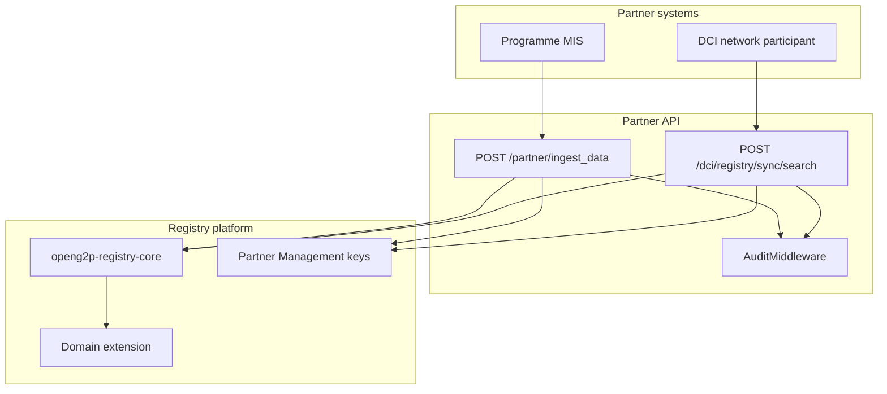
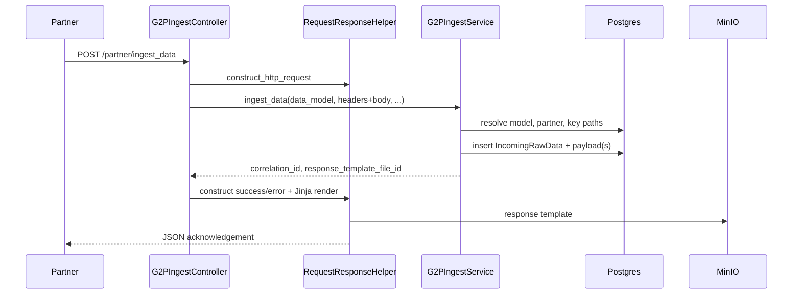
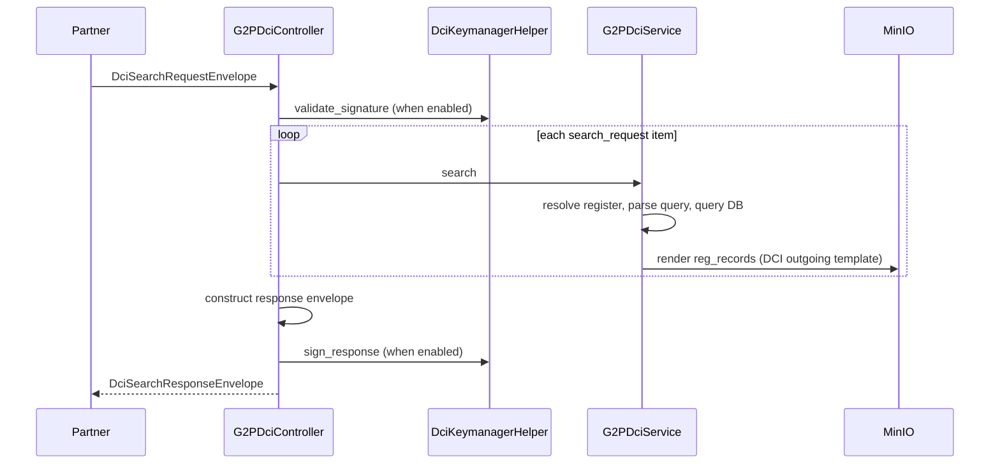

# Partner APIs


**New home: GitLab.** **`national-social-registry`** is now developed at [github.com/OpenG2P/national-social-registry](https://github.com/OpenG2P/national-social-registry).


## Overview

### Purpose and scope

The Partner API is the boundary between external data providers / programme systems and an OpenG2P Registry deployment. Partners do not call staff-portal endpoints or mutate register tables directly. Instead they:

1. **Ingest** structured payloads that enter the async ingestion pipeline (classification → transformation → intake or change request → approval).
2. **Search** register records synchronously via a fixed standard such as DCI-compliant envelope, receiving JSON-LD shaped outbound payloads.

The service is intentionally thin: controllers validate and adapt wire formats, then delegate to **core** services (`G2PIngestControllerService`, `G2PRegisterService`) and **extension** register models loaded at runtime.

### Position in the platform


```mermaid
flowchart TB
    subgraph partners [Partner systems]
        P1[Programme MIS]
        P2[DCI network participant]
    end

    subgraph partner_api [Partner API]
        ING["POST /partner/ingest_data"]
        DCI["POST /dci/registry/sync/search"]
        AUD[AuditMiddleware]
    end

    subgraph platform [Registry platform]
        CORE[openg2p-registry-core]
        EXT[Domain extension]
        KM[Partner Management keys]
    end

    P1 --> ING
    P2 --> DCI
    ING --> AUD
    DCI --> AUD
    ING --> CORE
    DCI --> CORE
    CORE --> EXT
    ING --> KM
    DCI --> KM
```

Compared to the **Staff Portal API**, the Partner API serves external callers with signature-based auth (not Keycloak JWT), exposes ingest, activity submission, the data scope catalogue and DCI search only (not full CRUD), returns envelope-level success/error inside HTTP 200 for business failures, and relies on controllers to set `request.state.audit_actor` for audit identity.

See Platform and extension model for how the extension package is loaded into API images at deploy time.

### Service components and dependencies

Boot sequence (`main.py` → `app.py`) initialises core, extensions, ping, ingestion, and DCI modules:

<table><thead><tr><th width="256">Component</th><th>Responsibility</th></tr></thead><tbody><tr><td><code>G2PIngestController</code></td><td><code>POST /partner/ingest_data</code></td></tr><tr><td><code>RequestResponseHelper</code> (ingestion)</td><td>Parses HTTP body; builds G2P responses; renders MinIO Jinja templates</td></tr><tr><td><code>G2PIngestControllerService</code> / <code>G2PIngestService</code></td><td>Persists raw data; returns <code>correlation_id</code></td></tr><tr><td><code>G2PDciController</code></td><td><code>POST /dci/registry/sync/search</code></td></tr><tr><td><code>G2PDciService</code></td><td>Register search + outbound template rendering</td></tr><tr><td><code>DciQueryHelper</code></td><td>Parses <code>expression</code> and <code>idtype-value</code> queries</td></tr><tr><td><code>DciKeymanagerHelper</code></td><td>Detached JWS verify/sign for every partner call (DCI, ingest, activities, data scopes)</td></tr><tr><td><code>AuditMiddleware</code></td><td>Optional CloudEvents to Audit Manager</td></tr><tr><td><code>PingInitializer</code></td><td><code>GET /ping</code> health probe</td></tr></tbody></table>

### API surface

<table><thead><tr><th width="107">Method</th><th width="265">Path</th><th>Summary</th></tr></thead><tbody><tr><td><code>POST</code></td><td><code>/partner/ingest_data</code></td><td>Accept partner payload into ingestion pipeline</td></tr><tr><td><code>POST</code></td><td><code>/dci/registry/sync/search</code></td><td>Synchronous DCI search</td></tr><tr><td><code>POST</code></td><td><code>/partner/activity/append_activities</code>, <code>/partner/activity/correct_activities</code></td><td>Partner activity submission and correction</td></tr><tr><td><code>POST</code></td><td><code>/partner/data_scopes</code></td><td>Data scope catalogue (signed); <code>GET</code> is off by default</td></tr><tr><td><code>GET</code></td><td><code>/ping</code></td><td>Liveness / readiness probe</td></tr></tbody></table>


OpenAPI is served at `/docs` and `/openapi.json` when the service is running.


### Design principles

1. **Format-agnostic ingest** - Raw envelopes are stored; data-model metadata (JSONPath key paths, semantic patterns, Jinja) drives downstream interpretation.
2. **Synchronous search, asynchronous ingest** - Search returns records in the same response; ingest returns `correlation_id` while workers apply changes later.
3. **Signature-based trust** - Every partner call carries a detached JWS verified against the partner's Partner Management key; no staff sessions.
4. **Template-driven wire formats** - Ingest acknowledgements and DCI `reg_records` are rendered from MinIO Jinja templates.
5. **Fail in the envelope** - Business errors appear inside the protocol body; HTTP status often stays `200` (see Error handling).

### Audit integration

`AuditMiddleware` (registered in `main.py`) emits one CloudEvent per audited call to OpenG2P Audit Manager when both `REGISTRY_PARTNER_API_AUDIT_ENABLED=true` and `REGISTRY_PARTNER_API_AUDIT_MANAGER_URL` are set. Emission is fire-and-forget and never blocks the response.

Because partner-api has no JWT auth middleware, audit rows need controller-supplied identity via `request.state.audit_actor`. Without it, successful anonymous calls are skipped; rejected calls are still audited when `audit_anonymous_failures=true` (default). Health probes (`/ping`, `/docs`, `/openapi.json`) are excluded.

Both ingest and DCI controllers currently return HTTP 200 for business failures inside the envelope - set `request.state.audit_outcome` on error paths if Audit Manager should record those as failures rather than successes.

### Deployment notes

The partner-api image installs the domain extension (`openg2p_registry_extensions`) alongside core. Helm values configure database URLs, MinIO buckets, Keymanager endpoints, and audit URLs per environment. The service shares the registry database with workers; ingest acceptance only requires raw-data tables to be writable — pipeline workers must be running for records to reach register tables.

For local development, copy `.env.example` from the service repo and point `REGISTRY_PARTNER_API_DB_*` and MinIO settings at your stack. Every partner call is signed and verified against the partner's Partner Management key, gated by `REGISTRY_PARTNER_API_SIGNATURE_VALIDATION_ENABLED` (Helm `global.partnerSignatureValidationEnabled`, **on** by default; turn it off only for testing). See [Authentication and signature verification](#authentication-and-signature-verification).

***

## Ingestion endpoint

Endpoint reference: [`POST /partner/ingest_data`](../developer-zone/api-documentation/partner-api.md#post-partner-ingest_data)

### Role

`POST /partner/ingest_data` is the front door for partner-submitted registry data. A successful call **does not** write register rows. It identifies the data model and the (active) partner, verifies the partner's signature over the configured signature payload, persists raw ingest rows, optionally pre-classifies when query params are set, and returns an acknowledgement with **`correlation_id`**.

Downstream processing: Ingestion and outgestion.

### Request handling flow


```mermaid
sequenceDiagram
    participant Partner
    participant Controller as G2PIngestController
    participant RRH as RequestResponseHelper
    participant Core as G2PIngestService
    participant DB as Postgres
    participant MinIO

    Partner->>Controller: POST /partner/ingest_data
    Controller->>RRH: construct_http_request
    Controller->>Core: ingest_data(data_model, headers+body, ...)
    Core->>DB: resolve model, partner, key paths
    Core->>DB: insert IncomingRawData + payload(s)
    Core-->>Controller: correlation_id, response_template_file_id
    Controller->>RRH: construct success/error + Jinja render
    RRH->>MinIO: response template
    RRH-->>Partner: JSON acknowledgement
```

### Query parameters

| Parameter                        | Purpose                                                                                                                   |
| -------------------------------- | ------------------------------------------------------------------------------------------------------------------------- |
| `data_model`                     | Target data model mnemonic. When omitted, core auto-detects via configured patterns.                                      |
| `register_id` + `intake_form_id` | When **both** supplied, skip classification by writing `incoming_classified_data` with `transformation_status = PENDING`. |

Use the bypass when the partner channel already knows the target register and intake form (e.g. a dedicated farmer feed with fixed routing).

### Payload routing (metadata-driven)

`RequestResponseHelper` wraps the HTTP request as `{ "headers": {...}, "body": {...} }`. Per data model, `incoming_model_key_paths` JSONPath columns locate:

* Partner / sender identity (`key_path_for_sender`)
* Signature and signed payload (`key_path_for_signature`, `key_path_for_signature_payload`)
* Message id (`key_path_for_message_id`)
* Batch list elements (`key_path_for_list_elements` when `is_list = true`)

Missing required path values → `INVALID_REQUEST` before any DB write. Unknown partner mnemonic in master data → `PARTNER_NOT_REGISTERED`.

### Data model and persistence

Resolution: explicit `data_model` query param (upper-cased) → else pattern match across all models → else `DATA_MODEL_NOT_FOUND`.

Each ingest item creates `incoming_raw_data` + `incoming_raw_data_payload`. All items in one call share one **`correlation_id`**; each gets its own **`ingest_id`**. Batch ingest splits list elements at the configured JSONPath into separate rows.

#### Asynchronous pipeline hand-off

The ingest handler does not call `celery_app.send_task`. After raw rows are committed, Celery Beat producers poll PostgreSQL status columns and dispatch workers. Beat producers and workers must be running or payloads stay at `PENDING`. See Ingestion and outgestion for the full pipeline.

| Stage          | Polled status                                              | Worker                                                                |
| -------------- | ---------------------------------------------------------- | --------------------------------------------------------------------- |
| Classification | `incoming_raw_data.classification_status = PENDING`        | `ingest_data_classification_worker`                                   |
| Transformation | `incoming_classified_data.transformation_status = PENDING` | `ingest_data_transformation_worker`                                   |
| Ingestion      | `incoming_classified_data.ingestion_status = PENDING`      | `ingest_data_worker` (ADD) or `change_request_ingest_worker` (UPDATE) |

ADD creates a finalized intake submission; register rows are written only after approval and `intake_form_register_ingest_worker`. UPDATE creates a change request and follows the normal approval flow.

HTTP 200 with `correlation_id` means acceptance into the pipeline, not a register write. Track `correlation_id`, per-item `ingest_id`, and later `intake_form_submission_id` (ADD) or `change_request_id` (UPDATE).

### Response rendering

Success and error responses serialise to G2P objects, then render through the data model's MinIO Jinja template (`response_template_file_id`). Programmes can keep legacy acknowledgement shapes without changing internal schemas.

***

## DCI search endpoint

Endpoint reference: [`POST /dci/registry/sync/search`](../developer-zone/api-documentation/partner-api.md).

### Role

**Synchronous, read-only** register lookup for DCI participants. The partner sends a signed envelope with one or more search items; the registry responds with a signed envelope listing per-item statuses and, on success, rendered `reg_records`.

### Envelope model

| Part        | Content                                                                          |
| ----------- | -------------------------------------------------------------------------------- |
| `signature` | Detached JWS over `{header, message}` (partner's PM key)                         |
| `header`    | Routing metadata: `message_id`, `sender_id`, `receiver_id`, `action`, timestamps |
| `message`   | `DciSearchRequest` (in) or `DciSearchResponse` (out)                             |

Response headers swap sender/receiver, echo request `message_id`, and set aggregate `status`, `total_count`, `completed_count`.

### Request handling flow


```mermaid
sequenceDiagram
    participant Partner
    participant Controller as G2PDciController
    participant KM as DciKeymanagerHelper
    participant Svc as G2PDciService
    participant MinIO

    Partner->>Controller: DciSearchRequestEnvelope
    Controller->>KM: validate_signature (when enabled)
    loop each search_request item
        Controller->>Svc: search
        Svc->>Svc: resolve register, parse query, query DB
        Svc->>MinIO: render reg_records (DCI outgoing template)
    end
    Controller->>Controller: construct response envelope
    Controller->>KM: sign_response (when enabled)
    Controller-->>Partner: DciSearchResponseEnvelope
```

### Batch semantics

`message.search_request[]` items carry `reference_id`, `search_criteria`, and optional `locale`. Items are processed sequentially. Partial success uses per-item `status` (`succ` / `rjct`), not HTTP status.

### Register resolution

`search_criteria.reg_type` = deployer **`register_mnemonic`** (`g2p_register_definitions.register_mnemonic`), e.g. `Farmer`, `Household` — not necessarily a DCI URI unless configured that way.

Steps: resolve `register_id` → load `G2PRegister{Mnemonic}` from extension → load DCI outgoing template (`outgoing_templates` where data model mnemonic is `"DCI"`). `reg_record_type` (e.g. `spdci-extensions-dci:Farmer`) shapes outbound JSON-LD and is echoed in results; it does **not** select the register.

### Query types

**`idtype-value`** — Requires `id_type` and `id_value` in query value. Delegates to `G2PRegisterService.deep_search_in_a_register` (full-text / configured search vectors).

**`expression`** — Mongo-style filters translated to SQLAlchemy on the register model:

```json
{
  "expression": {
    "query": {
      "functional_record_id": { "$eq": "FR-001" },
      "birth_date": { "$gte": "1990-01-01" }
    }
  }
}
```

Shorthand `{"field": "value"}` ≡ `{"$eq": "value"}`. Allowed fields: `Settings.dci_expression_allowed_fields` (defaults include names, `foundational_id`, demographics, `search_text`, …). Operators: `$eq`, `$ne`, `$gt`, `$gte`, `$lt`, `$lte`, `$in`, `$nin`, `$contains`, `$startsWith`, `$endsWith`. Legacy: lone `search_text.$eq` → plain full-text search.

Invalid fields/operators → `rjct.search_criteria.invalid`.

### Pagination, sorting, rendering

Defaults: page 1, size 10. Only the **first** sort item applies (`desc` → `-column`). Response items include `pagination.total_count` when available.

Each hit is rendered through the register's DCI outgoing Jinja template into `data.reg_records` (opaque JSON-LD). Success items use `status = succ`, ISO timestamp, and echoed `reg_type` / `reg_record_type`.

### Consent, encryption, item statuses

The `authorize` block carries the partner's **consent object** — a compact JWS at
`search_criteria.authorize.consent_jws`. When **consent enforcement is enabled**, it
**does gate search**: the partner-api forwards the JWS to the Consent Manager's
`/validate` (naming this registry as `data_controller`), checks that the consent's subject
is the person searched, and filters each record to the fields of the **effective data scopes** it
returns before rendering it (see [Data Scopes](data-scopes.md)); a non-permit decision or a subject mismatch rejects the request (fail-closed). Independently, the DCI envelope
`signature` is verified against the partner's
[**Partner Management**](../../../../platform/platform-services/partner-management/README.md)
key when signature validation is enabled. Both switches default **on** in the Helm
values; when one is turned off the blocks are accepted but not enforced (the bypass is
stamped into the response header `meta`).

The `consent` block remains a permissive JSON-LD descriptor and is not itself evaluated.

The partner-api holds **no** partner keys of its own: it fetches them from Partner
Management (`crypto_backend=partner-mgmt`), keyed by `PARTNER_<sender_id>` — the same
reference convention used across g2p-bridge and the rest of the platform. See
[Integration — consuming partner keys](../../../../platform/platform-services/partner-management/integration.md).

See [Consent-Aware data sharing](../features/consent-aware-data-sharing.md) for the
feature overview, and
[Registry integration (the PEP side)](../../../../consent-management/design/registry-integration.md)
for the full contract (embedding, signatures, keys, config).

Cleartext messages only (`is_msg_encrypted = false`); `DciEncryptedMessage` is not supported on this path.

| Status         | Meaning on this endpoint                                      |
| -------------- | ------------------------------------------------------------- |
| `succ`         | Results in `data.reg_records`                                 |
| `rjct`         | Rejected — see `status_reason_code` / `status_reason_message` |
| `rcvd`, `pdng` | Not emitted on sync search today                              |

***

## Authentication and signature verification

The Partner API does **not** use Keycloak or staff JWT middleware — trust is
**signature-based**. **Every partner API call that returns or accepts data must be
signed** with the partner's key; the registry verifies it against the key Partner
Management holds for that partner.

| Endpoint | What is signed | Verified |
| --- | --- | --- |
| `POST /dci/registry/sync/search` | `{header, message}` | yes |
| `POST /partner/ingest_data` | the object at the data model's `key_path_for_signature_payload` | yes |
| `POST /partner/activity/append_activities` | `{header, message}` | yes |
| `POST /partner/activity/correct_activities` | `{header, message}` | yes |
| `POST /partner/data_scopes` | `{header, message}` | yes |
| `GET /partner/data_scopes` | nothing (no body) | **off by default** — use the signed POST |
| `GET /ping`, `/docs`, `/openapi.json` | — | open (health and API description) |

One switch, `REGISTRY_PARTNER_API_SIGNATURE_VALIDATION_ENABLED` (Helm
`global.partnerSignatureValidationEnabled`, **on** by default), gates all of them.
Turn it off only for testing: unsigned messages are then accepted, a warning is
logged and the audit actor is recorded as unverified.

`GET /partner/data_scopes` is the one unsigned read. It is disabled unless
`REGISTRY_PARTNER_API_DATA_SCOPES_PUBLIC_GET_ENABLED=true` (Helm
`global.partnerDataScopesPublicGetEnabled`); when disabled it answers HTTP 403 and
points to the signed `POST /partner/data_scopes`.

### How the signature is checked

The `signature` is a **detached JWS** (`header..signature`). The registry **holds
no partner keys**: it fetches the caller's public key from
[**Partner Management**](../../../../platform/platform-services/partner-management/README.md)
and caches it in-process.

* **Key lookup** — the partner reference is derived from the sender as
  **`PARTNER_<SENDER_ID>`** (upper-cased, `-` → `_`). This is the same reference
  convention used by `openg2p-fastapi-partner-auth` and g2p-bridge, so a partner's
  key resolves identically across the platform. The partner must be onboarded in
  Partner Management under exactly that `partner_id`.
* **Backend** — `crypto_backend` selects the key source via
  `openg2p-fastapi-common`'s `build_crypto_helper`:
  `partner-mgmt` (**default**) fetches from PM; `keymanager` is the legacy Mosip
  service; `local` uses seeded keys for tests.
* **Caching / failure** — PM keys are cached per partner with a short TTL, refreshed
  on an unknown `kid` (rotation), and served stale within a bounded window if PM is
  briefly unreachable. A disabled/unknown partner returns no keys and the request is
  **rejected (fail-closed)**.
* **Verification input** — the raw JSON exactly as sent, never re-serialised
  pydantic models. The signing input is the payload serialised as compact JSON with
  sorted keys.
* **Rejection** — a missing signature gives `INVALID_REQUEST`, a signature that does
  not verify gives `REQUEST_VALIDATION_ERROR`, each in the endpoint's usual error
  envelope, and the call is audited as a failure. Once the signature verifies, the
  partner is recorded as the verified audit actor.

Settings (env prefix `REGISTRY_PARTNER_API_`):

| Setting | Notes |
| --- | --- |
| `CRYPTO_BACKEND` | `partner-mgmt` (default), `keymanager`, or `local` |
| `PARTNER_MGMT_API_URL` | PM partner-api, e.g. `http://commons-services-pm-partner-api` — **required** when the backend is `partner-mgmt` |
| `CRYPTO_ALLOWED_ALGORITHMS` | `EdDSA,ES256,RS256` (widened from fastapi-common's RS256-only) |
| `SIGNATURE_VALIDATION_ENABLED` | gates the check on every partner call; **on** by default — testing only when off |
| `DATA_SCOPES_PUBLIC_GET_ENABLED` | allows the unsigned `GET /partner/data_scopes`; **off** by default |

See [Integration — consuming partner keys](../../../../platform/platform-services/partner-management/integration.md)
for the fetch/caching contract.

### Ingestion signatures

Ingest envelopes are format-agnostic, so the data model's `incoming_model_key_paths`
row says where things are: `key_path_for_sender` (the partner), `key_path_for_signature`
(the detached JWS) and `key_path_for_signature_payload` (the signed object). The
registry:

1. resolves the sender to an **active** Partner Management partner (else
   `PARTNER_NOT_REGISTERED`);
2. verifies the JWS over the object at the signature payload key path with that
   partner's PM key (the PM `partner_id`, i.e. `PARTNER_<SENDER>`);
3. only then stores the raw data and records the partner as the verified audit actor.

The signature payload key path must select **one** JSON node (for example
`$.body.message`); a path that matches several nodes uses only the first. Partners
sign exactly that object.

The **staff** ingestion endpoint uses the same ingest service but is authenticated by
IAM (`intakeSubmission:edit`), so it does not ask for a partner signature; nor does the
file-import worker.

***

## Error handling

Two parallel error models — ingest (G2P envelope) and DCI (search envelope). Controllers catch exceptions and return protocol bodies instead of raising to FastAPI.

### HTTP vs envelope status

| Endpoint                    | Business error HTTP | Error location                                      |
| --------------------------- | ------------------- | --------------------------------------------------- |
| `/partner/ingest_data`      | Usually `200`       | `response_header.response_status = ERROR`           |
| `/dci/registry/sync/search` | Usually `200`       | `header.status = rjct`; may empty `search_response` |


**HTTP 422** applies when Pydantic rejects the body before the controller (`HTTPValidationError` with `detail[]`). Unhandled controller exceptions map to code `"500"` in envelopes.


### Ingestion errors

`RequestResponseHelper.construct_error_response`:

* `G2PRegistryException` → exception `code` / `message`
* Other → `"500"` + `str(error)`

Populates `response_status = ERROR`, null `response_payload`, then renders through the data-model template when `response_template_file_id` is known.

Common codes: `DATA_MODEL_NOT_FOUND`, `PARTNER_NOT_REGISTERED`, `INVALID_REQUEST` (missing JSONPath / config), `REQUEST_VALIDATION_ERROR` (signature).

### DCI search errors

`DciRequestResponseHelper.construct_error_response` → envelope with `header.status = rjct`, reason fields from exception, empty `search_response`, new `correlation_id`. Query helper raises DCI reason codes (e.g. `rjct.search_criteria.invalid`). Controller-level catch fails the **whole** batch unless per-item handling is added later.

### Client and ops guidance

1. **Parse the envelope** — do not rely on HTTP status alone.
2. **Treat 422 as shape errors** — fix and retry.
3. **Track `correlation_id`** (ingest) and `reference_id` (DCI items) for support.
4. **Monitor body fields or Audit Manager** — wrapped 200 errors won't trip naive HTTP failure alerts.
5. Controllers may set `request.state.audit_outcome` on error paths for accurate audit outcomes.

***

## Related

### OpenAPI Docs


[partner-api.md](../developer-zone/api-documentation/partner-api.md)


### Registry platform documentation


[ingestion-pipeline.md](ingestion-pipeline.md)



[outgestion-pipeline.md](outgestion-pipeline.md)



[Deployment and Extension](../deployment-and-extension/README.md)


Link to some [sample metadata](https://github.com/OpenG2P/national-social-registry/blob/develop/nsr-extension/src/openg2p_registry_nsr_extension/meta_data/registry-inbound-message-rules/incoming_model_register_semantic_patterns.sql) for a look at some key paths and semantic patterns

### Source code

* `openg2p-registry-partner-api` - controllers, DCI helpers, audit middleware
* `openg2p-registry-core` - `G2PIngestService`, register search, templates
* Domain extensions - register models, ingestion metadata SQL, outbound Jinja templates
