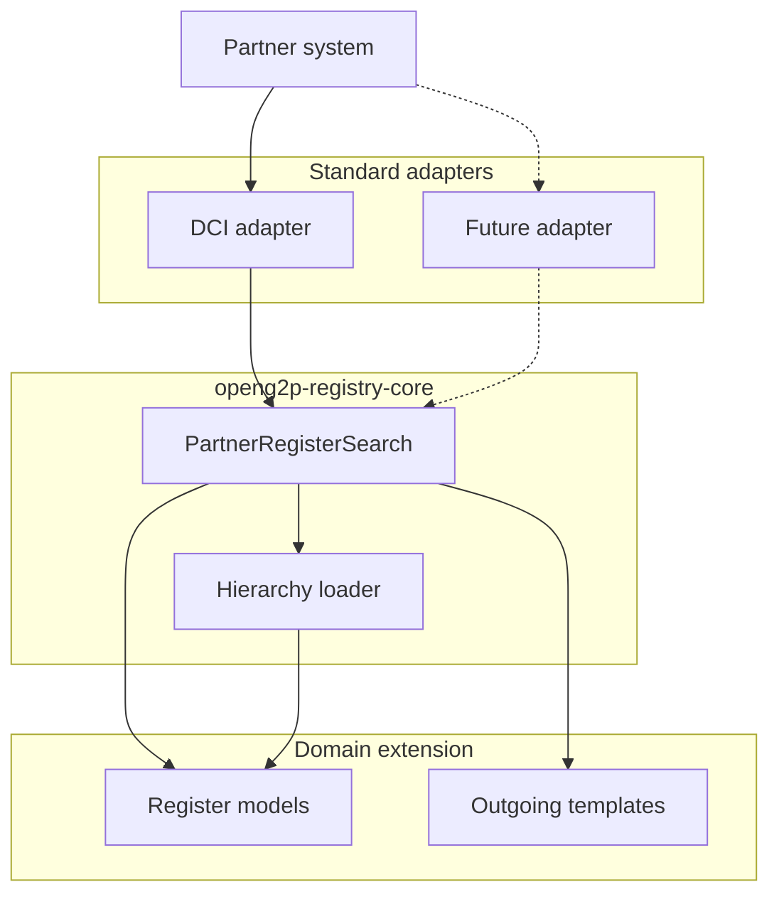

# Partner Register Search

Partner register search is a read path on the Partner API. Staff search is a
separate implementation and is not covered here.

The design keeps the database search independent of any one interoperability
standard.

| Piece | Lives in | Responsibility |
| --- | --- | --- |
| DCI controller, query decoders, envelopes, signing, consent calls | Partner API | Turn a DCI body into a core search, then build the DCI response. |
| `PartnerRegisterSearch` | `openg2p-registry-core` | Compile an allowlisted clause, page the root register, and load related rows in batches. |
| Register classes and Jinja templates | Domain extension and object storage | Supply the tables and the external payload shape. |

DCI is the only adapter shipped today. `POST /dci/sync/search` and
`POST /dci/async/search` both decode into the same core search. The difference
is delivery: the synchronous call returns the envelope, and the asynchronous
call publishes it to WebSub after an acknowledgement.

A future adapter would own its own routes and body format. It would still call
`PartnerRegisterSearch` and render through the outgoing template bound to its
data model. UNDP-style search is an example of that extension point. It is not
implemented.

## Pages


[Core register search](core-search.md)



[DCI partner search](dci-search.md)


The feature overview is in
[Partner Register Search](../../features/partner-register-search.md). WebSub hub
behaviour is in
[WebSub](../../../../../platform/platform-services/websub/README.md). Register
change fan-out, which shares outgoing topics but not this search path, is in
[Outgestion Pipeline](../outgestion-pipeline.md).
