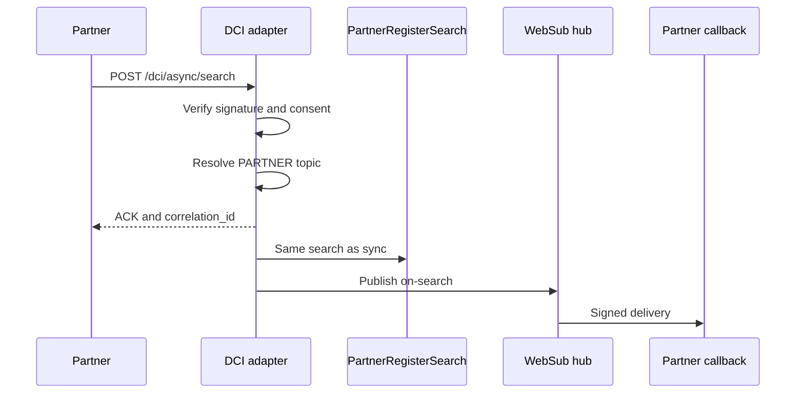

# DCI Partner Search

The DCI adapter is the Partner API implementation of
[partner register search](README.md). It accepts a DCI search envelope, decodes
each item into a core `RegisterSearch`, and returns a DCI response envelope.
SQL, allowlists, and related-register loading are specified in
[Core register search](core-search.md).

| Endpoint | Delivery |
| --- | --- |
| `POST /dci/sync/search` | Runs the search and returns the signed envelope. |
| `POST /dci/async/search` | Validates the request, returns an acknowledgement, then publishes an `on-search` envelope. |

Both endpoints use the same decoder, signature check, and consent check.


Older generated OpenAPI files use `/dci/registry/sync/search`. Current source
registers `/dci/sync/search` and `/dci/async/search`. Confirm the target
`/openapi.json` before integrating.


OpenAPI is served at `/docs` and `/openapi.json` on a running Partner API.

## What the operator must supply

There is no partner-facing discovery API for deployment metadata. Obtain:

* Partner Management id and signing key
* Partner API base URL
* Register mnemonic and DCI `reg_record_type`
* Allowed search fields and identifier-type mappings
* Consent requirements and data scopes
* WebSub hub URL, topic name, and callback secret

Register models and outgoing templates come from the domain extension. The
adapter does not embed a Farmer or Individual schema.

## Request envelope

The envelope, search objects, and query shapes are defined by the
[DCI common API methods](https://standards.spdci.org/standards/standards-for-interoperability-interfaces/common-standards-for-interoperability-interfaces/api/methods).
Use [synchronous search](https://standards.spdci.org/standards/standards-for-interoperability-interfaces/common-standards-for-interoperability-interfaces/api/methods/api.com.01.syn-search-sync-approach)
and [asynchronous search](https://standards.spdci.org/standards/standards-for-interoperability-interfaces/common-standards-for-interoperability-interfaces/api/methods/api.com.01.asy-search-async-approach)
for the object structure and the YAML definitions. This page describes the
Registry adapter's behaviour where it narrows or extends that structure.

```json
{
  "signature": "<detached JWS>",
  "header": {
    "version": "1.0.0",
    "message_id": "msg-001",
    "message_ts": "2026-10-08T08:00:00Z",
    "action": "search",
    "sender_id": "programme-a",
    "sender_uri": "https://programme.example/registry/on-search",
    "receiver_id": "farmer-registry",
    "is_msg_encrypted": false,
    "meta": {}
  },
  "message": {
    "transaction_id": "txn-001",
    "search_request": [
      {
        "reference_id": "search-001",
        "timestamp": "2026-10-08T08:00:00Z",
        "locale": "eng",
        "search_criteria": {
          "version": "1.0.0",
          "reg_type": "Farmer",
          "reg_record_type": "spdci-extensions-dci:Farmer",
          "query_type": "idtype-value",
          "query": {
            "type": "UIN",
            "value": "4733616459"
          },
          "sort": [
            {
              "attribute_name": "last_name",
              "sort_order": "asc"
            }
          ],
          "pagination": {
            "page_size": 10,
            "page_number": 1
          }
        }
      }
    ]
  }
}
```

| Field | Meaning |
| --- | --- |
| `header.sender_id` | Partner mnemonic for the signature, consent, and async topic lookup. |
| `header.sender_uri` | Logged on async search. Delivery uses the WebSub topic, not this URI. |
| `message.transaction_id` | Caller id copied into the search response. It is not on the async ACK. |
| `search_request[].reference_id` | Caller id copied into the matching response item. |
| `search_criteria.reg_type` | Register mnemonic, such as `Farmer`. This selects the table. |
| `search_criteria.reg_record_type` | DCI output label. It does not select the table. |
| `search_criteria.query_type` | Decoder name. |
| `search_criteria.sort` | Ordered sort keys. Core applies every entry. |
| `search_criteria.pagination` | Root-register page. Defaults to page 1 and size 10 when omitted. |

One envelope may contain several `search_request` items. Each item is one core
search and one `search_response` item. Preferred wire forms are shown below.
Legacy wrapped forms are marked. Use the preferred form unless the deployed
OpenAPI requires the older shape.

Response-item `locale` is emitted as `en`. The request locale does not select
a translation.

## Query types

### Identifier

`query_type` selects this decoder. `query.type` is the identifier type, not
the word `idtype-value`.

```json
{
  "query_type": "idtype-value",
  "query": {
    "type": "UIN",
    "value": "4733616459"
  }
}
```

`dci_id_type_columns` maps the type to a register column. Defaults:

| Identifier type | Register column |
| --- | --- |
| `UIN` | `foundational_id` |
| `FID` | `functional_record_id` |

Type names match case-insensitively. Values use exact column equality. The
column must also be on the allowlist.

This older shape is still accepted:

```json
{
  "query_type": "idtype-value",
  "query": {
    "type": "idtype-value",
    "value": {
      "id_type": "uin",
      "id_value": "4733616459"
    }
  }
}
```

### Expression

```json
{
  "query_type": "expression",
  "query": {
    "type": "ns:org:QueryType:expression",
    "value": {
      "expression": {
        "query": {
          "$and": [
            { "first_name": { "$startsWith": "A" } },
            { "birth_date": { "$gte": "1990-01-01" } }
          ]
        }
      }
    }
  }
}
```

Operators: `$eq`, `$ne`, `$neq`, `$gt`, `$gte`, `$lt`, `$lte`, `$in`, `$nin`,
`$contains`, `$startsWith`, `$endsWith`, `$and`, `$or`.

A scalar is shorthand for `$eq`. A field map without `$and` or `$or` is
combined with `AND`. `$and` or `$or` must be the only key at its node.

`search_text` uses the core text rules: `$eq` and `$contains` are substring
matches. `$in` and `$nin` are rejected for that column.

### Predicate

```json
{
  "query_type": "predicate",
  "query": [
    {
      "seq_num": 1,
      "expression1": {
        "attribute_name": "first_name",
        "operator": "eq",
        "attribute_value": "Amina"
      },
      "condition": "and",
      "expression2": {
        "attribute_name": "birth_date",
        "operator": "ge",
        "attribute_value": "1990-01-01"
      }
    }
  ]
}
```

Items are ordered by `seq_num` and combined with `AND`. Inside one item, no
`condition` uses `expression1` only. `and` and `or` require `expression2`.
`not` negates `expression1` and rejects `expression2`.

Operators: `eq`, `gt`, `lt`, `ge`, `le`, `in`.

A wrapped `{ "type": "predicate", "value": [ ... ] }` query is also accepted.

### GraphQL

GraphQL here is a closed filter syntax, not a GraphQL server:

```json
{
  "query_type": "graphql",
  "query": {
    "type": "ns:org:QueryType:graphql",
    "value": {
      "expression": "query { farmer(gender: { eq: \"MALE\" }) { id } }"
    }
  }
}
```

An identifier argument is also accepted:

```json
{
  "query_type": "graphql",
  "query": {
    "type": "ns:org:QueryType:graphql",
    "value": {
      "expression": "query GetFarmer { farmer(identifier: { value: \"4733616459\", type: \"uin\" }) { demographic_info { name } } }"
    }
  }
}
```

The parser accepts one root field with scalar filters or an `identifier`
object. The selection set is ignored and does not choose response fields.
Mutations, subscriptions, fragments, directives, multiple roots, and nested
filter expressions are rejected.

`reg_type` selects the register. The GraphQL root name does not.

## Allowlist

`dci_allowed_search_fields` is the name list passed to core. The default is
`functional_record_id`, `first_name`, `middle_name`, `last_name`,
`given_name`, `gender`, `birth_date`, `foundational_id`, `record_name`,
`record_status`, and `search_text`.

Invalid fields, operators, and values return
`rjct.search_criteria.invalid`. A typical message is
`Field 'unknown_field' is not searchable.`

## Counts in the DCI response

Core returns a full root match count for each item. The adapter copies that
into `pagination.total_count`. The response header `total_count` is the sum of
those item counts. `completed_count` is the number of items with
`status = succ`.

## Synchronous response

```json
{
  "signature": "<registry detached JWS>",
  "header": {
    "version": "1.0.0",
    "message_id": "msg-001",
    "message_ts": "2026-10-08T08:00:00Z",
    "action": "search",
    "status": "succ",
    "total_count": 1,
    "completed_count": 1,
    "sender_id": "farmer-registry",
    "receiver_id": "programme-a",
    "is_msg_encrypted": false,
    "meta": {
      "signature_validation": "enabled",
      "consent_enforcement": "enabled"
    }
  },
  "message": {
    "transaction_id": "txn-001",
    "correlation_id": "8e5a9ac8d39c47e2a571e1af21804226",
    "search_response": [
      {
        "reference_id": "search-001",
        "timestamp": "2026-10-08T08:00:01Z",
        "status": "succ",
        "data": {
          "version": "1.0.0",
          "reg_type": "Farmer",
          "reg_record_type": "spdci-extensions-dci:Farmer",
          "reg_records": []
        },
        "pagination": {
          "page_size": 10,
          "page_number": 1,
          "total_count": 1
        },
        "locale": "en"
      }
    ]
  }
}
```

The response swaps sender and receiver. `reg_records` contains the rendered
template output. The sample above leaves that array empty.

Business rejection is HTTP 200 with `header.status = rjct` and an empty
`search_response`. Schema errors raised by FastAPI before the controller are
HTTP 422. Sync correlation ids are hexadecimal UUIDs without hyphens.

## Asynchronous search

`POST /dci/async/search` takes the same request. The HTTP body is only an
acknowledgement:

```json
{
  "message": {
    "ack_status": "ACK",
    "timestamp": "2026-10-08T08:00:00.123456",
    "correlation_id": "d9406775-93d9-4838-be51-54d8cb308458",
    "error": null
  }
}
```

The ACK is unsigned and has no `transaction_id`. The later `on-search`
envelope is a signed DCI search response. It copies this `correlation_id` and
the request `transaction_id`. Several search items in one request produce one
ACK and one publish containing every response item. Async correlation ids
include hyphens.

Acceptance failure:

```json
{
  "message": {
    "ack_status": "ERR",
    "timestamp": "2026-10-08T08:00:00.123456",
    "correlation_id": "f8fa02aa-b903-4183-95fe-247dc74126ca",
    "error": {
      "code": "REQ-VAL-001",
      "message": "No active registered partner topic for this caller."
    }
  }
}
```

Encrypted messages are rejected. `sender_uri` is not used as a callback URL.



The background work uses FastAPI `BackgroundTasks` in the Partner API process.
It does not use Celery and it does not store a delivery job.


Delivery is at-most-once after the ACK. A process restart can drop the
publish. There is no fetch-by-correlation-id API and no retry queue.


Keep the original query, time out the callback, and resubmit under an agreed
operator policy. A resubmit is a new request and a new correlation id.

### Partner topic

Async publish needs one active `PARTNER` row in `outgoing_topics` whose
`partner_id` is the normalized sender:

```text
programme-a -> PARTNER_PROGRAMME_A
```

Normalization upper-cases the sender, replaces `-` with `_`, and prefixes
`PARTNER_`. The same id must exist in Partner Management. The topic must be
`PROCESSED` and active. Register-change topics are a different row type and
are not used here.

Staff create the topic. The payload shape and lifecycle are in the
[Outgestion Pipeline](../outgestion-pipeline.md). A minimal create body is:

```json
{
  "request_body": {
    "request_payload": {
      "topic_type": "PARTNER",
      "register_id": null,
      "data_model_id": null,
      "partner_id": "PARTNER_PROGRAMME_A",
      "websub_topic": "programme-a-search",
      "description": "Asynchronous DCI search results"
    }
  }
}
```

The Partner API then publishes `hub.mode=publish` to that topic. Subscription,
the callback challenge, and `X-Hub-Signature` are hub behaviour:
[WebSub subscription](../../../../../platform/platform-services/websub/subscription.md).

## Signature and consent

When signature validation is on, the adapter verifies a detached JWS over the
raw `{header, message}` and resolves the key from Partner Management with
`PARTNER_<SENDER_ID>`. Sign those two objects as compact JSON with sorted
keys, and send `protected-header..signature` with an empty payload segment.

The registry signs synchronous responses and `on-search` envelopes. With
validation disabled, the signature value is `signature_validation_disabled`.
The async ACK stays unsigned either way.

When consent enforcement is on, each item needs
`search_criteria.authorize.consent_jws`. Consent Manager is called before
search. A missing or non-permit consent rejects the whole request: a rejected
search envelope for sync, and an `ERR` acknowledgement with no publish for
async. Effective scopes remove top-level keys after template rendering. They
do not change which rows match.

See [Data Scopes](../data-scopes.md),
[Consent-Aware Data Sharing](../../features/consent-aware-data-sharing.md),
and [Registry integration](../../../../../consent-management/design/registry-integration.md).

## Configuration

| Environment variable | Purpose |
| --- | --- |
| `REGISTRY_PARTNER_API_DCI_ALLOWED_SEARCH_FIELDS` | JSON list of columns passed to the core allowlist. |
| `REGISTRY_PARTNER_API_DCI_ID_TYPE_COLUMNS` | JSON object of DCI identifier type to column. |
| `REGISTRY_PARTNER_API_SIGNATURE_VALIDATION_ENABLED` | Verify requests and sign search responses. Keep on in production. |
| `REGISTRY_PARTNER_API_CONSENT_ENFORCEMENT_ENABLED` | Validate consent and clamp rendered records. Keep on in production. |
| `REGISTRY_PARTNER_API_PARTNER_MGMT_API_URL` | Partner Management key API. |
| `REGISTRY_PARTNER_API_CONSENT_MANAGER_URL` | Consent validation API. |
| `REGISTRY_PARTNER_API_WEBSUB_BASE_URL` | Hub root for async publish. Do not include `/hub`. |

```yaml
global:
  websubBaseUrl: http://commons-services-websub
  partnerSignatureValidationEnabled: true
  consentEnforcementEnabled: true
  registryCryptoBackend: partner-mgmt
  partnerManagementApiUrl: http://commons-services-pm-partner-api
  consentManagerUrl: http://commons-services-cm-partner-api
```

Hub install, `securityOn`, and the core `websub_base_url` setting are in
[WebSub deployment](../../../../../platform/platform-services/websub/deployment.md).

## Troubleshooting

| Symptom | Check |
| --- | --- |
| `rjct.search_criteria.invalid` | Query shape, operator, allowlist, column, and value type. |
| HTTP 422 | Envelope shape against `/openapi.json`. |
| Search matches but the call fails internally | DCI outgoing template binding and the object-storage document. |
| Async `ERR`, no registered topic | Active `PARTNER` row for the normalized sender, status `PROCESSED`. |
| Topic stays `PENDING` or becomes `FAILED` | Celery Beat, the registration worker, and the worker hub URL. See outgestion. |
| ACK is `ACK` but no callback arrives | Process restart after the ACK, then hub subscription and delivery logs. |

## DCI adapter limitations

* Predicate items are combined with `AND`.
* GraphQL selection sets do not project fields.
* Async search does not accept encrypted messages.
* Async delivery has no durable queue, retry, or fetch-by-correlation-id API.
* Result-size caps are not implemented.

## Related


[Partner APIs](../partner-apis.md)



[Partner API reference](../../developer-zone/api-documentation/partner-api.md)

