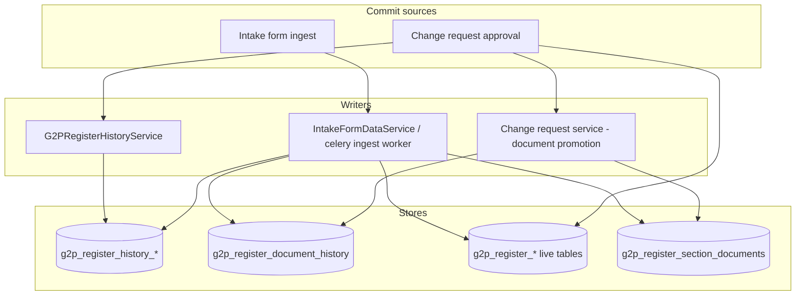
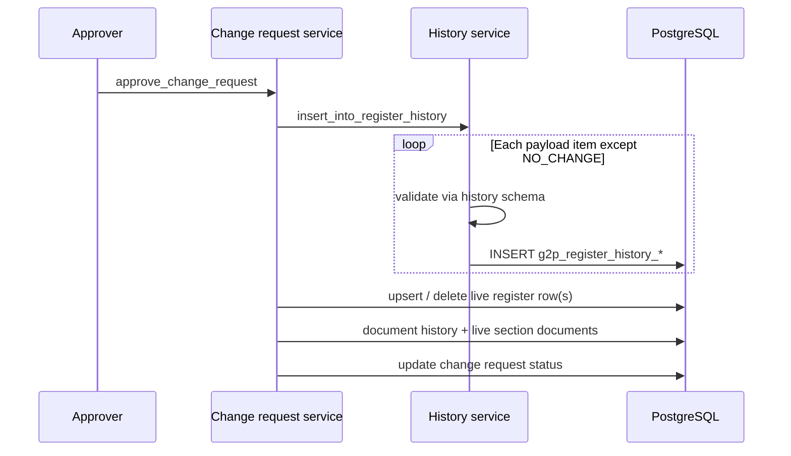

# Version History

## Version History

Every approved mutation to a primary or child register leaves an append-only snapshot in a per-register history table. Version history is the registry’s ledger of **what the record looked like when a change was committed** - distinct from change-request workflow audit (who verified / approved) and from system / write-operation audit trails.


Version history is **not** the same as Audit-ability & Trace-ability (workflow actors and evidence) or Audit trail for Write Operations (JWT `user_id` injection on writes).


### Design principles

| Principle                   | Description                                                                                                                                                                                  |
| --------------------------- | -------------------------------------------------------------------------------------------------------------------------------------------------------------------------------------------- |
| Per-register twins          | Each domain register has a matching history table (e.g. `g2p_register_farmers` → `g2p_register_history_farmers`).                                                                            |
| Commit-time snapshots       | History rows are written when a change is **approved** (change request) or when an intake submission is **ingested** into live register tables - not when a draft change request is created. |
| Payload- or row-sourced     | Change-request history is built from the approved change payload (validated through the history schema). Intake history copies columns from the live row into the history class.             |
| Subject-scoped discovery    | `subject_internal_record_id` denormalises the master subject onto every history row so version queries remain correct after child deletes.                                                   |
| Separate document ledger    | Supporting-document promotions are recorded in the shared `g2p_register_document_history` table, not in the per-register row history.                                                        |
| No program-register history | Registers with purpose `PROGRAM_REGISTER` skip register history inserts.                                                                                                                     |

### Architecture



#### Components

<table><thead><tr><th width="282">Component</th><th>Role</th></tr></thead><tbody><tr><td><code>G2PRegisterHistory</code></td><td>Abstract ORM base for per-register history tables.</td></tr><tr><td><code>G2PRegisterHistory{Mnemonic}</code></td><td>Domain history model (e.g. <code>G2PRegisterHistoryFarmer</code>).</td></tr><tr><td><code>G2PRegisterHistorySchema{Mnemonic}</code></td><td>Pydantic filter applied when building CR history rows from the change payload.</td></tr><tr><td><code>G2PRegisterHistoryService</code></td><td>Inserts history rows on change-request approval.</td></tr><tr><td>Intake ingest (<code>_insert_history_row</code>)</td><td>Inserts history rows when an approved intake submission is written to live tables.</td></tr><tr><td><code>G2PRegisterService</code></td><td>Read APIs: version counts, dates, versions for a date, record history.</td></tr><tr><td>Staff Portal Version History UI</td><td>Date → section/CR picker over the read APIs.</td></tr></tbody></table>

### Record history data model

#### Abstract base - `G2PRegisterHistory`

| Column                                                            | Notes                                                                                     |
| ----------------------------------------------------------------- | ----------------------------------------------------------------------------------------- |
| `history_record_id`                                               | Primary key (UUID).                                                                       |
| `internal_record_id`                                              | The register row being versioned (indexed).                                               |
| `tab_id` / `section_id`                                           | Section context for the change. Intake uses the intake **form id** as `tab_id`.           |
| `is_primary_section`                                              | Whether the change targeted the register’s primary section.                               |
| `change_request_id`                                               | Originating change request. **Nullable** for intake ingest (use `submission_id` instead). |
| `submission_id`                                                   | Originating intake submission when there is no change request.                            |
| `change_request_source`                                           | Channel enum (staff portal, intake form, ingestion pipeline, etc.).                       |
| `subject_internal_record_id`                                      | Denormalised master subject id for hierarchical version queries.                          |
| `link_internal_record_id` / `link_foundational_id`                | Parent linkage for child registers.                                                       |
| `functional_record_id`, `record_name`, `record_image_document_id` | Common display / identity fields when present on the payload or live row.                 |
| `record_status` / `record_status_reason`                          | Status at commit time.                                                                    |
| `created_by` / `created_at`                                       | Initiator and create time (from the CR or submission).                                    |
| `approved_by` / `approved_at`                                     | Approver and approval time.                                                               |

Person and geo mixins (`G2PPersonHistory`, `G2PGeoHistory`, `G2PGeoShapeHistory`) mirror the corresponding live mixins so person/geo registers can persist those attributes on history rows when the history schema includes them.

#### Domain extension pattern

A domain register extends the abstract history base the same way it extends the live register:

```
Class:  G2PRegisterHistory{Mnemonic}     e.g. G2PRegisterHistoryFarmer
Table:  g2p_register_history_{plural}    e.g. g2p_register_history_farmers
Schema: G2PRegisterHistorySchema{Mnemonic}
```

Example (Farmer Registry):

```python
class G2PRegisterHistoryFarmer(G2PRegisterHistory, G2PPersonHistory, G2PGeoHistory, G2PFarmer):
    __tablename__ = "g2p_register_history_farmers"
```

History tables are created by the domain extension (`create_migrate()` on each history class). The platform core migrates shared tables such as `g2p_register_document_history` and `g2p_register_score_history`.


Program application registers do **not** receive history inserts. History tracking applies to primary and child registers only.



ORM history classes may inherit full domain columns, but many history **schemas** are thinner than the live register schema. Change-request history therefore tends to store base history fields (plus person/geo when included), not necessarily every domain attribute. Intake history is closer to a full live-row dump into columns present on both the live model and the history class.


### Write paths

#### Change request approval

When a change request is approved, the approval transaction:

1. Inserts one history row per non-`NO_CHANGE` item in the change payload (`G2PRegisterHistoryService.insert_into_register_history`).
2. Upserts or deletes the live register row(s).
3. Promotes supporting documents (see Document history).
4. Updates change-request status / timestamps.

For each payload item:

1. Validate / filter through `G2PRegisterHistorySchema{Mnemonic}`.
2. Keep non-null schema fields.
3. Overlay CR metadata: new `history_record_id`, `internal_record_id` from the payload, `tab_id` / `section_id`, `change_request_id`, source, primary-section flag, created/approved stamps.
4. Stamp `subject_internal_record_id = change_request.internal_record_id`.

`NO_CHANGE` payload items and `PROGRAM_REGISTER` targets are skipped. Rejected change requests do not write history.



#### Intake form ingest

When an approved intake submission is ingested into live tables:

1. Upsert live register row(s).
2. Insert a history row via `_insert_history_row` (core service and celery ingest worker).
3. Promote submission documents to live section documents and write document history.

Intake history forces:

| Field                         | Value                     |
| ----------------------------- | ------------------------- |
| `change_request_id`           | `NULL`                    |
| `submission_id`               | Intake submission id      |
| `change_request_source`       | `INTAKE_FORM` (core path) |
| `tab_id`                      | Intake form id            |
| Remaining overlapping columns | Copied from the live row  |

#### Deletes and subject scoping

For `DELETE` actions, a history row is still written (often with only identifiers and CR metadata; domain columns may be null). The live row is then removed.

After a child record is deleted, a live hierarchy walk can no longer discover that child’s history. `subject_internal_record_id` keeps deleted children (and deeper descendants) visible when querying version history for the master subject.


Existing deployments backfilled `subject_internal_record_id` onto history tables so version-history queries remain correct for pre-existing rows.


### Document history

Supporting documents use a **shared** append-only table, `g2p_register_document_history`, rather than per-register history twins.

| Column                                           | Notes                                          |
| ------------------------------------------------ | ---------------------------------------------- |
| `document_history_id`                            | Primary key                                    |
| `internal_record_id`                             | Live register row the document was promoted to |
| `section_id`                                     | Section that owns the attachment slot          |
| `document_id`                                    | Catalog id in `g2p_registry_documents`         |
| `label`                                          | Human-readable slot / display label            |
| `change_request_id`                              | Nullable - set for CR approval promotions      |
| `submission_id`                                  | Set for intake ingest promotions               |
| `change_request_source`, created/approved stamps | Provenance                                     |

Document history is written on **promotion to live**, not on upload:

| Origin                  | Behaviour                                                                                                                                              |
| ----------------------- | ------------------------------------------------------------------------------------------------------------------------------------------------------ |
| Change request approval | For each CR document × target record id(s) from the payload (skip `DELETE` / `NO_CHANGE`), insert history and upsert `g2p_register_section_documents`. |
| Intake ingest           | For each submission section document, insert history with `submission_id` and upsert live section documents.                                           |

Live attachments are the current set in `g2p_register_section_documents`. Document history is the audit of promotion events.

### Score history

Computed scores use a separate append-only table, `g2p_register_score_history`. Each compute writes `register_id`, score type / definition, optional `link_internal_record_id`, triggering CR / submission ids, `computed_score`, and `computed_at`.

This is **not** register version history. Domain “score register” sections (where used) may still have their own `g2p_register_history_*` twins like any other register section.

### Querying history

Staff Portal register-data APIs expose version history for a subject record within a tab.

| Endpoint                                      | Behaviour                                                                                                                     |
| --------------------------------------------- | ----------------------------------------------------------------------------------------------------------------------------- |
| `POST /register-data/get_number_of_versions`  | Count of unique **non-null** `change_request_id` values under the subject for the tab’s sections, plus last-updated metadata. |
| `POST /register-data/get_version_dates`       | Distinct history `created_at` dates for the subject.                                                                          |
| `POST /register-data/get_versions_for_a_date` | Per section, change requests on that date (deduped by `change_request_id`), enriched with AWE `request_id` when present.      |
| `POST /register-data/get_record_history`      | History rows for one `internal_record_id` on that register’s history table (policy-gated).                                    |

Subject discovery prefers `subject_internal_record_id == subject`, with a legacy fallback that walks the live hierarchy for unstamped rows.


Intake-only history rows (`change_request_id` null) appear in date / raw history queries when matched, but they do **not** increment `get_number_of_versions`, which counts unique change-request ids only.


Permission: `registerHistory:view`.

#### Staff Portal UI

The Version History surface on a record page:

1. Loads version dates for the subject.
2. Lets the user pick a date and see sections with committed changes.
3. Selects a change request (`selectedVersionId` = `change_request_id`) and opens CR / approval-task detail.

### Building a domain register with history

1. Define `G2PRegisterHistory{Mnemonic}` extending `G2PRegisterHistory` (plus person/geo/domain mixins as needed).
2. Define `G2PRegisterHistorySchema{Mnemonic}` with the fields that should be persisted from change payloads.
3. Call `create_migrate()` for the history class in the domain app bootstrap (alongside the live register).
4. Ensure change-request approval and intake ingest paths resolve the history class via the register mnemonic factory / extension module (platform convention: `G2PRegisterHistory{Mnemonic}`).

No per-domain history **service** is required for the default CR and intake paths.

### Related design topics

| Topic                                    | Link                       |
| ---------------------------------------- | -------------------------- |
| Registers, sections, and history stub    | Data Model                 |
| Approval transaction that writes history | Change Management          |
| Document catalog and promotion           | File Attachments           |
| Intake create path                       | Intake Forms               |
| Partner / async UPDATE path into CRs     | Ingestion Pipeline         |
| Product-facing capability summary        | Version History (Features) |
