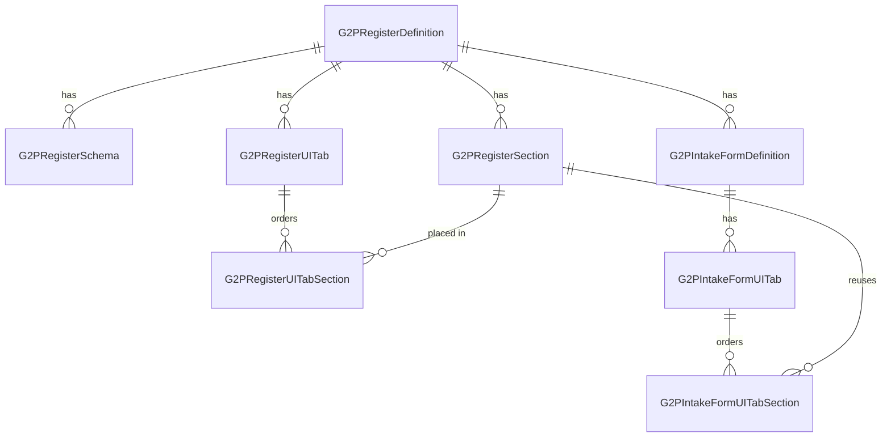

---
layout:
  width: default
  title:
    visible: true
  description:
    visible: false
  tableOfContents:
    visible: true
  outline:
    visible: true
  pagination:
    visible: true
  metadata:
    visible: true
  tags:
    visible: true
---

# Register Metadata

While the **ORM models** define how data is stored in the database and the **Pydantic schemas** define validation and API data structures, the OpenG2P Registry platform also requires registers to be defined in **platform metadata tables**.

These metadata definitions allow the platform to dynamically:

* Discover available registers
* Configure UI rendering
* Route API requests
* Load appropriate service classes and domain models

The metadata is also important for the **Registry UI layer**, which uses these definitions to dynamically render register interfaces and workflows.

The primary metadata table used for this purpose is **`g2p_register_definition`**.

Register metadata can be created either:

* Directly through database configuration scripts, or
* Through the **Configuration section of the Registry Staff UI**

***

### Metadata Model Relationships

***

### Metadata Tables

| Document                                                   | SQL seed file                         | Purpose                                                    |
| ---------------------------------------------------------- | ------------------------------------- | ---------------------------------------------------------- |
| [G2PRegisterDefinition](g2pregisterdefinition.md)          | `g2p_register_definitions.sql`        | Register catalog, hierarchy, dedup and ID flags            |
| [G2PRegisterSchema](g2pregisterschema.md)                  | `g2p_register_schemas.sql`            | Dedup, search result, and filter JSON schemas              |
| [G2PRegisterSection](g2pregistersection.md)                | `g2p_register_sections.sql`           | Section UI schema, verification, list display              |
| [G2PRegisterUITab](g2pregisteruitab.md)                    | `g2p_register_ui_tabs.sql`            | Staff portal tab layout per register                       |
| [G2PRegisterUITabSection](g2pregisteruitabsections.md)     | `g2p_register_ui_tab_sections.sql`    | Tab → section ordering                                     |
| G2PRegistryDocument                                        | `g2p_registry_documents.sql`          | Registry-level files in object storage (templates, assets) |
| [G2PIntakeFormDefinition](g2pintakeformdefinition.md)      | `g2p_intake_form_definitions.sql`     | Intake form definitions                                    |
| [G2PIntakeFormUITab](g2pintakeformuitab.md)                | `g2p_intake_form_ui_tabs.sql`         | Tabs within an intake form                                 |
| [G2PIntakeFormUITabSection](g2pintakeformuitabsections.md) | `g2p_intake_form_ui_tab_sections.sql` | Intake tab → section ordering                              |
