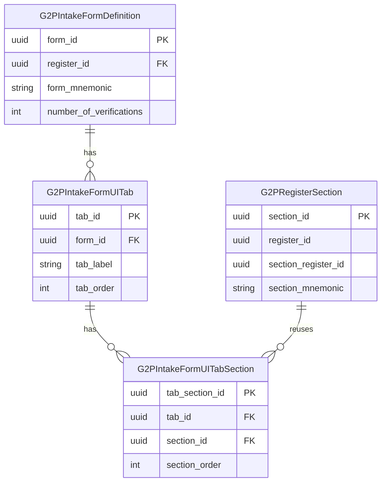

# G2PIntakeFormUITabSections

Junction table associating [G2PRegisterSection](g2pregistersection.md) definitions with [G2PIntakeFormUITab](g2pintakeformuitab.md) definitions. Defines which sections appear on each intake form tab and in what order.

***

### Attributes

| Attribute            | Description                                                      |
| -------------------- | ---------------------------------------------------------------- |
| **tab\_section\_id** | Primary key.                                                     |
| **tab\_id**          | Intake form tab. References `g2p_intake_form_ui_tabs.tab_id`.    |
| **section\_id**      | Register section. References `g2p_register_sections.section_id`. |
| **section\_order**   | Order within the tab. Lower values appear first.                 |

***

### Relationship model

Intake forms **reuse** section definitions from register metadata. Submitting the form creates change requests against the referenced sections.
