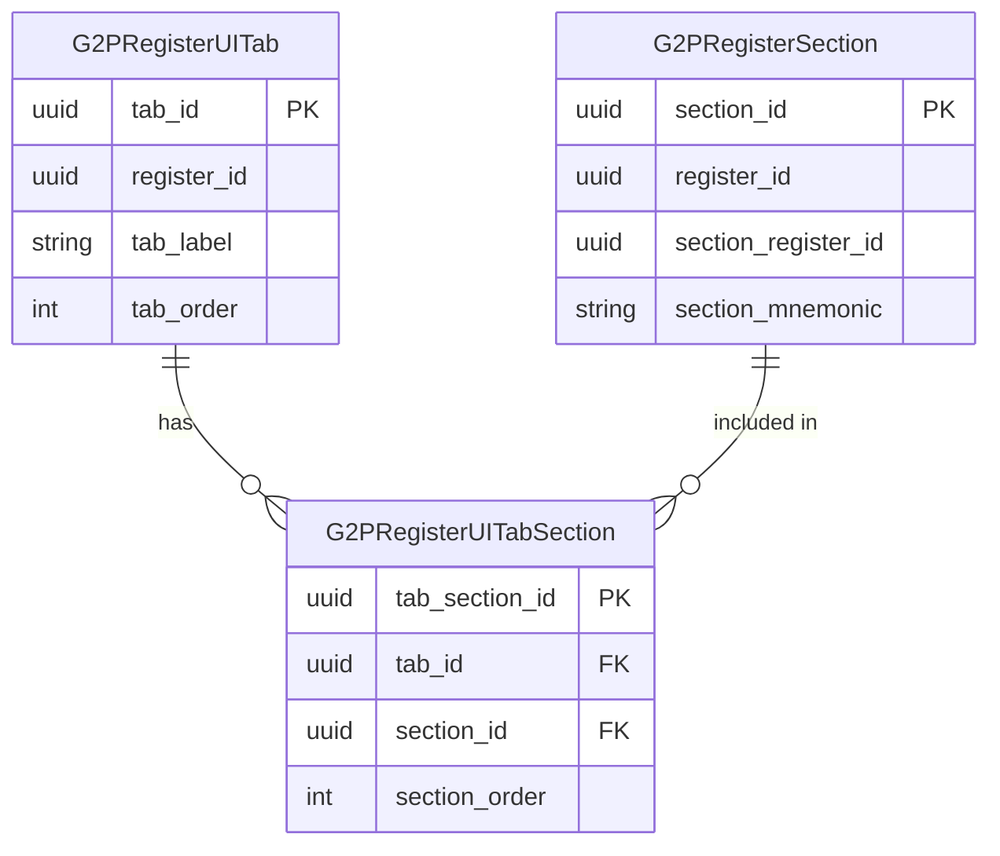

# G2PRegisterUITabSections

Junction table associating G2PRegisterSection definitions with G2PRegisterUITab definitions. Defines **section ordering within a tab**.

Sections are defined once in `g2p_register_sections`; this table controls **where** each section appears and **in what order**.

***

### Attributes

| Attribute            | Description                                                   |
| -------------------- | ------------------------------------------------------------- |
| **tab\_section\_id** | Primary key. Uniquely identifies the tab–section association. |
| **register\_id**     | Register identifier (stored for query convenience).           |
| **tab\_id**          | References `g2p_register_ui_tabs.tab_id`.                     |
| **section\_id**      | References `g2p_register_sections.section_id`.                |
| **section\_order**   | Order within the tab. Lower values appear first.              |

***

### Relationship model





A section definition may appear in multiple tabs via multiple junction rows.
