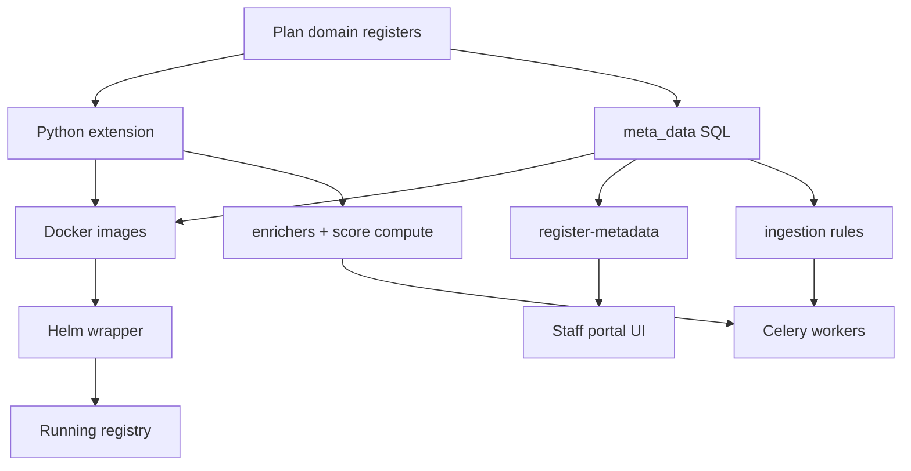

# Registry Extensions

Understanding the registry architecture is necessary before you write code. These pages explain **how the platform loads your extension**, what metadata drives the UI, and how async pipelines interact with domain code.

| Document                      | Summary                                                                |
| ----------------------------- | ---------------------------------------------------------------------- |
| Platform and extension model  | Core vs extension, API vs Celery startup, import map, end-to-end flows |
| Registers and metadata        | Register types, hierarchy, register-metadata tables, section flags     |
| Extension contract            | Required classes, factories, enrichers, score compute, ID generator    |
| Section UI schema and widgets | Authoring `section_ui_schema` JSON — panels, widgets, data paths       |
| Ingestion and outgestion      | Partner pipeline, enrichers, Jinja templates, ADD/UPDATE               |
| Background jobs and Celery    | Which workers call extension code; beat vs worker                      |

Register-metadata table field reference: Register metadata index (10 G2P\* pages aligned with `meta_data/register-metadata/` SQL files).

Non-register-metadata SQL folders: Metadata folder reference.

***

### How the pieces fit together

Metadata defines **what** the UI shows and **how** external messages map to registers. Python defines **columns**, **validation**, and **side effects** the metadata layer cannot express. Docker and Helm deliver both to Kubernetes without forking the platform.
