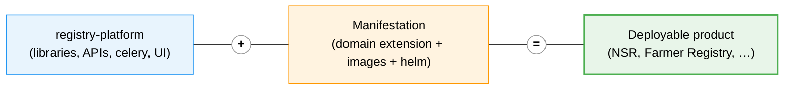

# Organization of Codebase


**The Registry codebase has been consolidated.** All platform code — the core library, the APIs, the Celery runtimes and the UI — now lives in a **single repository, `registry-platform`**. The older split repositories (`openg2p-registry-gen2-*`) are being **deprecated**. See [Deprecated repositories](organization-of-codebase.md#deprecated-repositories) below.


## The platform repository: `registry-platform`

[**`registry-platform`**](https://github.com/openg2p/registry-platform) holds the entire OpenG2P Registry platform in one place — all libraries, APIs, Celery runtimes and UIs:

```
registry-platform/
├── core/
│   └── openg2p-registry-core                  Core library: ORM models, Pydantic
│                                               schemas, core business logic.
│                                               Packaged INTO each runtime — not
│                                               deployed on its own.
├── apis/
│   ├── openg2p-registry-staff-portal-api       REST APIs for the Staff Portal UI
│   ├── openg2p-registry-partner-api            REST APIs for the partner ecosystem
│   └── openg2p-registry-bene-portal-api        REST APIs for the Beneficiary Portal
├── celery/
│   ├── openg2p-registry-celery-beat-producers  Periodic task scheduler. Must run as
│   │                                            exactly ONE instance (POD).
│   └── openg2p-registry-celery-workers         Async task workers. Scale PODs out
│                                                to handle higher volumes.
└── ui/
    ├── staff-portal-ui                          Next.js Staff Portal UI runtime
    └── ui-widgets                               Shared UI widget library
```

Each runtime above (the APIs, the two Celery runtimes and the Staff Portal UI) is built into a Docker image; `openg2p-registry-core` and `ui-widgets` are libraries that the runtimes embed rather than deploy separately.

## The platform is not deployable on its own

`registry-platform` is **a platform, not a product**. It carries no domain model, no Docker images and no Helm chart of its own. To run it, the platform must be **manifested** as a concrete registry product.



## Manifestations

A **manifestation** is a deployable registry product built on the platform. The current manifestations are:

* [**National Social Registry (NSR)**](../../national-social-registry/)
* [**Farmer Registry**](../../farmer-registry.md)

Each manifestation is its own repository and is **self-contained**. It provides:

1. **Domain extension** — the registers, supporting tables, schemas and meta-data SQL specific to that product (e.g. NSR's `nsr-extension/`).
2. **Docker build scripts** — the Dockerfiles and spec files that assemble the platform runtimes + the manifestation's extension into the product's images, along with path-scoped CI workflows that build and push them.
3. **A complete, self-sufficient Helm chart** — the full set of templates, values and sub-dependencies needed to deploy the product. There is **no shared "base registry chart"** to depend on (see note below); each manifestation owns its chart end-to-end.


**There is no longer a "base registry chart".** Earlier, manifestations deployed via a thin wrapper that depended on a published `openg2p-registry` base chart. That model has been retired — each manifestation now ships a complete Helm chart of its own.


## Deprecated repositories

The following repositories are being **deprecated** in favour of `registry-platform` (code) and the per-manifestation repositories (images + Helm):

| Deprecated repository                   | Replaced by                                                   |
| --------------------------------------- | ------------------------------------------------------------- |
| `openg2p-registry-gen2-core`            | `registry-platform/core/openg2p-registry-core`                |
| `openg2p-registry-gen2-apis`            | `registry-platform/apis/*`                                    |
| `openg2p-registry-gen2-celery`          | `registry-platform/celery/*`                                  |
| `openg2p-registry-gen2-staff-portal-ui` | `registry-platform/ui/staff-portal-ui`                        |
| `openg2p-registry-gen2-ui-widgets`      | `registry-platform/ui/ui-widgets`                             |
| `openg2p-registry-gen2-deployment`      | Per-manifestation Helm charts (e.g. NSR's `helm/openg2p-nsr`) |

## External service dependencies

The Registry platform depends on the following services, deployed separately:

| Service                  | Purpose                                                                                                                                                                            | Documentation                                                               |
| ------------------------ | ---------------------------------------------------------------------------------------------------------------------------------------------------------------------------------- | --------------------------------------------------------------------------- |
| **IAM Service**          | Gateway for ID and Access Token validation; interfaces with OIDC/OAuth providers (Keycloak) for token issuance; provides a shared library for token validation across OpenG2P APIs | [Identity & Access Management](../../../../identity-and-access-management/) |
| **ID Generator Service** | Generates unique Functional IDs for registrants; usage is configurable per Register via Register Metadata                                                                          | [ID Generator](../../../../platform/platform-services/id-generator/)        |
| **Master Data Service**  | Provides Partner and Geo Lookup data via API                                                                                                                                       | —                                                                           |

## Versions

The **version of the `registry-platform` repository is the platform version** — there is no separate base-chart version to track. Each manifestation carries its own product version independently.

| Platform tag | Release date | Notes |
| ------------ | ------------ | ----- |
| [v1.0.0](https://github.com/OpenG2P/registry-platform/tree/v1.0.0) | 19-Jun-2026 | First tagged release of the consolidated platform. [Release notes](../versions/registry-platform-release-notes-v1.0.0.md). |
| `develop` | — | Active development branch. |

Legacy Helm chart history (4.0.0, 4.1.0) is in [Versions](../versions/).
