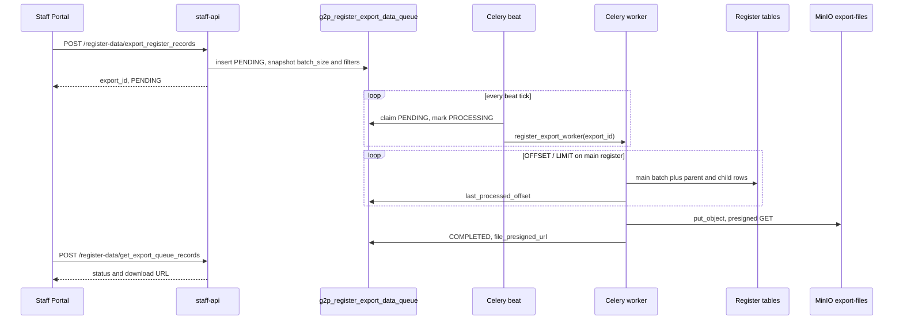

# Export Register Data

The export file would include the register being browsed **and** every related parent and child register in that register's `master_register_id` tree. XLSX uses one worksheet per register. `ZIP_CSV` uses one CSV per register inside a zip.


This page is the shipped pipeline in [registry-platform](https://github.com/OpenG2P/registry-platform) (Staff UI, Staff API, Celery, Helm). The original design note is [Exporting to an XLS](../design/exporting-to-an-xls.md).



`export_format` is only `XLSX` or `ZIP_CSV`. XLSX is slower to write than ZIP of CSVs.


### Staff Portal

On Browse Register, **Export Records** and **Export History** sit in the more menu.

<table><thead><tr><th width="223">Control</th><th>Behaviour</th></tr></thead><tbody><tr><td>Scope: all / filtered</td><td>No checkboxes. The worker replays the current search, filters, and sort.</td></tr><tr><td>Scope: selected</td><td>Checkboxes accumulated across pages. The worker exports those main-register IDs, plus related rows.</td></tr><tr><td>Format</td><td><strong>XLSX</strong> (default) or <strong>ZIP CSV</strong> (<code>ZIP_CSV</code>)</td></tr><tr><td>History panel</td><td>This user's jobs only. Polls every 10 seconds while any job is <code>PENDING</code> or <code>PROCESSING</code>. Download opens the MinIO presigned URL.</td></tr><tr><td>Retry in History</td><td>Enqueues a <strong>new</strong> job with the <strong>current</strong> Browse Register filters and scope <code>all</code>. It does not replay the original selection.</td></tr></tbody></table>

Staff UI lives in [registry-platform `ui/staff-ui`](https://github.com/OpenG2P/registry-platform/tree/develop/ui/staff-ui), not in the separate `staff-portal` repo:

* Modal and queue: [`src/features/export/register/`](https://github.com/OpenG2P/registry-platform/tree/develop/ui/staff-ui/src/features/export/register)
* Browse Register wiring: [`src/app/[locale]/register/[type]/page.tsx`](https://github.com/OpenG2P/registry-platform/blob/develop/ui/staff-ui/src/app/\[locale]/register/\[type]/page.tsx)
* BFF: [`export-register-records/route.ts`](https://github.com/OpenG2P/registry-platform/blob/develop/ui/staff-ui/src/app/api/register/export-register-records/route.ts), [`get-export-queue-records/route.ts`](https://github.com/OpenG2P/registry-platform/blob/develop/ui/staff-ui/src/app/api/register/get-export-queue-records/route.ts)

The BFF posts to Staff API `POST /register-data/export_register_records` and `POST /register-data/get_export_queue_records`.

Both API endpoints require `register:export` permission.


The list API returns rows where `requested_by` is the signed-in Keycloak `sub` **and** `queued_at` is within `exportQueueVisibilityDays` (default **2 days**). Older rows stay in `g2p_register_export_data_queue`; they disappear from History. Presigned URLs expire separately (`exportPresignedUrlExpiryHours`, default **48 hours**). A completed job can still list with no Download button.


### Pipeline



<table><thead><tr><th width="205">Piece</th><th width="355">Code</th></tr></thead><tbody><tr><td>Enqueue / list</td><td><a href="https://github.com/OpenG2P/registry-platform/blob/develop/apis/openg2p-registry-staff-api/src/openg2p_registry_staff_api/controllers/g2p_register_data_controller.py"><code>g2p_register_data_controller.py</code></a>, <a href="https://github.com/OpenG2P/registry-platform/blob/develop/core/openg2p-registry-core/src/openg2p_registry_core/services/g2p_register_export_service.py"><code>g2p_register_export_service.py</code></a></td></tr><tr><td>Queue table</td><td><a href="https://github.com/OpenG2P/registry-platform/blob/develop/core/openg2p-registry-core/src/openg2p_registry_core/models/g2p_register_export_data_queue.py"><code>g2p_register_export_data_queue.py</code></a></td></tr><tr><td>Beat</td><td><a href="https://github.com/OpenG2P/registry-platform/blob/develop/celery/openg2p-registry-celery-beat/src/openg2p_registry_celery_beat/tasks/register_export_beat_producer.py"><code>register_export_beat_producer.py</code></a></td></tr><tr><td>Worker</td><td><a href="https://github.com/OpenG2P/registry-platform/blob/develop/celery/openg2p-registry-celery-worker/src/openg2p_registry_celery_worker/tasks/register_export_worker.py"><code>register_export_worker.py</code></a></td></tr><tr><td>Hierarchy, filters, sort</td><td><a href="https://github.com/OpenG2P/registry-platform/blob/develop/core/openg2p-registry-core/src/openg2p_registry_core/helpers/register_export.py"><code>helpers/register_export.py</code></a></td></tr><tr><td>Helm knobs</td><td><a href="https://github.com/OpenG2P/registry-platform/blob/develop/helm/openg2p-registry/values.yaml"><code>helm/openg2p-registry/values.yaml</code></a> (<code>global.export*</code>)</td></tr></tbody></table>

Enqueue snapshots the caller's data policies onto the queue row. The worker reapplies them on every register it touches, so the file cannot contain rows that Browse Register would hide.

#### Selection vs search

Non-empty `selected_internal_record_ids` means mode `SELECTED`. Empty list or omit means mode `SEARCH_FILTER`. The worker does not treat Browse Register `current_page` / `page_size` as the export window. Those fields only carry `search_text`, `filter_by`, and `sort_by`.

If `sort_by` is empty, sort is `last_approved_at DESC`, then `internal_record_id ASC` (same default as Browse Register). A custom Browse Register sort is replayed on `SEARCH_FILTER` exports.

Unless `filter_by` already sets `record_status`, the worker keeps `record_status = ACTIVE` on the **main** register. Related parent and child rows are always restricted to `ACTIVE`.

#### Related registers

The worker walks `master_register_id` up to the root, then breadth-first **down from the browsed register only**. Ancestor sheets are included. Siblings of the browsed register are not. Exporting a child register does not pull other children of its parent.

Related rows for each main-register batch are loaded with `link_internal_record_id IN (...)` (children) or parent `internal_record_id IN (...)` (ancestors). Duplicate related rows across batches are skipped.

#### Output

| `export_format` | Object key                  | Notes                                                                                                             |
| --------------- | --------------------------- | ----------------------------------------------------------------------------------------------------------------- |
| `XLSX`          | `{prefix}/{export_id}.xlsx` | One worksheet per register. `openpyxl` write-only. The worker raises if a sheet would exceed 1,048,575 data rows. |
| `ZIP_CSV`       | `{prefix}/{export_id}.zip`  | One CSV per register, then zip. Prefer this for large dumps.                                                      |

Bucket name is the enum value `export-files`. It is not a Helm key. Object prefix defaults to `register-exports/`.

Each worker attempt sets `last_processed_offset = 0` before paging, and again on failure. The in-loop update of `last_processed_offset` is progress for operators, not a resume checkpoint. After `exportWorkerMaxAttempts` (default 3) the row is `FAILED`. The temp file is discarded, so every retry rebuilds the file from the start.

### Configuration

Helm `global` keys in [`helm/openg2p-registry/values.yaml`](https://github.com/OpenG2P/registry-platform/blob/develop/helm/openg2p-registry/values.yaml):

<table><thead><tr><th>Helm</th><th width="140">Default</th><th>Used by</th><th>Role</th></tr></thead><tbody><tr><td><code>exportBatchSize</code></td><td><code>500</code></td><td><strong>Staff API</strong> <code>REGISTRY_STAFF_PORTAL_API_EXPORT_BATCH_SIZE</code></td><td>Written onto the queue row at enqueue. This is the batch size the worker uses.</td></tr><tr><td>same</td><td></td><td>Celery worker <code>REGISTRY_CELERY_WORKERS_EXPORT_BATCH_SIZE</code></td><td>Fallback only if the row's <code>batch_size</code> is missing or 0.</td></tr><tr><td><code>exportQueueVisibilityDays</code></td><td><code>2</code></td><td>Staff API</td><td>History list cutoff</td></tr><tr><td><code>exportPresignedUrlExpiryHours</code></td><td><code>48</code></td><td>Celery worker</td><td>Download URL lifetime</td></tr><tr><td><code>exportFilesPrefix</code></td><td><code>register-exports/</code></td><td>Celery worker</td><td>MinIO key prefix</td></tr><tr><td><code>exportBeatProducerFrequency</code></td><td><code>20</code> (seconds)</td><td>Celery beat</td><td>How often PENDING rows are claimed</td></tr><tr><td><code>exportNoOfTasksToProcess</code></td><td><code>5</code></td><td>Celery beat</td><td>Max jobs claimed per tick</td></tr><tr><td><code>exportWorkerMaxAttempts</code></td><td><code>3</code></td><td>Celery worker</td><td>Retry ceiling</td></tr></tbody></table>

Changing `exportBatchSize` does not rewrite in-flight rows. Check `g2p_register_export_data_queue.batch_size` for the job you are timing.

Raising beat frequency or Celery replica count will not speed a single large dump. One export is one task. Beat only bounds how long a new job sits in `PENDING` (about one tick). `REGISTRY_CELERY_WORKERS_BATCH_SIZE` is ingest, not export.

## Speeding up large exports


Some pointers to follow for speeding up large exports run regularly by operators


A `SEARCH_FILTER` export, pages the **main** register with `OFFSET` / `LIMIT`, then loads related rows for that batch. Wall time is usually a mix of:

* Postgres walking later `OFFSET` pages (and sorting if there is no matching index)
* Related-register `IN (...)` lookups per batch
* Writing the file in Python (`openpyxl` for XLSX is much more expensive than CSV)

### Format and batch size

Use `ZIP_CSV` for full-register or otherwise large dumps. XLSX will stay slower even when the SQL plan is good.

Raise `exportBatchSize` (for example 2000 instead of 500) so the worker makes fewer OFFSET round-trips. The value is snapshotted onto the queue row at enqueue. Going much higher increases celery-worker RSS (helm chart memory limit is 2560Mi).

Give the celery-worker pod a real CPU request if the writer is the bottleneck. The chart default is 100m, and the ZIP/XLSX loop is Python.

### Create indexes for the operation you regularly run

The worker's default `SEARCH_FILTER` predicate (no search, no extra filters) is:

```
WHERE record_status = 'ACTIVE'
ORDER BY last_approved_at DESC, internal_record_id
OFFSET n LIMIT batch_size
```

The platform declares a partial index for that default on every concrete register table ([`g2p_register.py`](https://github.com/OpenG2P/registry-platform/blob/develop/core/openg2p-registry-core/src/openg2p_registry_core/models/g2p_register.py)):

```
idx_<tablename>_export_active
  (last_approved_at DESC, internal_record_id)
  WHERE record_status = 'ACTIVE'
```

SQLAlchemy `create_all` / `create_migrate()` will not add this index to tables that already exist. Create it on a live database with `CREATE INDEX CONCURRENTLY` (see below).

That index only helps exports that match it. For example, if operators mostly export **INACTIVE**, **ARCHIVED**, another `filter_by` on `record_status`, or a non-default Browse Register sort, add **your own** index that matches that `WHERE` and `ORDER BY`. The platform will not invent those.

Examples (replace `<register_table>` with the physical table, such as `g2p_register_individuals`):

Default ACTIVE export, if the table predated the platform index:

```sql
CREATE INDEX CONCURRENTLY IF NOT EXISTS idx_<register_table>_export_active
ON <register_table> (last_approved_at DESC, internal_record_id)
WHERE record_status = 'ACTIVE';
```

Mostly exporting INACTIVE with the same default sort:

```sql
CREATE INDEX CONCURRENTLY IF NOT EXISTS idx_<register_table>_export_inactive
ON <register_table> (last_approved_at DESC, internal_record_id)
WHERE record_status = 'INACTIVE';
```

A custom sort, for example `created_at` descending, for ACTIVE rows:

```sql
CREATE INDEX CONCURRENTLY IF NOT EXISTS idx_<register_table>_export_active_created
ON <register_table> (created_at DESC, internal_record_id)
WHERE record_status = 'ACTIVE';
```

`CONCURRENTLY` avoids a long write lock. It cannot run inside a transaction. Keep one index per real export shape. Duplicate partial indexes on the same columns and predicate only cost writes.

Confirm with `EXPLAIN (ANALYZE, BUFFERS)` using the **same** `WHERE` / `ORDER BY` / `OFFSET` / `LIMIT` as the worker, including a late offset (not only offset 0):

```sql
EXPLAIN (ANALYZE, BUFFERS)
SELECT *
FROM <register_table>
WHERE record_status = 'ACTIVE'   -- or INACTIVE, or your filter
ORDER BY last_approved_at DESC, internal_record_id
OFFSET <n> LIMIT <batch_size>;
```

You want an index scan (ideally index-only) on the matching export index, not a sequential scan plus sort.

### Vacuum

After creating an index, and after bulk loads or large updates, run:

```sql
VACUUM (ANALYZE) <register_table>;
```

Index-only scans need an up-to-date visibility map. If `EXPLAIN` shows an index-only scan with a large `Heap Fetches` count, vacuum again. Stale statistics also make the planner skip a perfectly good partial index.

### Configure `work_mem`

This is a PostgreSQL setting, not a Helm env var.

If `EXPLAIN` shows `Sort Method: external merge` (disk spill), the sort does not fit in `work_mem` (often `4MB` by default). Raise it until that sort becomes `quicksort` in memory. A starting point for large register sorts is `32MB`. Read the `Memory:` figure in `EXPLAIN` rather than guessing.

Raising `work_mem` does not pick an index. A predicate the planner cannot use (for example `search_text ILIKE '%%'` on an old worker) still seq-scans.

Set it on the registry database (Helm `global.registryDB`) or on the role celery uses, not as a huge `ALTER SYSTEM` default:

```sql
ALTER DATABASE <registryDB> SET work_mem = '32MB';
```

Existing sessions keep the old value. Bounce celery-worker so new connections pick it up. `work_mem` is per sort/hash operation, per query. Do not set it to hundreds of MB globally.

### What will not help

* Beat frequency and celery-worker replica count, for **one** in-flight dump
* Changing only the worker env `REGISTRY_CELERY_WORKERS_EXPORT_BATCH_SIZE` after the job is already queued (the row already has `batch_size`)
* An ACTIVE partial index when the export filters `INACTIVE` or sorts on a different column

### Example metrics for NSR Individual exports


Tested on national-social-registry installation of registry-platform with \~250,000 individual records and \~60,000 households with an approximate of 2-5 records per child table


[National Social Registry](https://github.com/OpenG2P/national-social-registry). Browse Register **Individual**, blank search, `SEARCH_FILTER`, `record_status = ACTIVE`. Main table 258,984 rows on the tuned run. File also includes Household plus 7 Individual child tables (9 sheets). Celery worker CPU request 100m.

<table><thead><tr><th width="171">Setup</th><th width="96">Format</th><th width="135">Wall clock</th><th width="187">Main-row throughput</th></tr></thead><tbody><tr><td><code>exportBatchSize=500</code>, no DB tuning</td><td>XLSX</td><td>40 to 50 min</td><td>~90 rows/s</td></tr><tr><td><code>exportBatchSize=500</code>, no DB tuning</td><td>ZIP_CSV</td><td>~23 min</td><td>~180 rows/s</td></tr><tr><td><code>exportBatchSize=2000</code>, no DB tuning</td><td>XLSX</td><td>~24 to 26 min</td><td>~170 rows/s</td></tr><tr><td><code>exportBatchSize=2000</code>, no DB tuning</td><td>ZIP_CSV</td><td>~10 min</td><td>~420 rows/s</td></tr><tr><td><code>exportBatchSize=2000</code> plus index, vacuum, no blank <code>ILIKE</code></td><td>XLSX</td><td><strong>~22 min</strong></td><td>~200 rows/s</td></tr><tr><td><code>exportBatchSize=2000</code> plus index, vacuum, no blank <code>ILIKE</code></td><td>ZIP_CSV</td><td><strong>6 min 42 sec</strong></td><td>~640 rows/s</td></tr></tbody></table>

Main-register page, `OFFSET n LIMIT 2000`:

<table><thead><tr><th width="302">Query</th><th width="317">Time</th></tr></thead><tbody><tr><td><code>OFFSET 0</code>, no <code>ILIKE</code></td><td>~3.6 ms, index scan</td></tr><tr><td><code>OFFSET 200000</code> with <code>search_text ILIKE '%%'</code></td><td>~1.5 to 1.8 s, seq scan + disk sort</td></tr><tr><td><code>OFFSET 200000</code> after the steps below</td><td>~98 ms, index-only, <code>Heap Fetches: 0</code></td></tr></tbody></table>

What produced the 6 min 42 sec / \~22 min pair:

<table><thead><tr><th width="225">Change</th><th>Value</th></tr></thead><tbody><tr><td><code>exportBatchSize</code></td><td>2000 (was 500)</td></tr><tr><td>Blank-search <code>ILIKE '%%'</code></td><td>omitted in the worker</td></tr><tr><td>Partial index</td><td><code>idx_g2p_register_individuals_export_active</code> on <code>(last_approved_at DESC, internal_record_id) WHERE record_status = 'ACTIVE'</code>, <code>CREATE INDEX CONCURRENTLY</code></td></tr><tr><td>Vacuum</td><td><code>VACUUM (ANALYZE) g2p_register_individuals</code></td></tr><tr><td><code>work_mem</code></td><td><code>ALTER DATABASE &#x3C;registryDB> SET work_mem = '32MB'</code>, then bounce celery-worker</td></tr></tbody></table>

Index, vacuum, and skipping `ILIKE` saved about 3 to 4 minutes on both formats (SQL). The remaining XLSX vs ZIP gap (\~15 min) is `openpyxl`. Beat frequency and extra celery replicas were not used.
