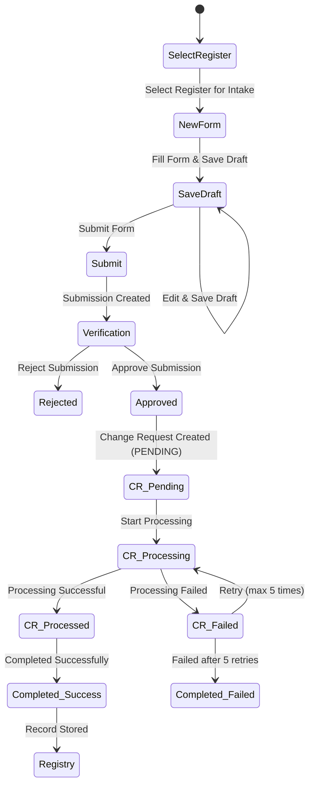

# Registry Intake

The intake layer is used a **JSON-configured form widgets** that dynamically assembles forms at runtime, eliminating the need for hardcoded forms for each register type.

### 1. Intake Overview & Process

Registry Intake defines the lifecycle through which a record is **created, verified, processed, and stored** in the system.

#### Intake Lifecycle

***

### Key Stages in Intake Form Lifecycle

#### Draft Stage

* Form is created or edited
* Users can save and update multiple times
* Each submission is assigned an **Application Reference** and **Submission id**
* **Status:** `intake_form_status = DRAFT`

#### Submission Stage

* Form is finalized and submitted
* No further edits are allowed
* A submission record is created
* **Status:** `intake_form_status = FINAL`

#### Verification and Approval Stage

* Multiple verification steps can be performed based on configuration
* Final decision is made after all verifications
* **Status:** `approval_status`
  * `PENDING` → Awaiting review
  * `APPROVED` → Approved
  * `REJECTED` → Rejected (flow ends)

#### Change Request Stage

* Triggered after approval for backend processing
* **Status:** `change_request_submission_status`
  * `NOT_APPLICABLE` → Not submitted or not approved
  * `PENDING` → Ready for processing
  * `PROCESSING` → In progress
  * `PROCESSED` → Successfully processed
  * `FAILED` → Failed after retries

#### Completion Stage

* Final outcome of the process:
  * **Success** → Record stored in registry
  * **Failure** → Processing failed after retries

***

### 2. Configure Intake Form Using Configuration Page

#### Step 2.1: Select Register

* Select the target register for which the intake form will be configured

#### Step 2.2: Create Intake Form

* Add a new **Intake Form Tab**
* Provide form details such as name and description

#### Step 2.3: Create Sections within the Intake Form

* Add multiple sections under the intake form tab

**Important:**

* One section must be marked as the primary and core section
  * `is_core_section = true`
  * `is_primary = true`
* Remaining sections should be non-primary

#### Step 2.4: Configure UI Schema

* Define and update the [UI Schema](https://gitlab.com/openg2p/registry/registry-platform/-/tree/develop/ui/ui-widgets/UISchema.json) for each section

This controls:

* Field layout
* Input types
* Rendering behavior

#### Step 2.5: View and Fill Form

* Open the configured intake form
* Verify:
  * Sections render correctly
  * Fields behave as expected
* Fill and test the form end-to-end

***
