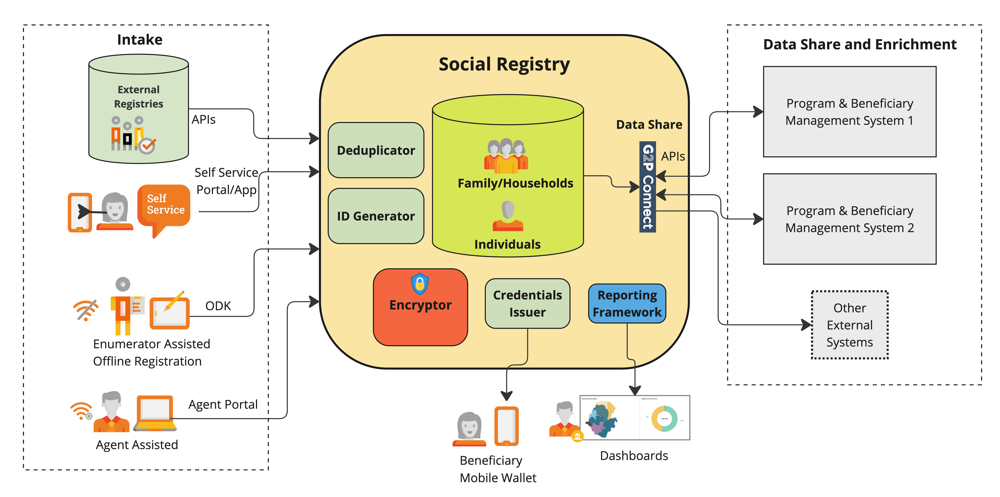

# Social Registry (Gen1)

**OpenG2P Social Registry (SR)** is an independent module that enables the creation of **registries** of individuals and groups of people with demographic data with advanced features that make the SR interoperable and easily fit into the digital public infrastructure (DPI) infrastructure of a country. SR is not a mere database - it is based on principles of a good [functional registry](https://docs.cdpi.dev/initiatives/dpi-as-a-packaged-solution-daas/upcoming-daas-cohorts/functional-registries) offering several features that can result into exponential benefits to government and people via data share, user control, issue of verifiable credentials etc.

The registry can host demographic data of both individuals and groups (family/household) and this data is privacy protected. OpenG2P Registry offers the unique feature of issuing digitally signed credentials - Verifiable Credentials - to the beneficiaries.

The registry is offered as ready-to-deploy package which can be configured for a use case.

## Functional architecture

<figure><figcaption></figcaption></figure>

## Salient features

Some of the key features offered by the Registry are as follows:

* [Holds both **individual and household** records with relationships.](features/individuals-and-groups/)
* [Ability to **share data** with other systems via standard interfaces.](features/data-share/)
* [**Privacy** controls on the data](features/privacy-and-security.md).
* [Packaged for **rapid deployment**](features/rapid-deployment-framework.md)
* [**Dynamic registry**: multiple update mechanisms](features/dynamic-registry.md).
* [Automatic computation of scores like **PMT**](features/score-computation.md)**.**
* Easy user interface for administration
* [Deduplication support](features/deduplication/).
* [**Offline registrations** in areas with no connectivity.](features/offline-assisted-registration/)
* [Issuance of **unique ID** to individuals](features/unique-social-id.md).
* [Issuance of **Verifiable Credentials**](features/verifiable-credentials-issuance/)**.**

## Use cases

<table data-view="cards"><thead><tr><th></th><th></th><th data-hidden data-card-cover data-type="files"></th></tr></thead><tbody><tr><td><strong>Farmer Registry</strong></td><td>Registry of farmers to provide crop assistance and other advisory.</td><td><a href="../../../../.gitbook/assets/framer-registry.png">framer-registry.png</a></td></tr><tr><td><strong>Urban Destitute</strong></td><td>Shelter services for urban destitute</td><td><a href="../../../../.gitbook/assets/urban-destitute-registraiton.png">urban-destitute-registraiton.png</a></td></tr><tr><td></td><td></td><td></td></tr></tbody></table>

* Farmer registry
* Family registry
* National social registry
* Disaster relief registry
* Urban destitute

## Technical architecture


