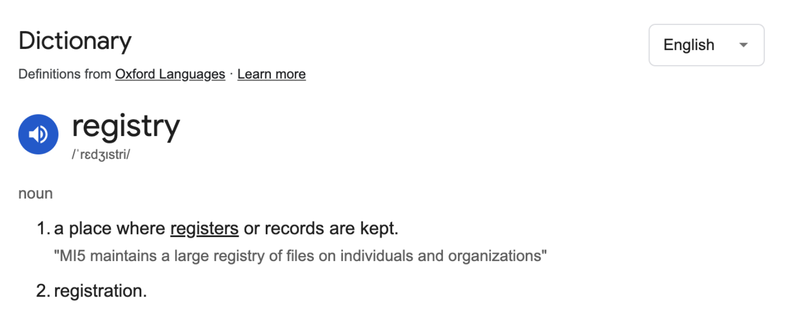

# Concept

<figure><figcaption></figcaption></figure>

***

**Using the same analogy, our Instance can be called OpenG2P Registry**

The individual tables – can be called Registers, so a Farmer Registry (Instance) will contain many registers

* Farmer Register (Primary Register)
* Land Holdings Register
* Crop Register
* Vehicle Register
* Family Members Register&#x20;

Farmer will have a single record in the Farmer Register (single entry)

The other registers will have multiple records (entries) against a single farmer

In some exceptional cases there might be 3rd level of hierarchy

Farmer has Land, Land has Crops

***

**Can we have many Primary Registers in a single instance of Registry?**

Practically - unlikely

But from a software perspective, we have no opinion.&#x20;

Our registry can have multiple Primary Registers.

***

Tables - will be called “Registers” - so farmer\_register, crop\_register, worker\_register, monthly\_attendance\_register, daily\_attendance\_register

Records in tables - will be called - “records” – so each farmer will have a record\_id (of course we interpret it as farmer\_record\_id) 

***

**g2p\_register\_definition**

| register\_id                   |
| ------------------------------ |
| register\_mnemonic             |
| register\_description          |
| master\_register\_id           |
| program\_application (boolean) |

**Methods**

1. get\_primary\_registers (get registers with master\_register\_id as NULL)
2. get\_child\_registers (master\_register\_id)
3. get\_program\_application\_registers

***

**g2p\_register\_operations**&#x20;

| operation\_id                              |
| ------------------------------------------ |
| register\_id                               |
| operation\_mnemonic                        |
| operation\_description                     |
| Json\_form\_schema\_file\_id - upload file |
| documents\_required (boolean)              |
| number\_of\_verifications\_required        |
| auto\_approval (boolean)                   |

**g2p\_register\_documents**

| **document\_id**       |
| ---------------------- |
| operation\_id          |
| document\_mnemonic     |
| document \_description |

***

**g2p\_register (Abstract Class) - This is the base class extended by all domain register models**

| internal\_record\_id                  | Primary Key - UUID                                                                                                                             |
| ------------------------------------- | ---------------------------------------------------------------------------------------------------------------------------------------------- |
| functional\_record\_id                | MOSIP ID - Unique Index                                                                                                                        |
| link\_record\_id                      | 
Link ID to the parent register (internal record id) Non unique Index, if required Only applicable for slave, not master registers
 |
| created\_at                           |                                                                                                                                                |
| last\_updated\_at                     |                                                                                                                                                |
| last\_approved\_by                    |                                                                                                                                                |
| search\_text (TEXT, trigram indexing) |                                                                                                                                                |

***

**g2p\_register\_history (Abstract Class) - This is the base class extended by domain registory history models**

Program application registers will not have history

| history\_record\_id                  | Primary Key - UUID                |
| ------------------------------------ | --------------------------------- |
| internal\_record\_id                 | Non Unique Index                  |
| change\_log\_id                      | Non unique index                  |
| link\_record\_id                     | Non unique Index, only for slaves |
| created\_by\_id, created\_by\_name   |                                   |
| approved\_by\_id, approved\_by\_name |                                   |

***

**g2p\_register\_change\_log**

| **change\_log\_id**     |
| ----------------------- |
| register\_id            |
| internal\_record\_id    |
| operation\_id           |
| change\_payload (JSONB) |
| source\_channel\_id     |
| changed\_at             |
| changed\_by             |
| approval\_status        |
| approved\_at            |
| approved\_by            |

***

**g2p\_register\_change\_log\_documents**

| document\_id    |
| --------------- |
| change\_log\_id |

***

g2p\_register\_verifications

| **verification\_id**       |
| -------------------------- |
| register\_id               |
| internal\_record\_id       |
| operation\_id              |
| change\_log\_id            |
| verified\_by               |
| verified\_at               |
| verification\_observations |
| is\_ok                     |

***

g2p\_register\_service (Base Service Class) will have the following methods implemented

1. create\_change\_log
2. get\_change\_logs
3. delete\_change\_log
4. add\_change\_log\_verification
5. get\_change\_log\_verifications
6. approve\_change\_log
   1. insert into implementation history table (dynamic sql)
   2. upsert into implementation table (dynamic sql)
   3. update change\_log
7. validate\_change\_log
   1. This will be abstract method, to be implemented by the domain model classes
   2. Domain model classes can implement validations based on domain attributes
   3. Any business logic based on domain attributes&#x20;

***

**farmer\_register** - extends - g2p\_register

register\_mnemonic = “farmer”

Based on register\_mnemonic, the parent class methods will decipher the table\_name

g2p\_register\_farmer & g2p\_registry\_history\_farmer – for dynamic SQL operations

change\_log and verifications - anyway are global tables.

There will be register\_factory – that will return the appropriate register classes

***

**g2p\_registry\_controller**

/create\_change\_log

Get farmer\_register - from factory

farmer\_register.create\_change\_log

farmer\_register

all dummy methods - calling - super.methods()

Only implements - validate\_change\_log – where validations on specific attributes be performed

***
