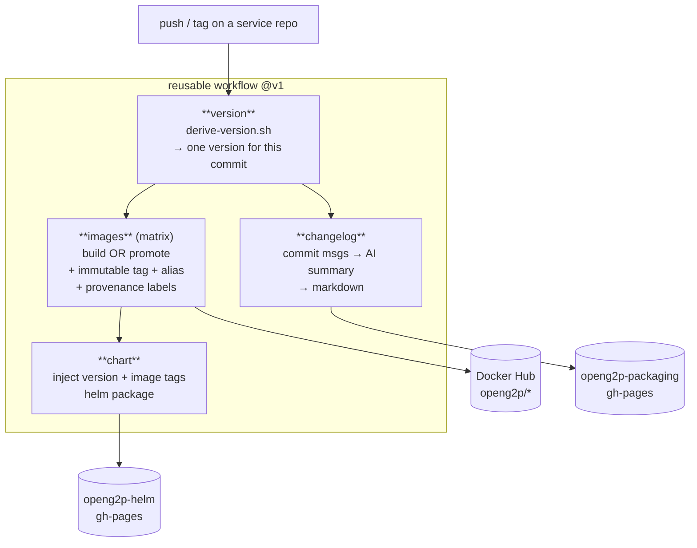

# CI pipeline

All the logic lives **once**, in
[`openg2p-packaging`](https://github.com/openg2p/openg2p-packaging), as a
**reusable GitHub Actions workflow**. Each service repo keeps only a thin ~40-line
**caller stub** that declares what that repo contains. The stub carries no
versioning logic and rarely changes.

```
service repo                         openg2p-packaging
────────────                         ─────────────────
.github/workflows/build-publish.yml  .github/workflows/build-publish.yml   (the pipeline)
   uses: …@v1  ───────────────────►  ci/version/derive-version.sh          (versioning policy)
   declares: images, chart,          ci/changelog/*.sh                     (changelog)
             pins                     ci/changelog/config.yml               (AI model)
```

## The flow




## What each job does

**version** — runs `derive-version.sh` against the git ref and emits the single
version every other job uses (see the [strategy page](README.md#the-versioning-with-examples)).

**images** (a matrix, one per Docker image the repo declares) —

* **On develop / RC / feature:** builds and pushes the image with **two** tags —
  the immutable version and, on develop, the moving `develop` alias — plus OCI
  labels (`source`, `revision`, `version`) and an `org.openg2p.pin.<arg>` label
  for every build-arg that was a git ref resolved to a SHA.
* **On a release tag:** does **not** rebuild. It **promotes** the digest the
  release line already tested — `docker buildx imagetools create -t …:1.0.0 …:1.0.0-rc.N`
  — so the released image is bit-for-bit the tested one.

**chart** — injects the version (`helm package --version/--app-version`) and the
image tags (into `values.yaml` via `yq`), stamps the commit into the chart
annotations, and publishes the `.tgz` to `openg2p-helm` gh-pages (merging
Rancher-annotated charts into the catalog index).

**changelog** — see [Changelogs](changelogs.md).

## Three guarantees

1. **Immutable versions are never overwritten.** Before publishing, both the image
   and chart steps check for an existing artifact and **fail** rather than
   clobber. This is what makes `0.0.0-develop.39` trustworthy rather than just
   "`develop` with extra digits".
2. **A release is a retag, not a rebuild.** You can therefore only tag a commit
   whose images CI already built; tagging an un-built commit fails with a clear
   error. You ship exactly what you tested.
3. **Build inputs are pinned.** A build-arg that is a git ref (e.g.
   `FASTAPI_COMMON_REF=develop`) is resolved to a commit SHA before the build, so
   two builds of the same commit produce the same image, and the SHA is recorded
   as a label.

## No path filters — builds are all-or-nothing

The workflow triggers on every push, with **no per-artifact path filters**. Any
build produces the **complete** set (images + chart + changelog) at one version.
This is deliberate: path-filtering images and chart independently is exactly what
let them drift apart under the old scheme. If you want to skip genuinely inert
changes (docs), add a `paths-ignore` for `**.md` — but never split image vs chart
triggers.

## Rolling out policy: the `@v1` tag

The stub pins the reusable workflow at `@v1`:

```yaml
uses: openg2p/openg2p-packaging/.github/workflows/build-publish.yml@v1
```

A reusable workflow's ref resolves **independently of the caller's branch** — so
`develop`, a `1.0` line, and a two-year-old branch all run today's `v1`.

* `v1` is a **moving** major tag. Change the policy in `openg2p-packaging`, move
  `v1`, and **every repo and every branch** picks it up on its next run — no PRs.
* `v1.x.y` pegs are immutable and kept forever, so you can roll back or pin.

See [moving the `v1` tag](onboarding-a-new-repo.md#maintaining-the-pipeline-moving-v1)
for the promotion procedure and the compatibility rule (moving `v1` may change
*how* things build, never *what version* a commit gets).

## The stub is per-branch; the policy is central

The caller stub physically exists on each branch, and GitHub runs the copy on the
branch being pushed. But since it contains no logic, it almost never changes —
**policy changes go through `@v1`, not the stub.** The stub changes only when the
repo's own structure does (a new image, a moved chart), and then only on the
branches you actively build from. Release lines are cut from `develop` and inherit
whatever stub `develop` had at cut time.
