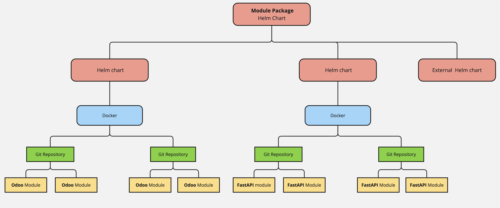

# Packages

## Module packages

Each OpenG2P module—such as Social Registry, PBMS, SPAR, and G2P Bridge—is delivered as a deployable package. This package consists of multiple components and is provided as a Helm chart that includes several sub-charts. See the packaging hierarchy outlined below:

<figure><figcaption></figcaption></figure>

The contents of the Helm package may be found in the [`Chart.yaml` ](https://github.com/OpenG2P/openg2p-social-registry-deployment/tree/2.0/charts/openg2p-social-registry)file

## Package versioning

The version of the Helm Chart of the module is considered as the package version of the module.  For example, Social Registry version 1.5.0 refers to the **Helm chart of the entire package.** As mentioned above, each package contains several components that may have their own versions. In case of Odoo based modules - Social Registry and PBMS - the "core" version refers to the version of the Odoo Docker, which is part of the Helm package. &#x20;

&#x20;Learn more on Helm charts, versioning and publishing [here](helm-charts.md#helm-chart-versions).

Refer to [versioning conventions](versioning.md).

