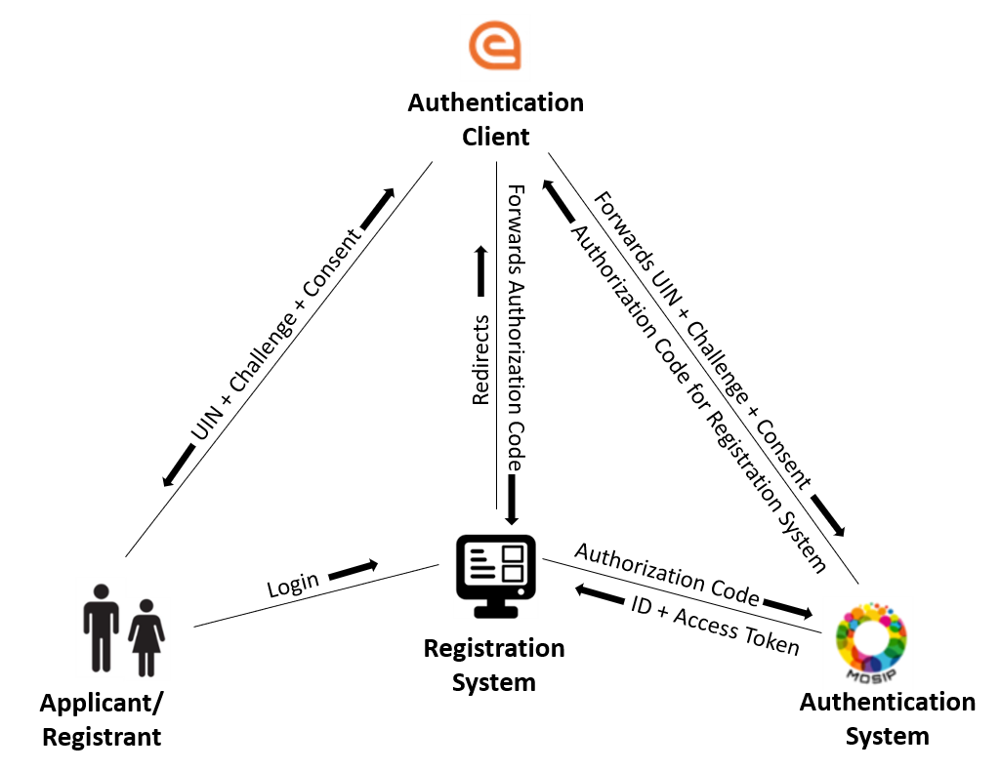

# ID Verification

## Introduction

At the backend, the ID provided (functional or foundational) during registration is verified by submitting the demographic details and ID number by calling APIs of the corresponding ID system. The response from the ID system could be a _yes/no_ response with optional data like ID tokens and KYC details.

## Authentication using MOSIP ID/National ID

OpenG2P registration systems can be integrated with e-Signet to build a trustworthy authentication interface. The platform utilizes an authentication system like MOSIP or National ID to authenticate the applicants and registrants in the backend.&#x20;

<figure><figcaption></figcaption></figure>

To view the e-Signet authentication process in detail, click [here](../integrations/integration-with-mosip/integration-with-e-signet.md).


Though this example mentions only OTP-based authentication, biometric and QR code-based authentications are also supported.


##
