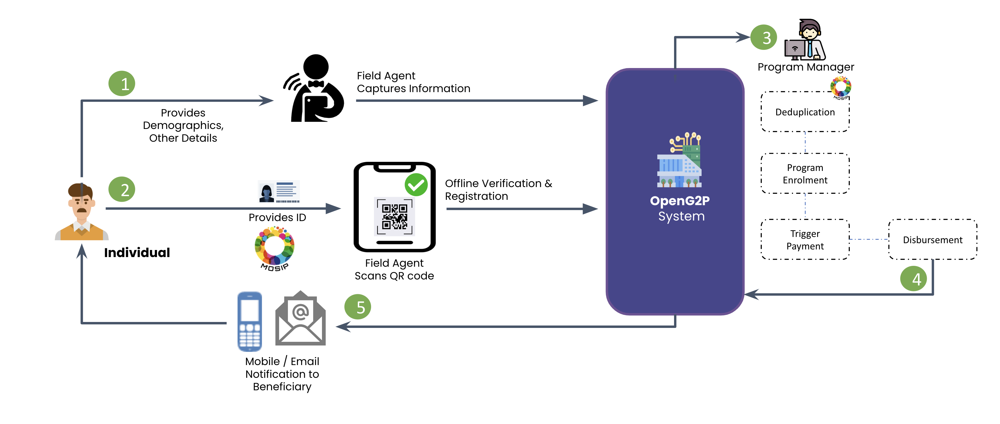

# Mobile Registration App

## Introduction

The person's information is filled in [ODK](https://getodk.org/) forms on Android devices and submitted to the backend for further processing. The ODK application is integrated with a QR code scanning application that enables an automatic population of KYC data of the person in the form along with verification of digital signature establishing the authenticity of the card.

## Registration Process

* Program creation&#x20;
* ODK form template creation&#x20;
* Upload of form to ODK Central
* Assigning forms to agents
* Field registration by the agent using ODK Collect on an Android tablet/phone.
* Submission of form to ODK Central
* Addition of record to the registry&#x20;
* ID verification and KYC

A high-level view of the administrator-driven registration approach is given below:

<figure><figcaption></figcaption></figure>

## ODK

ODK is an open source toolkit that uses offline forms to collect data.  ODK Collect is the client-side app while ODK Central is the server-side app.  Learn more about ODK [here](https://docs.getodk.org/).

## Offline Registration Mode

OpenG2P offers mechanisms to carry out registrations on the field in areas where Internet connectivity may not be available.&#x20;

## Offline registration demo


